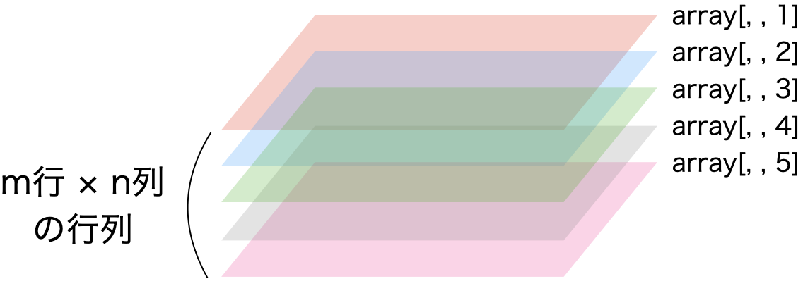

# データの構造 {#datastructure}

```{r datastructure-common, include = FALSE}
source("_common.R")
```

## データ構造とは {#WhatIsDatastructure}

データ構造 (data structure)とは最小単位であるベクトルを何らかの形で集めたものです。ベクトル自体もデータ構造であり、同じデータ型のベクトルを積み重ねた行列、異なるデータ型の縦ベクトルを横に並べたデータフレームなど、Rでは様々なデータ構造を提供しています。また、R内臓のデータ構造以外にも、パッケージ等で提供される独自のデータ構造もあります。ここではRが基本的に提供している代表的なデータ構造について、その作り方と操作方法について解説します。

---

## ベクトル (vector) {#structure-vector}

### ベクトルの作り方

Rにおいてベクトルとは*同じデータ型が一つ以上格納されているオブジェクト*を意味します。たとえば、以下の`myVec1`は長さ1のベクトルです。

```{r datastructure-vector-1}
myVec1 <- "R is fun!"
myVec1
```

むろん、2つ以上の文字列、または数字を格納することも可能です。以下の`myVec2`は長さ5のベクトルです。

```{r datastructure-vector-2}
myVec2 <- c(1, 3, 5, 6, 7)
myVec2
```

注意すべきところは、ベクトル内の要素は必ず同じデータ型である必要があるということです。たとえば、数字と文字が混在した`myVec3`を考えてみましょう。

```{r datastructure-vector-3}
myVec3 <- c("A", "B", "C", 1, 2, 3)
myVec3
```

数字であるはずの1, 2, 3が`"`で囲まれ、文字列に自動的に変換されていることが分かります。実際に、デーが型を確認してみましょう。

```{r datastructure-vector-4}
class(myVec3)
```

`"character"`、つまりデータ型が文字列になっていることが分かります。これは`character`型が`numeric`型よりも優先順位が高いからです。それでは`numeric`と`logical`型はどうでしょうか。

```{r datastructure-vector-5}
myVec4 <- c(1, 2, 3, TRUE, FALSE)
myVec4
class(myVec4)
```

`TRUE`が1、`FALSE`が0となり、自動的に`numeric`型になりました。一般的によく使われるデータ型は`logical`、`numeric`、`character`ですが、優先順位は`logical < numeric < character`の関係になります。ここで重要なのは優先順位ではなく、異なるデータ型が含まれるベクトルの場合、自動的にデータ型が統一されるということです。ベクトルを作成する際は、全ての要素が同じ型になるようにしましょう。

### ベクトルの操作

**ベクトルの長さ**

ベクトルの長さはベクトルに含まれている要素の数です。ベクトルの長さは`length()`関数で調べることができます。それでは前節で作成した4つのベクトルの長さを調べてみましょう。

```{r datastructure-vector-6}
length(myVec1) # "R is fun!"
length(myVec2) # c(1, 3, 5, 6, 7)
length(myVec3) # c("A", "B", "C", "1", "2", "3")
length(myVec4) # c(1, 2, 3, 1, 0)
```

それぞれのベクトルの長さは`r length(myVec1)`、`r length(myVec2)`、`r length(myVec3)`、`r length(myVec4)`ということが分かりますね。

**要素の抽出**

これは既に説明しましたので、\@ref(rbasic-extract)を参照してください。

**ベクトルの加減乗除**

ここではnumeric型のベクトルを用いた加減乗除について考えたいと思います。Rにおいてベクトルは自動的に反復作業を行います。たとえば、`c(1, 2, 3, 4)`というベクトルがあり、ここに5を足すと、ベクトルの全ての要素に対して同じ計算を行います。これは引き算でも、掛け算でも、割り算でも同じです。むろん、べき乗などの様々な操作に対しても同じです。それでは`myVec2`に対して、5を足したり、引いたり、色々してみましょう。

```{r datastructure-vector-7}
myVec2 + 5
myVec2 - 5
myVec2 * 5
myVec2 / 5
myVec2 ^ 5
```

また、ベクトル同士の演算も可能です。まず、`myVec2`と同じ長さを持つ`myVec4`との計算を考えてみましょう。これは長さが同じであるため、それぞれ同じ位置の要素同士の計算となります。つまり、足し算の場合、`myVec2[1]`と`myVec4[1]`の和、`myVec2[2]`と`myVec4[2]`の和、...といった形です。

```{r datastructure-vector-8}
myVec2 + myVec4
myVec2 - myVec4
myVec2 * myVec4
myVec2 / myVec4
```

もし、ベクトルの長さが異なる場合はどうなるでしょう。たとえば、長さ2のベクトル`myVec5`と`myVec2`の足し算を考えてみましょう。

```{r datastructure-vector-9}
(myVec5 <- c(1, 10))
(myVec6 <- myVec2 + myVec5)
```

警告メッセージは表示されますが、計算自体はできます。同じ長さのベクトル同士なら、同じ位置の要素同士の計算になりますが、この場合は、短い方のベクトルを繰り返すことにより、長さを合わせることになります。`myVec5`の例だと、`c(1, 10, 1, 10, 1)`のように扱われます。具体的には以下の表のような関係となります。

|`myVec6[1]`|`myVec6[2]`|`myVec6[3]`|`myVec6[4]`|`myVec6[5]`|
|:---:|:---:|:---:|:---:|:---:|
|`myVec2[1]`|`myVec2[2]`|`myVec2[3]`|`myVec2[4]`|`myVec2[5]`|
|+|+|+|+|+|
|`myVec5[1]`|`myVec5[2]`|`myVec5[1]`|`myVec5[2]`|`myVec5[1]`|

実際は長さが異なるベクトル同士の計算を行うことは滅多にありません。例外としては長さ1のベクトルの計算くらいですね。

文字列ベクトルの扱い方はより複雑ですので、第\@ref(string)章で詳細に解説します。

---

## 行列 (matrix) {#structure-matrix}

行列は名前とおり、行と列で構成されたデータ構造です。ただし、我々が一般に考える「表」とは異なる点があります。それは行列内部の要素に制約がある点です。具体的に、行列の要素となり得るデータ型はnumeric、complex、NA型のみです。ここではnumeric型のみで構成された行列の作成および操作方法について解説します。

### 行列の作り方

行列を作成するには`matrix()`関数を使います。引数として、行列に入る数値と行または列の数は必須です。数値はベクトルであり、行・列の数は整数です。以下のような行列を作るにはいくつかの方法があります。

$$
\left[
\begin{matrix} 
1 & 2 & 3 & 4 \\ 
5 & 6 & 7 & 8 \\
9 & 10 & 11 & 12
\end{matrix}
\right]
$$

```{r datastructure-matrix-1}
# 方法1: 行数を指定する
Matrix1 <- matrix(c(1, 5, 9, 2, 6, 10, 3, 7, 11, 4, 8, 12), nrow = 3)
Matrix1
# 方法2: 列数を指定する
Matrix2 <- matrix(c(1, 5, 9, 2, 6, 10, 3, 7, 11, 4, 8, 12), ncol = 4)
Matrix2
```

いずれも同じ結果が得られます。注意してもらいたいところは、第一引数の書き方です。我々は「左から右へ、そして上から下へ」という順番で読むのになれていますが、**Rの行列は「上から下へ、そして左から右へ」の順番**です。もし、「左から右へ、そして上から下へ」のような、より我々にとって読みやすい書き方をするためにはもう一つの引数が必要であり、それが`byrow = `です。

```{r datastructure-matrix-2}
(matrix(c(1, 2, 3, 4, 5, 6, 7, 8, 9, 10, 11, 12), nrow = 3, byrow = TRUE))
```

むろん、初項1、公差1、最大値12の等差数列ですのて、`1:12`のような書き方も可能です。

```{r datastructure-matrix-3}
(matrix(1:12, nrow = 3, byrow = TRUE))
```

データ構造も確認してみましょう。

```{r datastructure-matrix-4}
class(Matrix1)
```

R 4.0.0からの仕様変更により行列型はmatrix構造以外にもarrayの構造も持つようになりました。array型については第\@ref(structure-array)章で解説します。

**単位行列**

最後にちょっと特殊な行列である単位行列 (indetity matrix)の作り方について説明します。単位行列とは行と列の数が同じである正方形の行列ですが、対角線上は全て1、その他は全て0となっている行列です。たとえば大きさが4の単位行列は、

$$
\left[
\begin{matrix} 
1 & 0 & 0 & 0 \\ 
0 & 1 & 0 & 0 \\ 
0 & 0 & 1 & 0 \\ 
0 & 0 & 0 & 1 \\ 
\end{matrix}
\right]
$$

です。これは`matrix(c(1, 0, 0, 0, 0, 1, 0, 0, 0, 0, 1, 0, 0, 0, 0, 1), nrow = 4)`で作成することも可能ですが、`diag()`関数を使えば簡単に出来ます。サイズが4の単位行列は`diag(4)`です。

```{r datastructure-matrix-5}
(diag(4))
```

### 行列の操作

まず、以下のような行列`A`を作ってみましょう。

$$
A = \left[
\begin{matrix} 
1 & 2 & 3 & 4 \\ 
5 & 6 & 7 & 8 \\
9 & 10 & 11 & 12
\end{matrix}
\right]
$$

```{r datastructure-matrix-6}
A <- matrix(c(1, 2, 3, 4, 5, 6, 7, 8, 9, 10, 11, 12), 
            nrow = 3, byrow = TRUE)
```

**行列のサイズ**

行列の大きさ (行と列の数)を求める際は`dim()`関数を使います。

```{r datastructure-matrix-7}
dim(A)
```

結果は長さ2のベクトルですが、1番目の要素が行数、2番目の要素が列数になります。もし、行列の行数のみ確認したい場合は`dim(A)[1]`、列数なら`dim(A)[2]`で確認することができます。また、全く同じ機能を持つ関数があり、それが`nrow()`と`ncol()`関数です。

```{r datastructure-matrix-8}
nrow(A) # 行列の行数を確認: dim(A)[1]と同じ
ncol(A) # 列列の列数を確認: dim(A)[2]と同じ
```

`dim()`および`nrow()`、`ncol()`関数は第\@ref(structure-dataframe)章で紹介するデータフレームでも使用可能です。

**要素の抽出**

ベクトルと同様、要素の抽出は`[]`を使います。ただし、行列は横と縦の2次元構成となりますので、行と列のそれぞれの位置を指定する必要があります。たとえば、`A`の2行目、3列目の要素を抽出するためには、

```{r datastructure-matrix-9}
A[2, 3]
```

のように書きます。行か列の位置を省略した場合、指定した列・行全てが抽出されます。2行目の要素全てを抽出するなら`A[2, ]`、3列目の要素全てを抽出するなら`A[, 3]`となります。

```{r datastructure-matrix-10}
A[2, ]
A[, 3]
```

この場合、返される値のデータ構造はいずれも**行列でなく、ベクトル**です。確認してみましょう。

```{r datastructure-matrix-11}
is.vector(A[2, 3])
is.vector(A[2, ])
is.vector(A[, 3])
```

例外は複数の行と複数の列を同時に抽出した場合です。たとえば、行列`A`の1・2行目と2・3列目の要素を全て抽出するとします。その場合は`A[1:2, 2:3]`のように書きます。むろん、`:`を使わずに`A[c(1, 2), c(2, 3)]`のような書き方も可能です。抽出後、返された結果のデータ構造も確認してみましょう。

```{r datastructure-matrix-12}
A[1:2, 3:4]

class(A[1:2, 3:4])
```

この場合、返された結果のデータ構造は行列であることが分かります。

**行列の足し算と引き算**

行列の足し算 (引き算)には

1. 行列内の全要素に対して同じ数字を足す (引く)
2. 同じサイズの2つの行列から対応する要素を足す (引く)

2パタンがあります。例えば、行列`A`の全要素に5を足す場合は以下のように入力します。

```{r datastructure-matrix-13}
(A_plus_5 <- A + 5)
```

同様に、`A`から10を引く場合は`-`演算子を使います。

```{r datastructure-matrix-14}
(A_minus_10 <- A - 10)
```

二つ目は同じサイズの行列同士の足し算と引き算です。行列`A`は3 $\times$ 4の行列ですので、同じサイズの行列`B`を作成してみましょう。

```{r datastructure-matrix-15}
(B <- matrix(c(3, 2, 1, 4, 5, 9, 7, 11, 6, 12, 8, 10), 
             nrow = 3, byrow = TRUE))
```

この行列`A`と`B`の足し算はそれぞれ同じ位置の要素同士の和を行列をして返し、これは引き算も同じです。

```{r datastructure-matrix-16}
A + B
A - B
```

注意すべき点は、2つの行列は同じ大きさでなければならない点です。たとえば、行列`B`の1列から3列までを抽出した3 $\times$ 3行列`C`を作成し、`A + C`をしてみましょう。

```{r datastructure-matrix-17, error = TRUE}
(C <- B[, 1:3])
A + C
```

このように足し算ができなくなり、これは引き算でも同じです。

**行列の掛け算**

やや特殊なのは行列の掛け算です。行列`A`の全要素を2倍にしたい場合、これは足し算・引き算と同じやり方で十分です。

```{r datastructure-matrix-18}
A * 2
```

ただし、問題は行列同士の掛け算です。行列`A`と`B`の掛け算といえば、直感的には足し算や引き算同様、同じ位置の要素の積と考えるかも知れません。実際`A * B`はそのように計算を行います。

```{r datastructure-matrix-19}
A * B
```

ただし、このような掛け算は「アダマール積 (Hadamard product)」と呼ばれる計算方法であり[^matrix-product]、一般的に使う掛け算ではありません。実際、数学において$A \times B$はアダマール積を意味すのではなく、アダマール積は$A \circ B$または$A \odot B$と表記します。

[^matrix-product]: 他にも要素ごとの積 (element-wise product)、シューア積 (Schur product)と呼ばれたりします。

それでは一般的な行列の積は何でしょう。詳しいことは線形代数の入門書に譲りますが、以下のような2つの行列`C`と`D`を考えてみましょう。

$$
C = \left[
\begin{matrix} 
1 & 2 & 3 \\ 
4 & 5 & 6 
\end{matrix}
\right],
D = \left[
\begin{matrix} 
2 & 7  & 17 \\ 
3 & 11 & 19 \\
5 & 13 & 23
\end{matrix}
\right]
$$

行列の大きさが異なりますね。行列`C`の大きさは2 $\times$ 3、`D`は3 $\times$ 3です。実はこれが正しいです。行列の積は$n \times m$の行列と$m \times p$の行列同士でないと計算できません。$n$と$p$は同じでも、同じでなくても構いません。その意味で$C \times D$は計算可能でも、$D \times C$は計算できません。そして、2つの行列の積の大きさは$n \times p$です。したがって、$C \times D$の大きさは$2 \times 3$です。

行列の積がどのように求められるかを確認するために、まず行列`C`と`D`を作成してみましょう。

```{r datastructure-matrix-20}
(C <- matrix(c(1, 2, 3, 4, 5, 6), nrow = 2,byrow = TRUE))
(D <- matrix(c(2, 7, 17, 3, 11, 19, 5, 13, 23), nrow = 3,byrow = TRUE))
```

この2つの積は`%*%`演算子で計算されますが、まずその結果から見ましょう。

```{r datastructure-matrix-21}
(E <- C %*% D)
```

2行2列の行列ができました。これらの数字、どうやった計算されたのでしょうか。`E`の`[1, 1]`は23であり、`[1, 2]`は68、`[2, 1]`は53、`[2, 2]`は161です。各値は以下のように求まります。

* `E[1, 1]` = (`C[1, 1]` * `D[1, 1]`) + (`C[1, 2]` * `D[2, 1]`) + (`C[1, 3]` * `D[3, 1]`) = 23
* `E[1, 2]` = (`C[1, 1]` * `D[1, 2]`) + (`C[1, 2]` * `D[2, 2]`) + (`C[1, 3]` * `D[3, 2]`) = 68
* `E[1, 3]` = (`C[1, 1]` * `D[1, 3]`) + (`C[1, 2]` * `D[2, 3]`) + (`C[1, 3]` * `D[3, 3]`) = 124
* `E[2, 1]` = (`C[2, 1]` * `D[1, 1]`) + (`C[2, 2]` * `D[2, 1]`) + (`C[2, 3]` * `D[3, 1]`) = 53
* `E[2, 2]` = (`C[2, 1]` * `D[1, 2]`) + (`C[2, 2]` * `D[2, 2]`) + (`C[2, 3]` * `D[3, 2]`) = 161
* `E[2, 3]` = (`C[2, 1]` * `D[1, 3]`) + (`C[2, 2]` * `D[2, 3]`) + (`C[2, 3]` * `D[3, 3]`) = 301

大きさ$n \times m$行列`C`の`i`行目`j`列目の要素を$C_{i,j}$と表記し、大きさ$n \times p$行列`D`の`i`行目`j`列目の要素を$D_{i,j}$と表記した場合、以下のような関係が成り立ちます。

行列`E`の`i`行目`j`列目の要素を$e_{i,j}$と表記した場合、以下のような関係が成り立ちます。

$$
e_{i, j} = \sum_{k = 1}^m C_{i, k} \cdot D_{k, j}.
$$

したがって、行列$C$と$D$の積は

\begin{align} 
CD = E & = \left[
\begin{matrix} 
e_{1, 1} & e_{1, 2} & e_{1, 3} \\ 
e_{2, 1} & e_{2, 2} & e_{2, 3}
\end{matrix}
\right] \\
& = \left[
\begin{matrix} 
\sum_{k = 1}^m C_{1, k} \cdot D_{k, 1} & \sum_{k = 1}^m C_{1, k} \cdot D_{k, 2} & \sum_{k = 1}^m C_{1, k} \cdot D_{k, 3} \\ 
\sum_{k = 1}^m C_{2, k} \cdot D_{k, 1} & \sum_{k = 1}^m C_{2, k} \cdot D_{k, 2} & \sum_{k = 1}^m C_{2, k} \cdot D_{k, 3}
\end{matrix}
\right].
\end{align} 

このように業績同士の積はかなり求めるのが面倒ですが、Rを使えば一瞬で終わります。

**行列式**

行列式 (determinant)は$n \times n$の正方行列のみに対して定義される値の一つです。主に一次方程式において解が存在するか否かを判断するために用いられる数値ですが[^determinant]、その詳しい意味や求め方については線形代数の入門書を参照してください。

[^determinant]: 行列式が0でない場合において一次方程式には一組の解があります。

行列$A$の行列式は一般的に$\text{det}(A)$、または$|A|$と表記されます。行列式を求めるRの関数は`det()`です。それでは適当に正方行列`F`を作成し、その行列を求めてみましょう。

```{r datastructure-matrix-22}
(F <- matrix(c(2, -6, 4, 7, 2, 3, 8, 5, -1), nrow = 3, byrow = 3))
det(F)
```

行列`F`の行列式は`r det(F)`です。この場合、以下の一次方程式に何らかの一組の解が存在することを意味します ($p$, $q$, $r$は任意の実数)。

\begin{align}
2x - 6y + 4z = & p, \\
7x + 2y + 3z = & q, \\
8x + 5y - 1z = & r.
\end{align}

しかし、以下のような連立方程式はいかがでしょう。これは二組以上の解が存在する方程式です[^eqn1]。

[^eqn1]: なぜなら2行目が1行目の0.5倍になっているからです。

\begin{align}
2x - 6y + 4z = & p, \\
1x - 3y + 2z = & q, \\
5x + 9y + 3z = & r.
\end{align}

実際に行列`G`を作成し、`det(G)`を計算してみましょう。

```{r datastructure-matrix-23}
(G <- matrix(c(2, -6, 4, 1, -3, 2, 5, 9, 3), nrow = 3, byrow = 3))
det(G)
```

$|G|$は`r det(G)`であることが分かりますね。

**階数**

行列の特徴を表す代表的な数値の一つが階数 (rank)です。詳しい説明は省きますが、一次方程式の例だと、階数が行列の行数と一致する場合、一組の解が存在することを意味します。階数を求める方法は`qr(行列)$rank`であり、行列`F`と`G`の階数を確認してみましょう。

```{r datastructure-matrix-24}
qr(F)$rank
qr(G)$rank
```

どれも3行の行列ですが、行列`F`の階数は`r qr(F)$rank`、行列`G`の階数は`r qr(G)$rank`です。`G`の階数は`G`の行数より小さいため、連立方程式に一組の解がないことが分かります。

階数の活用先は様々であり、行列式とは違って、正方行列でなくても計算可能です。

**逆行列**

逆行列とは掛け算すると単位行列となる行列を意味します。行列$A$の逆行列は一般的に$A^{\prime}$と表記し、$A \times A^{\prime} = I$となります。この逆行列の求め方は非常に複雑であり、一定以上の大きさの行列になると手計算で解くのはほぼ不可能です。しかし、Rでは逆行列を計算する`solve()`関数が内蔵されております。

以下の行列$A$ (`A`)の逆行列、$A^{\prime}$ (`Ap`)を求めてみましょう。そして$A \times A^{\prime}$が単位行列になるかまで確認してみます。

```{r datastructure-matrix-25}
# 行列Aの作成
(A  <- matrix(c(1, -2, 2, 0, 1, -1, 1, 0, 1), nrow = 3))
# 行列Aの逆行列を計算し、Apに格納
(Ap <- solve(A))
# AとApの積が単位行列であることを確認
A %*% Ap
```

ちゃんと単位行列ができましたね。

**転置**

行列$A$の転置行列は$A^T$と表記され、以下のような関係となります。

$$
A = \left[
\begin{matrix} 
1 & 2 & 3 \\ 
4 & 5 & 6 \\
7 & 8 & 9
\end{matrix}
\right],
A^T = \left[
\begin{matrix} 
1 & 4 & 7 \\ 
2 & 5 & 8 \\
3 & 6 & 9
\end{matrix}
\right]
$$

正方行列の場合、対角成分を除き、全ての要素が対角成分を中心に反転していることが分かりますね。このような転置行列の作成には`t()`関数を使います。それでは行列`A`とその転置行列`At`を作ってみましょう。

```{r datastructure-matrix-26}
A  <- matrix(1:9, byrow = TRUE, nrow = 3)
A

At <- t(A)
```

ちなみに転置行列は正方行列でなくても作成できます。

---

## データフレーム (data.frame) {#structure-dataframe}

データフレームはデータ分析の際に最もよく見るデータ構造です。我々が一般的に考える表形式のデータはデータフレームです。行列も見た目は表に近いですが、行列は中身の要素がnumericまたはcomplex型に限定されるに対して[^matrixelement]、データフレームはcharacterやfactor、Dateなど様々なデータ型が許容されます。

[^matrixelement]: `NA`も可能です。

### データフレームの作成

まずは、表\@ref(tab: datastructure-dataframe-1)のようなデータフレームを作成して見ましょう。データフレームを作成する際は`data.frame()`関数を使います。

```{r datastructure-dataframe-1, echo = FALSE, results = "asis", warning = FALSE}
kable(data.frame(
    ID   = 1:4,
    Name = c("Yanai", "Song", "Shigemura", "Tani"),
    Math = c(50, 90, 100, 80),
    Stat = c(25, 5, 100, 85)
    ),
    caption = "`myDF`の中身") %>%
    kable_styling(bootstrap_options = "striped", 
                  full_width        = FALSE, 
                  position          = "center",
                  latex_options     = "hold_position")
```

```{r datastructure-dataframe-2}
myDF <- data.frame(
    ID   = 1:4,
    Name = c("Yanai", "Song", "Shigemura", "Tani"),
    Math = c(50, 90, 100, 80),
    Stat = c(25, 5, 100, 85)
    )

myDF
```

データ構造を確認してみましょう。

```{r datastructure-dataframe-3}
class(myDF)
```

データフレームを作成する際、事前にベクトルを用意してから作成することも可能です。

```{r datastructure-dataframe-4}
myDF_ID   <- 1:4
myDF_Name <- c("Yanai", "Song", "Shigemura", "Tani")
myDF_Math <- c(50, 90, 100, 80)
myDF_Stat <- c(25, 5, 100, 85)

myDF2 <- data.frame(myDF_ID, myDF_Name, myDF_Math, myDF_Stat)

myDF2
```

この場合、列の名前はベクトル名そのままになります。もし、列名を指定したい場合は以下のように作成します。

```{r datastructure-dataframe-5}
myDF3 <- data.frame(
    ID   = myDF_ID, 
    Name = myDF_Name, 
    Math = myDF_Math, 
    Stat = myDF_Stat
    )

myDF3
```

以上をコードを考えてみると、データフレームは複数のベクトルを横方向にくっつけたものになります。注意すべき点としては各ベクトルの長さが一致している点です。`myDF`の場合、4つのベクトルで構成されていますが、全てのベクトルの長さは4です。むろん、長さが異なる場合もデータフレームは作成できます。この場合、長さが足りないベクトルは最も長さが長いベクトルに合わせて繰り返されます。例として`myDF4`を作ってみましょう。

```{r datastructure-dataframe-6}
myDF4 <- data.frame(
    ID   = 1:4,
    Name = c("Yanai", "Song", "Shigemura", "Tani"),
    Math = c(50, 90, 100, 80),
    Stat = c(25, 5, 100, 85),
    City = "Kobe",
    Food = c("Ramen", "Udon")
    )

myDF4
```

`City`列はすべて`"Kobe"`が入り、`Food`列は長さが足りない3, 4番目の要素に1, 2番目の要素が代入されます。実際はあまり使わない使い方ですが、ある列の要素が全て同じ場合、このような使い方をすることがあります。

### データフレームの操作

**データフレームの大きさ**

行列と同様、`dim()`から行と列の数を、`nrow()`からは行数を、`ncol()`から列数を計算することができます。

```{r datastructure-dataframe-7}
dim(myDF4)
nrow(myDF4)
ncol(myDF4)
```

**要素の抽出**

まず、データフレーム内要素の抽出についてですが、行列型と同じやり方で問題ありません。つまり、`[行番号, 列番号]`で要素の抽出が可能です。これに加え、データフレームには`$`を使った抽出方法があります。

まず、行列と同じやり方で`myDF4`の2行目、6列目の要素を抽出してみましょう。

```{r datastructure-dataframe-8}
myDF4[2, 6]
```

行を丸ごと抽出したい場合は、列を指定しません。`myDF4`の3, 4行目を抽出してみましょう。

```{r datastructure-dataframe-9}
myDF4[3:4, ] # myDF4[c(3, 4), ]も同じ
```

同じやり方で列を抽出すことも可能です。好きな食べ物 (`Food`)列を抽出してみましょう。

```{r datastructure-dataframe-10}
myDF4[, 6]
```

列を抽出する場合は、列名を指定することも可能です。やり方は`[, "列名"]`による方法、`$列名`による方法があります。`Name`列を抽出してみましょう。

```{r datastructure-dataframe-11}
myDF4[, "Name"]
myDF4$Name
```

どれも同じ結果が返されます。後者の方が簡単ですが、一つの列しか抽出できない限界があります。それに比べ、前者は`c()`を使うことで複数の列を同時に抽出することも可能です。それぞれの場面に応じて使い分けていきましょう。

また、`$`で列を抽出した場合、抽出されたものはベクトル扱いになるため、`[]`を使った要素の抽出が可能です。例えば`myDF4`の`Name`列の2番目の要素を抽出してみましょう。

```{r datastructure-dataframe-12}
myDF4$Name[2]
```

あまり意識する必要はありませんが、抽出後のデータ構造について簡単に説明します。データフレームから一部の要素を抽出した結果物は必ずしもデータフレームにはなりません。

||操作|返されるデータ型|
|---|---|---|
|1|1行を抽出する|データフレーム|
|2|複数の行を抽出する|データフレーム|
|3|1列を抽出する|**ベクトル**|
|4|複数の列を抽出する|データフレーム|

注目するのは3番目の例ですが、これはRの最小単位がベクトルであり、データフレームもベクトルの集めだからです。データフレームは「縦」ベクトルを横に並べたものです。もし、行を抽出した場合、その要素は全て同じデータ型だとは限りません。実際、`myDF4`の3行目を抽出しても、中にはcharacter型とnumeric型と混在しています。しかし、一つの列のみを抽出した場合、全ての要素は必ず同じデータ型となるため、ベクトルとして扱うことが可能です。同様に、行列型の一列を抽出した場合も結果はベクトルとなります。ただし、行列は全ての要素がNAを除き、同じであるため、一行を抽出しても結果はベクトル型となります。

**セルの修正**

特定のセルの修正する方法は簡単です。先ほど、データフレームから一つのセルを取り出すには`データフレーム名[行番号, 列番号]`だけでした。そのセルを修正するにはベクトルと同様、`データフレーム名[行番号, 列番号] <- 新しい値`のように入力します。

たとえば、重村さんが数学試験で不正が発覚し、0点になるとします。そのためには、`myDF4`の3行・3列目の要素を`0`に修正する必要がありますが、以下のようなコマンドで修正可能です。

```{r datastructure-dataframe-13}
myDF4[3, 3] <- 0
myDF4
```

ちゃんと重村さんの数学点数が0点になりました。ざまあみろですね！

もう一つのやり方としては、一旦、列を取り出し、ベクトルにおける要素の置換操作を行う方法です。矢内大先生が神戸から離れ、高知県へ移住し、小物の宋は京都へ移住したとします。`myDF4`の`City`列の1・2番目要素を`c("Kochi", "Kyoto")`に修正する必要があります。そのためには以下のように入力します。

```{r datastructure-dataframe-14}
myDF4$City[c(1, 2)] <- c("Kochi", "Kyoto")
myDF4
```

修正した要素が反映されました。

**列の追加・修正**

まずは、データフレームに列を追加する方法について紹介します。方法は

```{r datastructure-dataframe-15, eval = FALSE}
データフレーム名$新しい列名 <- ベクトル
```

のように入力するだけです。たとえば、4人を対象に英語試験を行い、それぞれの点数が95点、50点、80点、5点だとします。この英語試験の成績を`myDF4`の`English`列として追加してみましょう。

```{r datastructure-dataframe-16}
myDF4$English <- c(95, 50, 80, 5)
```

むろん、以下のように予めベクトルを作成してから代入することも可能です。

```{r datastructure-dataframe-17, eval = FALSE}
English_Score <- c(95, 50, 80, 5)
myDF4$English <- English_Score
```

どれも同じ結果になりますが、結果を見てみましょう。

```{r datastructure-dataframe-18}
myDF4
```

「`English`が`Stat`の次じゃなくて気持ち悪い！」と思う方もいるかも知れませんが、列順番の変更については第\@ref(datahandling1)章で解説します。まずは、これで我慢しましょう。

次は、列の置換についてです。実はよく考えてみるとこれは列の追加と全く同じです。たとえば、英語試験において配点が5点の問題にミスが見つかり、全生徒の英語成績に5点を上乗せるとします。そのためにはベクトル`myDF4$English`の全ての要素に5を足し、それをもう一回`myDf4$English`に代入すれば良いです。

```{r datastructure-dataframe-19}
myDF4$English <- myDF4$English + 5
myDF4
```

これで`English`列の修正ができました。

**行の追加・修正はなるべくしない**

行の追加はなるべくしない方が良いです。その理由について考えてみましょう。今は4人の生徒のデータがありますが、ここにもう一人の生徒のデータを追加するとします。そのためには`myDF4`の5行目に生徒のID、名前、数学・統計学の成績、居住地域、好きな食べ物、英語の成績を入れれば良いでしょう。新しい学生、吐合さんの数学・統計学・英語成績は50, 50, 50点、居住地域は芦屋、好きな食べ物は二郎だとします。早速追加してみましょう。

```{r datastructure-dataframe-20}
myDF4[5, ] <- c(5, "Hakiai", 50, 50, "Ashiya", "Jiro", 50)
myDF4
```

問題なく吐合さんのデータが追加されたように見えますが、実は問題があります。`myDF4`の`Stat`列を取り出して見ましょう。

```{r datastructure-dataframe-21}
myDF4$Stat
```

異常に気づきましたか。それではこのベクトルのデータ型を確認してみましょう。

```{r datastructure-dataframe-22}
class(myDF4$Stat)
```

元々はnumeric型であるはずの`Stat`列がcharacter型になりました。その理由は明白です。ベクトルの要素は全て同じデータ型だからです。そして、numericとcharacter型が混在している場合は、自動的に（優先順位の高い）character型になります。以下の2つのコマンドが同じであることは理解できるでしょう。

```{r datastructure-dataframe-23, eval = FALSE}
# Case 1
myDF4[5, ] <- c(5, "Hakiai", 50, 50, "Ashiya", "Jiro", 50)

# Case 2
Hakiai_Data <- c(5, "Hakiai", 50, 50, "Ashiya", "Jiro", 50)
myDF4[5, ]  <- Hakiai_Data
```

ここのベクトル`Hakiai_Data`が強制的にcharacter型になるため、`myDF4`の5行目の要素は全てcharacter型になります。また、データフレームは縦ベクトルを横に並べたものであるなら、`myDF4$Math`列にcharacter型の要素が追加されることによって、列も全てcharacter型になってしまいます。したがって、データフレームにcharacter型とnumeric型が混在している状況において新しい行の追加は全ての要素をcharacter型に変えてしまうのです。むろん、データフレームの全要素がnumeric型であれば、このような問題は生じますが、numeric型のみで構成されたデータフレームはなかなかないでしょう。

5行目を消しても問題は解決しないので、結局は列のデータ型を強制的に変更する必要があります。

```{r datastructure-dataframe-24}
myDF4$ID      <- as.numeric(myDF4$ID)
myDF4$Math    <- as.numeric(myDF4$Math)
myDF4$Stat    <- as.numeric(myDF4$Stat)
myDF4$English <- as.numeric(myDF4$English)

class(myDF4$Math)
```

これでやっと元通りになりましたね。

どうしても行を追加したい場合は、以下のようなやり方もありますが、おすすめはできません。

```{r datastructure-dataframe-25}
myDF4[6, ] <- rep(NA, 7) # myDF4の6行目を追加し、7つの欠損値を代入

myDF4$ID[6]      <- 6           # myDF4$IDの6番目の要素に6を代入
myDF4$Name[6]    <- "Yukawa"    # myDF4$Nameの6番目の要素にYukawaを代入
myDF4$Math[6]    <- 80          # 以下、省略
myDF4$Stat[6]    <- 30
myDF4$City[6]    <- "Hiroshima"
myDF4$Food[6]    <- "Ramen"
myDF4$English[6] <- 90

myDF4

class(myDF4$English)
```

欠損値 (`NA`)はどのようなデータ型にも対応できる特徴を利用すれば、このような操作も可能ですが、かなり面倒です。そもそも実際の分析において任意の行を追加することは滅多にないはずです。

### tibble型

data.frame型に似ているデータ型としてtibble型があります。これはR内蔵のデータ型ではありませんが、Rの必須パッケージとも言える{tidyverse}内に含まれているデータ型であり、これからもどんどん普及していくでしょう。tibble型とdata.frame型の違いを説明するために、同じデータをそれぞれのデータ型で読み込んでみましょう。

とりあえず`read.csv()`で読み込み、`VoteDF1`と名付けましょう。

```{r datastructure-dataframe-26}
VoteDF1 <- read.csv("Data/Vote.csv")
```

続いて`VoteDF1`を`as_tibble()`関数を使ってtibble型にし、`VoteDF2`と名付けます。そして、それぞれのデータ構造を確認してみます。

```{r datastructure-dataframe-27}
VoteDF2 <- as_tibble(VoteDF1)

class(VoteDF1)

class(VoteDF2)
```

全く同じデータですが、`VoteDF2`には`tbl`と`tbl_df`というクラスが追加されていることが分かります。それではデータの中身を覗いてみましょう。まずは、data.frame型から

```{r datastructure-dataframe-28}
VoteDF1
```

つづいて、tibble型は、

```{r datastructure-dataframe-29}
VoteDF2
```

同じデータですが、表示画面がやや異なります。data.frame型は全ての列と行が表示されましたが、tibble型の場合、「画面に収まる」程度しか表示されません。表示されなかった行や列に関しては最後に表示されています。今回は全ての列が表示されましたが、たとえば、`VoteDF2`の場合、下段にこのように表示される場合があります (画面の大きさによって変わり、表示されないケースもあれば、`SDP`以外の変数も省略されるケースがあります。)。

```
## # … with 37 more rows, and 1 more variable: SDP <dbl>
```

これは表示されなかった行が37行あり、`SDP`という変数も表示されていないということです。他の違いとしては、tibble型の場合、最初にデータのサイズ (47行11列)が、各変数名の下にデータ型 (`<int>`、`<chr>`、`<dbl>`など)が表示されるという点です。

本書はtibble型とdata.frame型を区別して解説はしませんが、一部の章・節においてはtibble型を念頭において解説をします。tibble型の作り方は先ほどのように`as_tibble()`使う方法もありますが、`readr::read_csv()`を使う方法もあります[^maketibble]。`read_csv()`を使うと各列がどのようなデータ型として読み込まれたかも表示されるので便利です。{readr}パッケージは{tidyverse}に含まれているため、普段では以下のような使い方で十分です。

[^maketibble]: tibble型を直接作成するには`tibble()`関数を使いますが、`data.frame()`と同じ使い方で問題ありません。他にも`tribble()`関数を使った方法もありますが、詳細は`?tribble`で確認してください。

```{r datastructure-dataframe-30}
#| message: FALSE
VoteDF3 <- read_csv("Data/Vote.csv")

class(VoteDF3) # VoteDF3の構造
```

tibble型とdata.frame型の最も大きな違いは、data.frame型の一つのセルには長さ1のベクトルしか入らない一方、tibble型は何でも入るという点です。つまり、tibble型なら一つのセルに数字や文字列だけでなく、長さ2以上のベクトル、後述するリスト型、行列、さらにはtibble型も入れることが出来ます。これについては本書の中盤以降に解説します。

本書で「データフレーム」と書いた場合、それはtibbleでも適用可能です。ただし、tibbleと明示した場合、データフレームでは適用不可能です。

---

## リスト (list) {#structure-list}

リスト型は「様々なデータ構造を集めたもの」です。これは複数のデータフレームが格納されたオブジェクト、複数のベクトルが格納されたオブジェクト、行列とデータフレームが混在したオブジェクトなどを意味します。また、リスト型データはリスト型データを含むことも可能であり、非常に柔軟なデータ構造です。

### リスト型データの作成

ここではまず、2つのデータフレームを含むリストを作成してみます。それぞれのデータフレームはFIFA国別サッカーランキングであり[^fifa1]、本書のサンプルデータの`FIFA_Women.csv`と`FIFA_Men.csv`です。まずは、2つのデータを読み込み、`Soccer_W`と`Soccer_M`という名のオブジェクトに格納しましょう。また、ここでは単に例を見せるだけなので、全データを利用するのではなく、最初の10行のみを利用します。

[^fifa1]: 厳密には国別ではありません。イギリスの場合、イングランド、スコットランド、北アイルランド、ウェールズがそれぞれ独立したチームとしてFIFAに加盟しています。

```{r datastructure-list-1}
Soccer_W <- read.csv("Data/FIFA_Women.csv")
Soccer_M <- read.csv("Data/FIFA_Men.csv")

Soccer_W <- Soccer_W[1:10, ]
Soccer_M <- Soccer_M[1:10, ]
```

リストの作成には`list()`関数に入れたいオブジェクト名を指定するだけです。それでは`List1`という名前で`Soccer_W`と`Soccer_M`データフレームを入れてみましょう。格納後は`List1`のデータ構造を`class()`で確認します

```{r datastructure-list-2}
List1 <- list(Soccer_W, Soccer_M)
class(List1)
List1
```

一つのオブジェクトに2つのデータフレームが入っていますね。これは2つのデータフレームで構成された長さ2のリストです。ただし、どちらが女性ランキングで、どちらが男子ランキングか区別が難しいです。この場合、各データフレームに名前を付けることも可能です。

```{r datastructure-list-3}
List2 <- list(Women = Soccer_W, Men = Soccer_M)
List2
```

これでどれが女性ランキングか、男性ランキングかが区別しやすくなりました。ここでは2つのデータフレームを入れましたが、様々なデータ構造が混在したリストも可能です。様々なデータ構造が混在したリストを自分で作成する場面はあまりありません。自分で作成した独自クラスを利用するパッケージを開発する際はよく使いますが、ここでは省略します。ただし、様々なデータ構造が含まれたリスト型を見ることはよくあります。たとえば、`lm()`関数で回帰分析を行った際、その結果はリスト型であり、中にはベクトル、データフレーム、リストなどが混在しています。これについては今後詳細に解説していきたいと思います。

### リスト型データの操作

リスト型の中身は何でもあり得るので、なんらかの操作方法があるわけではありません。リスト型の操作というのはリスト内の要素をどのように抽出するかであり、各要素 (データフレーム、行列、ベクトルなど)の操作はこれまで説明してきた方法と同じです。したがって、ここではリストを構成する要素を抽出する方法についてのみ解説します。

**要素の番号を利用する方法**

`List1`は各要素に名前が付いていないため、番号で抽出します。たとえば、あるリストの`i`番目の要素を抽出するには`リスト名[[i]]`で抽出します。`[]`ではなく、`[[]]`であることに注意してください。それでは`List1`の1番目の要素を抽出してみましょう。

```{r datastructure-list-4}
List1[[1]]
```

このように`List1`内の1番目のデータが抽出されました。こちらのデータ構造は何でしょうか。

```{r datastructure-list-5}
class(List1[[1]])
```

既に予想したかと思いますが、データフレームとして抽出されました。ここから更に、3行目のデータを抽出するには、`[[]]`の後に`[3, ]`を付けます。

```{r datastructure-list-6}
List1[[1]][3, ]
```

先ほどリストの要素の抽出には「`[]`でなく、`[[]]`です」と申しましたが、実は`[]`も使用可能です。やってみましょう。

```{r datastructure-list-7}
List1[1]
```

`[[]]`を使った抽出とあまり変わらないですね。しかし、重要な違いが一つあります。それはデータ構造です。

```{r datastructure-list-8}
class(List1[1])
```

`[]`で抽出したリストの要素のデータ構造もまたリスト型です。この場合、先ほどのように`[x, ]`を使って、`x`行目のデータを抽出することはできません。なぜなら、`[行, 列]`による要素の抽出はデータフレームのためのものであって、リスト型のためのものではないからです。

```{r datastructure-list-9, error = TRUE}
List1[1][3, ]
```

このようにエラーが表示されます。

**要素の名前を利用する方法**

`List2`のようにリストの要素に名前を付けた場合、これまでの方法に加え`[["要素名"]]`と`$要素名`を使った操作が可能です[^list1]。`List2`から男子ランキング (`Men`)を抽出してみましょう。

[^list1]: `["要素名"]`で抽出することも可能ですが、この場合、返される結果はリスト型になります。

```{r datastructure-list-10}
List2[["Men"]]
List2$Men
```

どれも結果は同じです。また、それぞれのデータ構造もデータフレームです。

```{r datastructure-list-11}
class(List2[["Men"]])
class(List2$Men)
```

したがって、`[行番号, 列番号]`のようにデータフレームの操作が可能です。`Men`要素から10行目のデータを抽出してみましょう。

```{r datastructure-list-12}
List2[["Men"]][10, ]
List2$Men[10, ]
```

もちろん、名前を付けた場合であっても、要素の番号を利用した操作も可能です。自分でリスト型を作成する際には各要素に名前を付けた方が分かりやすくて良いでしょう。

---

## 配列 (array) {#structure-array}

配列は行列の拡張版であり、行列は配列の特殊な形です。これまでのRでは行列と配列は区別されてきましたが、R 4.0.0以降、行列は配列の属するデータ構造となりました。

配列型は簡単にいうと、同じサイズの行列を数枚重ねたものです。図\@ref(fig:datastructure-array-1)は配列型のイメージを表したものです。

```{r datastructure-array-1, out.width = "100%", fig.cap = "配列型データのイメージ", echo = FALSE}

```

したがって、配列型は行と列以外にも、層の要素も持つことになります。複数の行列で構成されている点では、リスト型と類似していますが、配列型は**同じサイズ**の**行列**のみで構成されている点が特徴です。

配列型は普段、扱う機会があまりありませんが、マルコフ連鎖モンテカルロ法 (MCMC)でベイジアン推定を行った後の事後分布データは配列型で格納される場合があります。

### 配列型データの作成

各行列は3行4列とし、4層構造とします。まずは、同じサイズの行列を作成し、それぞれ`Mat1`、`Mat2`、`Mat3`、`Mat4`と名付けます。

```{r datastructure-array-2}
Mat1 <- matrix(sample(1:12, 12, replace = TRUE), byrow = TRUE, nrow = 3)
Mat2 <- matrix(sample(1:12, 12, replace = TRUE), byrow = TRUE, nrow = 3)
Mat3 <- matrix(sample(1:12, 12, replace = TRUE), byrow = TRUE, nrow = 3)
Mat4 <- matrix(sample(1:12, 12, replace = TRUE), byrow = TRUE, nrow = 3)
```

`sample()`関数は初めてですね。これは与えられたベクトルの要素から無作為に要素を抽出する関数です。`sample(1:12, n)`なら`c(1, 2, 3, 4, 5, 6, 7, 8, 9, 10, 11,1 2)`から無作為に`n`個の要素を抽出するという意味です。`replace = TRUE`を指定すると、反復抽出、つまり、一回抽出された要素であっても抽出される可能性があることを意味します。デフォルトは`FALSE`ですが、この場合、一旦抽出された要素は二度と抽出されません。それではそれぞれの行列の中身を見てみましょう。

```{r datastructure-array-3}
Mat1
Mat2
Mat3
Mat4
```

配列型データを作成するには`array()`関数を使います。引数としては行列名を`c()`で繋ぎ[^array1]、`dim = `でarrayの大きさを指定するだけです。配列を作成した後はそのデータ構造も確認してみましょう。

[^array1]: 元々はベクトルを入力しますが、行列を`c()`で繋ぐと自動的にベクトルに変換されます。

```{r datastructure-array-4}
Array1 <- array(c(Mat1, Mat2, Mat3, Mat4), dim = c(3, 4, 4))
class(Array1)
```

`dim = c(m, n, z)`の部分ですが、これは「`m`行`n`列の行列が`z`枚重ねる」という意味です。今回は3行4列の行列を4枚重ねるので`dim = c(3, 4, 4)`です。それでは`Array1`の中身を見てみます。

```{r datastructure-array-5}
Array1
```

このように一つのオブジェクト内に複数の行列が格納されたオブジェクトが生成されます。

### 配列型データの操作

配列型データの操作は行列型に似ていますが、層というもう一つの次元があるため、`行列名[行番号, 列番号]`ではなく、`配列名[行番号, 列番号, 層番号]`を使います。たとえば、`Array1`の3番目の行列を抽出したい場合、`Array1[, , 3]`と入力します。

```{r datastructure-array-6}
Array1[, , 3]
```

また、2番目の行列の3行目・1列目の要素を抽出するなら`Array1[3, 1, 2]`と入力します。

```{r datastructure-array-7}
Array1[3, 1, 2]
```

配列型における操作の特徴の一つは全ての行列が同じ大きさを持つため、層を貫通した操作ができるという点です。たとえば、全ての層の2行目を抽出するなら、層番号を指定せず、行番号のみで抽出します。

```{r datastructure-array-8}
Array1[2, , ]
```

ただ、返された結果は配列型でなく行列型であることに注意しましょう。たとえば、1番目の行列の2行目の要素は`r Array1[2, , 1]`ですが、これは先ほど抽出された行列の1列目に該当します。また、2番目の行列の2行目の要素は`r Array1[2, , 2]`であり、これは先ほどの抽出された行列の2列目となります。全層において特定の一列を抽出しても同じです。これは各層において抽出されたデータが行列でなく、ベクトルだからです。

一方、**複数**の行または列を抽出した場合、結果は配列型です。`Array1`の各層から1・2行目と1・2列目の要素、つまり大きさが2 $\times$ 2の行列を抽出してみましょう。

```{r datastructure-array-9}
Array1[1:2, 1:2, ]
```

このように各層において抽出されたデータが行列だからです。自分の操作から得られた結果がどのようなデータ型・データ構造かを予め知っておくことで分析の効率が上がるでしょう。

**行列に名前を付けたい**

今回は各行列に1, 2, 3, 4という番号のみ割り当てましたが、実は行列に名前を付けることも可能です。そのためには配列データ作成時、`dimnames = `引数を指定する必要があります。

```{r datastructure-array-10}
Array2 <- array(c(Mat1, Mat2, Mat3, Mat4), dim = c(3, 4, 4),
                dimnames = list(NULL, 
                                NULL, 
                                c("M1", "M2", "M3", "M4"))
                )
```

`dimnames = `引数は必ず長さ3のリスト型である必要があります。1番目と2番目の要素は行名と列名ですが、行列において一般的に使われないため、ここでは`NULL`にし、3番目の要素、つまり各層の名前だけを指定します。ここではそれぞれの層を`M1`、`M2`、`M3`、`M4`と名付けました。ここで`M4`のみを抽出する場合は、以下のように操作します。

```{r datastructure-array-11}
Array2[, , "M4"]
```

むろん、これまでと同様、番号で抽出することも可能です。

```{r datastructure-array-12}
Array2[, , 4]
```

---

## 練習問題 {#structure-exercise .unnumbered}

リストと配列は要素の抽出が主な操作となるため、練習問題は掲載しておりません。

### ベクトル

**問1** 1から10までの公差1の等差数列 (1, 2, 3, ..., 10)を作成し、`myVec1`と名付けよ。

**問2** `myVec1`の長さを求めよ。

**問3** `myVec1`から偶数のみを抽出せよ

**問4** `myVec1`を`myVec2`という名でコピーし、`myVec2`の偶数を全て0に置換せよ。

**問5** `myVec1`の全要素から1を引し、`myVec3`と名付けよ。

**問6** `myVec1`の奇数番目の要素には1を、偶数番目の要素には2を足し、`myVec4`と名付けよ。

**問7** `myVec4`から`myVec1`を引け。

### 行列

**問1** 以下のような2つの行列を作成し、それぞれ`myMat1`、`myMat2`と名付けよ。

$$
\text{myMat1} = \left[
\begin{matrix} 
1 & 2 & 3 \\ 
4 & 5 & 6 
\end{matrix}
\right],
\text{myMat2} = \left[
\begin{matrix} 
1 & 4 & 7 \\ 
2 & 5 & 8 \\
3 & 6 & 9
\end{matrix}
\right]
$$

**問2** `myMat1`と`myMat2`の掛け算を行い、`myMat3`と名付けよ。掛け算はアダマール積でなく、一般的な行列間の積を求めること。

**問3** 以下のような連立方程式を解くケースを考える。

\begin{align}
3x -  y + 2z & = 12, \\
 x + 2y + 3z & = 11, \\
2x -  y -  z & =  2.
\end{align}

1. 以下のような2つの行列を作成し、それぞれ`myMat4`、`myMat5`と名付けよ。

$$
\text{myMat4} = \left[
\begin{matrix} 
3 & -1 & 2 \\
1 & 2 & 3 \\
2 & -1 & -1
\end{matrix}
\right],
\text{myMat5} = \left[
\begin{matrix} 
12 \\
11 \\
2
\end{matrix}
\right]
$$

2. `myMat4`の逆行列を求めよ。
3. `myMat4`の逆行列と`myMat5`の積を求め、`myMat6`と名付けよ。
    * これが連立方程式の解である。
4. `myMat4`と`myMat6`の積を求めよ。

### データフレーム

**問1** 以下のようなデータフレームを作成し、`myDF1`と名付けよ[^fifa]。

[^fifa]: 2020年4月9日現在のFIFA男子サッカーランキングである。データはAFC (アジアサッカー連盟)所属の上位10カ国である。データ源は(https://www.fifa.com/fifa-world-ranking/ranking-table/men/rank/id12882/)である (アクセス日: 2020年4月11日)。

```{r datastructure-exercise-1, echo = FALSE, results = "asis", warning = FALSE}
kable(data.frame(
    ID    = 1:10,
    Name  = c("Japan", "Iran", "South Korea", "Australia", "Qatar", 
              "Saudi Arabia", "Iraq", "UAE", "China", "Syria"),
    Rank  = c(28, 33, 40, 42, 55, 67, 70, 71, 76, 79),
    Socre = c(1500, 1489, 1464, 1457, 1396,
              1351, 1344, 1334, 1323, 1314)
)) %>%
    kable_styling(bootstrap_options = "striped", 
                  latex_options     = "hold_position",
                  full_width        = FALSE, 
                  position          = "center")
```

**問2** `myDF1`から`Name`列を抽出せよ。

**問3** `myDF1`の`Name`列から3番目の要素を抽出せよ。

**問4** `myDF1`の3行目を抽出せよ。

**問5** [`FIFA_Women.csv`](Data/FIFA_Women.csv)をtibble型として読み込み、`myTbl1`と名付けよ[^fifa2]。

**問6** `myTbl1`の`Rank`列を抽出し、それぞれの要素が20より小さいかを判定せよ。

**問7** `myTbl1`の`Rank`が20より小さい**国名**を抽出せよ。

**問8** `myTbl1`からランキングが20より上位の**行**を抽出せよ。

[^fifa2]: 2020年3月27日現在のFIFA女子サッカーランキングである。データ源は(www.fifa.com/fifa-world-ranking/ranking-table/women/)である (アクセス日: 2020年4月11日)。それぞれの変数は`ID`: 国名のID (アルファベット順)、`Team`: チーム名、`Rank`: FIFAランキング、`Points`: 2020年3月27日のポイント、`Prev_Points`: 2019年12月13日のポイント、`Confederation`: 所属しているサッカー連盟である。
