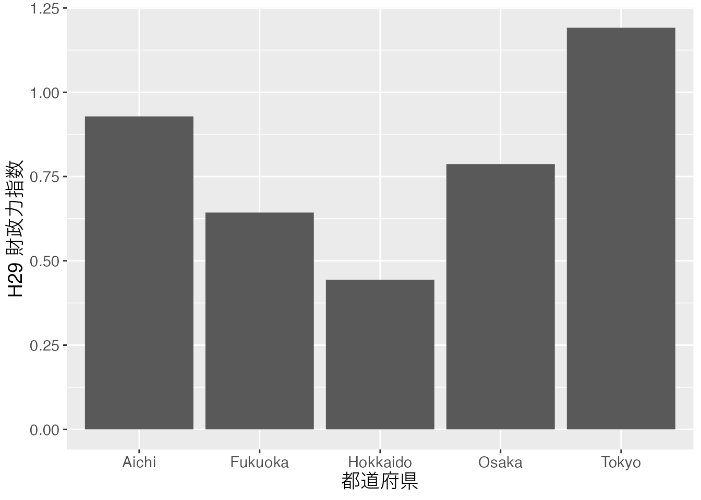
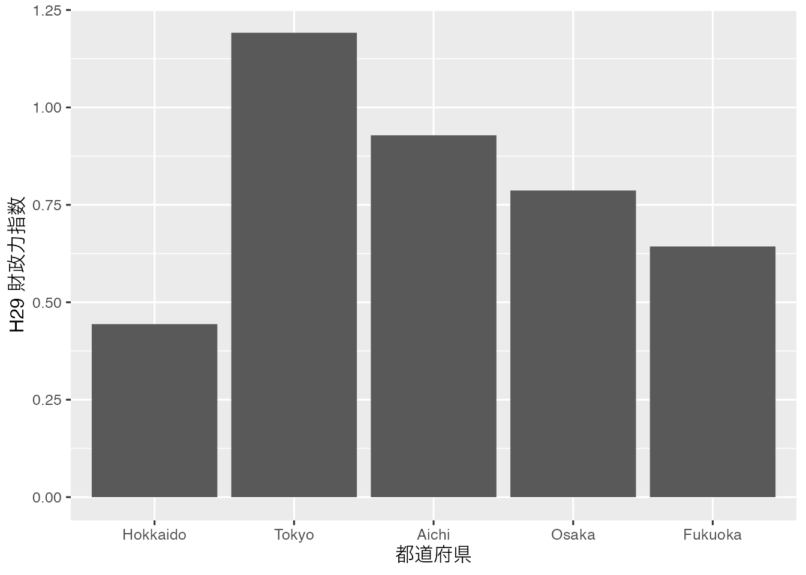
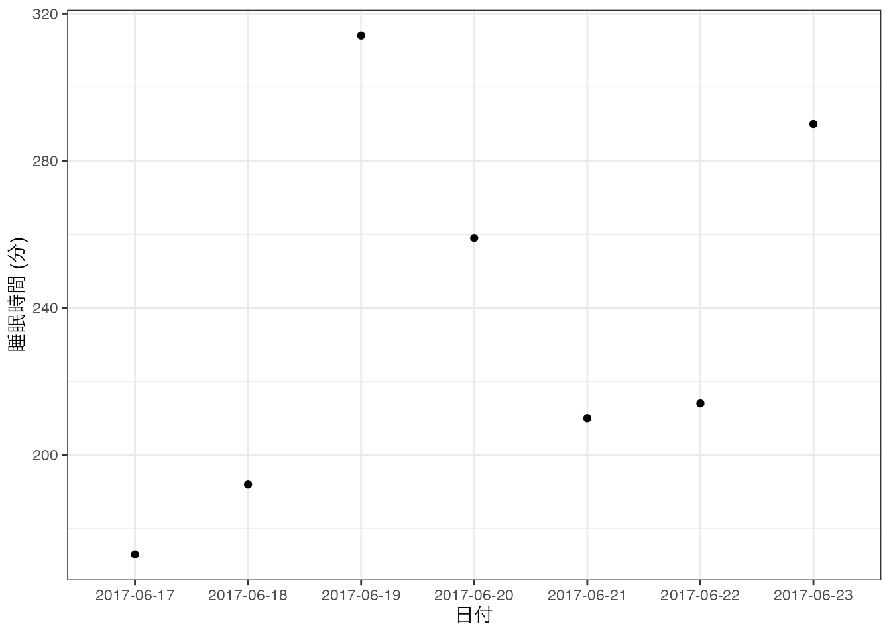
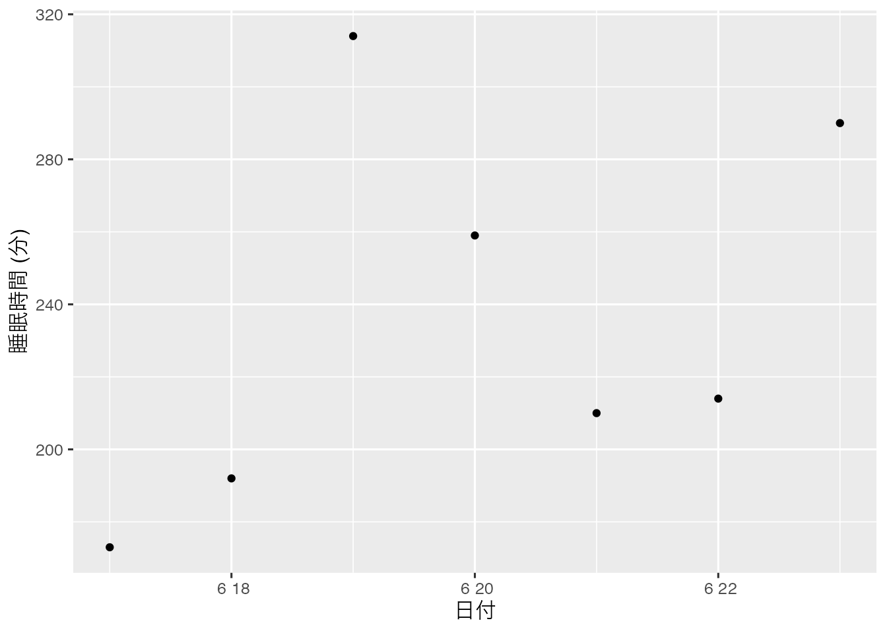
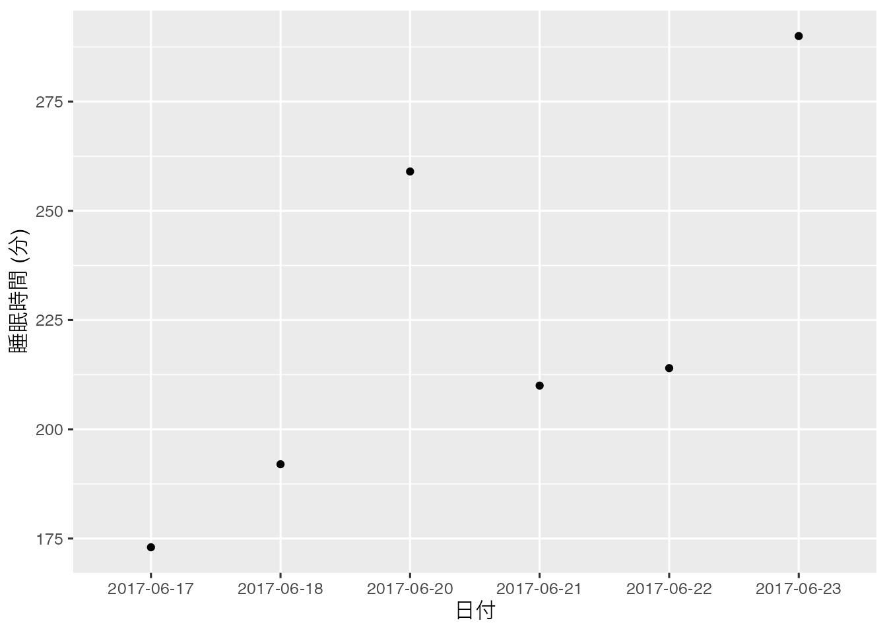
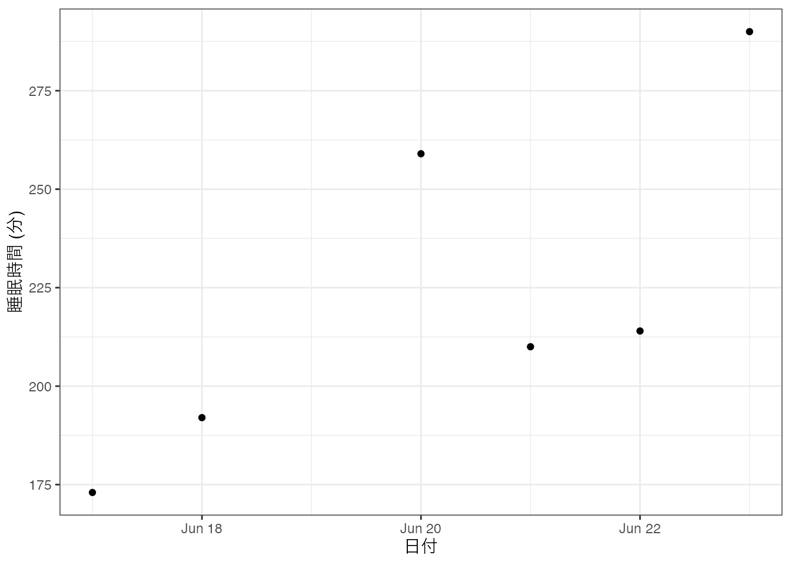
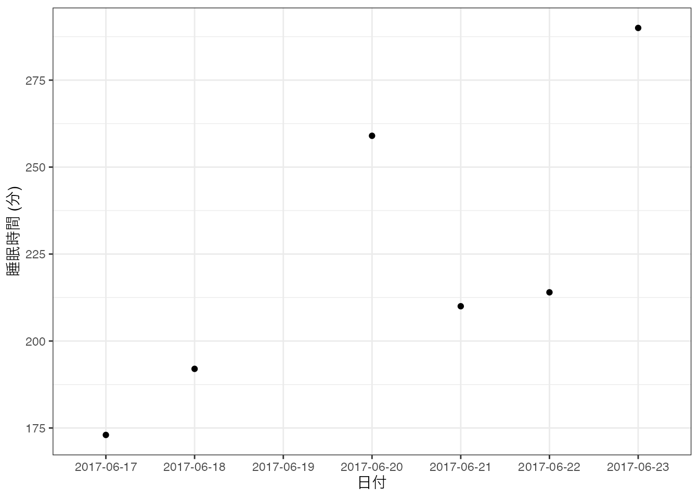

# データの型 {#datatype}


<h2>目次</h2>

* 第\@ref(WhatIsDatatype)章: データ型とは
* 第\@ref(type-logical)章: Logical型
* 第\@ref(type-numeric)章: Numeric型
* 第\@ref(type-complex)章: Complex型
* 第\@ref(type-character)章: Character型
* 第\@ref(type-factor)章: Factor型
* 第\@ref(type-date)章: Date型
* 第\@ref(type-na)章: NA型
* 第\@ref(type-null)章: NULL型
* 第\@ref(type-nan)章: NaN型
* 第\@ref(type-inf)章: Inf型

## データ型とは {#WhatIsDatatype}

ここではRにおけるデータ型について説明します。第\@ref(datastructure)章で説明するデータ「構造」とデータ「型」は異なる概念です。次章でも説明しますが、Rにおけるデータの最小単位はベクトルです。`c(1, 2, 3, 4, 5)`や`c("Yanai", "Song", "Hadley")`もベクトルですが、`30`とか`"R"`もベクトルです。後者のように要素が1つのベクトルは原子ベクトル (atomic vector)とも呼ばれますが、本質的には普通ベクトルです。このベクトルの要素の性質がデータ型です。たとえば`c(2, 3, 5, 7, 11)`は数値型ですし、`c("R", "Python", "Julia")`は文字型です。他にも第\@ref(rbasic)章で紹介した`FALSE`や`TRUE`は論理型と呼ばれています。一つのベクトルは複数の要素で構成されることも可能ですが、必ず**同じデータ型**である必要があります。

しかし、データ分析を行う際はベクトル以外のデータも多いです。行列や表がその典型例です。しかし、行列でも表でも中身の一つ一つの要素は長さ1のベクトルに過ぎません。たとえば、以下のような2行5列のベクトルがあるとします。ここで1行3列目の要素は`11`であり、長さ1の数値型ベクトルです。あるいは5列目は`c(23, 29)`であり、長さ2の数値型ベクトルです。


```
##      [,1] [,2] [,3] [,4] [,5]
## [1,]    2    5   11   17   23
## [2,]    3    7   13   19   29
```

表についても考えてみましょう。以下の表の3行2列目の要素は`"American Samoa"`という長さ1の文字型ベクトルです。また、6列目は`c("UEFA", "CAF", "OFC", "UEFA", "CAF", "CONCACAF")`であり、これは長さ6の文字型ベクトルです。このようにRで扱う全てのデータは複数のベクトルが集まっているものです。


```
##   ID                Team Rank Points Prev_Points Confederation
## 1  1             Albania   75   1325        1316          UEFA
## 2  2             Algeria   85   1271        1271           CAF
## 3  3      American Samoa  133   1030        1030           OFC
## 4  4             Andorra  155    749         749          UEFA
## 5  5              Angola  121   1117        1117           CAF
## 6  6 Antigua and Barbuda  153    787         787      CONCACAF
```

つまり、複数のベクトルを綺麗に、または分析しやすく集めたのが行列や表であり、これがデータ構造に該当します。データ型ごとの処理方法については本書を通じて紹介して行きますので、本章は軽く読んで頂いても構いません。ただし、Factor型とDate & Datetime型の処理はやや特殊ですので、手を動かしながら読み進めることをおすすめします。

ここではデータ型について紹介し、次章ではデータ構造について解説します。

---

## Logical {#type-logical}

Logical型は`TRUE`と`FALSE`のみで構成されたデータ型です。練習としてなにかの長さ5の論理型ベクトルを作ってみましょう。


```{.r .numberLines}
Logical.Vec1 <- c(TRUE, FALSE, TRUE, TRUE, FALSE)

Logical.Vec1
```

```
## [1]  TRUE FALSE  TRUE  TRUE FALSE
```

注意すべきこととしては、`TRUE`と`FALSE`は`"`で囲まないことです。`"TRUE"`、`"FALSE"`と入力してしまえばlogical 型として認識されません。もし、一つ間違えて2番目の要素である`FALSE`を`"FALSE"`と入力したらどうなるでしょうか。


```{.r .numberLines}
Logical.Vec2 <- c(TRUE, "FALSE", TRUE, TRUE, FALSE)

Logical.Vec2
```

```
## [1] "TRUE"  "FALSE" "TRUE"  "TRUE"  "FALSE"
```

2番目の要素だけでなく、他の全ての要素も`"`で囲まれるようになりました。実際に、この2つのベクトルのデータ型を確認してみましょう。ベクトルのデータ型を確認する関数は`class()`関数です。


```{.r .numberLines}
class(Logical.Vec1)
```

```
## [1] "logical"
```

```{.r .numberLines}
class(Logical.Vec2)
```

```
## [1] "character"
```

`Logical.Vec1`はlogical型ですが、`Logical.Vec2`はcharacter型と認識されます。

他にも、`is.logical()`関数を使ってあるベクトルがlogical型か否かを判定することも可能です。もし、ベクトルがlogical型なら`TRUE`が、logical型以外なら`FALSE`が返って来ます。


```{.r .numberLines}
is.logical(Logical.Vec1)
```

```
## [1] TRUE
```

```{.r .numberLines}
is.logical(Logical.Vec2)
```

```
## [1] FALSE
```

Logical型は様々な場面で使われますが、代表的な使い方は第\@ref(rbasic-calc)章で紹介しました要素の抽出と第\@ref(programming)章で紹介する予定の条件分岐 (`if()`や`ifelse()`)、条件反復 (`while()`)があります。

---

## Numeric {#type-numeric}

Numeric型は数値型ですが、まずはnumeric型のベクトル`Numeric.Vec1`を作成し、データ型を確認してみましょう。


```{.r .numberLines}
Numeric.Vec1 <- c(2, 0, 0, 1, 3)

class(Numeric.Vec1)
```

```
## [1] "numeric"
```

`is.logical()`に似た関数`is.numeric()`も使用可能です。


```{.r .numberLines}
is.numeric(Numeric.Vec1)
```

```
## [1] TRUE
```

```{.r .numberLines}
is.numeric(Logical.Vec1)
```

```
## [1] FALSE
```

もうちょっと詳しく分けるとinteger型とdouble型があります。以下の内容はあまり意識的に区分して使う場面が稀ですので、(読み)飛ばしても構いません。

integerは整数型であり、doubleは実数型です。これは`class()`関数では確認できず、`typeof()`関すを使います。


```{.r .numberLines}
typeof(Numeric.Vec1)
```

```
## [1] "double"
```

一般的に作成するnumeric型のベクトルは全てdouble型です。もし、整数型のベクトルを作成したい場合、数値の後ろに`L`を付けます。


```{.r .numberLines}
Integer.Vec1 <- c(2L, 0L, 0L, 1L, 3L)
typeof(Integer.Vec1)
```

```
## [1] "integer"
```

ここでも注意すべき点としては、一つでも`L`が付かない要素が含まれる場合、自動的にdouble型に変換されるという点です。


```{.r .numberLines}
Integer.Vec2 <- c(2L, 0L, 0, 1L, 3L)
typeof(Integer.Vec2)
```

```
## [1] "double"
```

もちろんですが、小数点のある数値に`L`を付けてもinteger型にはならず、勝手にdouble型になります。また、integer型同士の割り算の結果もdouble型になります。これは`2L/1L`のような場合でも同じです。足し算、引き算、掛け算はinteger型になります。


```{.r .numberLines}
typeof(2.3L)
```

```
## [1] "double"
```

```{.r .numberLines}
typeof(3L / 12L)
```

```
## [1] "double"
```

```{.r .numberLines}
typeof(3L / 1L)
```

```
## [1] "double"
```

```{.r .numberLines}
typeof(3L + 1L)
```

```
## [1] "integer"
```

```{.r .numberLines}
typeof(3L - 4L)
```

```
## [1] "integer"
```

```{.r .numberLines}
typeof(3L * 6L)
```

```
## [1] "integer"
```

一般的な分析において整数と実数を厳格に区別して使う場面は多くないと考えられますので、今のところはあまり気にしなくても問題ないでしょう。

---

## Complex {#type-complex}

Complex型は複素数を表すデータ型であり、`実数部+虚数部i`のように表記します。まず、複素数のベクトル`Complex.Vec1`を作成し、データ型を確認してみましょう。


```{.r .numberLines}
Complex.Vec1 <- c(1+3i, 3+2i, 2.5+7i)
Complex.Vec1
```

```
## [1] 1.0+3i 3.0+2i 2.5+7i
```

```{.r .numberLines}
class(Complex.Vec1)
```

```
## [1] "complex"
```

あまりおすすめはできませんが、`虚数部i+実数部`のような書き方も可能です。


```{.r .numberLines}
Complex.Vec2 <- c(3i+1, 2i+3, 7i+2.5)
Complex.Vec2
```

```
## [1] 1.0+3i 3.0+2i 2.5+7i
```

```{.r .numberLines}
class(Complex.Vec2)
```

```
## [1] "complex"
```

`Complex.Vec1`と`Complex.Vec2`は同じベクトルであることを確認してみましょう。


```{.r .numberLines}
Complex.Vec1 == Complex.Vec2
```

```
## [1] TRUE TRUE TRUE
```

もし、ベクトル内にnumeric型とcomplex型が混在している場合、強制的にcomplex型に変換されます。変換された後の値は`実数部+0i`のようになります。


```{.r .numberLines}
Complex.Vec3 <- c(2+7i, 5, 13+1i)
Complex.Vec3
```

```
## [1]  2+7i  5+0i 13+1i
```

```{.r .numberLines}
class(Complex.Vec3)
```

```
## [1] "complex"
```

---

## Character {#type-character}

Character型は文字列で構成されているデータ型です。Rを含む多くの言語は文字列を表現するために、中身を`"`で囲みます。`"abc"`はcharacter型ですが、`"1"`や`"3+5i"`もcharacter型です。数字であっても`"`で囲んだらそれは文字列となります。それではいくつかのcharacter型ベクトルを作っていみましょう。


```{.r .numberLines}
Char.Vec1 <- c("Yanai", "Song", "Shigemura", "Tani")
Char.Vec2 <- c(1, 2, 3, 4)
Char.Vec3 <- c("1", "2", "3", "4")

Char.Vec1
```

```
## [1] "Yanai"     "Song"      "Shigemura" "Tani"
```

```{.r .numberLines}
Char.Vec2
```

```
## [1] 1 2 3 4
```

```{.r .numberLines}
Char.Vec3
```

```
## [1] "1" "2" "3" "4"
```

`Char.Vec2`と`Char.Vec3`の違いは通じを`"`で囲んだか否かです。ベクトルの中身を見ても、`Char.Vec2`は`"`で囲まれていません。データ型を見てみましょう。


```{.r .numberLines}
class(Char.Vec1)
```

```
## [1] "character"
```

```{.r .numberLines}
class(Char.Vec2)
```

```
## [1] "numeric"
```

```{.r .numberLines}
class(Char.Vec3)
```

```
## [1] "character"
```

やはり`Char.Vec3`もcharacter型になっていることが分かります。

---

## Factor {#type-factor}

Factor型はラベル付きの数値型データです。Factor型の見た目はcharacter型とほぼ同じですし、分析の場面においてもcharacter型とほぼ同じ扱いになります。Factor型とcharacter型との違いは、「順序が付いている」点です。例えば、以下の質問文に対するアンケートの結果を考えてみましょう。

* あなたは猫がすきですか。
    1. めちゃめちゃ好き
    2. めちゃ好き
    3. 好き
    4. どちらかといえば好き
    
以下の表\@ref(tab:Cat)は5人の結果です。

<table class="table table-striped" style="width: auto !important; margin-left: auto; margin-right: auto;">
<caption>(\#tab:Cat)猫好きの度合い</caption>
 <thead>
  <tr>
   <th style="text-align:right;"> ID </th>
   <th style="text-align:left;"> Name </th>
   <th style="text-align:left;"> Cat </th>
  </tr>
 </thead>
<tbody>
  <tr>
   <td style="text-align:right;"> 1 </td>
   <td style="text-align:left;"> Yanai </td>
   <td style="text-align:left;"> めちゃめちゃ好き </td>
  </tr>
  <tr>
   <td style="text-align:right;"> 2 </td>
   <td style="text-align:left;"> Song </td>
   <td style="text-align:left;"> めちゃめちゃ好き </td>
  </tr>
  <tr>
   <td style="text-align:right;"> 3 </td>
   <td style="text-align:left;"> Shigemura </td>
   <td style="text-align:left;"> どちらかといえば好き </td>
  </tr>
  <tr>
   <td style="text-align:right;"> 4 </td>
   <td style="text-align:left;"> Tani </td>
   <td style="text-align:left;"> めちゃ好き </td>
  </tr>
  <tr>
   <td style="text-align:right;"> 5 </td>
   <td style="text-align:left;"> Hadley </td>
   <td style="text-align:left;"> 好き </td>
  </tr>
</tbody>
</table>

人間としてはこの表から、[重村](https://soheishigemura.com)という人がどれだけ猫が嫌いなのかが分かります。ただし、Rはそうではありません。Rは日本語どころか、人間の言葉は理解できません。各項目ごとに順番を付けてあげる必要がありますが、そのために使われるのがfactor型です。

実習のために表\@ref(tab:Cat)の`Cat`列のみのベクトルを作ってみましょう。


```{.r .numberLines}
Factor.Vec1 <- c("めちゃめちゃ好き", "めちゃめちゃ好き", 
                 "どちらかといえば好き", "めちゃ好き", "好き")

Factor.Vec1
```

```
## [1] "めちゃめちゃ好き"     "めちゃめちゃ好き"     "どちらかといえば好き"
## [4] "めちゃ好き"           "好き"
```

```{.r .numberLines}
class(Factor.Vec1)
```

```
## [1] "character"
```

`Factor.Vec1`は普通の文字列ベクトルであることが分かります。これをfactor型に変換するためには`factor()`関数を使います。


```{.r .numberLines}
Factor.Vec2 <- factor(Factor.Vec1, ordered = TRUE,
                      levels = c("どちらかといえば好き", "好き",
                                 "めちゃ好き", "めちゃめちゃ好き"))
class(Factor.Vec2)
```

```
## [1] "ordered" "factor"
```

データ型がfactor型に変換されています。`"ordered"`というものも付いていますが、これについては後ほど説明します。それでは中身をみましょう。


```{.r .numberLines}
Factor.Vec2
```

```
## [1] めちゃめちゃ好き     めちゃめちゃ好き     どちらかといえば好き
## [4] めちゃ好き           好き                
## Levels: どちらかといえば好き < 好き < めちゃ好き < めちゃめちゃ好き
```

いくつかの点で異なります。まず、文字列であるにもかかわらず、`"`で囲まれていいない点です。そして3行目に`4 Levels: `というのが追加されている点です。このlevelは「水準」と呼ばれるものです。`4 Levels`ですから、`Factor.Vec2`は4つの水準で構成されていることを意味します。Factor型の値は予め指定された水準以外の値を取ることはできません。たとえば、2番目の要素を「超好き」に変えてみましょう。


```{.r .numberLines}
Factor.Vec2[2] <- "超好き"
Factor.Vec2
```

```
## [1] めちゃめちゃ好き     <NA>                 どちらかといえば好き
## [4] めちゃ好き           好き                
## Levels: どちらかといえば好き < 好き < めちゃ好き < めちゃめちゃ好き
```

警告が表示され、2番目の要素が後ほど紹介する欠損値となっていることが分かります。それでは普通に「好き」を入れてみましょう。


```{.r .numberLines}
Factor.Vec2[2] <- "好き"
Factor.Vec2
```

```
## [1] めちゃめちゃ好き     好き                 どちらかといえば好き
## [4] めちゃ好き           好き                
## Levels: どちらかといえば好き < 好き < めちゃ好き < めちゃめちゃ好き
```

今回は問題なく置換できましたね。このようにfactor型の取りうる値は既に指定されています。また、`## 4 Levels: どちらかといえば好き < 好き < ... < めちゃめちゃ好き`からも分かるように、その大小関係の情報も含まれています。猫好きの度合いは「どちらかといえば好き-好き-めちゃ好き-めちゃめちゃ好き」の順で高くなることをRも認識できるようになりました。

Factor型はこのように順序付きデータを扱う際に便利なデータ型ですが、順序情報を含まないfactor型もあります。これは`factor()`を使う際、`ordered = TRUE`引数を削除するだけでできます。


```{.r .numberLines}
Factor.Vec3 <- factor(Factor.Vec1,
                      levels = c("どちらかといえば好き", "好き",
                                 "めちゃ好き", "めちゃめちゃ好き"))
Factor.Vec3
```

```
## [1] めちゃめちゃ好き     めちゃめちゃ好き     どちらかといえば好き
## [4] めちゃ好き           好き                
## Levels: どちらかといえば好き 好き めちゃ好き めちゃめちゃ好き
```

```{.r .numberLines}
class(Factor.Vec3)
```

```
## [1] "factor"
```
今回は3行目が`## Levels: どちらかといえば好き 好き めちゃ好き めちゃめちゃ好き`となり、順序に関する情報がなくなりました。また、`class()`で確認しましたデータ型に`"ordered"`が付いていません。これは順序なしfactor型であることを意味します。「順序付けしないならfactor型は要らないのでは...?」と思うかも知れませんが、これはこれで便利です。その例を考えてみましょう。

分析においてfactor型はcharacter型に近い役割を果たしますが、factor型なりの長所もあります。それは図や表を作成する際です。例えば、横軸が都道府県名で、縦軸がその都道府県の財政力指数を表す棒グラフを作成するとします。元になるデータは表\@ref(tab:Zaisei)の`Zaisei.df`です。

<table class="table table-striped" style="width: auto !important; margin-left: auto; margin-right: auto;">
<caption>(\#tab:Zaisei)5都道府県のH29財政力指数</caption>
 <thead>
  <tr>
   <th style="text-align:right;"> ID </th>
   <th style="text-align:left;"> Pref </th>
   <th style="text-align:right;"> Zaisei </th>
  </tr>
 </thead>
<tbody>
  <tr>
   <td style="text-align:right;"> 1 </td>
   <td style="text-align:left;"> Hokkaido </td>
   <td style="text-align:right;"> 0.44396 </td>
  </tr>
  <tr>
   <td style="text-align:right;"> 2 </td>
   <td style="text-align:left;"> Tokyo </td>
   <td style="text-align:right;"> 1.19157 </td>
  </tr>
  <tr>
   <td style="text-align:right;"> 3 </td>
   <td style="text-align:left;"> Aichi </td>
   <td style="text-align:right;"> 0.92840 </td>
  </tr>
  <tr>
   <td style="text-align:right;"> 4 </td>
   <td style="text-align:left;"> Osaka </td>
   <td style="text-align:right;"> 0.78683 </td>
  </tr>
  <tr>
   <td style="text-align:right;"> 5 </td>
   <td style="text-align:left;"> Fukuoka </td>
   <td style="text-align:right;"> 0.64322 </td>
  </tr>
</tbody>
</table>

可視化については第\@ref(visualization1)章以降で詳しく解説しますが、この`Pref`列をcharacter型にしたままグラフにしますと図\@ref(fig:ZaiseiFig)のようになります。

<div class="figure" style="text-align: center">

<p class="caption">(\#fig:ZaiseiFig)5都道府県のH29財政力指数</p>
</div>

このようにアルファベット順で横軸が並び替えられます。別にこれでも問題ないと思う方もいるかも知れませんが、基本的に日本の都道府県は北から南の方へ並べるのが一般的な作法です[^PrefSort]。北海道と東京、大阪の間には順序関係はありません。しかし、表示される順番は固定したい。この場合、順序なしfactor型が活躍します。これを修正するためには`Pref`列を順序なしfactor型にすれば良いです[^orderedfactor]。データフレームの列を修正する方法は第\@ref(datastructure)章で詳しく説明します。

[^PrefSort]: アメリカの州ならアルファベット順ですね。

[^orderedfactor]: むろん、「北から南へ」という規則もあるので、順序付きfactor型にしても問題ありません。ただし、今回はあくまでも表示順番を設定したいだけですので、`ordered = TRUE`は省略しました。


```{.r .numberLines}
Zaisei.df$Pref <- factor(Zaisei.df$Pref,
                         levels = c("Hokkaido", "Tokyo", "Aichi", "Osaka", "Fukuoka"))
```

`Zaisei.df`の`Pref`列を順序付きfactor型にしてから同じ図を描くと図\@ref(fig:ZaiseiFig2)のようになります。

<div class="figure" style="text-align: center">

<p class="caption">(\#fig:ZaiseiFig2)5都道府県のH29財政力指数</p>
</div>

都道府県以外にもこのような例は多くあります。順序尺度で測定された変数が代表的な例です。他にも政党名を議席数順で表示させたい場合もfactor型は有効でしょう。

---

## Date {#type-date}

### なぜDate型があるのか

Date型は年月日を表すデータ型[^datetime]です。この2つのデータ型はかなり複雑ですが、ここでは簡単に説明します。Date型は日付の情報を含むため、順序関係が成立します。その意味では順序付きFactor型とあまり挙動は変わらないかもしれませんが、実際はそうではありません。

[^datetime]: 他にも時間まで表すDateTime型があります。

たとえば、Songの1週間[^sleep]の睡眠時間を記録したデータ`SongSleep`があるとします。`Date`という列には日付が、`Sleep`列には睡眠時間が記録されています。睡眠時間の単位は「分」です。

[^sleep]: 実際は2017年6月17日から11月15日まで記録しましたが、ここでは1週間分のみお見せします。


```{.r .numberLines}
SongSleep <- data.frame(
    Date  = c("2017-06-17", "2017-06-18", "2017-06-19", "2017-06-20", 
              "2017-06-21", "2017-06-22", "2017-06-23"),
    Sleep = c(173, 192, 314, 259, 210, 214, 290)   
)
```

中身をみると、以下のようになります。


```{.r .numberLines}
SongSleep
```

```
##         Date Sleep
## 1 2017-06-17   173
## 2 2017-06-18   192
## 3 2017-06-19   314
## 4 2017-06-20   259
## 5 2017-06-21   210
## 6 2017-06-22   214
## 7 2017-06-23   290
```

日付を横軸に、睡眠時間を縦軸にした散布図を描くと図\@ref{fig:sleep1}このようになります。ggplot2を利用した作図については第\@ref{visualization}章で解説しますので、ここではDate型の特徴のみ理解してもらえたら十分です。


```{.r .numberLines}
ggplot(SongSleep, 
       mapping = aes(x = Date, y = Sleep)) +
    geom_point() +
    labs(x = "日付", y = "睡眠時間 (分)") +
    theme_bw(base_family = "HiraKakuProN-W3")
```

<div class="figure" style="text-align: center">

<p class="caption">(\#fig:sleep1)Songの睡眠時間</p>
</div>

この図は全く問題ないように見えます。それでは、`Date`列をそれぞれDate型に変換し、`SoongSleep`データの`DateD`としてみます。データフレームの列追加については第\@ref(structure-dataframe)章で解説します。


```{.r .numberLines}
SongSleep$DateD <- as.Date(SongSleep$Date)
```

中身を見てみますが、あまり変わっていないようです。`Date`と`DateD`列は全く同じように見えますね。


```{.r .numberLines}
SongSleep
```

```
##         Date Sleep      DateD
## 1 2017-06-17   173 2017-06-17
## 2 2017-06-18   192 2017-06-18
## 3 2017-06-19   314 2017-06-19
## 4 2017-06-20   259 2017-06-20
## 5 2017-06-21   210 2017-06-21
## 6 2017-06-22   214 2017-06-22
## 7 2017-06-23   290 2017-06-23
```

図にすると実は先ほどの図と同じものが得られます。


```{.r .numberLines}
ggplot(SongSleep, 
       mapping = aes(x = DateD, y = Sleep)) +
    geom_point() +
    labs(x = "日付", y = "睡眠時間 (分)") +
    theme_bw(base_family = "HiraKakuProN-W3")
```

<div class="figure" style="text-align: center">

<p class="caption">(\#fig:sleep2)Songの睡眠時間</p>
</div>

しかし、Songがうっかり6月19日に記録するのを忘れたとします。つまり、`SongSleep`データの3行目が抜けている状況を考えてみましょう。データフレームの要素抽出については第\@ref(structure-dataframe)章で解説します。


```{.r .numberLines}
SongSleep2 <- SongSleep[-3, ]
```

中身をみると、以下のようになります。`Date`も`DateD`も同じように見えます。


```{.r .numberLines}
SongSleep2
```

```
##         Date Sleep      DateD
## 1 2017-06-17   173 2017-06-17
## 2 2017-06-18   192 2017-06-18
## 4 2017-06-20   259 2017-06-20
## 5 2017-06-21   210 2017-06-21
## 6 2017-06-22   214 2017-06-22
## 7 2017-06-23   290 2017-06-23
```

この状態で横軸を`Date`にしたらどうなるでしょうか（図\@ref(fig:sleep3)）。


```{.r .numberLines}
ggplot(SongSleep2, 
       mapping = aes(x = Date, y = Sleep)) +
    geom_point() +
    labs(x = "日付", y = "睡眠時間 (分)") +
    theme_bw(base_family = "HiraKakuProN-W3")
```

<div class="figure" style="text-align: center">

<p class="caption">(\#fig:sleep3)Songの睡眠時間</p>
</div>

一方、横軸を`DateD`にしたものが図\@ref(fig:sleep4)です。


```{.r .numberLines}
ggplot(SongSleep2, 
       mapping = aes(x = DateD, y = Sleep)) +
    geom_point() +
    labs(x = "日付", y = "睡眠時間 (分)") +
    theme_bw(base_family = "HiraKakuProN-W3")
```

<div class="figure" style="text-align: center">

<p class="caption">(\#fig:sleep4)Songの睡眠時間</p>
</div>

違いが分かりますかね。違いは抜けている6月19日です。図\@ref(fig:sleep3)を見ると、横軸の6月18日の次が20日になっています。一方、図\@ref(fig:sleep4)は19日になっており、ちゃんと空けてくれますね。これはDate型でない場合、データにないものは図に表示されないことを意味します。一方、Date型は抜けている日があっても、図に表示表示されます。一般のcharacter型またはfactor型でこのようなことを再現するためには、6月19日の列を追加し、睡眠時間を欠損値として指定する必要があります。たとえば、`SongSleep`データにおいて6月19日の行は温存したまま、睡眠時間だけを欠損値にしてみましょう。


```{.r .numberLines}
SongSleep3 <- SongSleep
SongSleep3$Sleep[SongSleep$Date == "2017-06-19"] <- NA

SongSleep3
```

```
##         Date Sleep      DateD
## 1 2017-06-17   173 2017-06-17
## 2 2017-06-18   192 2017-06-18
## 3 2017-06-19    NA 2017-06-19
## 4 2017-06-20   259 2017-06-20
## 5 2017-06-21   210 2017-06-21
## 6 2017-06-22   214 2017-06-22
## 7 2017-06-23   290 2017-06-23
```

このように日付はあるが、睡眠時間が欠損している場合、図にしたものが図\@ref(fig:sleep5)です。


```{.r .numberLines}
ggplot(SongSleep3, 
       mapping = aes(x = Date, y = Sleep)) +
    geom_point() +
    labs(x = "日付", y = "睡眠時間 (分)") +
    theme_bw()
```

<div class="figure" style="text-align: center">

<p class="caption">(\#fig:sleep5)Songの睡眠時間</p>
</div>

警告が表示されましたが、横軸上に6月19日が表示されます。このようにDate型でなくてもDate型と同じように動かすことは可能ですが、非常に面倒です。その意味でDate型は時系列データを扱う際に非常に便利なデータ型です。

### Date型の作り方

Date型を作成方法はいくつかあります。

1. character型をDate型にする
2. numeric型をDate型にする

主に使う方法は1であり、既に前節でお見せしました`as.Date()`関数を使います。方法2もまた`as.Date()`を使いますが、これは「xxxx年xx月xx日から何日目」という書き方となり、起点となる日付 (`origin`)[^dateorigin]を指定する必要があります。

[^dateorigin]: 主に使う`origin`は1970年1月1日です。

ここでは方法1について解説します。日付を表すいくつかのベクトルを作ってみましょう。


```{.r .numberLines}
Date1 <- "2020-05-21"
Date2 <- "2020-5-21"
Date3 <- "2020/5/21"
Date4 <- "20/05/21"
Date5 <- "20200521"
Date6 <- "2020 05 21"
Date7 <- "2020.05.21"
```


```{.r .numberLines}
as.Date(Date1)
```

```
## [1] "2020-05-21"
```

```{.r .numberLines}
as.Date(Date2)
```

```
## [1] "2020-05-21"
```

```{.r .numberLines}
as.Date(Date3)
```

```
## [1] "2020-05-21"
```

```{.r .numberLines}
as.Date(Date4, "%y/%m/%d")
```

```
## [1] "2020-05-21"
```

```{.r .numberLines}
as.Date(Date5, "%Y%m%d")
```

```
## [1] "2020-05-21"
```

```{.r .numberLines}
as.Date(Date6, "%Y %m %d")
```

```
## [1] "2020-05-21"
```

```{.r .numberLines}
as.Date(Date7, "%Y.%m.%d")
```

```
## [1] "2020-05-21"
```

`Date1`、`Date2`、`Date3`のようなベクトルの場合、`as.Date()`のみでDate型に変換できます。つまり、日付が数字のみで構成され、年が4桁となっており、年月日が`-`または`/`で区切られている場合はこれでだけで十分です。しかし、年が2桁になっていたり、その他の記号が使われたり、区切られていない場合は、`fotmat =`引数を指定する必要があります。たとえば`Date4`は年が2桁となっているます。2桁の年は`%y`と表記します。この表記法の一部を以下の表で紹介します。

|表記|説明|例|
|---|---|---|
|%y|年 (2桁)|20|
|%Y|年 (4桁)|2020|
|%m|月 (数字)|5, 10|
|%b|月 (文字)|Jan|
|%B|月 (文字)|January|
|%d|日|5, 05, 13|

他にも様々な表記法がありますが、詳細は`?strptime`で確認してみてください。

他にも、日本では使わない表記法ですが、月を英語で表記したり、日月年の順で表記する場合があります。後者は`format = `引数の順番を変えるだけで問題有りませんが、問題は前者です。そこで使うのが`%b`または`%B`です。`%b`は3文字の月表記で、`%B`はフルネームです。


```{.r .numberLines}
as.Date("21may2020",   format = "%d%b%Y")
```

```
## [1] "2020-05-21"
```

```{.r .numberLines}
as.Date("May/21/2020", format = "%b/%d/%Y")
```

```
## [1] "2020-05-21"
```

うまくいかないですね。これはシステムの時間ロケールが日本になっているのが原因です。ロケール設定は`Sys.getlocale()`で確認できます。


```{.r .numberLines}
Sys.getlocale(category = "LC_TIME")
```

```
## [1] "en_US.UTF-8"
```

これを`Sys.setlocale()`を使って、`"C"`に変更します。


```{.r .numberLines}
Sys.setlocale(category = "LC_TIME", locale = "C")
```

```
## [1] "C"
```

それではもう一回やってみましょう。


```{.r .numberLines}
as.Date("21may2020",   format = "%d%b%Y")
```

```
## [1] "2020-05-21"
```

```{.r .numberLines}
as.Date("May/21/2020", format = "%b/%d/%Y")
```

```
## [1] "2020-05-21"
```

うまく動くことが確認できました。念の為に、ロケールを戻しておきます。


```{.r .numberLines}
Sys.setlocale(category = "LC_TIME", locale = "ja_JP.UTF-8")
```

```
## [1] "ja_JP.UTF-8"
```

### POSIXct、POSIXlt型について

POSIXct、POSIXlt型は日付だけでなく時間の情報も含むデータ型です。これらは`as.POSIXct()`、`as.POSIXlt()`関数で作成することができます。どちらも見た目は同じデータ型ですが、内部構造がことなります[^posix]。詳細は`?as.POSIXct`または`?as.POSIXlt`を参照してください。

[^posix]: POSIXct型は基準日 (1970年1月1日 00時00分00秒 = UNIX時間)からの符号付き経過秒数であり、POSIXlt型は日付、時間などがそれぞれ数字として格納されています。可読性の観点からはPOSIXlt型が優れていますが、データ処理の観点から見るとPOSIXct型の方が優れていると言われます。

---

## NA {#type-na}

NAは欠損値と呼ばれます。これは本来は値があるはずなのがなんらかの理由で欠損していることを意味します。表\@ref(tab:NAExample1)の例を考えてみましょう。

<table class="table table-striped" style="width: auto !important; margin-left: auto; margin-right: auto;">
<caption>(\#tab:NAExample1)4人の支持政党</caption>
 <thead>
  <tr>
   <th style="text-align:right;"> ID </th>
   <th style="text-align:left;"> 名前 </th>
   <th style="text-align:left;"> 支持政党あり </th>
   <th style="text-align:left;"> 政党名 </th>
  </tr>
 </thead>
<tbody>
  <tr>
   <td style="text-align:right;"> 1 </td>
   <td style="text-align:left;"> Yanai </td>
   <td style="text-align:left;"> ない </td>
   <td style="text-align:left;"> NA </td>
  </tr>
  <tr>
   <td style="text-align:right;"> 2 </td>
   <td style="text-align:left;"> Song </td>
   <td style="text-align:left;"> ある </td>
   <td style="text-align:left;"> ラーメン大好き党 </td>
  </tr>
  <tr>
   <td style="text-align:right;"> 3 </td>
   <td style="text-align:left;"> Shigemura </td>
   <td style="text-align:left;"> ある </td>
   <td style="text-align:left;"> 鹿児島第一党 </td>
  </tr>
  <tr>
   <td style="text-align:right;"> 4 </td>
   <td style="text-align:left;"> Tani </td>
   <td style="text-align:left;"> ない </td>
   <td style="text-align:left;"> NA </td>
  </tr>
</tbody>
</table>

3列目で支持政党があるケースのみ、4列目に値があります。YanaiとTaniの場合、支持する政党がないため、政治政党名が欠損しています。実際、多くのデータには欠損値が含まれています。世論調査データの場合はもっと多いです。理由としては「Q2で"はい"を選んだ場合のみQ3に進み、それ以外はQ4へ飛ばす」のようなのもありますが、単に回答を拒否した場合もあります。

まずは欠損値が含まれたベクトル`NA.Vec1`を作ってみましょう。


```{.r .numberLines}
NA.Vec1 <- c(1, NA, 3, NA, 5, 6)
NA.Vec1
```

```
## [1]  1 NA  3 NA  5  6
```

つづいて、データ型を確認してみましょう。


```{.r .numberLines}
class(NA.Vec1)
```

```
## [1] "numeric"
```

NAが含まれていてもデータ型はnumericのままです。これは「一応、欠損しているが、ここに何らかの値が割り当てられるとしたらそれはnumeric型だろう」とRが判断しているからです。ある要素がNAか否かを判定するには`is.na()`関数を使います。


```{.r .numberLines}
is.na(NA.Vec1)
```

```
## [1] FALSE  TRUE FALSE  TRUE FALSE FALSE
```

2番目と4番目の要素が欠損していることが分かります。

欠損値も要素の一つとしてカウントされるため、ベクトルの長さは6になります。ベクトルの長さは`length()`関数で確認できます。


```{.r .numberLines}
length(NA.Vec1)
```

```
## [1] 6
```

**欠損値の取り扱い**

欠損値を含むデータの処理方法はやや特殊です。まず、`NA.Vec1`の要素全てに1を足してみましょう。


```{.r .numberLines}
NA.Vec1 + 1
```

```
## [1]  2 NA  4 NA  6  7
```

この場合、欠損値の箇所には1が足されず、それ以外の要素のみに1を足した結果が返ってきます。これは直感的に考えると自然です。問題になるのは欠損値が含まれるベクトルを関数に入れた場合です。たとえば、numeric型ベクトル内の要素の総和を求めるには`sum()`関数を使います。`sum(c(1, 3, 5))`を入力すると9が返されます。`NA.Vec1`は欠損していない要素が1, 3, 5, 6であるため、総和は15のはずです。確認してみましょう。


```{.r .numberLines}
sum(NA.Vec1)
```

```
## [1] NA
```

このように欠損値を含むベクトルの総和はNAとなります。もし、欠損値を除いた要素の総和を求めるには、まずベクトルから欠損値を除去する必要があります。そのためには`is.na()`関数を使って`NA.Vec1`の要素を抽出します。ただし、`is.na()`を使うと、欠損値であるところが`TRUE`になるため、これを反転する必要があります。この場合は`!is.na()`関数を使います。それでは`is.na()`と`!is.na()`を使って要素を抽出してみましょう。


```{.r .numberLines}
NA.Vec1[is.na(NA.Vec1)]
```

```
## [1] NA NA
```

```{.r .numberLines}
NA.Vec1[!is.na(NA.Vec1)]
```

```
## [1] 1 3 5 6
```

`!is.na()`を使うことで欠損値を除いた要素のみを取り出すことができました。これなら`sum()`関数も使えるでしょう。


```{.r .numberLines}
sum(NA.Vec1[!is.na(NA.Vec1)])
```

```
## [1] 15
```

これで欠損値を除いた要素の総和を求めることができました。ただし、一部の関数には欠損値を自動的に除去するオプションを持つ場合があります。`sum()`関数のその一部であり、`na.rm = TRUE`オプションを付けると、欠損値を除いた総和を返します。


```{.r .numberLines}
sum(NA.Vec1, na.rm = TRUE)
```

```
## [1] 15
```

**欠損値の使い方**

主に欠損値を扱うのは入手したデータに含まれる欠損値に対してですが、NAをこちらから生成することもあります。それは空ベクトルを用意する時です。第\@ref(programming)章では関数の作り方について解説します。関数内で何らかの処理を行い、その結果を返すことになりますが、その結果を格納するベクトルを事前に作っておくこともできます。こちらの方がメモリの観点からは効率的です。以下は第\@ref(programming)章を読んでから読んでも構いません。

もし、長さ10のベクトル`Result.Vec1`を返すとします。ベクトルの要素として1から10の数字が入るとします。一つ目の方法としてはまず、`Result.Vec1`に1を代入し、次は`c()`を使って要素を一つずつ足して行く手順です。


```{.r .numberLines}
Result.Vec1 <- 1
Result.Vec1 <- c(Result.Vec1, 2)
Result.Vec1 <- c(Result.Vec1, 3)
Result.Vec1 <- c(Result.Vec1, 4)
Result.Vec1 <- c(Result.Vec1, 5)
Result.Vec1 <- c(Result.Vec1, 6)
Result.Vec1 <- c(Result.Vec1, 7)
Result.Vec1 <- c(Result.Vec1, 8)
Result.Vec1 <- c(Result.Vec1, 9)
Result.Vec1 <- c(Result.Vec1, 10)
```

二つ目の方法はまず、10個のNAが格納されたベクトル`Reuslt.Vec2`を作っておいて、その中に要素を置換してく方法です。


```{.r .numberLines}
Result.Vec2     <- rep(NA, 10)
Result.Vec2[1]  <- 1
Result.Vec2[2]  <- 2
Result.Vec2[3]  <- 3
Result.Vec2[4]  <- 4
Result.Vec2[5]  <- 5
Result.Vec2[6]  <- 6
Result.Vec2[7]  <- 7
Result.Vec2[8]  <- 8
Result.Vec2[9]  <- 9
Result.Vec2[10] <- 10
```

以上の手順を`for()`を使って反復処理するとしたら、以下のようなコードになります。


```{.r .numberLines}
# 方法1
Result.Vec1 <- 1

for (i in 2:10) {
    Result.Vec1 <- c(Result.Vec1, i)
}

# 方法2
Result.Vec2 <- rep(NA, 10)

for (i in 1:10) {
    Result.Vec2[i] <- i
}
```

結果を確認してみましょう。


```{.r .numberLines}
Result.Vec1
```

```
##  [1]  1  2  3  4  5  6  7  8  9 10
```

```{.r .numberLines}
Result.Vec2
```

```
##  [1]  1  2  3  4  5  6  7  8  9 10
```

コードの書き方は異なりますが、どれも結果は同じです。また、どちらが早いかというと、これくらいの計算ならどの方法でも同じです。ただし、より大規模の反復作業を行う場合、後者の方が時間が節約でき、コードの可読性も高いです。

---

## NULL {#type-null}

NULLは「存在しない」、空っぽであることを意味します。先ほどのNAはデータは存在するはずなのに、何らかの理由で値が存在しない、または割り当てられていないことを意味しますが、NULLは「存在しません」。したがって、NULLが含まれたベクトルを作成しても表示されません。NULLが含まれた`NULL.Vec1`を作ってみましょう。


```{.r .numberLines}
NULL.Vec1 <- c(1, 3, NULL, 5, 10)
NULL.Vec1
```

```
## [1]  1  3  5 10
```

3番目の要素であるNULLは表示されません。ということはNAと違って、データの長さも5ではなく4でしょう。確認してみます。


```{.r .numberLines}
length(NULL.Vec1)
```

```
## [1] 4
```

この`NULL.Vec1`のデータ型は何でしょう。


```{.r .numberLines}
class(NULL.Vec1)
```

```
## [1] "numeric"
```

`is.null()`関数もありますが、どうでしょうか。


```{.r .numberLines}
is.null(NULL.Vec1)
```

```
## [1] FALSE
```

NULLは存在しないことを意味するため、`NULL.Vec1`は要素が4のnumeric型ベクトルです。`is.null()`でNULLが判定できるのは`is.null(NULL)`のようなケースです。このNULLはいつ使うのでしょうか。実際、使う機会はあまりありません。強いて言えば、空っぽのリストを作成する際に使うケースがあります。リストについては第\@ref(datastructure)章で説明します。以下の例は第\@ref(datastructure)章を読み終わってから目を通して下さい。


```{.r .numberLines}
NULL.List1 <- list(Room1 = 1:3,
                   Room2 = c("Yuki", "Jaehyun", "Hadley"),
                   Room3 = NULL)

NULL.List1
```

```
## $Room1
## [1] 1 2 3
## 
## $Room2
## [1] "Yuki"    "Jaehyun" "Hadley" 
## 
## $Room3
## NULL
```

このように予めリストの要素は作っておきたいが、とりあえず空けておく際に使います。続く分析の段階で`NULL.List1[["Room3"]]`に何かを格納したりすることに使えるでしょう。ちなみにこの場合は`is.null()`が使用可能です。


```{.r .numberLines}
is.null(NULL.List1[["Room3"]])
```

```
## [1] TRUE
```

---

## NaN {#type-nan}

NaNはnumeric型、中でもdouble型の一種ですが、これは計算できない値を意味します。つまり、NaN値を直接入力することはめったにありませんが、計算の結果として`NaN`が返されるケースがあります。代表的な例が0を0で割った場合です。実際、0を0で割ることはできません。ここでは0を0で割った値を含む`NaN.Vec1`作ってみましょう。


```{.r .numberLines}
NaN.Vec1 <- c(2/5, 0/12, 0/0)
NaN.Vec1
```

```
## [1] 0.4 0.0 NaN
```

```{.r .numberLines}
class(NaN.Vec1)
```

```
## [1] "numeric"
```

先ほどせつめいしましたように、NaNはnumeric型の一部ですので、データ型としてはnumeircになります。ある値がNaNか否かを判定するには`is.nan()`関数を使います。


```{.r .numberLines}
is.nan(NaN.Vec1)
```

```
## [1] FALSE FALSE  TRUE
```

---

## Inf {#type-inf}

Infもまたnumeric型、中でもdouble型の一部ですが、これは無限大を意味します。Infも通常、自分から作成するケースはあまりなく、結果として帰ってくる場合があります。一つの例が0以外の数値を0で割った場合です。それではなんらかの数値を0を割った値が含まれるベクトル`Inf.Vec1`を作ってみましょう。


```{.r .numberLines}
Inf.Vec1 <- c(28/95, 3/0, -12/0, 0/0)
Inf.Vec1
```

```
## [1] 0.2947368       Inf      -Inf       NaN
```

```{.r .numberLines}
class(Inf.Vec1)
```

```
## [1] "numeric"
```

正の値を0で割ったら`Inf`が負の値を0で割ったら`-Inf`が返ってきます。これは正の無限大、負の無限大を意味します。データ型はNaNと同様、numeric型ですが、`is.infinite()`を使うと、無限大か否かが判定できます。


```{.r .numberLines}
is.infinite(Inf.Vec1)
```

```
## [1] FALSE  TRUE  TRUE FALSE
```
