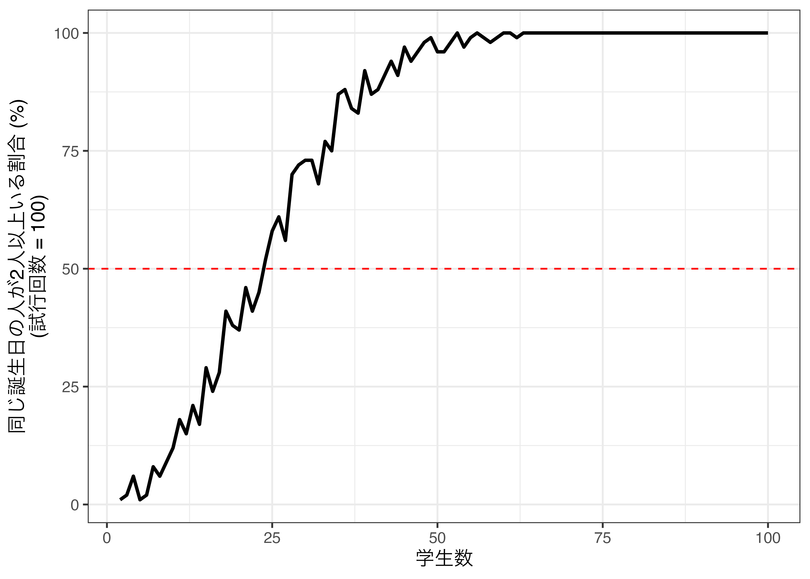
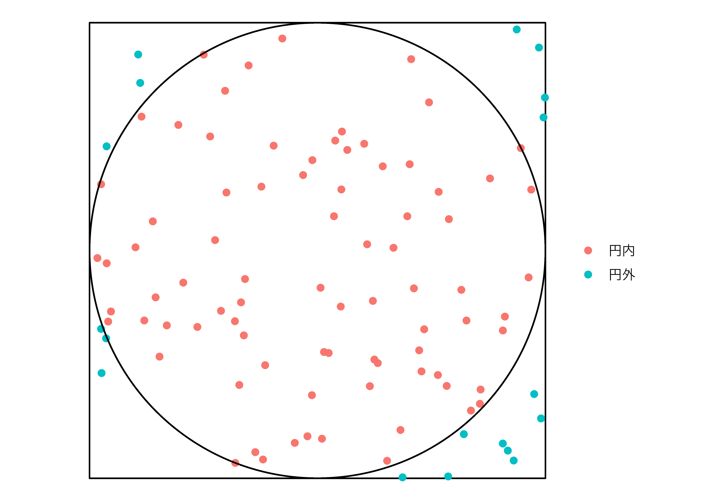

# モンテカルロシミュレーション {#monte}


## モンテカルロシミュレーションとは {#monte-intro}


```{.r .numberLines}
pacman::p_load(tidyverse, ggforce)
```

　モンテカルロ法 (Monte Carlo method)とは無作為に抽出された乱数を用い、数値計算やシミュレーションを行う手法を意味します。モンテカルロはヨーロッパのモナコ公国内の一つの地区であり、カジノで有名なところです。カジノではサイコロやルーレット、無作為に配られたカードなど、乱数が頻繁に使われることからこのように名付けられました。

　モンテカルロ法を用いたシミュレーションがモンテカルロ・シミュレーションです。計算があまりにも複雑だったり、実質的に代数で解が得られない解析学上の問題などに強みを持つ手法です。一部、明快な例（共役事前分布が存在するなど）を除き、事後分布の計算が非常に複雑（実質、不可能）だと知られていたベイズ統計学もモンテカルロ法（マルコフ連鎖モンテカルロ法; MCMC）によって、ようやく使えるものになったなど、今になってモンテカルロ法は非常に広く用いられています。

　モンテカルロ法から得られた結果には常に誤差が存在します。とりわけ、生成された乱数が少ない（= 試行回数が少ない）場合、この誤差は大きくなります。しかし、近年はパソコンの性能が飛躍的に発達しているため、かなり小さな誤差で、つまりより正確な結果が得られるようになりました。

　以下ではまず、モンテカルロ法を理解するために必須知識である乱数生成について解説します。具体的には乱数生成のアルゴリズムでなく、Rで乱数を生成する方法について紹介します。続いて、モンテカルロ法を用いたシミュレーションの例として誕生日問題、モンティ・ホール問題、円周率の計算、ブートストラップ法を紹介します。

---

## 乱数生成 {#monte-rng}

### `sample()`によるサンプリング

　無作為に値を抽出する方法には2つが考えられます。一つは**値の集合から**無作為に値を抽出する方法、もう一つは正規分布などの**確率分布から**値を抽出する方法です。ここではまず`sample()`関数を用い、値の集合から無作為に値を抽出する方法について説明します。


```{.r .numberLines}
sample(x = 値の集合ベクトル, size = 抽出の回数, 
       replace = 復元抽出の有無, prob = 各要素が抽出される確率)
```

　`replace`は復元抽出の有無を指定する引数であり、既定値は`FALSE`、つまり非復元抽出がデフォルトとなっています。これは一度抽出された要素は、二度と抽出されないことを意味します。値の集合が{0, 1}で、5個の値を抽出する（=`size`が`x`の長さより大きい）ならば、`replace`は必ず`TRUE`に設定する必要があります。抽選などは非復元抽出であるため、`replace`引数は省略可能です。しかし、対数の法則やブートストラップなどは復元抽出を仮定している場合が多く、意識的に`replace`関数は指定することを推奨します。`prob`は各要素が抽出される確率を意味し、`x`の実引数と同じ長さのnumeric型ベクトルを指定します。`prob`の実引数の総和は1であることが望ましいですが、総和が1でない場合、自動的に総和が1になるよう正則化を行います。つまり、`c(1, 3)`は`c(0.25, 0.75)`と同じことを意味します。

　サイコロを3回振るコードを書くなら、値の集合（`x`）は`c(1, 2, 3, 4, 5, 6)`、または`1:6`で、抽出の回数（`size`）は3となります。また、一回出た目も抽出される可能性があるため、復元抽出を行う必要があります（`replace = TRUE`）。そして各目が出る確率は1/6ですが、各値が抽出される確率が等しい場合、省略可能です。


```{.r .numberLines}
# この場合、prob引数は省略可能
sample(1:6, 3, replace = TRUE, prob = rep(1/6, 6))
```

```
## [1] 6 1 1
```

　今回はサイコロを1万回振り、それぞれの目が出た回数を棒グラフとして示してみます。無作為に抽出された値であれば、各目が出る回数は等しいはずです。ベクトルに対して`table()`関数を使うと、各要素が出現した回数が出力され、このオブジェクトを`barplot()`関数に渡すと棒グラフを作成することができます。


```{.r .numberLines}
Dice_vec <- sample(1:6, 10^4, replace = TRUE)
table(Dice_vec) %>% barplot()
```


　1から6までの目が出た回数がほぼ同じであることが確認できます。この6つの棒の高さがすべて同じになることはありえませんが（そもそも1万を6で割ったら余りが出ますね）、ほぼ同じ割合であることから、疑似乱数とは言え、シミュレーション用としては十分でしょう。

### 確率分布からの乱数制制

|関数名|確率分布|パラメーター|
|---|---|---|
|`rbeta()`|ベータ分布|`n`, `shape1`, `shape2`|
|`rbinom()`|二項分布|`n`, `size`, `prob`|
|`rcauchy()`|コーシー分布|`n`, `location`, `scale`|
|`rchisq()`|$\chi^2$分布|`n`, `df`|
|`rexp()`|指数分布|`n`, `rate`|
|`rf()`|$F$分布|`n`, `df1`, `df2`|
|`rgamma()`|ガンマ分布|`n`, `shape`, `scale`|
|`rgeom()`|幾何分布|`n`, `prob`|
|`rhyper()`|超幾何分布|`nn`, `m`, `n`, `k`|
|`rlnorm()`|対数正規分布|`n`, `meanlog`, `sdlog`|
|`rmultinom()`|多項分布|`n`, `size`, `prob`|
|`rnbinom()`|負の二項分布|`n`, `size`, `prob`|
|`rnorm()`|正規分布|`n`, `mean`, `sd`|
|`rpois()`|ポアソン分布|`n`, `lambda`|
|`rt()`|t分布|`n`, `df`|
|`runif()`|一様分布|`n`, `min`, `max`|
|`rweibull()`|ワイブル分布|`n`, `shape`, `scale`|
|`mvtnorm::rmvnorm()`|多変量正規分布|`n`, `mean`, `sigma`|

　以上の表に掲載されているパラメーター以外にも指定可能なパラメーターがあるため、詳細は各関数のヘルプを参照してください。たとえば、ガンマ分布の場合、`rate`で、負の二項分布の場合、`mu`で分布の形状を指定することができます。また、多変量正規分布の乱数を抽出するには{mvtnorm}パッケージの`rmvnorm()`を使いますが、ここでの`mean`は数値型ベクトル、`sigma`は行列構造の分散共分散行列を使います[^mvtnorm]。

[^mvtnorm]: `sigma`は数値型ベクトル（`mean`の実引数の長さと同じ長さ）で指定することも可能ですが、この場合、共分散は0になります。

### シードについて

　特定の分布から乱数を抽出する場合、当たり前ですが、抽出の度に値が変わります。たとえば、平均0、標準偏差1の正規分布（標準正規分布）から5つの値を抽出し、小数点3桁に丸める作業を3回繰り返しみましょう。


```{.r .numberLines}
rnorm(5) %>% round(3)
```

```
## [1]  2.174 -0.054 -0.710  0.497 -0.155
```

```{.r .numberLines}
rnorm(5) %>% round(3)
```

```
## [1]  0.783  0.067 -1.943  0.298 -1.226
```

```{.r .numberLines}
rnorm(5) %>% round(3)
```

```
## [1] 0.653 0.658 0.665 1.406 0.954
```

　このように、抽出の度に結果が変わります。1回きりのシミュレーションではこれで問題ないでしょうが、同じシミュレーションから同じ結果を得るためには、乱数を固定する必要があります。そこで使うのがシード（seed）です。シードが同じなら抽出される乱数は同じ値を取ります。シードの指定は`set.seed(numeric型スカラー)`です。たとえば、シードを[19861008](https://www.jaysong.net)にし、同じ作業をやってみましょう。


```{.r .numberLines}
set.seed(19861008)
rnorm(5) %>% round(3)
```

```
## [1] -0.086  0.396 -1.330  0.574  0.152
```

```{.r .numberLines}
rnorm(5) %>% round(3)
```

```
## [1]  0.555  0.620 -1.133  0.572  0.900
```

　シードを指定しても2つのベクトルは異なる値を取りますが、もう一度シードを指定してから乱数抽出をしてみましょう。


```{.r .numberLines}
set.seed(19861008)
rnorm(5) %>% round(3)
```

```
## [1] -0.086  0.396 -1.330  0.574  0.152
```

　先ほどのコードでシードを指定した直後に抽出した乱数と同じ乱数が得られました。モンテカルロ・シミュレーションにおいて乱数は非常に重要ですが、これはシミュレーションの度に異なる結果が得られることを意味します。つまり、自分が書いたコードから100%同じ結果が得られないだけでなく、自分も同じ結果を再現できないことを意味します。この場合、シードを指定すると乱数が固定され、シミュレーション結果の再現ができるようになります。

　一つ注意すべき点は乱数を固定した後、複数回抽出を繰り返す場合、その順番も固定されるという点です。たとえば、シードを固定せずにもう一回5つの値を抽出してみましょう。


```{.r .numberLines}
rnorm(5) %>% round(3)
```

```
## [1]  0.555  0.620 -1.133  0.572  0.900
```

　この結果は先ほどシード指定後、2回目の抽出結果と同じ結果となります。結果を再現するという点では大きな問題はないはずですが、仕様を理解しておくことは重要でしょう。

---

## 例1: 誕生日問題 {#monte-birthday}

　まず簡単な例として誕生日問題 (birthday problem)をシミュレーションで確認してみましょう。誕生日問題とは「何人いれば、その中に誕生日が同じ2人以上がいる確率が50%を超えるか。」といった問題です。1年を365日で考えると（2月29日生まれの皆さん、すみません...）、366人がいれば確実に (= 100%)同じ誕生日の人が2人以上いることになりますね。100%でなく、50%まで基準を下げるならその半分である183人は必要じゃないかと思うかも知れません。しかし、実はたった23人が集まれば、その中で同じ誕生日の人が2人以上いる確率が50%になります。誕生日のパラドックスとも呼ばれるものですが、これをシミュレーションで確認してたいと思います。

　学生の数を`n_student`とし、1から365までの公差1の等差数列から、`n_student`個の値を**復元**抽出します。


```{.r .numberLines}
n_student <- 30 # 学生数
# 「1から365までの公差1の等差数列」からn_student個の値を復元抽出
Birth_vec <- sample(1:365, n_student, replace = TRUE)

Birth_vec
```

```
##  [1] 340 122 230 148  12 136  87  46  16 310 104 351 137  53 361  65 106 361 108
## [20] 281 299  67 342   4 338  88 156 254 192  37
```

　このベクトルの中で重複する要素があるかどうかを確認するには`duplicated()`関数を使います。ある要素が他の要素と重複するなら`TRUE`が、なければ`FALSE`が表示されます。


```{.r .numberLines}
duplicated(Birth_vec)
```

```
##  [1] FALSE FALSE FALSE FALSE FALSE FALSE FALSE FALSE FALSE FALSE FALSE FALSE
## [13] FALSE FALSE FALSE FALSE FALSE  TRUE FALSE FALSE FALSE FALSE FALSE FALSE
## [25] FALSE FALSE FALSE FALSE FALSE FALSE
```

　ただし、一つでも`TRUE`が含まれていれば、同じ誕生日の人が二人以上はいるということとなるので、更に`any()`関数を使います。`any()`内の条件文において、一つでも`TRUE`があれば返り値は`TRUE`となり、全て`FALSE`なら`FALSE`を返す関数です。


```{.r .numberLines}
any(duplicated(Birth_vec))
```

```
## [1] TRUE
```

　以上の作業を100回繰り返す場合、試行回数が100回となります。この場合、`TRUE`の結果が出る試行は何回でしょうか。


```{.r .numberLines}
n_student <- 10   # 学生数
n_trials  <- 100  # 試行回数

# 結果を格納する空ベクトルを用意する
Result_vec <- rep(NA, n_trials)

# 反復処理
for (i in 1:n_trials) {
    Birth_vec     <- sample(1:365, n_student, replace = TRUE)
    Result_vec[i] <- any(duplicated(Birth_vec))
}

Result_vec
```

```
##   [1] FALSE FALSE FALSE FALSE FALSE FALSE FALSE FALSE  TRUE FALSE FALSE FALSE
##  [13] FALSE FALSE FALSE FALSE  TRUE FALSE FALSE FALSE  TRUE FALSE FALSE FALSE
##  [25] FALSE FALSE  TRUE FALSE FALSE FALSE FALSE FALSE FALSE FALSE FALSE FALSE
##  [37] FALSE FALSE FALSE FALSE  TRUE FALSE FALSE FALSE FALSE  TRUE FALSE FALSE
##  [49] FALSE  TRUE FALSE FALSE FALSE FALSE FALSE FALSE FALSE FALSE FALSE FALSE
##  [61] FALSE FALSE FALSE FALSE FALSE FALSE  TRUE  TRUE FALSE FALSE FALSE FALSE
##  [73] FALSE FALSE FALSE FALSE FALSE FALSE FALSE FALSE FALSE FALSE FALSE FALSE
##  [85] FALSE FALSE FALSE  TRUE FALSE FALSE FALSE FALSE FALSE FALSE FALSE FALSE
##  [97] FALSE FALSE FALSE FALSE
```

　100回の試行の中で`TRUE`が出たのは10回ですね。割合で考えると10%です。この試行回数を無限にすると確率として解釈できますが、無限回繰り返しは世の中が終わるまでやっても終わりませんね。ただし、十分に多い試行回数、たとえば1万回程度繰り返すと確率に近似できるでしょう。


```{.r .numberLines}
n_student <- 10    # 学生数
n_trials  <- 10000 # 試行回数

# 結果を格納する空ベクトルを用意する
Result_vec <- rep(NA, n_trials)

# 反復処理
for (i in 1:n_trials) {
    Birth_vec     <- sample(1:365, n_student, replace = TRUE)
    Result_vec[i] <- any(duplicated(Birth_vec))
}

sum(Result_vec)
```

```
## [1] 1147
```

　1万回の試行から`TRUE`が出た回数は1147回であり、11.5%ですね。つまり、人が10人集まれば誕生日が同じ人が2人以上いる確率は約11.5%ということになります。実はこの確率は厳密に計算可能であり、理論的な確率は約11.7%です。シミュレーションから得られた結果が理論値にかなり近似していることが分かります。

　今回は試行回数は100に固定し、学生数を2から100まで調整しながら同じ誕生日の人が2人以上いる割合を計算してみましょう。以下では割合を計算する関数`Birthday_Func()`を作成し、{purrr}の`map_dbl()`関数を使用して反復処理を行います。関数の作成は第\@ref(functions)章を、{purrr}の使い方については第\@ref(iteration)章を参照してください。


```{.r .numberLines}
# 割合を計算する関数を作成する
Birthday_Func <- function (n, n_trials) {
    
    # 各試行の結果を格納する空ベクトルを用意する。
    Result_vec <- rep(NA, n_trials)
    
    # n_trials回だけ{}内コードを繰り返す。
    for (i in 1:n_trials) {
        # 1:365からn個の値を復元抽出
        Birth_vec     <- sample(1:365, n, replace = TRUE)
        # 重複する要素があるかをチェックし、結果ベクトルのi番目に格納
        Result_vec[i] <- any(duplicated(Birth_vec))
    }
    
    # 各試行結果が格納されたベクトルからTRUEの割合を返す
    mean(Result_vec)
}

# 学生数をStudents列に格納したデータフレーム (tibble)を作成
Prob_df <- tibble(Students = 2:100)

# Students列の値に応じてBirthday_Func()を実行
Prob_df <- Prob_df %>%
    mutate(Probs = map_dbl(Students, ~Birthday_Func(.x, 100)))
```

　{purrr}関数を使わずに、`for()`文を使用した例は以下のようになります。


```{.r .numberLines}
# {purrr}を使わない方法
Prob_df <- tibble(Students = 2:100,
                  Probs    = NA)

for (i in 1:nrow(Prob_df)) {
    
    Result_vec <- rep(NA, n_trials)
    
    for (j in 1:n_trials) {
        Birth_vec     <- sample(1:365, Prob_df$Students[i], replace = TRUE)
        Result_vec[j] <- any(duplicated(Birth_vec))
    }
    
    Prob_df$Probs[i] <- mean(Result_vec)
}
```

　結果を確認してみましょう。


```{.r .numberLines}
Prob_df
```

```
## # A tibble: 99 × 2
##    Students Probs
##       <int> <dbl>
##  1        2  0.01
##  2        3  0.02
##  3        4  0.06
##  4        5  0.01
##  5        6  0.02
##  6        7  0.08
##  7        8  0.06
##  8        9  0.09
##  9       10  0.12
## 10       11  0.18
## # … with 89 more rows
```

　学生数が何人いれば、同じ誕生日の人が2人以上いる割合が50%になるのでしょうか。割合が0.4以上、0.6以下の行を抽出してみましょう。


```{.r .numberLines}
Prob_df %>%
    filter(Probs >= 0.4 & Probs <= 0.6)
```

```
## # A tibble: 7 × 2
##   Students Probs
##      <int> <dbl>
## 1       18  0.41
## 2       21  0.46
## 3       22  0.41
## 4       23  0.45
## 5       24  0.52
## 6       25  0.58
## 7       27  0.56
```

　大体23人前後ですかね。試行回数を増やせばもう少し厳密に検証出来るかも知れませんが、とりあえず以上の結果を可視化してみましょう。


```{.r .numberLines}
Prob_df %>%
    ggplot() +
    geom_line(aes(x = Students, y = Probs * 100), size = 1) +
    geom_hline(yintercept = 50, color = "red", linetype = 2) +
    labs(x = "学生数",
         y = "同じ誕生日の人が2人以上いる割合 (%)\n(試行回数 = 100)") +
    theme_bw(base_size = 12)
```



　非常に直感に反する結果かも知れませんが、50人程度いれば、**ほぼ**確実に同じ誕生日の人が2人以上いることが分かります。この誕生日問題は以下のように解くことができます。人が$n$人いる場合、同じ誕生日の人が2人以上いる確率$p(n)$は、

$$
p(n) = 1 - \frac{365!}{365^n (365-n)!}
$$

　!は階乗を意味し、5!は$5 \times 4 \times 3 \times 2 \times 1$を意味します。Rでは`factorial()`関数を使います。それでは$p(50)$はいくらでしょうか。


```{.r .numberLines}
1 - factorial(365) / (365^50 * factorial(365 - 50))
```

```
## [1] NaN
```

　あらら、`NaN`がでましたね。つまり、計算不可です。実際、`factorial(365)`だけでも計算結果は`Inf`が出ます。むろん、実際に無限ではありませんが、非常に大きい数値ということです。以上の式を計算可能な式に変形すると以下のようになります。

$$
p(n) = 1 - \frac{n! \times _{365}C_n}{365^n}
$$

　$C$は二項係数を意味し$_nC_k$は$\frac{n!}{k!(n-k)!}$です。Rでは`choose(n, k)`で計算可能です。


```{.r .numberLines}
1 - ((factorial(50) * choose(365, 50)) / 365^50)
```

```
## [1] 0.9703736
```

　結果は0.9703736です。つまり、人が50人いれば同じ誕生日の人が2人以上いる確率は約97%ということです。それでは、以上の式を関数化し、`p(22)`と`p(23)`を計算してみましょう。


```{.r .numberLines}
Birth_Expect <- function (n) {
    1 - ((factorial(n) * choose(365, n)) / 365^n)
}

Birth_Expect(22)
```

```
## [1] 0.4756953
```

```{.r .numberLines}
Birth_Expect(23)
```

```
## [1] 0.5072972
```

　確率が50%を超える人数は23人であることが分かります。先ほどのデータフレーム (`Prob_df`)にこの理論値を`Expect`という名の列として追加してみましょう。


```{.r .numberLines}
Prob_df <- Prob_df %>%
    mutate(Expect = map_dbl(Students, ~Birth_Expect(.x)))

Prob_df
```

```
## # A tibble: 99 × 3
##    Students Probs  Expect
##       <int> <dbl>   <dbl>
##  1        2  0.01 0.00274
##  2        3  0.02 0.00820
##  3        4  0.06 0.0164 
##  4        5  0.01 0.0271 
##  5        6  0.02 0.0405 
##  6        7  0.08 0.0562 
##  7        8  0.06 0.0743 
##  8        9  0.09 0.0946 
##  9       10  0.12 0.117  
## 10       11  0.18 0.141  
## # … with 89 more rows
```

　これは人間にとっては読みやすい表ですが、可視化まで考えると、tidyなデータといは言えません。したがって、`pivot_longer()`関数を使用してtidyなデータに整形します。{tidyr}パッケージの使い方は第\@ref(tidydata)章を参照してください。


```{.r .numberLines}
Prob_df2 <- Prob_df %>%
    pivot_longer(cols      = Probs:Expect,
                 names_to  = "Type",
                 values_to = "Prob") 

Prob_df2
```

```
## # A tibble: 198 × 3
##    Students Type      Prob
##       <int> <chr>    <dbl>
##  1        2 Probs  0.01   
##  2        2 Expect 0.00274
##  3        3 Probs  0.02   
##  4        3 Expect 0.00820
##  5        4 Probs  0.06   
##  6        4 Expect 0.0164 
##  7        5 Probs  0.01   
##  8        5 Expect 0.0271 
##  9        6 Probs  0.02   
## 10        6 Expect 0.0405 
## # … with 188 more rows
```

　こちらのデータを使用し、シミュレーションから得られた結果と理論値を折れ線グラフで出力してみましょう。


```{.r .numberLines}
Prob_df2 %>%
    mutate(Type = ifelse(Type == "Probs", "シミュレーション", "理論値")) %>%
    ggplot() +
    geom_line(aes(x = Students, y = Prob * 100, color = Type), size = 1) +
    labs(x     = "学生数",
         y     = "同じ誕生日の人が2人以上いる割合 (%)\n(試行回数 = 100)",
         color = "") +
    theme_bw(base_size = 12) +
    theme(legend.position = "bottom")
```


　最後に以上の作業を試行回数10000としてもう一回やってみましょう。


```{.r .numberLines}
# 学生数をStudents列に格納したデータフレーム (tibble)を作成
Prob_df <- tibble(Students = 2:100)

# Students列の値に応じてBirthday_Func()を実行
Prob_df <- Prob_df %>%
    mutate(Simul  = map_dbl(Students, ~Birthday_Func(.x, 10000)),
           Expect = map_dbl(Students, ~Birth_Expect(.x)))

Prob_df %>%
    pivot_longer(cols      = Simul:Expect,
                 names_to  = "Type",
                 values_to = "Prob") %>%
    mutate(Type = ifelse(Type == "Simul", "シミュレーション", "理論値")) %>%
    ggplot() +
    geom_line(aes(x = Students, y = Prob * 100, color = Type), size = 1) +
    labs(x     = "学生数",
         y     = "同じ誕生日の人が2人以上いる割合 (%)\n(試行回数 = 100)",
         color = "") +
    theme_bw(base_size = 12) +
    theme(legend.position = "bottom")
```


　モンテカルロ・シミュレーションから得られた割合と理論上の確率が非常に近似していることが分かります。

---

## 例2: モンティ・ホール問題 {#monte-montyhall}

　抽出される乱数が必ずしも数値である必要はありません。たとえば、コイン投げの表と裏、ポーカーで配られたカードなど、数値以外の乱数もあり得ます。ここでは「AとB、C」から一つを選ぶ例として、モンティ・ホール問題をモンテカルロ法で解いてみましょう。

　モンティ・ホール問題はアメリカのテレビ番組「Let's make a deal」の中のゲームであり、この番組の司会者の名前がモンティ・ホール (Monty Hall)さんです。このゲームのルールは非常にシンプルです。

1. 3つのドアがあり、1つのドアの裏に商品 (車)がある。残りの2つは外れ（ヤギ）である。
2. 参加者はドアを選択する。
3. 司会者が残りのドア2つの中で商品がないドアを開けて中身を見せる。
4. ここで参加者はドアの選択を変える機会が与えられる。

　直観的に考えて、司会者が外れのドアを1つ教えてくれたなら、自分が選んだドアを含め、残りの2つのドアの1つに絶対に商品があります。直感的に考えてみると、当たる確率は半々であって、変えても、変えなくても当たる確率は同じだと考えられます。詳細は[Wikipedia](https://ja.wikipedia.org/wiki/%E3%83%A2%E3%83%B3%E3%83%86%E3%82%A3%E3%83%BB%E3%83%9B%E3%83%BC%E3%83%AB%E5%95%8F%E9%A1%8C)などを参照してください。この問題を巡る論争とかも紹介されていてなかなか面白いです。

　結論から申しますと選択を変えた方が、変えなかった場合より当たる確率が2倍になります。これは条件付き確率とベイズの定理を用いることで数学的に説明できますが、ここではあえてモンテカルロ法で調べてみたいと思います。シミュレーションの具体的な手順は以下の通りです。

1. 結果を格納する長さ1万の空ベクトルを2つ用意する。 (`Switch_Yes`と`Switch_No`)。
2. `i`の初期値を1とする。
3. 当たり (車)の位置をA, B, Cの中から無作為に1つ決め、`Car_Position`に格納する。
4. 最初の選択肢をA, B, Cの中から無作為に1つ決め、`Choice`に格納する。
5. 選択肢を変更した場合の結果を`Switch_Yes`の`i`番目の要素としてに格納する。
   1. 当たりの位置と最初の選択肢が同じなら (`Switch_Yes == Choice`)、結果は外れ (ヤギ)
   2. 当たりの位置と最初の選択肢が同じでないなら (`Switch_Yes != Choice`)、結果は当たり (車)
6. 選択肢を変更しなかった場合の結果を`Switch_No`の`i`番目の要素として格納する。
   1. 当たりの位置と最初の選択肢が同じなら (`Switch_Yes == Choice`)、結果は当たり (車)
   2. 当たりの位置と最初の選択肢が同じでないなら (`Switch_Yes != Choice`)、結果は外れ (ヤギ)
7. `i`の値を1増やし、3に戻る。
6. 3〜7の手順を1万回繰り返す。

　以上の手順をコードで書くと以下のようになります。


```{.r .numberLines}
Switch_Yes <- rep(NA, 10000)
Switch_No  <- rep(NA, 10000)

set.seed(19861009)
for (i in 1:10000) {
    Car_Position <- sample(c("A", "B", "C"), 1)
    Choice       <- sample(c("A", "B", "C"), 1)
    
    Switch_Yes[i] <- ifelse(Car_Position == Choice, "Goat", "Car")
    Switch_No[i]  <- ifelse(Car_Position == Choice, "Car", "Goat")
}

table(Switch_Yes)
```

```
## Switch_Yes
##  Car Goat 
## 6737 3263
```

```{.r .numberLines}
table(Switch_No)
```

```
## Switch_No
##  Car Goat 
## 3263 6737
```

　選択肢を変更し、車を獲得した回数は10000回中、6737であり、約67%です。つまり、選択肢を変えた方が、変えなかった場合に比べ、車が当たる確率が約2倍高いことを意味します。むろん、車よりもヤギが重宝される地域に住んでいるなら、あえて選択肢を変えず、ヤギを狙った方が良いかも知れません。

---

## 応用1: 円周率の計算 {#monte-pi}

　今回はもう一つの例として、円周率 ($\pi$)の計算を紹介したいと思います。$\pi$は無理数であるため、厳密な計算は出来ませんが、モンテカルロ・シミュレーションである程度近似できます。たとえば、半径1 ($r = 1$)の円を考えてみましょう。


　円の面積は$r^2\pi$であるため、この円の面積は$\pi$です。また、四角形は辺の長さが2の正四角形ですから面積は4です。続いて、四角形の範囲内の点を付けます。無作為に20個を付けてみます。


　20個点のうち、円の外側にあるのは5個、円の内側は15個です。つまり、75%の点が円内にあることを意味します。点の位置は無作為ですので、もし円の大きさが$\pi$であれば、点が円内に入る確率は$\frac{\pi}{4}$です。今回の例だと$\frac{\pi}{4} = 0.75$であるため、$\pi = 0.75 \times 4 = 3$となります。実際の円周率は3.141593...なので、そこそこ近似できていますね。

　それではこれを実際にやってみましょう。今回は20個の点ではなく、100個にしてみましょう。まず、100個の点を無作為に抽出します。


```{.r .numberLines}
set.seed(19861009)
pi_df <- tibble(x = runif(100, -1, 1),
                y = runif(100, -1, 1))

pi_df
```

```
## # A tibble: 100 × 2
##          x      y
##      <dbl>  <dbl>
##  1 -0.950  -0.344
##  2  0.0724  0.150
##  3  0.874   0.971
##  4  0.938   0.267
##  5  0.205   0.469
##  6 -0.343  -0.590
##  7 -0.0245 -0.635
##  8 -0.273  -0.886
##  9 -0.405   0.701
## 10  0.528  -0.547
## # … with 90 more rows
```

　まず、各辺の長さが2の正四角形と`pi_df`で生成した100個の点をプロットします。四角形を描くときには`geom_rect()`幾何オブジェクトを使用します。マッピングは四角形の左下の座標 (`xmin`と`ymin`)、右上の座標 (`xmax`と`ymax`)に行います。今回は原点が (0, 0)の半径1の円に接する四角形ですから、左下の座標は (-1, -1)、右上の座標は (1, 1)となります。


```{.r .numberLines}
pi_df %>%
    ggplot() +
    geom_rect(aes(xmin = -1, ymin = -1, xmax = 1, ymax = 1),
              fill = "white", color = "black") +
    geom_point(aes(x = x, y = y)) +
    coord_fixed(ratio = 1) +
    theme_minimal()
```


　ここに円を追加してみましょう。円を描くときには{ggforce}パッケージの`geom_circle()`幾何オブジェクトを使用します。マッピングは円の原点 (`x0`と`y0`)、円の半径 (`r`)です。原点は (0, 0)で半径は1の円を重ねます。


```{.r .numberLines}
pi_df %>%
    ggplot() +
    geom_rect(aes(xmin = -1, ymin = -1, xmax = 1, ymax = 1),
              fill = "white", color = "black") +
    geom_circle(aes(x0 = 0, y0 = 0, r = 1)) +
    geom_point(aes(x = x, y = y)) +
    coord_fixed(ratio = 1) +
    theme_minimal()
```


　これだけだと読みづらいので、円の中か外かで点の色分けをしてみましょう。そのためには各点が円内に入っているかどうかを判定した変数`in_circle`を追加します。点($x$, $y$)が、原点が($x^\prime$, $y^\prime$)、かつ半径$r$の円内に入っている場合、$(x - x^\prime)^2 + (y - y^\prime)^2 < r^2$が成立します。今回は原点が (0, 0)で、半径が1であるため、$x^2 + y^2 < 1$か否かを判定します。この条件を満たしているかどうかを示す`in_circle`という変数を追加します。


```{.r .numberLines}
pi_df <- pi_df %>%
    mutate(in_circle = if_else(x^2 + y^2 < 1^2, "円内", "円外"))
```

　散布図レイヤー (`geom_point()`)内に`color`を`in_circle`変数でマッピングします。


```{.r .numberLines}
pi_df %>%
    ggplot() +
    geom_rect(aes(xmin = -1, ymin = -1, xmax = 1, ymax = 1),
              fill = "white", color = "black") +
    # 円の内側か外側かで色分け
    geom_point(aes(x = x, y = y, color = in_circle), size = 2) +
    geom_circle(aes(x0 = 0, y0 = 0, r = 1)) +
    labs(x = "X", y = "Y", color = "") +
    coord_fixed(ratio = 1) +
    theme_void(base_size = 12)
```



　実際に円内の点と円外の点の個数を数えてみましょう。


```{.r .numberLines}
pi_df %>%
    group_by(in_circle) %>%
    summarise(N = n())
```

```
## # A tibble: 2 × 2
##   in_circle     N
##   <chr>     <int>
## 1 円外         18
## 2 円内         82
```

　円内の点は82個、円外の点は18ですね。つまり、$\frac{\pi}{4} = 0.82$であり、$\pi = 0.82 \times 4 = 3.28$です。


```{.r .numberLines}
82 / 100 * 4
```

```
## [1] 3.28
```

　今回は100個の点で円周率の近似値を計算しましたが、点の数を増やすとより正確な近似値が得られます。以下の例は10000個の点から得られた円周率の例です。


```{.r .numberLines}
set.seed(19861009)
pi_df2 <- tibble(x = runif(5000, -1, 1),
                 y = runif(5000, -1, 1))

pi_df2 <- pi_df2 %>%
    mutate(in_circle = if_else(x^2 + y^2 < 1, "円内", "円外"))

pi_df2 %>%
    ggplot() +
    geom_rect(aes(xmin = -1, ymin = -1, xmax = 1, ymax = 1),
              fill = "white", color = "black") +
    geom_point(aes(x = x, y = y, color = in_circle), size = 2) +
    geom_circle(aes(x0 = 0, y0 = 0, r = 1)) +
    labs(x = "X", y = "Y", color = "") +
    coord_fixed(ratio = 1) +
    theme_void(base_size = 12)
```


```{.r .numberLines}
pi_df2 %>%
    group_by(in_circle) %>%
    summarise(N = n())
```

```
## # A tibble: 2 × 2
##   in_circle     N
##   <chr>     <int>
## 1 円外       1081
## 2 円内       3919
```

　円内の点は3919個、円外の点は1081ですね。この結果から円周率を計算してみましょう。


```{.r .numberLines}
3919 / 5000 * 4
```

```
## [1] 3.1352
```

　より実際の円周率に近い値が得られました。

---

## 応用2: ブートストラップ法 {#monte-bootstrap}

　最後に、様々な分析から得られた統計量の不確実性を計算する方法の一つであるブートストラップ法 (bootstrapping)について説明します。たとえば、平均値の差分の検定 (*t*検定)差、回帰分析における標準誤差などはRの`t.test()`、`lm()`関数を使用すれば瞬時に計算できます。こちらの標準誤差はデータを与えられれば、常に同じ値が得られるもので、何らかの計算式があります。しかし、世の中にはモデルが複雑すぎて、統計量の標準誤差がうまく計算できないケースもあります。そこで登場するのがブートストラップ法を用いると、不確実性の近似値が得られます。ブートストラップ法は @Efron:1979 が提案した以来、データ分析において広く使われています。ブートストラップ法については優れた教科書が多くあるので詳細な説明は割愛し、以下ではブートストラップ法の簡単な例を紹介します。

　ブートストラップにおいて重要なのは元のデータセットのサンプルサイズを$n$とした場合、復元抽出を用いてサンプルサイズ$n$のデータセットをもう一度構築することです。そしてその平均値を計算します。これらの手順を5000回繰り返せば、5000個の平均値が得られます。この5000個の平均値の平均値は元のデータセットの平均値に近似し、5000個の平均値の標準偏差は元のデータセットの平均値の標準誤差に近似できます。これは本当でしょうか。実際にやってみましょう。

　まずは、長さ100のベクトルを2つ作成します。この2つのベクトルは平均値が0.7、0.9、標準偏差1の正規分布に従うとします。

$$
\begin{aligned}
\mbox{Data1} & \sim \mbox{Normal}(\mu = 0.7, \sigma = 1) \\
\mbox{Data2} & \sim \mbox{Normal}(\mu = 0.9, \sigma = 1) 
\end{aligned}
$$

　2つの標本の平均値の差分は約0.2です。この差分の不確実性はいくらでしょうか。ここでは主に使われる平均値の差の検定 ($t$検定)をやってみましょう。回は標準誤差が同じ2つの分布から得られた標本であるため、等分散を仮定する$t$検定を行います (`var.equal = TRUE`を追加)。


```{.r .numberLines}
set.seed(19861009)
Data1 <- rnorm(100, 0.7, 1)
Data2 <- rnorm(100, 0.9, 1)

ttest_result <- t.test(Data1, Data2, var.equal = TRUE)

ttest_result
```

```
## 
## 	Two Sample t-test
## 
## data:  Data1 and Data2
## t = -2.1707, df = 198, p-value = 0.03114
## alternative hypothesis: true difference in means is not equal to 0
## 95 percent confidence interval:
##  -0.58521800 -0.02807095
## sample estimates:
## mean of x mean of y 
## 0.6912143 0.9978588
```

平均値の差分の不確実性 (=標準誤差)は`ttest_result$stderr`で抽出可能であり、今回は約0.141です。標準誤差の値さえ分かれば、検定統計量も、信頼区間も、$p$値も計算できるため、重要なのはやはり標準誤差でしょう。以下では試行回数は1万のブートストラップ法で標準誤差の近似値を計算してみます。

1. 結果を格納する長さ1万の空ベクトル`Result_vec`を作成する。
2. `i`の初期値を1と設定する。
3. `Data1`から100個 (= `Data1`の大きさ)の値を無作為抽出 (**復元抽出**)し、`Sample1`に格納する。
4. `Data2`から100個 (= `Data2`の大きさ)の値を無作為抽出 (**復元抽出**)し、`Sample2`に格納する。
5. `Result_vec`の`i`番目の位置に`Sample1`の平均値と`Sample2`の平均値の差分を格納する。
6. `i`を1増加させる。
7. 3~6の手順を1万回繰り返す。


```{.r .numberLines}
n_trials   <- 10000
Result_vec <- rep(NA, n_trials)

for (i in 1:n_trials) {
    Sample1 <- sample(Data1, 100, replace = TRUE)
    Sample2 <- sample(Data2, 100, replace = TRUE)
    
    Result_vec[i] <- mean(Sample1) - mean(Sample2)
}
```

　`Result_vec`には平均値の差分が10000個格納されており、これらの値の平均値をブートストラップ推定量 (bootstrap estimate)と呼ぶとします。


```{.r .numberLines}
mean(Result_vec) # ブートストラップ推定量 (平均値の差分の平均値)
```

```
## [1] -0.3045563
```

　実際の平均値の差分は-0.3066445、ブートストラップ推定量は -0.3045563であるため、その差は0.0020881です。これをブートストラップ推定量のバイアスと呼びます。

　ただし、我々に興味があるのは平均値の差分ではありません。平均値の差分はブートストラップ法を用いなくても普通に計算できるからです。ここで重要なのは平均値の差分の不確実性、つまり標準誤差でしょう。ブートストラップ推定量の標準誤差は`Result_vec`の標準偏差を計算するだけで十分です。


```{.r .numberLines}
sd(Result_vec) # ブートストラップ推定量の標準誤差
```

```
## [1] 0.1404988
```


```{.r .numberLines}
# 平均値の差分の平均値 / 平均値の差分の標準偏差
mean(Result_vec) / sd(Result_vec)
```

```
## [1] -2.167679
```


```{.r .numberLines}
# p値
(1 - pt(abs(mean(Result_vec) / sd(Result_vec)), df = 198)) * 2
```

```
## [1] 0.03137631
```


```{.r .numberLines}
# 95%信頼区間
quantile(Result_vec, c(0.025, 0.975))
```

```
##        2.5%       97.5% 
## -0.58084484 -0.02999534
```

`Result_vec`のヒストグラムと$\mu$ = -0.307、$\sigma$ = 0.141の正規分布を重ねて見る（-0.307と0.141は$t$検定から得られた数値）。


```{.r .numberLines}
enframe(Result_vec) %>%
    ggplot() +
    geom_histogram(aes(x = value, y = ..density..), color = "white") +
    stat_function(aes(color = "Density"),
                  size = 2, fun = dnorm, n = 101, 
                  args = list(mean = -0.307, sd = 0.141)) +
    scale_color_discrete(labels = c("Density" = expression(paste(mu ~ "= -0.307, " ~ sigma ~ "= 0.141 の正規分布")))) +
    labs(x = "平均値の差分", y = "密度", color = "") +
    theme_bw(base_size = 12) +
    theme(legend.position = "bottom")
```


$t$検定とブートストラップ法の比較


