# 可視化[応用] {#visualization3}


　第\@ref(visualization1)章と第\@ref(visualization2)章では{ggplot2}の概念と5つの代表的なグラフ（棒、ヒストグラム、箱ひげ図、散布図、折れ線）の作り方について説明しました。本章では軸の調整、座標系の調整など、幾何オブジェクト**以外**のレイヤーについて説明します。第\@ref(visualization2)章で紹介しなかった図の作成方法については第\@ref(visualization4)章で解説します。

1. [ラベル](#visual3-labs)
2. [座標系](#visual3-coordinate)
3. [スケール](#visual3-scale)
4. [テーマ](#visual3-theme)
5. [図の結合](#visual3-merge)

　本章で使用するデータは第\@ref(visualization2)章で使用したものと同じデータを使います。データの詳細については第\@ref(visualization2)章を参照してください。


```{.r .numberLines}
pacman::p_load(tidyverse)
Country_df <- read_csv("Data/Countries.csv")
COVID19_df <- read_csv("Data/COVID19_Worldwide.csv", guess_max = 10000)
```

---

## `labs()`: ラベルの修正 {#visual3-labs}

　既に`labs()`レイヤーは第\@ref(visualization2)章で使ったことがあるでしょう。ここでは`labs()`の仕組みについて簡単に解説します。

　`labs()`関数は軸、凡例、プロットのラベル（タイトルなど）を修正する際に使用する関数です。軸ラベルは横軸（`x`）と縦軸（`y`）のラベルを意味します。指定しない場合は、マッピングで指定した変数名がそのまま出力されます。これは凡例ラベルも同じです。{ggplot2}は2次元のグラフの出力に特化したパッケージであるため、出力される図には必ず横軸と縦軸があります。したがって、引数として`x`と`y`は常に指定可能です。

　一方、凡例はマッピングされない場合、表示されません。幾何オブジェクトの`aes()`内に`color`、`size`、`linetype`などの要素がマッピングされてから初めて凡例で表示されます。凡例が存在することは何かの要素にマッピングがされていることを意味します。このマッピング要素名（`color`、`size`、`linetype`など）を`labs()`の引数として使うことで凡例のラベルが修正されます。マッピングされていない要素に対してラベルを指定しても、図に影響はありません。たとえば、`Country_df`の一人あたりGDP（`GDP_per_capita`）を横軸、フリーダムハウスのスコア（`FH_Total`）を縦軸にした散布図を作成します。


```{.r .numberLines}
Country_df %>%
    ggplot() +
    geom_point(aes(x = FH_Total, y = GDP_per_capita)) +
    labs(x = "フリーダムハウススコア",y = "一人あたりGDP (USD)", 
         color = "大陸") +
    theme_bw(base_size = 12)
```

```
## Warning: Removed 1 rows containing missing values (geom_point).
```

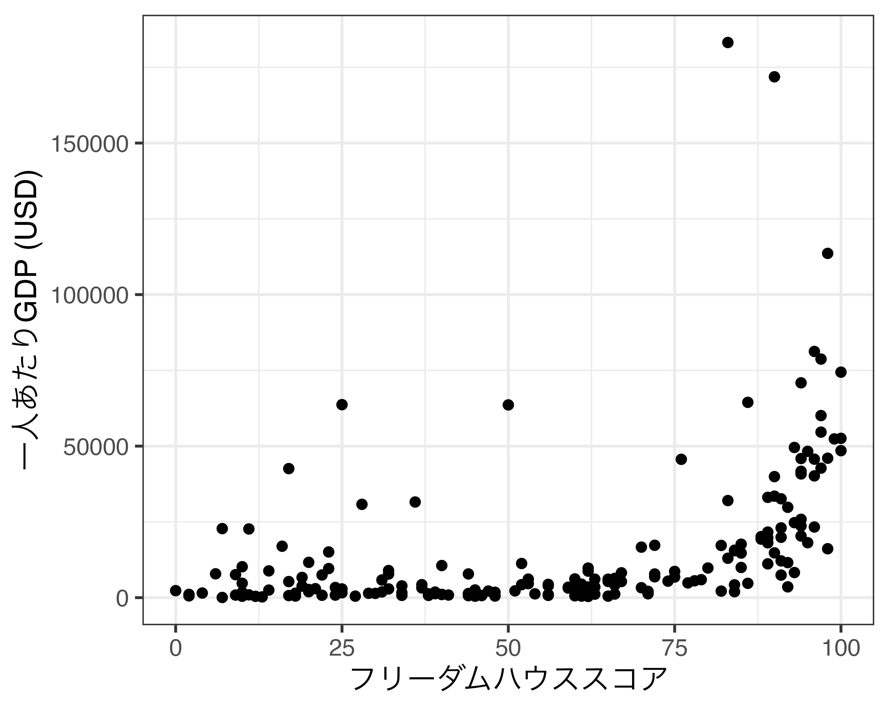

　`geom_point()`は横軸と縦軸のみにマッピングをしているため、`labs()`に`color =`を指定しても何の変化もありません。そもそも凡例が存在しないからです。それでは大陸ごとに色分けした散布図に修正してみましょう。


```{.r .numberLines}
Country_df %>%
    ggplot() +
    geom_point(aes(x = FH_Total, y = GDP_per_capita, color = Continent)) +
    labs(x = "フリーダムハウススコア",y = "一人あたりGDP (USD)", 
         color = "大陸") +
    theme_bw(base_size = 12)
```

```
## Warning: Removed 1 rows containing missing values (geom_point).
```


`color`に`Continent`変数をマッピングすることによって、各点の色は何らかの情報を持つようになりました。そして各色が`Continent`のどの値に対応しているかを示すために凡例が表示されます。凡例のラベルはデフォルトは変数名（この例の場合、「Continent」）ですが、ここでは「大陸」と修正されました。

　ここまでが第\@ref(visualization2)章で使用しました`labs()`レイヤーの使い方です。他にも`labs()`は**プロット**のラベルを指定することもできます。ここでいう「プロットのラベル」とはプロットのタイトルとほぼ同じです。使用可能な引数は`title`、`subtitle`、`tag`です。


```{.r .numberLines}
Country_df %>%
    ggplot() +
    geom_point(aes(x = FH_Total, y = GDP_per_capita, color = Continent)) +
    labs(x = "フリーダムハウススコア",y = "一人あたりGDP (USD)", color = "大陸",
         title = "民主主義の度合いと所得の関係", subtitle = "大陸別の傾向", 
         tag = "(a)") +
    theme_bw(base_size = 12)
```

```
## Warning: Removed 1 rows containing missing values (geom_point).
```


　`title`は図のメインタイトルとおり、プロットのタイトルを意味します。上の図だと「民主主義の度合いと所得の関係」です。また、`subtitle`引数を指定することでサブタイトルを付けることも可能です。上の図の「大陸別の傾向」がサブタイトルです。最後の`tag`は複数の図を並べる際に便利な引数です。図が横に2つ並んでいる場合、それぞれ(a)と(b)という識別子を付けると、文中において「図3(a)は...」のように、引用しやすくなります。この「(a)」が`tag`引数に対応します。複数の図を並べる方法は本章の後半にて説明します。

最後にキャプションの付け方について説明します。たとえば、外部のデータを利用して作図を行った場合、図の右下に「データ出典：〜〜」や「Source: https://www.jaysong.net 」などを付ける場合があります。このキャプションは`labs()`関数内に`caption`引数を指定するだけで付けることができます。たとえば、先程の図に「Source: Freedom House」を付けてみましょう。


```{.r .numberLines}
Country_df %>%
    ggplot() +
    geom_point(aes(x = FH_Total, y = GDP_per_capita, color = Continent)) +
    labs(x = "フリーダムハウススコア",y = "一人あたりGDP (USD)", color = "大陸",
         title = "民主主義の度合いと所得の関係", subtitle = "大陸別の傾向", 
         tag = "(a)", caption = "Source: Freedom House") +
    theme_bw(base_size = 12)
```

```
## Warning: Removed 1 rows containing missing values (geom_point).
```

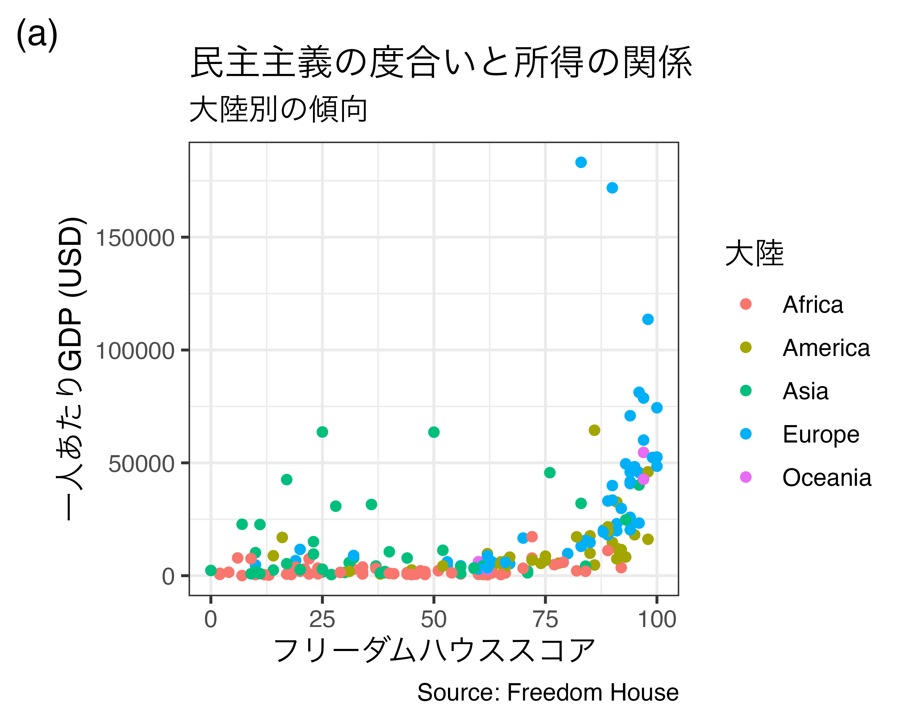

<!--
## `guides()`: 
-->

---

## `coord_*()`: 座標系の調整 {#visual3-coordinate}

　{ggplot2}はいくつかの座標系を提供しています。円グラフを作成する際に使われる極座標系（`coord_polar()`）や地図の出力によく使われる`coord_map()`や`coord_sf()`がその例です。中でも最も頻繁に使われる座標系はやはり縦軸と横軸は直交する直交座標系（デカルト座標系）でしょう。ここでは直交座標系の扱い方について解説します。

### 直交座標系の操作

　まずは座標系の上限と下限を指定する方法から考えましょう。日米中間のCOVID-19累積感染者数の折れ線グラフを作成してみましょう。


```{.r .numberLines}
Fig1 <- COVID19_df %>%
  mutate(Date = as.Date(Date)) %>%
  filter(Country %in% c("Japan", "South Korea", "China", "United States")) %>%
  ggplot() +
  geom_line(aes(x = Date, y = Confirmed_Total, color = Country)) +
  labs(x = "月", y = "累積感染者数 (人)") +
  theme_minimal(base_size = 12)

print(Fig1)
```


　アメリカの感染者が圧倒的に多いこともあり、日韓がほぼ同じ線に見えます。これを是正するために対数変換などを行うわけですが、対数変換したグラフは直感的ではないというデメリットがあります。それでもう一つの方法として、アメリカに関する情報は一部失われますが、縦軸の上限を10万にすることが考えられます。直交座標系の上限・下限を調整する関数が`coord_cartesian()`です。横軸は`xlim`、縦軸は`ylim`引数を指定し、実引数としては長さ2のnumericベクトルを指定します。たとえば、縦軸の下限を0、上限を10万にするなら、`ylim = c(0, 100000)`となります。先ほどの図は既に`Fig1`という名のオブジェクトとして保存されているため、ここに`coord_cartesian()`レイヤーを追加してみましょう。


```{.r .numberLines}
Fig1 +
  coord_cartesian(ylim = c(0, 100000))
```


3月下旬以降、アメリカの情報は図から失われましたが、日中韓についてはよりトレンドの差が区別できるようになりました。{ggplot2}は座標系の上限と下限をデータの最小値と最大値に合わせて自動的に調整してくれます。たとえば、以下のような例を考えてみましょう。


```{.r .numberLines}
Fig2 <- tibble(Class = paste0(LETTERS[1:5], "組"),
       Score = c(78, 80, 85, 77, 70)) %>%
  ggplot() +
  geom_bar(aes(x = Class, y = Score), stat = "identity") +
  labs(x = "クラス", y = "数学成績の平均 (点)") +
  theme_minimal(base_size = 12)

print(Fig2)
```


　数学成績平均値は最大100点までありえますが、手元のデータにおける最高得点が85店であるため、棒グラフの縦軸の上限が85点程度となります。この場合、上限は満点である100点に調整した方が良いでしょう。


```{.r .numberLines}
Fig2 +
  coord_cartesian(ylim = c(0, 100))
```


　このように上限を調整すると、成績の満点が何点かに関する情報が含まれ、グラフにより豊富な情報を持たせることが可能です。

### 座標系の変換

　続きまして座標系の変換について説明します。座標系の変換については実は第\@ref(visualization2)章でも取り上げました。対数化がその例です。例えば、連続型変数でマッピングされた横軸を底が10の対数化する場合、以下のような方法が考えれます。

1. `log10()`関数を使用し、データレベルで値を対数化する
2. `scale_x_continuous()`レイヤーを重ね、`trans = "log10"`引数を指定する
3. `scale_x_log10()`レイヤーを重ねる
4. `coord_trans()`レイヤーを重ね、`x = "log10"`引数を指定する

　どの方法でも得られる結果はさほど変わりませんが、`coord_trans()`は座標系全般を調整することができます。たとえば、`xlim`や`ylim`引数を使って座標系の上限と下限を同時に指定することも可能です。たとえば、座標系の上限を横軸は[0, 100]、縦軸は[-100, 100]とし、全て対数化を行うとします。方法はいくつか考えられます。たとえば、`scale_*_log10()`と`coord_cartesian()`を組み合わせることもできます。


```{.r .numberLines}
# coord_trans()を使用しない場合
ggplotオブジェクト +
  scale_x_log10() +
  scale_y_log10() +
  coord_cartesian(xlim = c(0, 100), ylim = c(-100, 100))
```

　しかし、上のコードは`coord_trans()`を使うと一行にまとめることができます。


```{.r .numberLines}
# coord_trans()を使用する場合
ggplotオブジェクト +
  coord_trans(x = "log10", y = "log10", xlim = c(0, 100), ylim = c(-100, 100))
```

　`coord_trans()`の`x`、`y`引数は`"log10"`以外にもあります。自然対数変換の`"log"`、反転を意味する`"reverse"`、平方根へ変換する`"sqrt"`などがあります。グラフを上下、または左右に反転する`"reverse"`は覚えておいて損はないでしょう。こちらは具体的には{tidyverse}パッケージ群に含まれている{scales}パッケージにある`*_trans()`関数に対応することになります。詳細は{scales}パッケージのヘルプを参照してください。

### 座標系の回転

　続きまして座標系を反時計方向回転する`coord_flip()`について紹介します。以下は`Country_df`を用い、大陸（`Continent`）ごとにPolity IVスコア（`Polity_Score`）の平均値を示した棒グラフです。


```{.r .numberLines}
Flip_Fig <- Country_df %>%
  group_by(Continent) %>%
  summarise(Democracy = mean(Polity_Score, na.rm = TRUE),
            .groups   = "drop") %>%
  ggplot() +
  geom_bar(aes(x = Continent, y = Democracy), stat = "identity") +
  labs(x = "大陸", y = "Polity IV スコアの平均値") +
  theme_minimal(base_size = 12)

print(Flip_Fig)
```

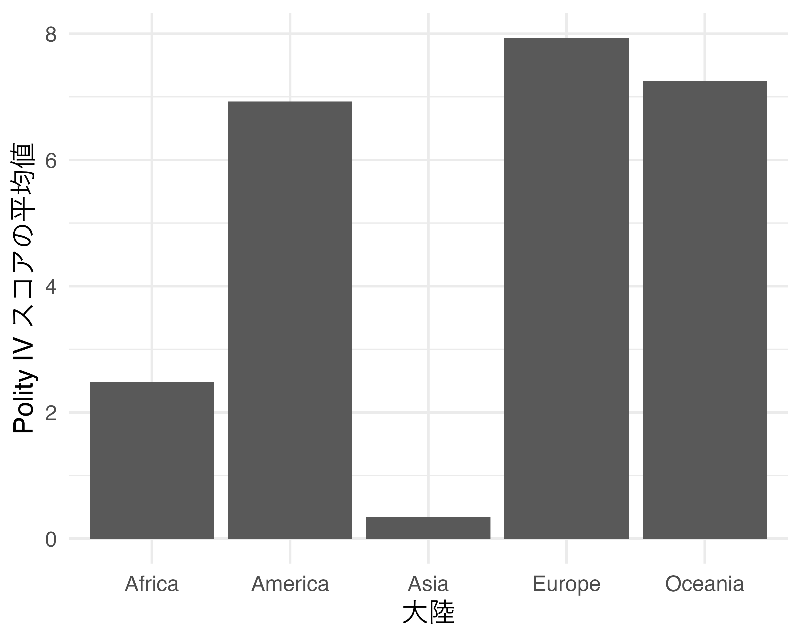

　この図を反時計方向回転する場合は以上のプロットに`coord_flip()`レイヤーを追加します。


```{.r .numberLines}
Flip_Fig +
  coord_flip() # 座標系の回転
```


　非常に簡単な方法で図を回転させることができました。しかし、実はこの`coord_flip()`関数、最近になって使う場面がどんどん減っています。たとえば、先ほどの`geom_bar()`幾何オブジェクトの場合、`x`をPolity IVスコアの平均値で、`y`を大陸名でマッピングすることが可能です。昔の{ggplot2}は横軸と縦軸にマッピングでいるデータ型が厳格に決まっていましたが、最近になってはますます柔軟となってきました[^visual4-flip]。`coord_flip()`を使用する前に、各幾何オブジェクトのヘルプを確認し、`coord_flip()`を用いた回転が必要か否かを予め調べておくのも良いでしょう。

[^visual4-flip]: 例えば、回帰係数の点推定値と信頼区間を示す係数プロット（キャタピラー・プロット）を作成する際は`geom_pointrange()`と`coord_flip()`を組み合わせてきましたが、今の{ggplot2}は`geom_pointrange()`のみで自由自在に作成できます。

### 座標系の固定

　他にも地味に便利な機能として座標系比を固定する`coord_fixed()`を紹介します。これは出力される座標系の「横:縦」を調整するレイヤーです。たとえば、以下のような散布図を考えてみましょう。


```{.r .numberLines}
ggplot() +
  geom_point(aes(x = 1:10, y = 1:10))
```

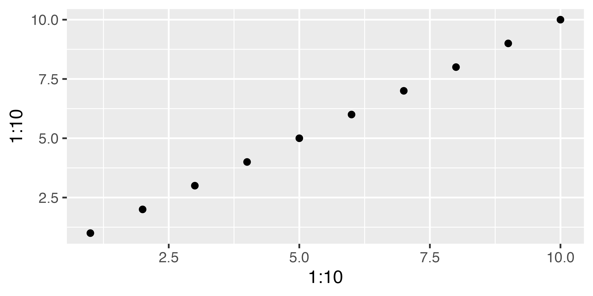

　こちらは横と縦が同じスケールでありますが、図の大きさに応じて、見た目が変わってきます。たとえば、上の図だと、横軸における1間隔は縦軸のそれの約2倍です。もし、図を上下に大きくし、左右を縮小したら同じ図でありながら随分と見た目が変わってきます。


```{.r .numberLines}
ggplot() +
  geom_point(aes(x = 1:10, y = 1:10))
```


　2つの図は本質的に同じですが、図の見せ方によって、傾きが緩やかに見せたり、急に見せたりすることができます。ここで活躍するレイヤーが`coord_fixed()`です。これを追加すると横を1とした場合の縦の比率を指定することができます。


```{.r .numberLines}
ggplot() +
  geom_point(aes(x = 1:10, y = 1:10)) +
  coord_fixed(ratio = 1)
```


　`ratio = 1`を指定すると縦横比は1:1となり、図の高さや幅を変更してもこの軸は変わりません。たとえば、RStudioのPlotsペインの大きさを変更すると図の大きさが変わりますが、`coord_fixed(ratio = 1)`を指定すると1:1の比率は維持されるまま図が拡大・縮小されます。直接やってみましょう。

---

## `scale_*_*()`: スケールの調整 {#visual3-scale}

　続いて`scale_*_*()`関数群を用いたスケールを解説しますが、こちらの関数は非常に多く、全てのスケールレイヤーについて解説すことは難しいです。しかし、共通する部分も非常に多いです。本説ではこの共通項に注目します。

　連続変数でマッピングされた横軸のスケールを調整する関数はは`scale_x_continuous()`です。ここで`x`が横軸を意味し、`continuous`が連続であることを意味します。この`x`の箇所は幾何オブジェクトの`aes()`内で指定した仮引数と一致します。つまり、`scale_x_continuous()`の`x`の箇所には`y`、`alpha`、`linetype`、`size`などがあります。そして、実引数として与えられた変数のデータ型が`continuous`の箇所に相当します。もし、離散変数なら`discrete`、時系列なら`time`、全て手動で調整する場合は`manual`を使います。他にも2020年10月現在、最近追加されたものとして`binned`があり、こちらはヒストグラムに特化したものです（`scale_x_binned()`と`scale_y_binned()`）。つまり、スケール調整関数は`aes()`内に登場した仮引数名とそのデータ型の組み合わせで出来ています。

　たとえば、時系列の折れ線グラフにおいて横軸のスケールを調整するなら、`sacle_x_time()`を使います。また、棒グラフのように横軸が名目変数なら`scale_x_manual()`、順序変数のような離散変数なら`scale_x_discrete()`を使います。また、連続変数の縦軸のスケール調整なら`scale_y_continuous()`を使います。グラフによっては`aes()`内に`x`または`y`を指定しないケースもあります。前章において度数の棒グラフや1つの箱ひげ図を出す場合、前者は`x`、後者は`y`のみを指定しました。これは指定されていない`y`や`x`が存在しないことを意味しません。{ggplot2}が自動的に計算しマッピングを行ってくれることを意味します。{ggplot2}で出来上がった図は2次元座標系を持つため、横軸と縦軸は必ず存在します。したがって、`aes()`内の引数と関係なく`scale_x_*()`と`scale_y_*()`関数群は使用することが出来ます。

### 横軸・縦軸スケールの調整

　軸のスケールを調整する目的は1) 目盛りの調整、2) 目盛りラベルの調整、3) 第2軸の追加などがありますが、主な目的は1と2です。第2軸の追加はスケールが異なるグラフが重なる場合に使用しますが、一般的に推奨されません。したがって、ここでは1と2について説明します。

#### 連続変数の場合

　軸に連続変数がマッピングされている場合は`scale_*_continuous()`レイヤーを追加します。`*`の箇所は横軸の場合は`x`、縦軸の場合は`y`となります。それでは`Country_df`の`FH_Total`を横軸、`GDP_per_capita`を縦軸にした散布図を作成し、`Scale_Fig1`という名のオブジェクトに格納します。


```{.r .numberLines}
Scale_Fig1 <- Country_df %>%
    ggplot() +
    geom_point(aes(x = FH_Total, y = GDP_per_capita)) +
    labs(x = "フリーダムハウススコア",y = "一人あたりGDP (USD)") +
    theme_bw(base_size = 12)

print(Scale_Fig1)
```

```
## Warning: Removed 1 rows containing missing values (geom_point).
```


　`Scale_Fig1`の横軸の場合、最小値0、最大値100であり、目盛りは25間隔となっております。ここではこの横軸を調整したいと思います。まず、プロットにおける最小値と最大値はスケールではなく座標系の問題ですので、`coord_*()`を使用します。ここでは目盛りを修正してみましょう。たとえば、目盛りを10間隔にし、そのラベルも0、10、20、...、100にします。`FH_Total`は連続変数ですので、`scale_x_continuous()`を使います。使い方は以下の通りです。


```{.r .numberLines}
Scale_Fig1 +
  scale_x_continuous(breaks = 目盛りの位置,
                     labels = 目盛りのラベル)
```

　`breaks`と`labels`の実引数としては数値型ベクトルを指定します。0から100まで10刻みの目盛りとラベルなら、`seq(0, 100, by = 10)`、または`c(0, 10, 20, 30, 40, 50, 60, 70, 80, 90, 100)`と指定します。


```{.r .numberLines}
Scale_Fig1 +
  scale_x_continuous(breaks = seq(0, 100, by = 10),
                     labels = seq(0, 100, by = 10))
```

```
## Warning: Removed 1 rows containing missing values (geom_point).
```


　目盛りのラベルを文字型にすることも可能です。例えば、目盛りを0、50、100にし、それぞれ「最低」、「中間」、「最高」としたい場合は以下のようにします。


```{.r .numberLines}
Scale_Fig1 +
  scale_x_continuous(breaks = c(0, 50, 100),
                     labels = c("最低", "中間", "最高"))
```

```
## Warning: Removed 1 rows containing missing values (geom_point).
```


　`scale_x_continuous()`は目盛りの調整が主な使い道ですが、他にも様々な機能を提供しています。たとえば、座標系の最小値と最大値の指定は`coord_*()`を使うと説明しましたが、実は`scale_*_continuous()`でも`limits`引数で指定することも可能です。たとえば、縦軸の範囲を0ドルから10万ドルにしたい場合は`scale_y_continuous()`の中に`limits = c(0, 100000)`を指定します。


```{.r .numberLines}
Scale_Fig1 +
  scale_x_continuous(breaks = seq(0, 100, by = 10),
                     labels = seq(0, 100, by = 10)) +
  scale_y_continuous(limits = c(0, 100000))
```

```
## Warning: Removed 4 rows containing missing values (geom_point).
```


　他にも目盛りと目盛りラベルの位置を変更することも可能です。これは`position`引数を使います。基本的に横軸の目盛りは下（`"bottom"`）、縦軸は左（`"left"`）ですが、`"top"`や`"right"`を使うことも可能です。もし、縦軸の目盛りとラベル、軸のラベルを右側にしたい場合は`scale_y_continuous()`の中に`position = "right"`を指定します。


```{.r .numberLines}
Scale_Fig1 +
  scale_y_continuous(position = "right")
```

```
## Warning: Removed 1 rows containing missing values (geom_point).
```


#### 離散変数の場合

　もし、軸が名目変数や順序変数のような離散変数でマッピングされている場合は、`scale_*_discrete()`を使います。たとえば、座標系の回転の例で使いました`Flip_Fig`の場合、横軸の大陸名が英語のままになっています。これを日本語にする場合、データレベルで大陸名を日本語で置換することも可能ですが、`scale_x_discrete()`を使うことも可能です。使い方は`scale_*_continuous()`と同じであり、`breaks`と`labels`引数を指定するだけです。


```{.r .numberLines}
Flip_Fig +
  scale_x_discrete(breaks = c("Africa", "America", "Asia", "Europe", "Oceania"),
                   labels = c("アフリカ", "アメリカ", "アジア", "ヨーロッパ", "オセアニア"))
```


　今回は大陸名が文字型の列でしたが、factor型の場合、いくつか便利な機能が使えます。たとえば、`Polity_Type`ごとに国数を計算し、棒グラフを作成するとします。


```{.r .numberLines}
Scale_df1 <- Country_df %>%
  group_by(Polity_Type) %>%
  summarise(N       = n(),
            .groups = "drop")

Scale_df1
```

```
## # A tibble: 6 × 2
##   Polity_Type         N
##   <chr>           <int>
## 1 Autocracy          19
## 2 Closed Anocracy    23
## 3 Democracy          65
## 4 Full Democracy     31
## 5 Open Anocracy      20
## 6 <NA>               28
```

　続きまして、`Polity_Type`列をfactor型にします。最もスコアの低い独裁（Autocracy）から最もスコアの高い完全な民主主義（Full Democracy）の順番のfactorにします。


```{.r .numberLines}
Scale_df1 <- Scale_df1 %>%
  mutate(Polity_Type = factor(Polity_Type, ordered = TRUE,
                              levels  = c("Autocracy",
                                          "Closed Anocracy",
                                          "Open Anocracy",
                                          "Democracy",
                                          "Full Democracy")))

Scale_df1$Polity_Type
```

```
## [1] Autocracy       Closed Anocracy Democracy       Full Democracy 
## [5] Open Anocracy   <NA>           
## 5 Levels: Autocracy < Closed Anocracy < Open Anocracy < ... < Full Democracy
```

　問題なくfactor化も出来たので、それでは作図をしてみましょう。


```{.r .numberLines}
Scale_df1 %>% 
  ggplot() +
  geom_bar(aes(x = Polity_Type, y = N), stat = "identity")
```

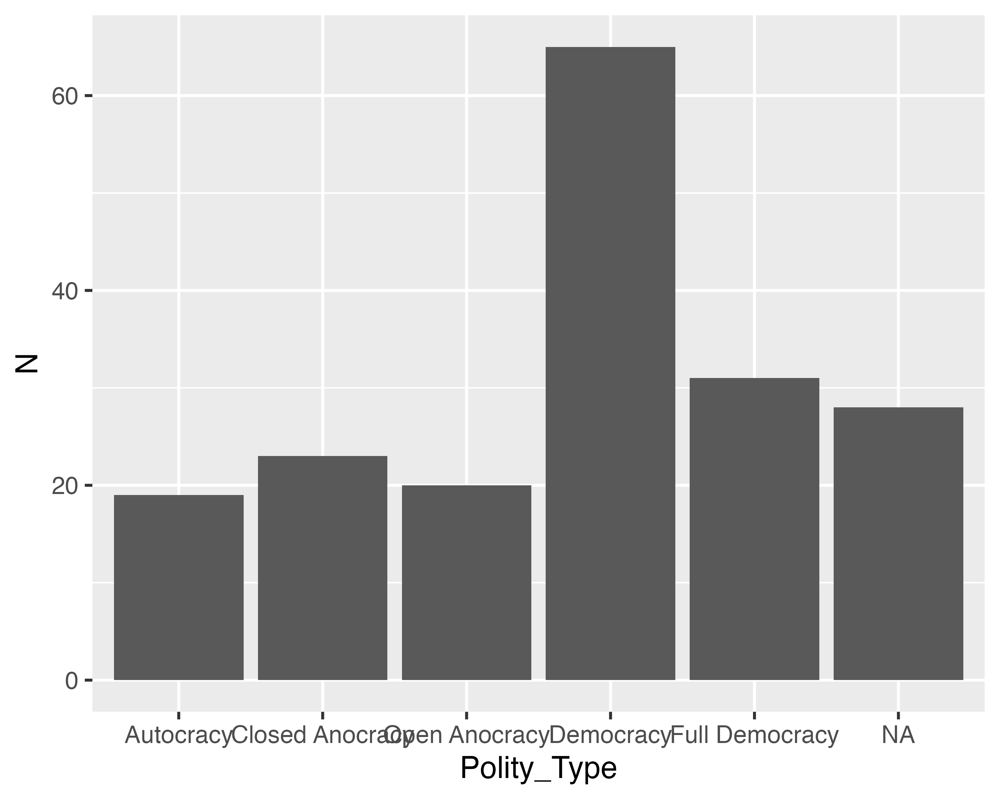

　Polityプロジェクトの対象外があり、この場合は欠損値（`NA`）になります。そして、問題はこの欠損値も表示されることです。むろん、欠損値のカテゴリも出力したいケースもありますが、もし欠損値カテゴリの棒を消すにはどうすれば良いでしょうか。1つ目の方法は`Scale_df1 %>% drop_na()`で欠損値を含む行を除去してから作図する方法です。2つ目の方法は`scale_x_discrete()`で`na.translate = FALSE`を指定する方法です。ここでは横軸の目盛りラベルも日本語に変更し、欠損値のカテゴリを除外してみましょう。また、地味に便利な機能として、軸ラベルも`scale_*_*()`で指定可能です。第1引数として長さ1の文字ベクトルを指定すると、自動的に軸ラベルが修正され、`labs()`が不要となります。


```{.r .numberLines}
Scale_df1 %>% 
  ggplot() +
  geom_bar(aes(x = Polity_Type, y = N), stat = "identity") +
  scale_x_discrete("Polity IV スコア", # 第1引数で軸ラベルも指定可能
                   breaks = c("Autocracy", "Closed Anocracy", "Open Anocracy",
                              "Democracy", "Full Democracy"),
                   labels = c("独裁", "閉じられたアノクラシー",
                              "開かれたアノクラシー", "民主主義",
                              "完全な民主主義"),
                   na.translate = FALSE) +
  scale_y_continuous("国数") +
  theme_minimal(base_size = 12)
```

```
## Warning: Removed 1 rows containing missing values (position_stack).
```


これで欠損値を除外することができました。目盛りラベルが重なる箇所があり、多少気になりますが、この問題に関しては第\@ref(visual3-theme)節で取り上げます。

### `color`スケールの調整

　グラフの次元を増やす際において広く使われている方法は変数の値に応じて色分けをすることでした。この場合、幾何オブジェクトの`aes()`内に`color = マッピングする変数名`を指定することになります。このように色が変数でマッピングされている場合は、色分けのスケールも調整可能です。たとえば、折れ線グラフにおいて日本が赤い線だったのを青い線に変更することが考えられます。ここでも`color`にマッピングされている変数のデータ型によって使用する関数が変わります。ここでは連続変数、順序付き離散変数、順序なし離散変数について説明します。

#### `color`引数が連続変数でマッピングされている場合

　まずは、連続変数からです。横軸は底10の対数変換した一人あたりGDP（`GDP_per_capita`）、縦軸は人間開発指数（`HDI_2018`）にした散布図を作成し、Polity IVスコア（`Polity_Score`）で点の色分けをしてみましょう。


```{.r .numberLines}
Scale_Fig2 <- Country_df %>%
    ggplot() +
    geom_point(aes(x = GDP_per_capita, y = HDI_2018, color = Polity_Score)) +
    labs(x = "一人あたりGDP (USD)",y = "人間開発指数", color = "Polity IVスコア") +
    scale_x_log10() +
    theme_bw(base_size = 12)

Scale_Fig2
```

```
## Warning: Removed 6 rows containing missing values (geom_point).
```

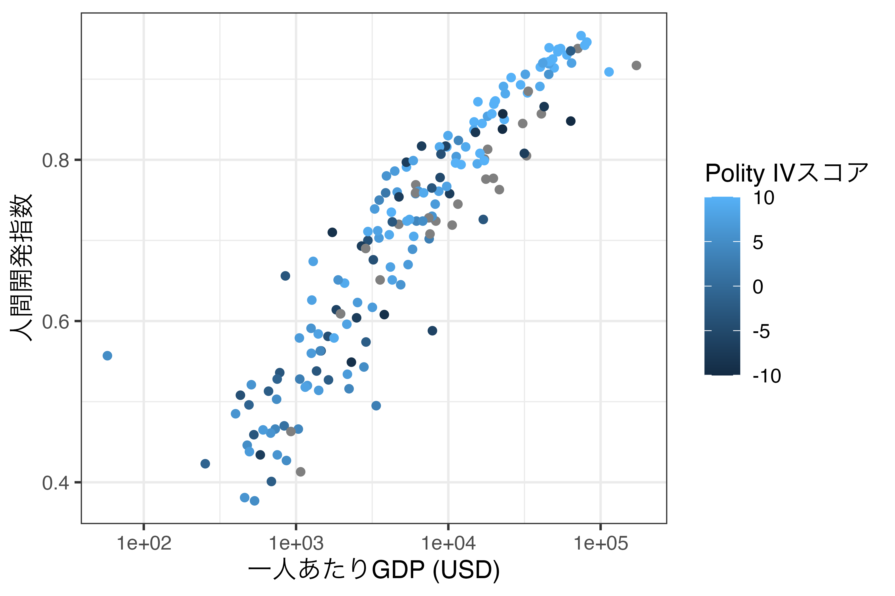

　これまでは`color`引数を離散変数でしかマッピングしませんでしたが、このように連続変数でマッピングすることも可能です。ただし、この場合は値に応じてはっきりした色分けがされるのではなく、グラデーションで色分けされます。この例だと、青に近いほどPolity IVスコアが高く、黒に近いほど低いことが分かります。この場合、`color`のスケール調整は最小値と最大値における色を指定するだけです。その間の色については{ggplot2}が自動的に計算してくれます。

　今回使用する関数は`scale_color_gradient()`です。これまでの例だと`scale_color_continuous()`かと思う方も多いでしょう。実際、`scale_color_continuous()`関数も提供されており、使い方もほぼ同じです。ただし、`scale_color_continuous()`を使う際は引数として`type = "gradient"`を指定する必要があります。`scale_color_gradient()`の場合、最小値における色を`low`、最大値のそれを`high`で指定します。数値は`"red"`や`"blue"`なども可能であり、`"#132B43"`のような書き方も使えます。たとえば、先ほどの`Scale_Fig2`においてPolity IVスコアが高いほど<span style="color:#cd3333;font-weight:bold;">brown3</span>、低いほど<span style="color:#6495ED;font-weight:bold;">cornflowerblue</span>になるようにする場合は以下のように書きます。


```{.r .numberLines}
Scale_Fig2 +
    scale_color_gradient(high = "brown3", low = "cornflowerblue")
```

```
## Warning: Removed 6 rows containing missing values (geom_point).
```

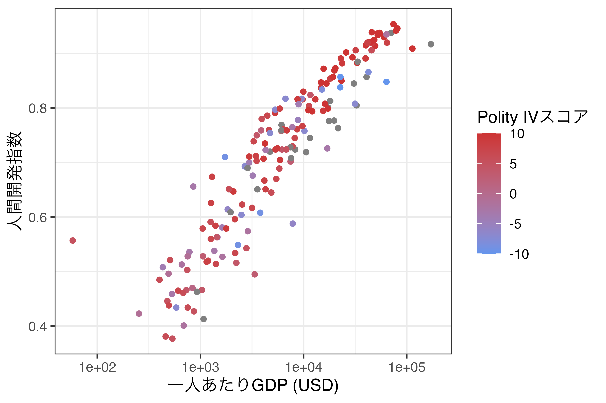

　このような書き方だとどのような色名で使えるかを事前に知っておく必要があります。使える色名のリストは`colors()`から確認できます。全部で657種類がありますが、ここでは最初の50個のみを出力します。


```{.r .numberLines}
head(colors(), 50)
```

```
##  [1] "white"          "aliceblue"      "antiquewhite"   "antiquewhite1" 
##  [5] "antiquewhite2"  "antiquewhite3"  "antiquewhite4"  "aquamarine"    
##  [9] "aquamarine1"    "aquamarine2"    "aquamarine3"    "aquamarine4"   
## [13] "azure"          "azure1"         "azure2"         "azure3"        
## [17] "azure4"         "beige"          "bisque"         "bisque1"       
## [21] "bisque2"        "bisque3"        "bisque4"        "black"         
## [25] "blanchedalmond" "blue"           "blue1"          "blue2"         
## [29] "blue3"          "blue4"          "blueviolet"     "brown"         
## [33] "brown1"         "brown2"         "brown3"         "brown4"        
## [37] "burlywood"      "burlywood1"     "burlywood2"     "burlywood3"    
## [41] "burlywood4"     "cadetblue"      "cadetblue1"     "cadetblue2"    
## [45] "cadetblue3"     "cadetblue4"     "chartreuse"     "chartreuse1"   
## [49] "chartreuse2"    "chartreuse3"
```

`scale_color_gradient()`から派生した関数として`scale_color_gradient2()`というものもあります。これは最小値と最大値だけでなく、`mid`引数を使って中間における色も指定可能な関数です。例えば、先ほどの例で真ん中を<span style="color:#00AC97;font-weight:bold;">seagreen</span>にしてみましょう。


```{.r .numberLines}
Scale_Fig2 +
    scale_color_gradient2(high = "brown3", mid = "seagreen", low = "cornflowerblue")
```

```
## Warning: Removed 6 rows containing missing values (geom_point).
```

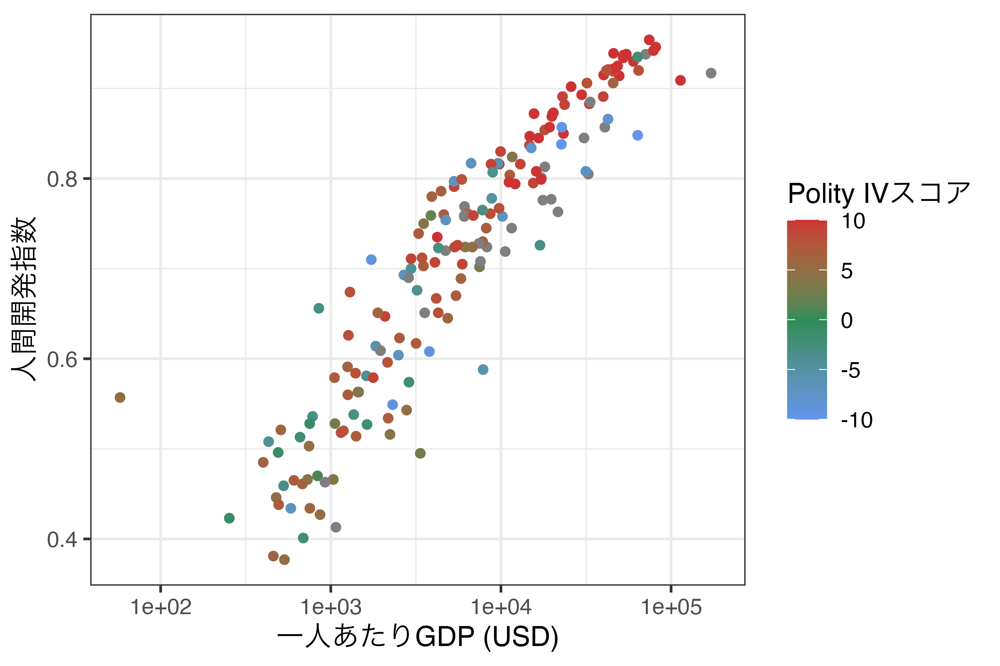

　色は`"seagreen"`、`"red"`でなく、`"#00AC97"`、`"#FF0000"`のように具体的なRGB値で指定することもできます。これは色を赤（R）、緑（G）、青（B）の3つの原色を混ぜて様々な色を表現する方法です。`"#FF0000"`の場合、最初の`#`はRGB表記であることを意味し、`FF`は赤が255であることの16進法表記、次の`00`と最後の`00`は緑と青が0であることの16進法表記です。各原色は0から255までの値を取ります。{ggplot2}でよく見る色としては<span style="color:#F8766D;font-weight:bold;">#F8766D</span>、<span style="color:#00BFC4;font-weight:bold;">#00BFC4</span>、<span style="color:#C77CFF;font-weight:bold;">#C77CFF</span>、<span style="color:#7CAE00;font-weight:bold;">#7CAE00</span>があります。他にもGoogleなどで「RGB color list」などを検索すれば様々な色を見ることができます。

他にも{ggplot2}は様々なユーザー指定のパレットが使用可能であり、実際、パッケージの形式として提供される場合もあります。たとえば、ジブリ風のカラーパレットが{[ghibli](https://github.com/ewenme/ghibli)}パッケージとして提供されており、`install.packages("ghibli")`でインストール可能です。


```{.r .numberLines}
pacman::p_load(ghibli)

Scale_Fig2 +
    # 連続変数（_c）用の「もののけ姫」パレット（medium）
    scale_color_ghibli_c("MononokeMedium")
```

```
## Warning: Removed 6 rows containing missing values (geom_point).
```

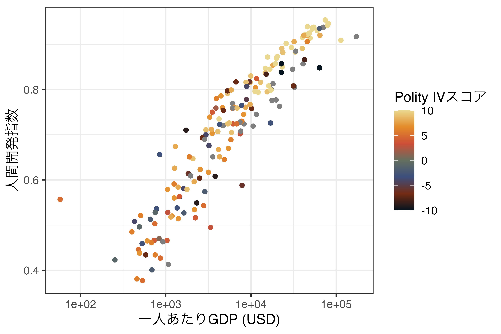

#### `color`引数が順序付き離散変数でマッピングされている場合

　連続変数のようにグラデーションではあるものの、それぞれの値に対して具体的な色が指定されます。まずは先ほど作成しました`Scale_Fig2`の色分けを連続変数である`Polity_Score`でなく、順序付き離散変数である`Polity_Type`にします。`Polity_Type`の順序は独裁（Autocracy）、閉じられたアノクラシー（Closed Anocracy）、開かれたアノクラシー（Open Anocracy）、民主主義（Democracy）、完全な民主主義（Full Democracy）にします。また、`Polity_Type`が定義されていない国もデータセットに含まれているため、`drop_na(Polity_Type)`を追加し、`Polity_Type`が欠損している行を除去します。


```{.r .numberLines}
Scale_Fig3 <- Country_df %>%
  mutate(Polity_Type = factor(Polity_Type, ordered = TRUE,
                              levels  = c("Autocracy",
                                          "Closed Anocracy",
                                          "Open Anocracy",
                                          "Democracy",
                                          "Full Democracy"))) %>%
  drop_na(Polity_Type) %>%
  ggplot() +
  geom_point(aes(x = GDP_per_capita, y = HDI_2018, color = Polity_Type)) +
  labs(x = "一人あたりGDP (USD)",y = "人間開発指数", color = "Polity IVタイプ") +
  scale_x_log10() +
  theme_bw(base_size = 12)

Scale_Fig3
```

```
## Warning: Removed 2 rows containing missing values (geom_point).
```


　今回は紫（独裁）から黄色（完全な民主主義）の順で色分けがされ、その間のカテゴリーも紫と黄色の間の値をとります。実は順序付き離散変数の場合、色のスケールを調整することはあまりありませんし、これまでの方法に比べてやや複雑です。ここでは色相（Hue）の範囲と強度、明るさを調整する方法について紹介します。

　まずは、色相について知る必要があります。{ggplot2}において色相の範囲は0から360です。そして、色には強度（intensity）、または彩度という概念があり、0に近いほどグレイへ近づき、色間の区別がしにくくなります。{ggplot2}では彩度のデフォルト値は100であり、我々が普段{ggplot2}で見る図の色です。最後に明るさ（luminance）があり、0から100までの値を取ります。値が大きいほど明るくなり、{ggplot2}のデフォルト値は65です。重要なのは色相のところであり、Hueの具体的な数値がどの色なのかを確認する必要があります。そのためには、{scales}パッケージの`hue_pal()`と`show_col()`関数を使用します。


　左上が0、右下が360の色を意味します。順序変数でマッピングされた色スケールを色相に基づいて調整する際は、`scale_color_hue()`レイヤーを追加し、色相の範囲、彩度、明るさを指定します。たとえば、0から300までの範囲の色を使用し[^hue-range]、再度と明るさはデフォルトにしたい場合、以下のように書きます。

[^hue-range]: 厳密には0から360までの全範囲の色を使うわけではありません。なぜなら、Hueは0度から360度、つまり循環する仕組みになっているからです。実際、Hueが[0, 360]の図を見ても、左上の色と右下の色は非常に似ていることが分かります。したがって、0から360を全て使用すると色の区別が難しくなるため、この場合は後半の色は仕様されません。


```{.r .numberLines}
Scale_Fig3 +
  scale_color_hue(h = c(0, 360), c = 100, l = 65)
```

```
## Warning: Removed 2 rows containing missing values (geom_point).
```

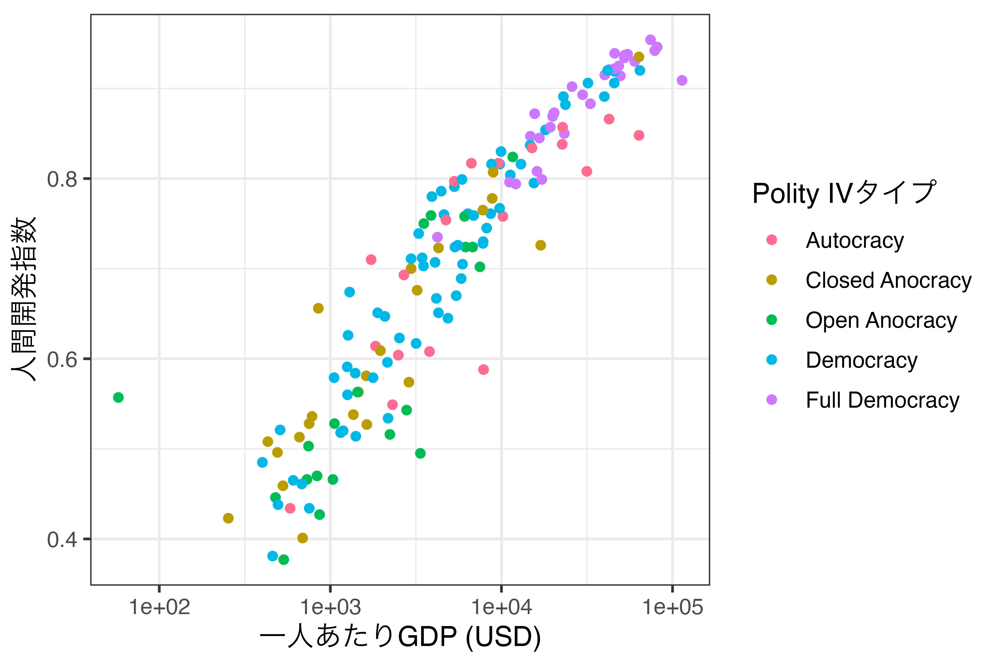

　また、`direction = -1`を追加することで、色の順番を逆にすることも可能です。


```{.r .numberLines}
Scale_Fig3 +
  scale_color_hue(h = c(0, 360), c = 100, l = 65, direction = -1)
```

```
## Warning: Removed 2 rows containing missing values (geom_point).
```

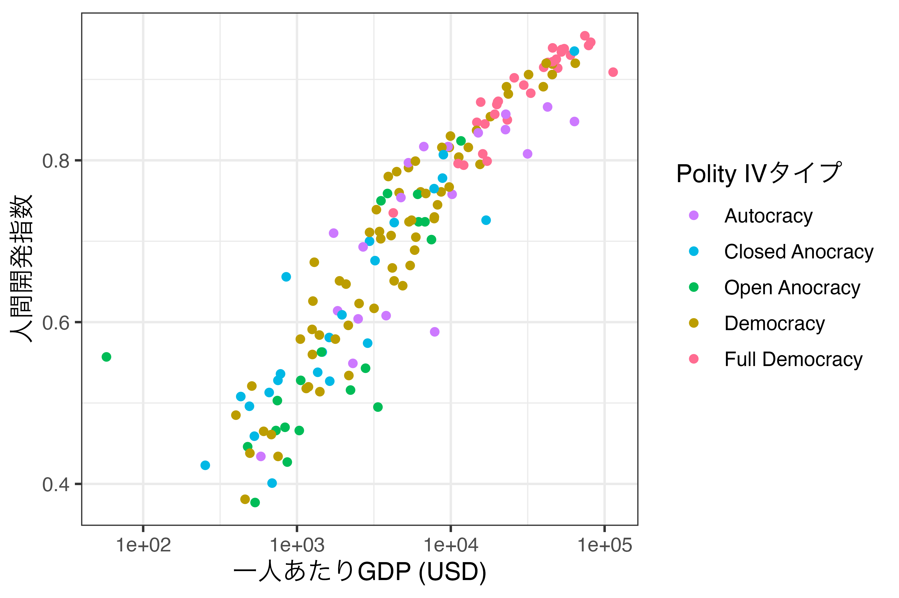

　他にも[mpl colormaps](https://bids.github.io/colormap/)というカラーマップを使うことも可能です。この場合は`scale_color_hue()`ではなく、`scale_color_viridis_d()`を使用します。具体的な色の情報は[mpl colormaps](https://bids.github.io/colormap/)を参照してください。必要な引数は色のスタート地点（`begin`）と終了地点（`end`）です。そして、`option`の引数のデフォルト値は`"D"`であり、これはVIRIDIS colormapを意味します。実は`scale_color_*()`を付けなかった場合の色分けがこれです。たとえば、VIRIDIS colormapでなく、PLASMA colormapを使うなら`option = "C"`を付けます。


```{.r .numberLines}
Scale_Fig3 +
  # PLASMA colormapを使用する（option = "C"）
  scale_color_viridis_d(begin = 0, end = 1, option = "C")
```

```
## Warning: Removed 2 rows containing missing values (geom_point).
```

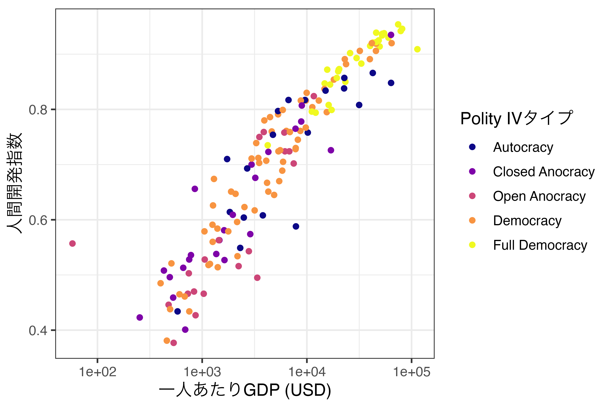

#### `color`引数が順序なし離散変数でマッピングされている場合

　最後に順序なし離散変数の場合について解説します。ここでは`scale_color_manual()`関数を使用し、マッピングされている変数のそれぞれ値に対して具体的な色を指定する方法です。以下で説明する方法は、順序付き離散変数でも使用可能であるため、`Scale_Fig3`の図をそのまま利用してみたいと思います。

　`scale_color_manual()`の核心となる引数は`values`であり、ここに`"変数の値" = "色"`で指定します。この色は`"red"`のような具体的な色名でも、`"#FF0000"`のようなRGB表記でも構いません。


```{.r .numberLines}
ggplot2オブジェクト +
  scale_color_manual(values = c("変数の値1" = "色1",
                                "変数の値2" = "色2",
                                "変数の値3" = "色3",
                                ...))
```

　それでは`Polity_Type`の値が`"Autocracy"`の場合は<span style="color:darkred;font-weight:bold;">darkred</span>、`"Closed Anocracy"`は<span style="color:seagreen;font-weight:bold;">seagreen</span>、`"Open Anocracy"`は<span style="color:cornflowerblue;font-weight:bold;">cornflowerblue</span>、`"Democracy"`は<span style="color:orchid;font-weight:bold;">orchid</span>、`"Full Democracy"`は<span style="color:orange;font-weight:bold;">orange</span>にしてみましょう。


```{.r .numberLines}
Scale_Fig3 +
  scale_color_manual(values = c("Autocracy"       = "darkred",
                                "Closed Anocracy" = "seagreen",
                                "Open Anocracy"   = "cornflowerblue",
                                "Democracy"       = "orchid",
                                "Full Democracy"  = "orange"))
```

```
## Warning: Removed 2 rows containing missing values (geom_point).
```


　色を決める際は色覚多様性に気をつけるべきです。誰にとっても見やすい図にはUniversal Designが必要です。特によくある例が「緑と赤」の組み合わせです。緑も赤も暖色系であり、P型およびD型色弱の場合、両者の区別が難しいと言われています。しかも、色弱の方は意外と多いです。日本の場合、男性の5%、女性の0.2%と言われております。これには人種差もありまして、フランスや北欧の男性の場合は約10%です。一通り図を作成しましたら、色覚シミュレーターなどを使用して、誰にとっても見やすい色であるかを確認することも良いでしょう。また、{ggplot2}がデフォルトで採用しているVIRIDISは色弱に優しいカラーパレットと言われています。一般的に二色の組み合わせの場合、最も区別しやすい色は青とオレンジと言われいます。

　{ggplot2}における`color`スケールは非常に細かく調整可能であり、関連関数やパッケージも多く提供されています。本書では全てを紹介することはできませんが、ここまで紹介してきました例だけでも、自分好みに色を調整できるでしょう。

### `alpha`スケールの調整

　次は点・線・面の透明度を指定する`alpha`スケールの調整です。もし、`alpha`に連続変数をマッピングすれば、マッピングした変数の値に応じて透明度が変わります。一般的に、値が大きいほど不透明となり、小さいほど透明になります。しかし、このような使い方はあまり見られません。プロット上のオブジェクトを透明度を指定するのは

1. 特定箇所にオブジェクトが密集し、重なるオブジェクトの区別がつきにくい場合
2. 特定の点・線・面を強調するため

　以上の2ケースでしょう。また、ケース1の場合、`alpha`引数を`aes()`の内部ではなく、外側に指定し、具体的な数値を指定することになります。ここで注目するのはケース2です。たとえば、横軸に一人あたりGDP、縦軸に人間開発指数をマッピングした散布図を作成し、アジアの国のみハイライトしたいとします。この場合、アジアとその他の国で色分けしたり、丸と四角といった形で分けるのも可能ですが、「強調」が目的であれば、その他の国をやや透明にすることも可能でしょう。まず、`Asia`という変数を作成し、`Continent`の値が`"Asia"`なら`"Asia"`、その他の値なら`"Other"`の値を入れます。そして、`geom_point()`の`aes()`内に`alpha`引数を追加し、`Asia`変数でマッピングします。


```{.r .numberLines}
Country_df %>%
  mutate(Asia = if_else(Continent == "Asia", "Asia", "Other")) %>%
  ggplot() +
  geom_point(aes(x = GDP_per_capita, y = HDI_2018, alpha = Asia), size = 2) +
  labs(x = "一人あたりGDP (USD)",y = "人間開発指数", alpha = "大陸") +
  scale_x_log10() +
  theme_bw(base_size = 12)
```

```
## Warning: Using alpha for a discrete variable is not advised.
```

```
## Warning: Removed 6 rows containing missing values (geom_point).
```

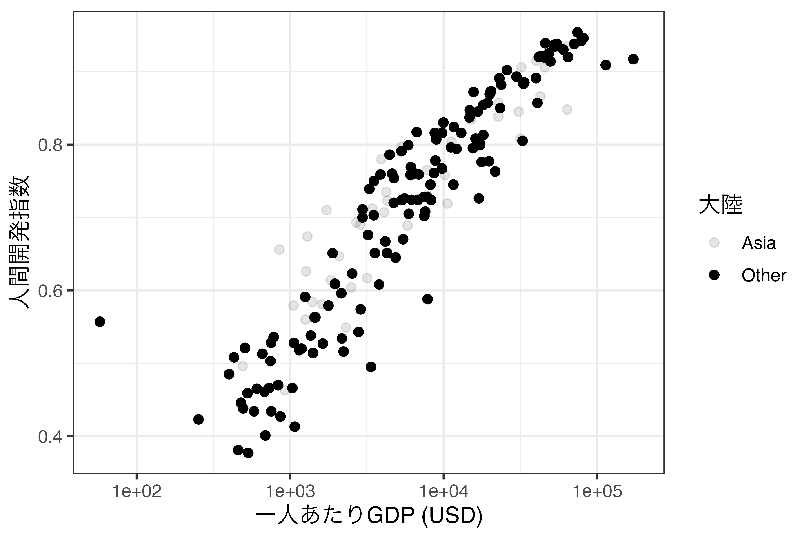

　`Asia`の値によって透明度が異なりますが、私たちの目的は`Asia`を不透明にし、その他の点を透明にすることです。ここで登場するのが`scale_alpha_manual()`です。使い方はこれまで見てきた`scale_*_manual()`と非常に似ています。`values`引数にそれぞれの値と透明度を指定するだけです。透明度は1が不透明、0が透明です。アジアの透明度を1.0、その他の透明度を0.15とするなら、以下のように書きます。


```{.r .numberLines}
Country_df %>%
  mutate(Asia = if_else(Continent == "Asia", "Asia", "Other")) %>%
  ggplot() +
  geom_point(aes(x = GDP_per_capita, y = HDI_2018, alpha = Asia), size = 2) +
  labs(x = "一人あたりGDP (USD)",y = "人間開発指数", alpha = "大陸") +
  scale_x_log10() +
  scale_alpha_manual(values = c("Asia" = 1.0, "Other" = 0.15)) +
  theme_bw(base_size = 12)
```

```
## Warning: Removed 6 rows containing missing values (geom_point).
```


　これでアジアの国々がプロット上で強調されました。透明度スケールは連続変数（`scale_alpha_continuous()`）や離散変数（`scale_alpha_discrete()`）に使うことも可能ですが、透明度を「区別」でなく「強調」の目的で使うならば、`scale_alpha_manual()`でも十分だと考えられます。

　一つ注意して頂きたいのは、図をPDFで出力する際、半透明なオブジェクトが見えなかったり、逆に透明度が全く適用されない場合があります。PNGなどのビットマップ画像ならこのような問題は生じませんが、PDFの場合は注意が必要です[^alpha]。この場合、画像をPNGなどの形式にするか、半透明でなく「グレーと黒」のような組み合わせで作図した方が良いかも知れません。

[^alpha]: 宋が論文を出した際、半透明なオブジェクトが査読者のPCでは出力されなかったことがあり、「お前、一体図の何を見ろと言ってるんだ」と怒られたことがあります。

### `size`スケールの調整

　大きさに関するマッピングは幾何オブジェクトの`aes()`内に`size`引数を使用します。ここでの大きさというのは点の大きさと線の太さを意味します。`geom_point()`内の`size`は点の大きさ、`geom_line()`や`geom_segment()`の`size`は線の太さ、`geom_pointrange()`では両方を意味します。ただし、実質的に変数の値に応じて線の太さを変えることは強調[^linewidth]を除けばあまり見られません。ここでは点の大きさに焦点を当てて解説します。

[^linewidth]: 強調したい線を太線にするなど

　それでは、横軸はフリーダム・ハウスのスコア（`FH_Total`）、縦軸は2018年人間開発指数（`HDI_2018`）として散布図を作成し、一人当たり購買力平価GDP（`PPP_per_capita`）に応じて点の大きさを指定します。


```{.r .numberLines}
Country_df %>%
    ggplot() +
    geom_point(aes(x = FH_Total, y = HDI_2018, size = PPP_per_capita)) +
    labs(x = "フリーダムハウススコア",y = "2018年人間開発指数", 
         size = "一人あたり購買力平価GDP（USD）") +
    theme_bw(base_size = 12) +
    theme(legend.position = "bottom") # 凡例の図の下段にする
```

```
## Warning: Removed 11 rows containing missing values (geom_point).
```

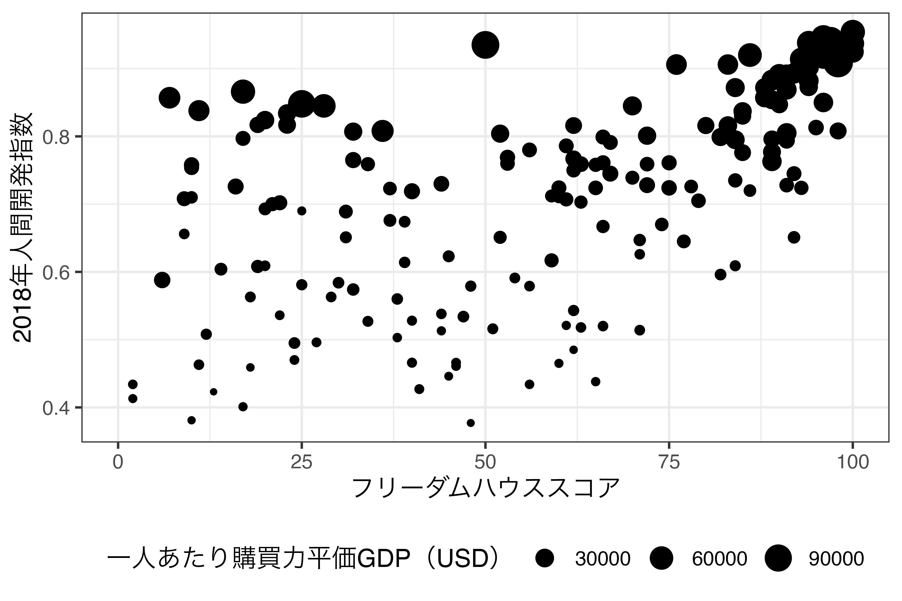

　フリーダム・ハウススコアと人間開発指数は全般的には正の相関を示しています。そして、両指標が高い国（図の右上）は所得水準も高いことが分かります。ただし、フリーダム・ハウススコアが低くても人間開発指数が高い国（図の左上）もかなり見られますが、これらの国の共通点は所得水準が高いことです。つまり、人間開発指数と所得水準には強い相関関係があると考えられます（人間開発指数には所得水準も含まれるため、当たり前です）。

　大きさをマッピングすると、点が重なる箇所が広くなりますので、`alpha`引数で半透明にすることも有効でしょう。


```{.r .numberLines}
Country_df %>%
    ggplot() +
    geom_point(aes(x = FH_Total, y = HDI_2018, size = PPP_per_capita),
               alpha = 0.5) + # 透明度の指定
    labs(x = "フリーダムハウススコア",y = "2018年人間開発指数", 
         size = "一人あたり購買力平価GDP（USD）") +
    theme_bw(base_size = 12) +
    theme(legend.position = "bottom") 
```

```
## Warning: Removed 11 rows containing missing values (geom_point).
```


　この大きさのスケール調整はマッピングされた変数の尺度によって、`scale_size_continuous()`、`sclae_size_discrete()`、`scale_size_ordinal()`などを使用し、すべてマニュアルで調整したい場合は`scale_size_manual()`を使います。使い方はこれまでのスケール調整とほぼ同様です。たとえば、上記の図だと、大きさの凡例が3万、6万、9万となっていますが、これを1000, 10000, 100000といった対数スケールに変更してみましょう。


```{.r .numberLines}
Country_df %>%
    ggplot() +
    geom_point(aes(x = FH_Total, y = HDI_2018, size = PPP_per_capita),
               alpha = 0.5) +
    labs(x = "フリーダムハウススコア",y = "2018年人間開発指数", 
         size = "一人あたり購買力平価GDP（USD）") +
    scale_size_continuous(breaks = c(1000, 10000, 100000),
                          labels = c("1000", "10000", "100000")) +
    theme_bw(base_size = 12) +
    theme(legend.position = "bottom") 
```

```
## Warning: Removed 11 rows containing missing values (geom_point).
```

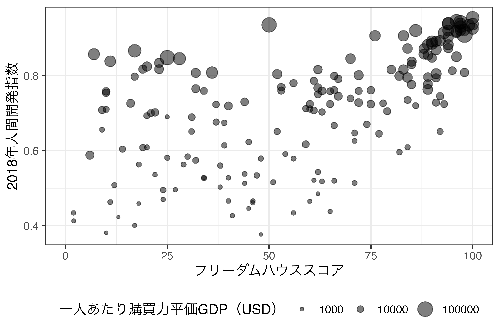

　この場合、図内の点の大きさに変化はありません。変わるのは凡例のみであり、値に応じた点のサイズに調整されます。連続変数でマッピングされている場合、一つ一つの値に応じてサイズを指定するのは非現実的であります。この場合、点の大きさ調整は{ggplot2}に任せて、凡例のサイズを調整するのが無難でしょう。

　ただし、点の最小サイズと最大サイズを調整したいケースもあるでしょう。最も小さい点のサイズを0.1に、最も大きい点のサイズを10にする場合、`range`引数を指定します。`range`引数の実引数は長さ2の数値型ベクトルです。


```{.r .numberLines}
Country_df %>%
    ggplot() +
    geom_point(aes(x = FH_Total, y = HDI_2018, size = PPP_per_capita),
               alpha = 0.5) +
    labs(x = "フリーダムハウススコア",y = "2018年人間開発指数", 
         size = "一人あたり購買力平価GDP（USD）") +
    scale_size_continuous(breaks = c(1000, 10000, 100000),
                          labels = c("1000", "10000", "100000"),
                          range = c(0.1, 10)) +
    theme_bw(base_size = 12) +
    theme(legend.position = "bottom") 
```

```
## Warning: Removed 11 rows containing missing values (geom_point).
```


　このように範囲が広がるほど、所得水準の差がより見やすくなります。他にもsizeは離散変数でマッピングさることも可能ですが、あまり相性は良くありません。離散変数でのマッピングはこれまで紹介しました`color`や`size`の方を参照してください。使い方は同じです。

### `shape`、`linetype`スケールの調整

　`size`は連続変数と相性が良いですが、点や線の形である`shape`と`linetype`は離散変数、とりわけ順序なし離散変数（名目変数）と相性が良いです。なぜなら、点や線の形は高低・大小の情報を持たないからです。たとえば、丸の点は四角の点より大きいとか実線は破線より小さいといった情報はありません。したがって、`size`や`linetype`は名目変数に使うのが一般的です。たとえば、フリーダムハウスのスコアを横軸、人間開発指数を縦軸とし、G20加盟有無によって点の形が異なる散布図を作成するとします。G20をcharacter型、あるいはfactor型に変換し、`geom_point()`の幾何オブジェクトの`aes()`内に`shape`引数を指定します。


```{.r .numberLines}
Country_df %>%
    mutate(G20 = if_else(G20 == 1, "加盟国", "非加盟国")) %>%
    ggplot() +
    geom_point(aes(x = FH_Total, y = HDI_2018, shape = G20),
               size = 2) +
    labs(x = "フリーダムハウススコア",y = "2018年人間開発指数", 
         shape = "G20") +
    theme_bw(base_size = 12) +
    theme(legend.position = "bottom") 
```

```
## Warning: Removed 6 rows containing missing values (geom_point).
```

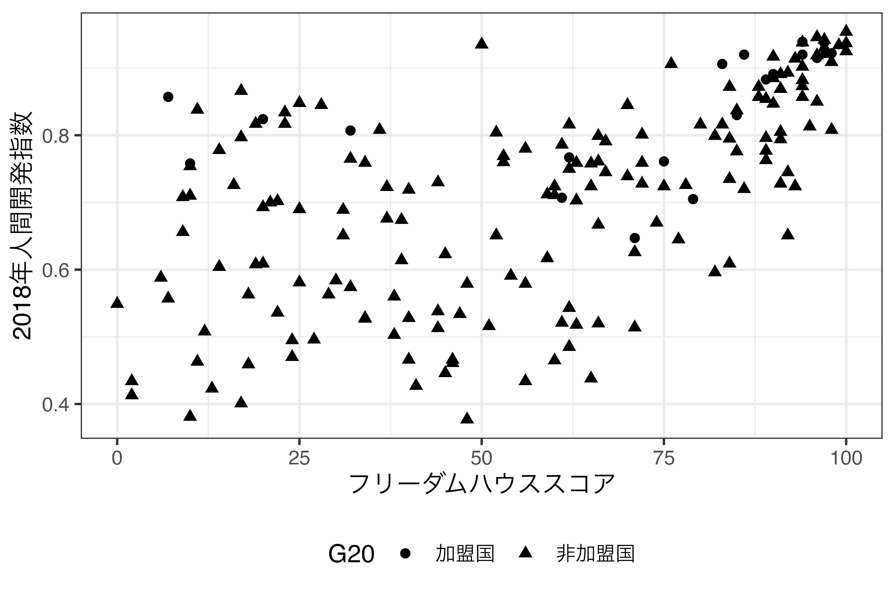

　加盟国を丸（16または19）、非加盟国をダイヤモンド型（18）にするには`scale_shape_manual()`を使います。


```{.r .numberLines}
Country_df %>%
    mutate(G20 = if_else(G20 == 1, "加盟国", "非加盟国")) %>%
    ggplot() +
    geom_point(aes(x = FH_Total, y = HDI_2018, shape = G20),
               size = 2) +
    scale_shape_manual(values = c("加盟国" = 19, "非加盟国" = 18)) +
    labs(x = "フリーダムハウススコア",y = "2018年人間開発指数", 
         shape = "G20") +
    theme_bw(base_size = 12) +
    theme(legend.position = "bottom") 
```

```
## Warning: Removed 6 rows containing missing values (geom_point).
```


　ただし、各数字がどの形に対応しているかを事前に知っておく必要があります。よく使うのは0から25までであり、それぞれ対応するshapeを示したのが以下の図です。必要に応じてこのページを参照しても良いですし、Rコンソール上で`?pch`を入力しても0から23までの例を見ることが出来ます。

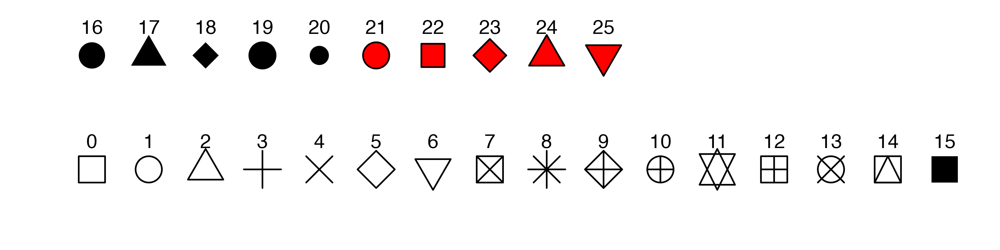

　注意していただきたいのは、`shape`のマッピングが有効でない状況があるという点です。それが先ほどの例です。先ほどの散布図の場合、次元を増やすことは、新しい次元で条件づけた場合の変数の関係性を調べることとなります。しかし、新しい次元による条件付き関連性があまり見られない場合、あるいは二種類以上の点の形があまり分離されていない場合は、次元の追加がもたらす恩恵が感じにくくなるでしょう。例えば以下のような散布図を比較してみましょう。図(A)の場合、縦軸の変数が閾値を超えるともう一つの変数との関係が弱まるということが分かります。たとえば、三角の点において両変数は正の相関を持ち、丸の点においては無相関に近いことが分かります。この場合、点の形は非常に有用な情報を含んでいると判断できます。一方、図(B)の場合、点の形から読み取れる情報が少ないですね。あえて言えば、グループ間の違いがあまりないことくらいでしょう。


　白黒のグラフの場合、色分けが出来ないため、次元拡張には点の形を変えることになります。しかし、色に来れば形は読み手にとって認知の負荷がかかりやすいです。下の図を見てください。100個の点がありますが、三角の点はいくつでしょうか。

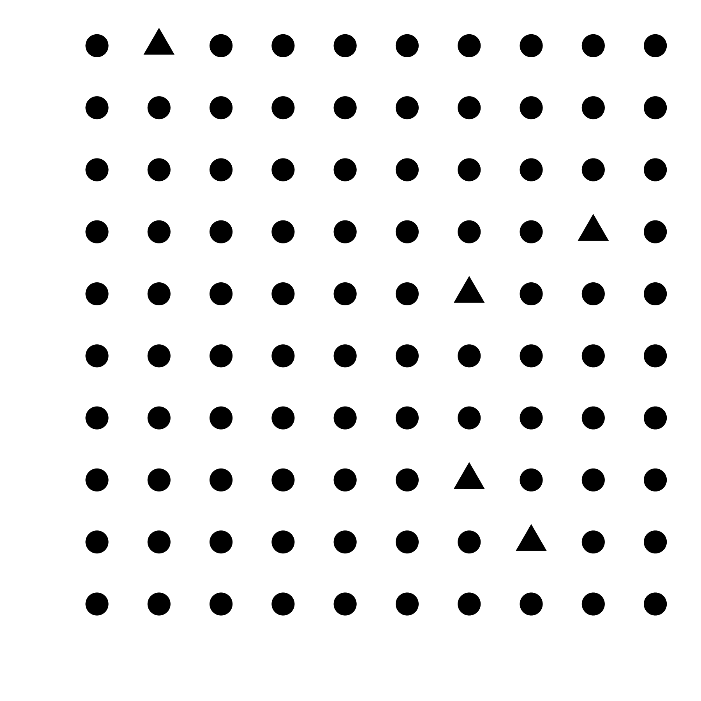

　正解は5つです。あまり難しい問題ではないでしょう。一方、下の図はいかがでしょうか。

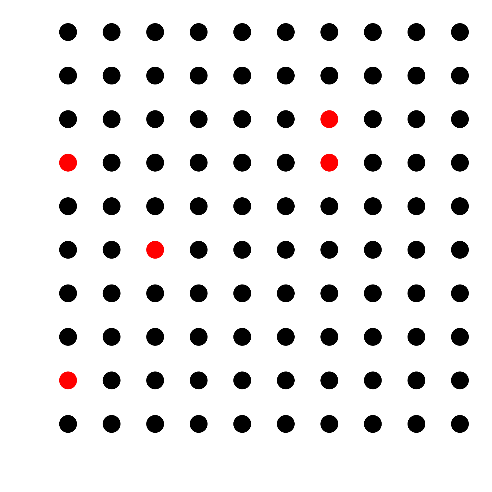

　どれも正解は5つです。本質的には同じ問題ですが、どの図の方が読みやすかったでしょうか。個人差はあるかも知れませんが、多くの方にとって後者の方が読みやすかったでしょう。最近、海外のジャーナルはカラーの図を使うことも可能ですので、色分けを優先的に考えましょう。白黒のみ受け付けられる場合でも、グループ数やサンプルサイズによっては点の形より、彩度や明るさの方が効果的な場合もあります。

　続きまして、`linetype`について解説します。線の形も色分けができない場合、よく使われる次元の増やし方です。ここでは日中韓台における人口1万人あたりCOVID-19新規感染者数の折れ線グラフを作成します。`COVID19_df`には人口のデータがないため、`left_join()`を使って`Country_df`と結合します。`left_join()`の使い方に関しては第\@ref(datahandling2)章を参照してください。続いて、Character型である`Date`変数を`as.Date()`関数を使ってDate型へ変換します。1万人あたり新規感染者数は新規感染者数（`Confirmed_Day`）を人口（`Population`）で割り、1万をかけます。最後に`Country`列を基準に`filter()`を使用し、日中韓台のデータのみ残します。後は折れ線グラフを作成しますが、`geom_line()`内の`aes()`内に`linetype`引数を`Country`変数でマッピングします。


```{.r .numberLines}
left_join(COVID19_df, Country_df, by = "Country") %>% 
  mutate(Date                 = as.Date(Date),
         Confirmed_per_capita = Confirmed_Day / Population * 10000) %>%
  filter(Country %in% c("Japan", "China", "Taiwan", "South Korea")) %>%
  ggplot() +
  geom_line(aes(x = Date, y = Confirmed_per_capita, linetype = Country)) +
  labs(x = "月", y = "1万人当たり新規感染者数",linetype = "国") +
  theme_bw(base_size = 12) +
  theme(legend.position = "bottom")
```


　いかがでしょうか。`linetype`は`color`よりも識別性が非常に低いことが分かるでしょう。個人差もあるかも知れませんが、`shape`よりも低いのではないでしょうか。実線の中国を除けば、日本、韓国、台湾の線はなかなか区別できません。したがって、`linetype`は2つ、3つまでが限界だと考えられます。3つまででしたら、実線、破線、点線に分けることができるでしょう。ここでは、日本のみを実線とし、他の3カ国は「その他」として破線にしてみましょう。そのためには、日本か否かを示す`Japan`変数を作成します。また、`geom_line()`の`aes()`内には`groups`引数を追加し、`linetype`は`Japan`変数でマッピングします。


```{.r .numberLines}
left_join(COVID19_df, Country_df, by = "Country") %>% 
  mutate(Date                 = as.Date(Date),
         Confirmed_per_capita = Confirmed_Day / Population * 10000,
         Japan                = if_else(Country == "Japan", "日本", "その他")) %>%
  filter(Country %in% c("Japan", "China", "Taiwan", "South Korea")) %>%
  ggplot() +
  geom_line(aes(x = Date, y = Confirmed_per_capita, 
                group = Country, linetype = Japan)) +
  labs(x = "月", y = "1万人当たり新規感染者数", linetype = "国") +
  theme_bw(base_size = 12) +
  theme(legend.position = "bottom")
```

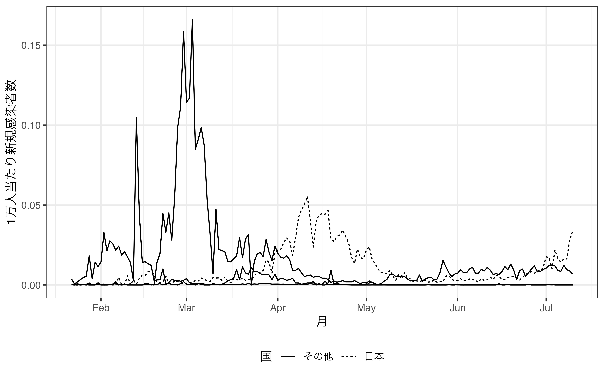

　その他の国が実線となっているので、`scale_linetype_manual()`で`Japan`の値ごとに線のタイプを指定します。


```{.r .numberLines}
left_join(COVID19_df, Country_df, by = "Country") %>% 
  mutate(Date                 = as.Date(Date),
         Confirmed_per_capita = Confirmed_Day / Population * 10000,
         Japan                = if_else(Country == "Japan", "日本", "その他")) %>%
  filter(Country %in% c("Japan", "China", "Taiwan", "South Korea")) %>%
  ggplot() +
  geom_line(aes(x = Date, y = Confirmed_per_capita, 
                group = Country, linetype = Japan)) +
  scale_linetype_manual(values = c("日本" = 1, "その他" = 2)) +
  labs(x = "月", y = "1万人当たり新規感染者数", linetype = "国") +
  theme_bw(base_size = 12) +
  theme(legend.position = "bottom")
```


　できれば、日本とその他の順番も逆にしたいですね。こちらは`Japan`変数をfactor化することで対応可能です。


```{.r .numberLines}
left_join(COVID19_df, Country_df, by = "Country") %>% 
  mutate(Date                 = as.Date(Date),
         Confirmed_per_capita = Confirmed_Day / Population * 10000,
         Japan                = if_else(Country == "Japan", "日本", "その他"),
         Japan                = factor(Japan, levels = c("日本", "その他"))) %>%
  filter(Country %in% c("Japan", "China", "Taiwan", "South Korea")) %>%
  ggplot() +
  geom_line(aes(x = Date, y = Confirmed_per_capita, 
                group = Country, linetype = Japan)) +
  scale_linetype_manual(values = c("日本" = 1, "その他" = 2)) +
  labs(x = "月", y = "1万人当たり新規感染者数", linetype = "国") +
  theme_bw(base_size = 12) +
  theme(legend.position = "bottom")
```

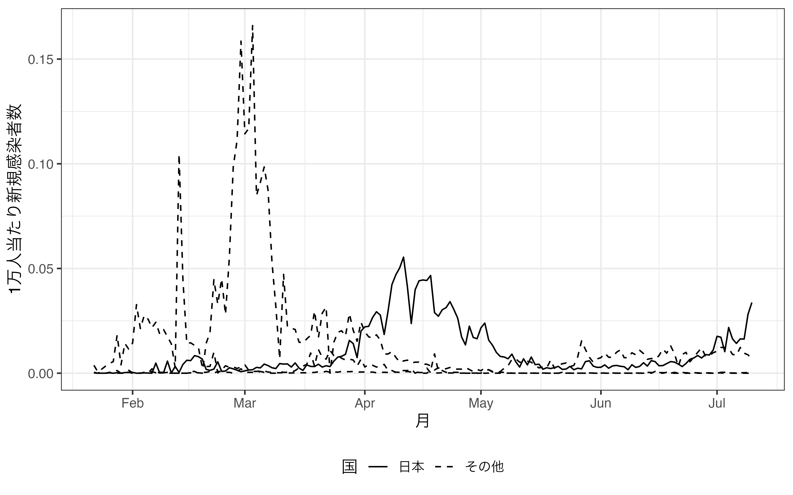

これで完成ですがいかがでしょうか。複数の線を識別するという意味では色分け（`color`）が優れていますし、ハイライトなら透明度（`alpha`）か線の太さ（`size`）の方が良いでしょう。筆者（SONG）としましては`linetype`による次元の追加はあまりオススメしませんが、知っといて損はないでしょう。

---

## `theme_*()`と`theme()`: テーマの指定 {#visual3-theme}

　続いて図全体の雰囲気を決める`theme_*()`レイヤーについて解説します。これらの使い方は非常に簡単であり、`ggplot`オブジェクトに`theme_*()`レイヤーを`+`で繋ぐだけです。もし、こちらのレイヤーを追加しない場合、デフォルトテーマとして`theme_gray()`が適用されます。{ggplot2}はいくつかのテーマを提供しており、以下がその例です。

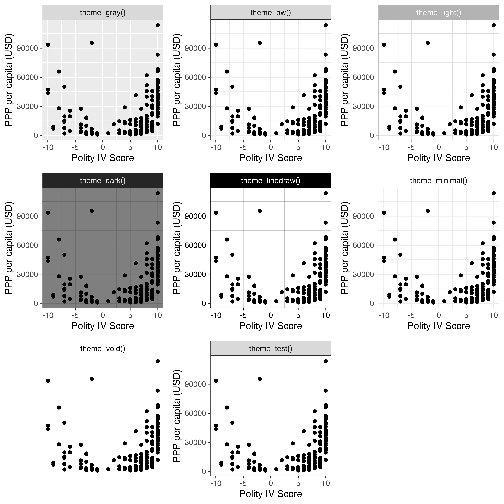

　他にも{ggplot2}用のテーマをパッケージとしてまとめたものもあります。興味のある方は[ggtheme](https://yutannihilation.github.io/allYourFigureAreBelongToUs/ggthemes/)や[ggthemr](https://github.com/Mikata-Project/ggthemr)ページを確認してみてください。

　`theme_*()`内部ではいくつかの引数を指定することができます。最もよく使われるのが`base_family`引数であり、図で使用するフォントを指定する引数です。macOSユーザーだとヒラギノ角ゴジックW3が良く使われており、`base_family = "HiraginoSans-W3"`で設定可能です。他にも全体の文字サイズを指定する`base_size`などがあります。

　テーマの微調整は主に`theme()`レイヤーで行います。こちらでは図の見た目に関する細かい調整ができます。実は`theme_*()`関数群は調整済み`theme()`レイヤーとして捉えることも出来ます。`theme_*()`と`theme()`を同時に使うことも可能であり、「全般的にはminimalテーマ（`theme_minimal()`）が好きだけど、ここだけはちょっと修正したい」場合に使用します。`theme()`では図の見た目に関する全ての部分が設定可能であるため、引数も膨大です。詳しくはコンソール上で`?theme`を入力し、ヘルプを確認してください。ここではいくつかの例のみを紹介します。

　まずは実習用データとして任意の棒グラフを作成し、`Theme_Fig`という名のオブジェクトとして保存しておきます。


```{.r .numberLines}
Theme_Fig <- Country_df %>%
  # Freedom HouseのStatus、Continentでグループ化
  group_by(FH_Status, Continent) %>%
  # 欠損値のある行を除き、PPP_per_capitaの平均値を計算
  summarise(PPP     = mean(PPP_per_capita, na.rm = TRUE),
            .groups = "drop") %>%
  # 欠損値の行を除去
  drop_na() %>%
  # Freedom HouseのStatusを再ラベリングし、factor化
  mutate(FH_Status = case_when(FH_Status == "F"  ~ "Free",
                               FH_Status == "PF" ~ "Partially Free",
                               FH_Status == "NF" ~ "Not Free"),
         FH_Status = factor(FH_Status, levels = c("Free", "Partially Free",
                                                  "Not Free"))) %>%
  ggplot() +
  geom_bar(aes(x = FH_Status, y = PPP, fill = Continent),
           stat = "identity", position = position_dodge(width = 1)) +
  labs(x = "Polity IV Score", y = "PPP per capita (USD)")

Theme_Fig
```


### 文字の大きさ

　図全体における文字の大きさは`theme_*()`レイヤーの`base_size`から調整することもできますが、`theme()`からも可能です。文字に関する調整は`text`引数に対して`element_text()`実引数を指定します。大きさの場合、`element_text()`内に`size`引数を指定します。


```{.r .numberLines}
Theme_Fig +
  theme(text = element_text(size = 16))
```

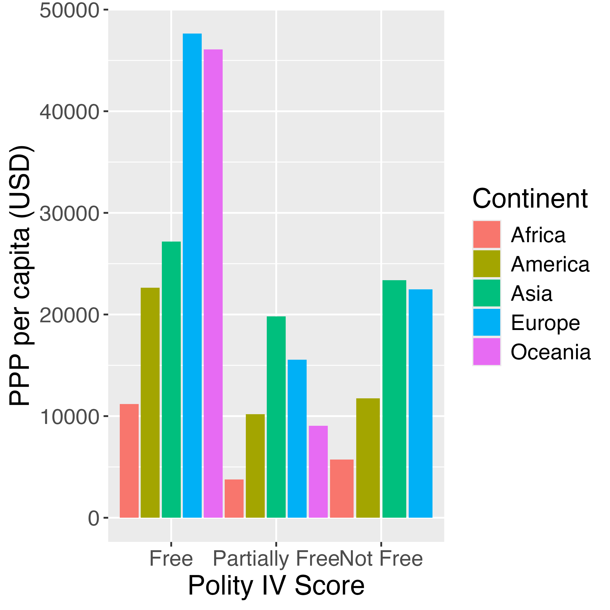

　`element_text()`では文字の大きさ以外にも色（`color`）、回転の度合い（`angle`）などを指定することもできます。詳しくはRコンソール上で`?element_text`を入力し、ヘルプを確認してください。

### 背景のグリッド

　背景のグリッドを調整する際は`panel.gird.*`引数を使います。主に使用する場面はグリッドの除去する場合ですが、この場合は実引数として`element_blank()`を使います。もし、グリッドの色や太さなどを変更したい場合は`element_line()`を使用します。ここではグリッドを除去する方法について紹介します。

　グリッドを除去する場合、どのグリッドを除去するかを決めないといけません。例えば、すべてのグリッドを除去するためには`panel.grid = element_blank()`を使います。また、メジャーグリッドの除去には`panel.grid.major`（すべて）、`panel.grid.major.x`（横軸のみ）、`panel.grid.major.y`（縦軸のみ）を指定します。マイナーグリッドの場合は`major`を`minor`に替えてください。以下にはいくつかの例をお見せします。


```{.r .numberLines}
# すべてのグリッドを除去
Theme_Fig +
  theme(panel.grid = element_blank())
```

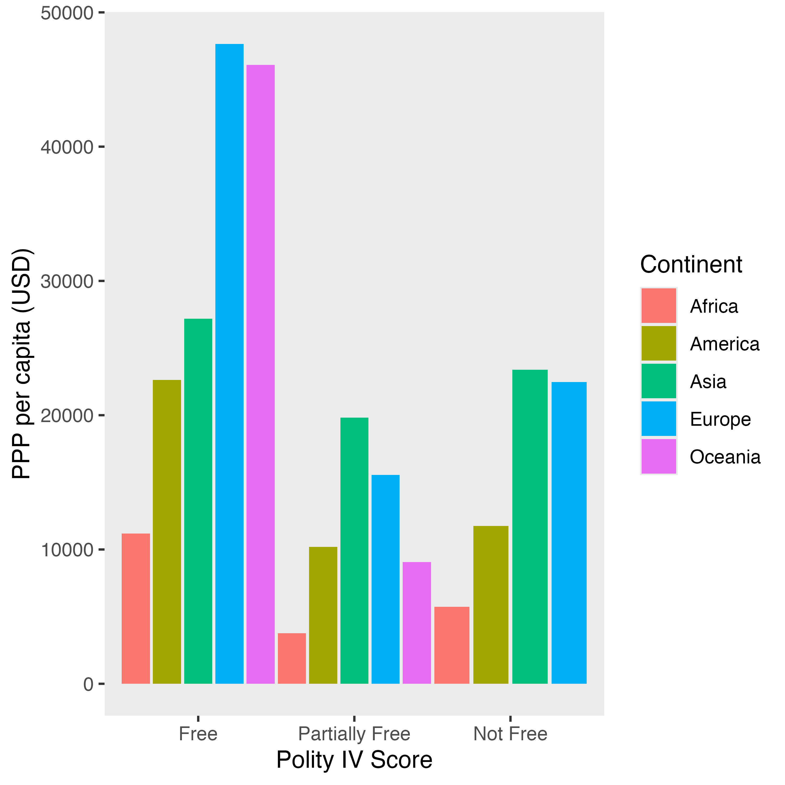

```{.r .numberLines}
# x軸のメジャーグリッドを除去
Theme_Fig +
  theme(panel.grid.major.x = element_blank())
```


```{.r .numberLines}
# y軸のマイナーグリッドのみ除去
Theme_Fig +
  theme(panel.grid.minor.y = element_blank())
```


### 目盛りラベルの回転

　横軸の目盛りラベルが長すぎるか大きすぎると、ラベルが重なる場合があります。この場合の対処方法としてはラベルの長さを短くしたり、改行（`\n`）を入れることが考えられますが、ラベルを若干回転することでも対処可能です。たとえば、横軸の目盛りラベルを調整する場合は`axis.text.x = element_text()`を指定し、`element_text()`内に`angle`引数を指定します。例えば、 **反**時計回りで25度回転させる場合は`angle = 25`と指定します。


```{.r .numberLines}
Theme_Fig +
  theme(text = element_text(size = 16),
        axis.text.x = element_text(angle = 25))
```

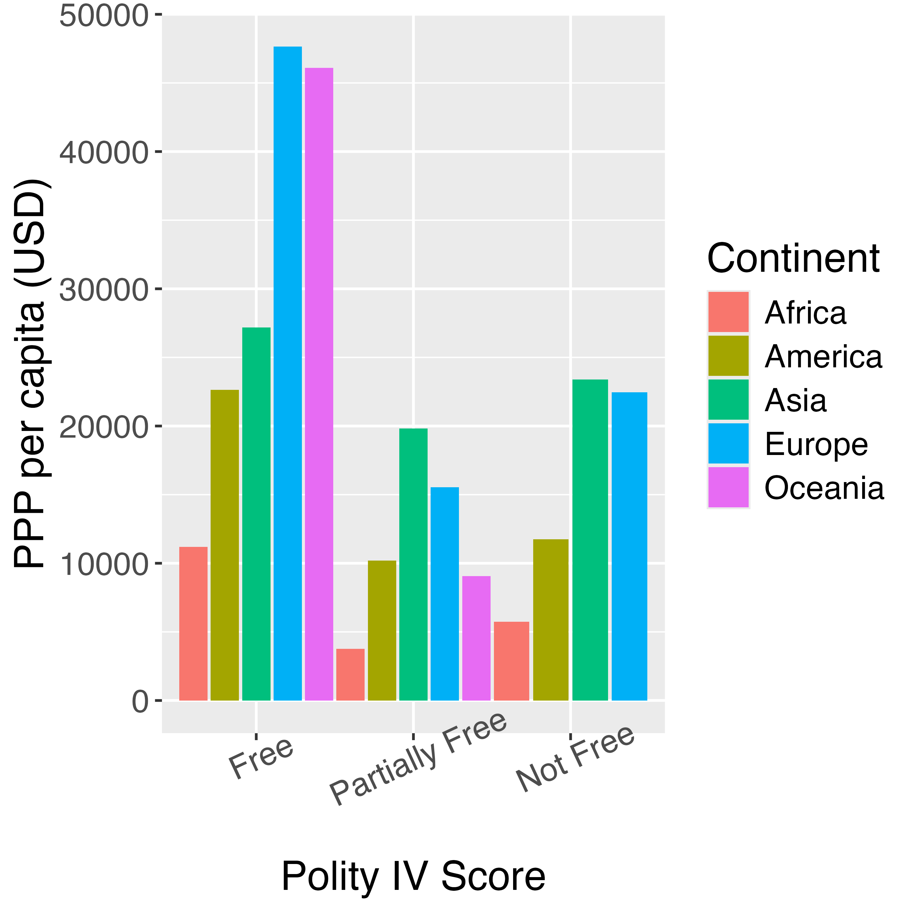

　この場合、ラベルは目盛りのすぐ下を基準に回転することになります。もし、ラベルの最後の文字を目盛りの下に移動させる場合は`hjust = 1`を追加します。


```{.r .numberLines}
Theme_Fig +
  theme(text = element_text(size = 16),
        axis.text.x = element_text(angle = 25, hjust = 1))
```

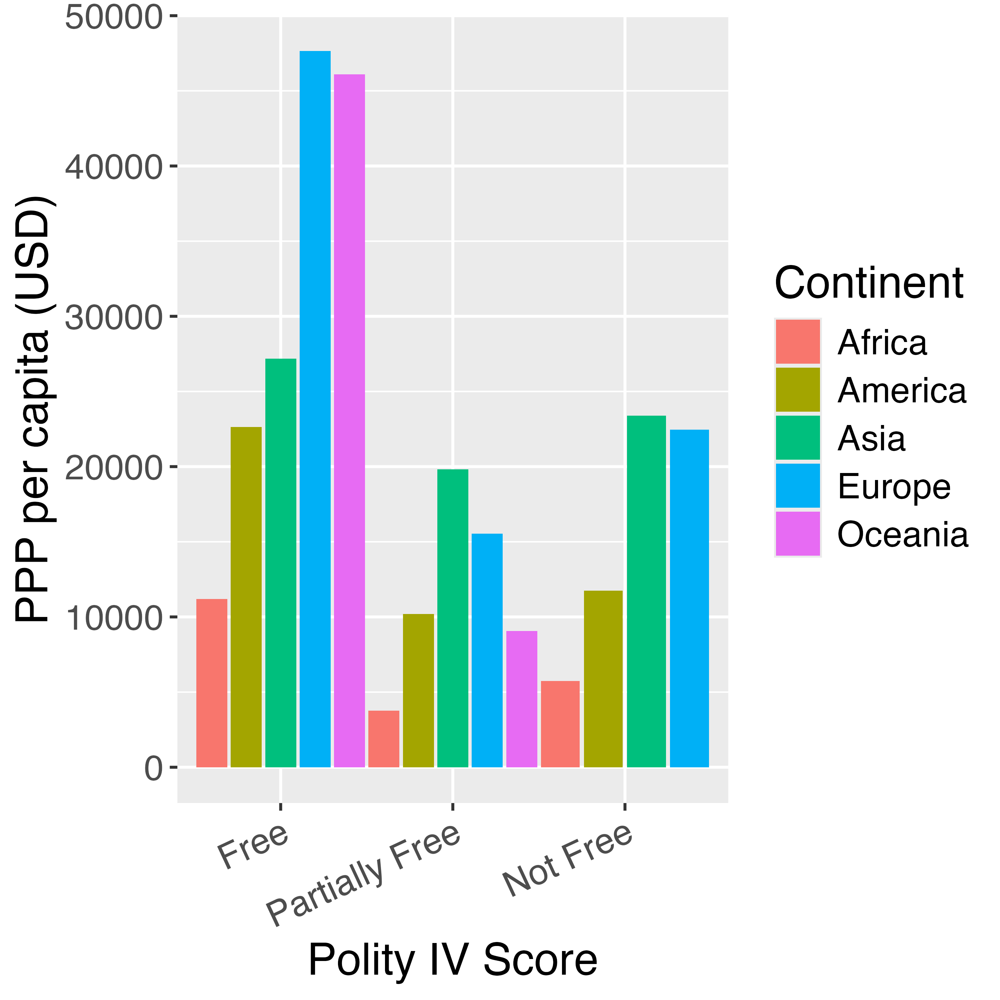

　ちなみに、`angle = 90`などで指定するとラベルが重なる問題はほぼ完全に解決されますが、かなり読みづらくなるので、できれば`angle`の値は小さめにした方が読みやすくなります。

### `scale_*_*()`を用いたラベル重複の回避

　ラベルの重複を回避するもう一つの方法は「ラベルの位置をずらす」ことです。これは{ggplot2}3.3.0以降追加された機能であり、`theme()`でなく、`scale_*_*()`関数の`guide`引数で指定することが出来ます。使い方は以下の通りです。たとえば、横軸（x軸）のラベルを2行構成にしたい場合は以下のように指定します。


```{.r .numberLines}
ggplot2オブジェクト名 +
  scale_x_discrete(guide = guide_axis(n.dodge = 2))
```

　実際の結果を確認してみましょう。


```{.r .numberLines}
Theme_Fig +
  scale_x_discrete(guide = guide_axis(n.dodge = 2)) +
  theme(text = element_text(size = 16))
```


　横軸のラベルが2行構成になりました。左から最初のラベルは1行目に、2番目のラベルは2行目に、3番目のラベルは1行目になります。実際、ラベルをずらすだけなら`n.dodge = 2`で十分ですが、この引数の挙動を調べるために`n.dodge = 3`に指定してみましょう。


```{.r .numberLines}
Theme_Fig +
  scale_x_discrete(guide = guide_axis(n.dodge = 3)) +
  theme(text = element_text(size = 16))
```


　3番目のラベルが3行目に位置することになります。もし、4つ目のラベルが存在する場合、それは1行目に位置するでしょう。

### 凡例の表示/非表示

　凡例を無くす方法はいくつかありますが、まずはすべての凡例を非表示する方法について紹介します。それは後ほど紹介します`legend.position`の実引数として`"none"`を指定する方法です。


```{.r .numberLines}
# 凡例を非表示にする
Theme_Fig +
  theme(legend.position = "none")
```


　`Theme_Fig`は`x`と`y`以外に`fill`にマッピングをしたため、凡例は一つのみとなります。ただし、場合によってはもっと次元を増やすことによって2つ以上の凡例が表示されるケースがあります。別途の説明なくても図だけで理解するのが理想なので凡例は出来る限り温存させた方が良いでしょう。しかし、実例はあまり多く見られないと思いますが、凡例がなくても理解に問題がないと判断される場合は一部の凡例を非表示することも考えられます。

　たとえば、以下のような`Theme_Fig2`の例を考えてみましょう。


```{.r .numberLines}
Theme_Fig2 <- Country_df %>%
  mutate(OECD = if_else(OECD == 1, "OECD", "non-OECE")) %>%
  ggplot(aes(x = FH_Total, y = GDP_per_capita)) +
  geom_point(aes(color = OECD)) +
  stat_ellipse(aes(fill = OECD), geom = "polygon", level = 0.95, alpha = 0.2) +
  labs(x = "Freedom House Score", y = "GDP per capita (USD)", 
       color = "OECD", fill = "Cluster")

Theme_Fig2
```

```
## Warning: Removed 1 rows containing non-finite values (stat_ellipse).
```

```
## Warning: Removed 1 rows containing missing values (geom_point).
```

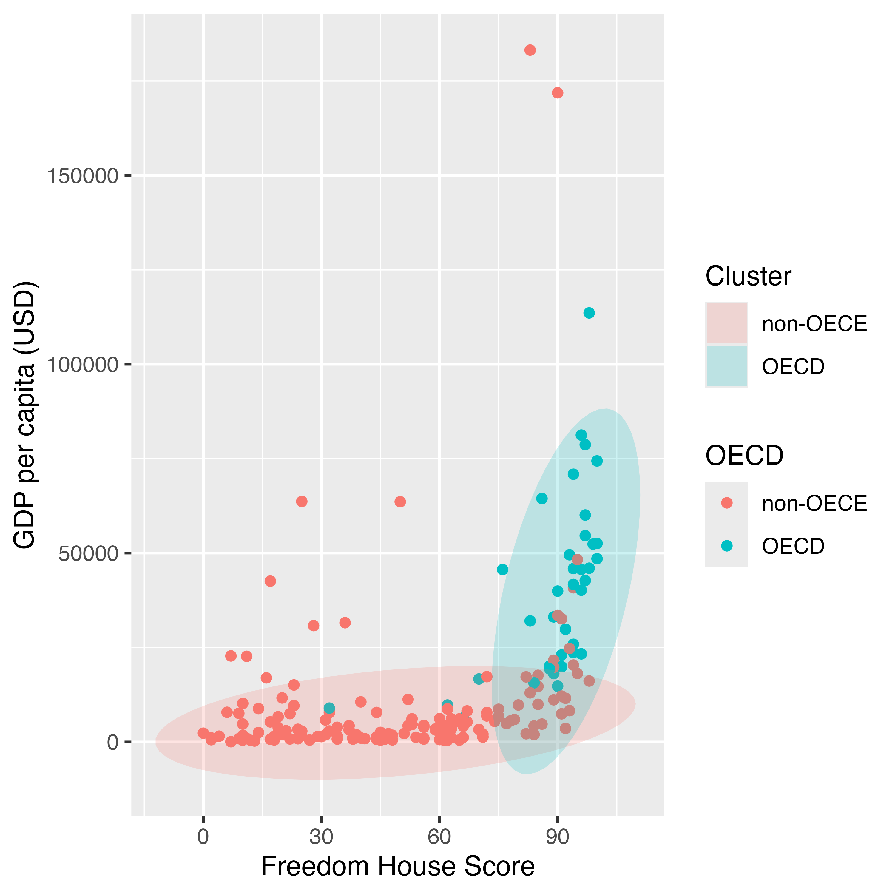

　`color`と`fill`がそれぞれ別の凡例として独立しています。この例の場合、`fill`の凡例はなくても、図を理解するのは難しくないかも知れません。ここで考えられる一つの方法は`color`と`fill`の凡例をオーバラップさせる方法です。{ggplot2}の場合、同じ変数がマッピングされていれば凡例をオーバーラップさせることも可能です。ただし、凡例のタイトルが同じである必要があります。ここでは`color`と`fill`のタイトルを`"OECD"`に統一してみましょう。


```{.r .numberLines}
Theme_Fig2 +
  labs(color = "OECD", fill = "OECD")
```

```
## Warning: Removed 1 rows containing non-finite values (stat_ellipse).
```

```
## Warning: Removed 1 rows containing missing values (geom_point).
```

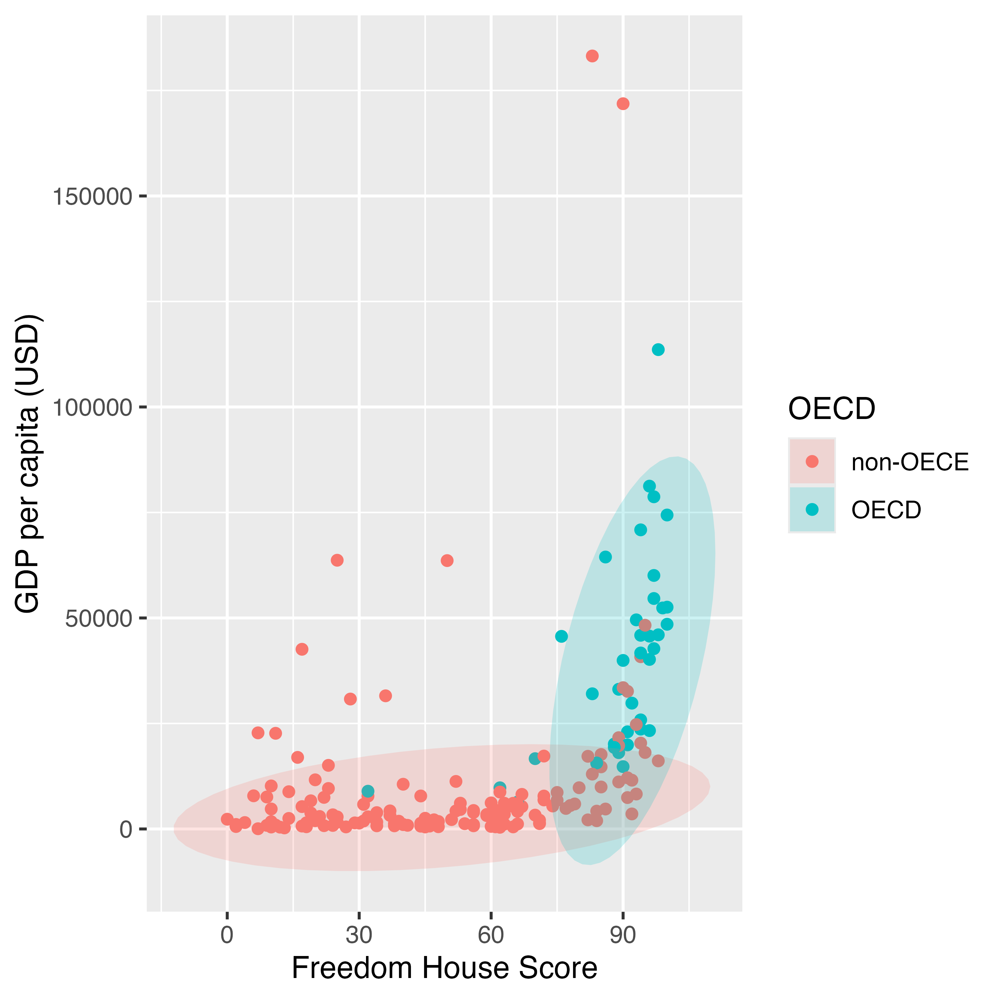

　これで十分でしょう。しかし、凡例から`fill`の情報を完全に消したい場合はどうすれば良いでしょうか。その時に登場するのが`guides()`関数です。関数の中で`マッピング要素 = "none"`を指定すると、当該凡例が非表示となります。


```{.r .numberLines}
Theme_Fig2 +
  guides(fill = "none")
```

```
## Warning: Removed 1 rows containing non-finite values (stat_ellipse).
```

```
## Warning: Removed 1 rows containing missing values (geom_point).
```

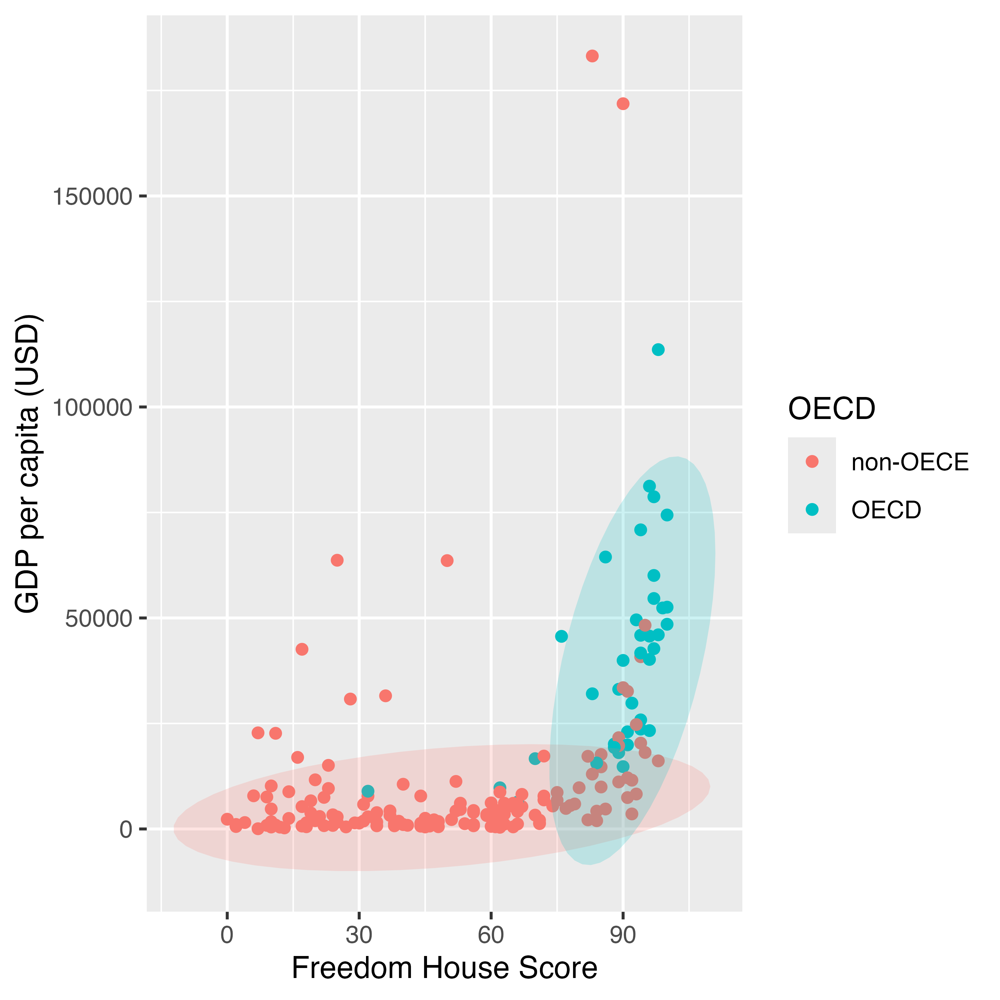

　`guides()`関数は凡例を細かく調整できる様々な機能を提供しています。興味のある方はヘルプ（`?guides`）を参照してください。

### 凡例の位置

　凡例を図の下段に移動させる場合は`legend.position`引数に`"bottom"`を指定するだけです。他にも`"top"`や`"left"`も可能ですが、凡例は一般的に図の右か下段に位置しますので、デフォルトのままに置くか、`"bottom"`くらいしか使わないでしょう。


```{.r .numberLines}
# 凡例を図の下段へ移動
Theme_Fig +
  theme(legend.position = "bottom")
```


　もし、凡例を図の内部に置く場合は、長さ2のnumeric型ベクトルを指定します。図の左下なら`c(0, 0)`、左上なら`c(0, 1)`、右上は`c(1, 1)`、右下は`c(1, 0)`となります。これは図の大きさを横縦それぞれ1とした場合の位置を意味します。ここでは凡例を右上へ置いてみましょう。


```{.r .numberLines}
# 凡例をプロットの右上へ
Theme_Fig +
  theme(legend.position = c(1, 1))
```


　これは凡例の中央が右上に来るようになります。これを是正するためには`legend.justification`引数を更に指定する必要があります。これにも長さ2のnumeric型ベクトルを指定しますが、これは凡例の中心をどこにするかを意味します。今回の例だと、**凡例の**右上を`c(1, 1)`に位置させたいので、ここも`c(1, 1)`と指定します。基本的に`legend.position`と`legend.justification`は同じ値にすれば問題ないでしょう。


```{.r .numberLines}
# 凡例の中心を凡例の右上と指定
Theme_Fig +
  theme(legend.position = c(1, 1),
        legend.justification = c(1, 1))
```


　また、凡例の背景を透明にしたい場合は`legend.background = element_blank()`を指定します。


```{.r .numberLines}
# 凡例を背景を透明に
Theme_Fig +
  theme(legend.position = c(1, 1),
        legend.justification = c(1, 1),
        legend.background = element_blank())
```


　`theme()`関数が提供している昨日は非常に多く、それぞれの実引数として用いられる`element_text()`や`element_line()`、`element_rect()`にも様々な引数が提供されております。図を自分好みに微調整したい方はそれぞれの関数のヘルプを参照してください。

---

## 図の結合 {#visual3-merge}

　{ggplot2}で作成した複数の図を一つの図としてまとめる場合、昔は{[gridExtra](https://cran.r-project.org/web/packages/gridExtra/vignettes/arrangeGrob.html)}一択でした。しかし、今はもっと使いやすいパッケージがいくつか公開されており、ここでは{ggpubr}の`ggarrange()`を紹介します。使い方を紹介する前に、結合する図をいくつか用意し、それぞれ`Grid_Fig1`、`Gird_Fig2`、...`Grid_Fig4`と名付けます。


```{.r .numberLines}
# Grid_Fig1: 散布図
# X軸: フリーダムハウス・スコア / Y軸: 一人あたり購買力平価GDP（対数）
Grid_Fig1 <- Country_df %>%
  ggplot() +
  geom_point(aes(x = FH_Total, y = PPP_per_capita)) +
  scale_y_log10() +
  labs(x = "フリーダムハウススコア", 
       y = "一人あたり購買力平価GDP（対数）") +
  theme_bw(base_size = 12)

# Grid_Fig2: 散布図
# X軸: フリーダムハウス・スコア / Y軸: 2018年人間開発指数
Grid_Fig2 <- Country_df %>%
  ggplot() +
  geom_point(aes(x = FH_Total, y = HDI_2018)) +
  labs(x = "フリーダムハウススコア", 
       y = "人間開発指数（2018年）") +
  theme_bw(base_size = 12)

# Grid_Fig4: ヒストグラム
# X軸: フリーダムハウス・スコア
Grid_Fig3 <- Country_df %>%
  ggplot() +
  geom_histogram(aes(x = FH_Total), color = "white",
                 binwidth = 5, boundary = 0) +
  labs(x = "フリーダムハウススコア", y = "国数") +
  theme_bw(base_size = 12)

# Grid_Fig4: ヒストグラム
# Y軸: 一人あたり購買力平価GDP（対数）
# 時計回りで90度回転したヒストグラムを作成するために、yにマッピング
Grid_Fig4 <- Country_df %>%
  ggplot() +
  geom_histogram(aes(y = PPP_per_capita), color = "white",
                 boundary = 0, bins = 15) +
  scale_y_log10() +
  labs(x = "国数", y = "一人あたり購買力平価GDP（対数）") +
  theme_bw(base_size = 12)
```

　それぞれの図は以下の通りです。左上、右上、左下、右下の順でそれぞれ`Grid_Fig1`、`Grid_Fig2`、`Grid_Fig3`、`Grid_Fig4`です。


　まずは`Grid_Fig1`と`Grid_Fig2`を横に並べてみましょう。まずは{ggpubr}を読み込みます。


```{.r .numberLines}
pacman::p_load(ggpubr)
```

　図を並べる際は`ggarrange()`関数を使用し、まず、結合したい図のオブジェクトを入力します。また、2つの図を横に並べることは1行2列のレイアウトであることを意味するため、`nrow`と`ncol`引数の実引数としてそれぞれ1と2を指定します。


```{.r .numberLines}
ggarrange(Grid_Fig1, Grid_Fig2, nrow = 1, ncol = 2)
```


　右側にある`Grid_Fig2`の幅が若干広いような気がします。この場合、`aling = "hv"`を入れると綺麗に揃えられます。


```{.r .numberLines}
ggarrange(Grid_Fig1, Grid_Fig2, nrow = 1, ncol = 2, align = "hv")
```


　続きまして、3つの図を以下のように並べるとします。

<table class=" lightable-classic table table-bordered" style='font-family: "Arial Narrow", "Source Sans Pro", sans-serif; width: auto !important; margin-left: auto; margin-right: auto; margin-left: auto; margin-right: auto;'>
<tbody>
  <tr>
   <td style="text-align:left;border-left:1px solid;border-right:1px solid;"> `Grid_Fig3` </td>
   <td style="text-align:left;border-left:1px solid;border-right:1px solid;">  </td>
  </tr>
  <tr>
   <td style="text-align:left;border-left:1px solid;border-right:1px solid;"> `Grid_Fig1` </td>
   <td style="text-align:left;border-left:1px solid;border-right:1px solid;"> `Grid_Fig4` </td>
  </tr>
</tbody>
</table>

　今回は3つの図オブジェクトを入れるだけでは不十分です。なぜなら、`ggarrange()`関数は左上から右下の順番へ一つずつ図を入れるからです。もし、3つの図オブジェクトのみを入れると、以下のように配置されます。

<table class=" lightable-classic table table-bordered" style='font-family: "Arial Narrow", "Source Sans Pro", sans-serif; width: auto !important; margin-left: auto; margin-right: auto; margin-left: auto; margin-right: auto;'>
<tbody>
  <tr>
   <td style="text-align:left;border-left:1px solid;border-right:1px solid;"> `Grid_Fig3` </td>
   <td style="text-align:left;border-left:1px solid;border-right:1px solid;"> `Grid_Fig1` </td>
  </tr>
  <tr>
   <td style="text-align:left;border-left:1px solid;border-right:1px solid;"> `Grid_Fig4` </td>
   <td style="text-align:left;border-left:1px solid;border-right:1px solid;">  </td>
  </tr>
</tbody>
</table>

　これを回避するためには空欄とするグリッドに`NULL`を指定する必要があります。


```{.r .numberLines}
ggarrange(Grid_Fig3, # 1行1列目
          NULL,      # 1行2列目
          Grid_Fig1, # 2行1列目
          Grid_Fig4, # 2行2列目
          nrow = 2, ncol = 2, align = "hv")
```

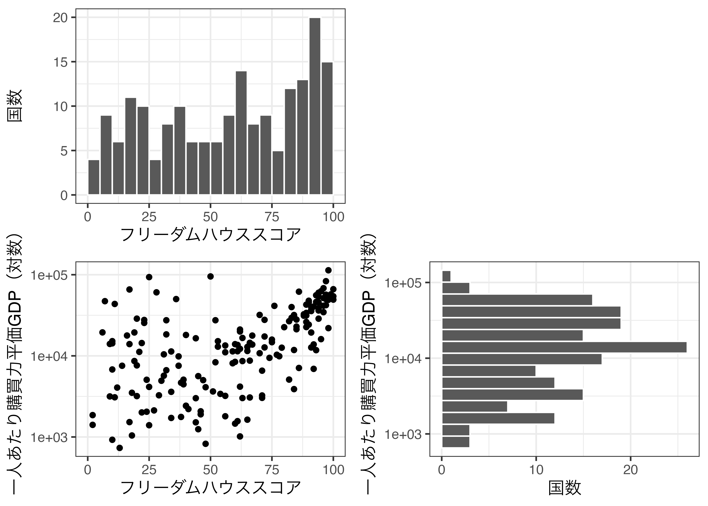

　次はヒストグラムを小さく調整します。左上の`Grid_Fig3`の上下の幅を、右下の`Grid_Fig4`は左右の幅を狭くします。このためには`widths`と`heights`引数が必要です。たとえば、`heights = c(0.3, 0.7)`だと1行目は全体の30%、2行目は全体の70%になります。今回は1行目と2行目の比率は3:7に、1列目と2列目の比は7:3とします。また、それぞれの図に(a)、(b)、(c)を付けます。空欄となるグリッドのラベルは`NA`か`""`にします。`NULL`ではないことに注意してください。


```{.r .numberLines}
ggarrange(Grid_Fig3, 
          NULL, 
          Grid_Fig1, 
          Grid_Fig4,
          nrow = 2, ncol = 2, align = "hv",
          # グリットの大きさを調整
          widths = c(0.7, 0.3), heights = c(0.3, 0.7),
          # 各図にラベルを付ける
          labels = c("(a)", NA, "(b)", "(c)"))
```


　左上の`Grid_Fig3`と左下の`Grid_Fig1`は横軸のラベルを共有しており、左下の`Grid_Fig1`と右下の`Grid_Fig4`は縦軸のラベルを共有しています。以下では`Grid_Fig3`の横軸ラベル、`Grid_Fig4`の縦軸ラベルを消します。ggplotオブジェクトに`theme(axis.title.x = element_blank())`を`+`で繋ぐと横軸のラベルが表示されなくなります。`ggarrange()`に入れるオブジェクトに直接アクセスし、それぞれの軸ラベルを消してみましょう[^fig-merge-tick]。

[^fig-merge-tick]: もし、横軸（x）の目盛りも消したい場合は`theme()`内に`axis.ticks.x = element_blank()`を、目盛りのラベルまで消したい場合は`axis.text.x  = element_blank()`を追加してください。横軸（y）の場合は`.x`の箇所を`.y`に書き換えてください。


```{.r .numberLines}
ggarrange(Grid_Fig3 + theme(axis.title.x = element_blank()), 
          NULL, 
          Grid_Fig1, 
          Grid_Fig4 + theme(axis.title.y = element_blank()),
          nrow = 2, ncol = 2, align = "hv",
          widths = c(0.7, 0.3), heights = c(0.3, 0.7),
          labels = c("(a)", NA, "(b)", "(c)"))
```

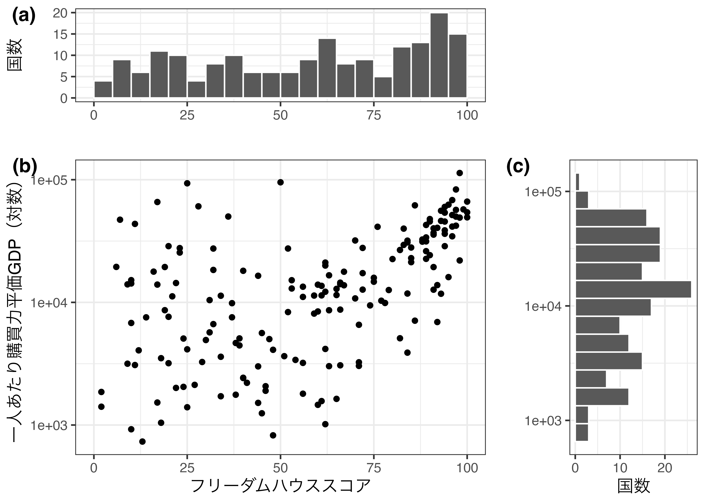

　これで完成です。`ggarrange()`には他にもカスタマイズ可能な部分がいっぱいあります。詳細はコンソール上で`?ggarrange`を入力し、ヘルプを参照してください。

　他にも{egg}パッケージの`ggarrange()`、{cowplot}の`plot_grid()`、{patchwork}の`+`、`|`、`/`演算子などがあります。それぞれ強みがあり、便利なパッケージです。興味のある読者は以下のページで使い方を確認してみてください。

* [egg](https://cran.r-project.org/web/packages/egg/vignettes/Overview.html)
* [cowplot](https://cran.r-project.org/web/packages/cowplot/vignettes/introduction.html)
* [patchwork](https://github.com/thomasp85/patchwork)
