# 可視化[発展] {#visualization4}


## 概要 {#visual4-intro}

　第\@ref(visualization1)章では{ggplot2}の仕組みについて、第\@ref(visualization2)章ではよく使われる5種類のプロット（棒グラフ、散布図、折れ線グラフ、箱ひげ図、ヒストグラム）の作り方を、第\@ref(visualization3)章ではスケール、座標系などの操作を通じたグラフの見た目調整について解説しました。本章では第\@ref(visualization2)章の延長線上に位置づけることができ、紹介しきれなかった様々なグラフの作り方について簡単に解説します。本章で紹介するグラフは以下の通りです。

* [バイオリンプロット](#visual4-violin)
* [ラグプロット](#visual4-rug)
* [リッジプロット](#visual4-ridge)
* [エラーバー付き散布図](#visual4-pointrange)
* [ロリーポップチャート](#visual4-lollipop)
* [平滑化ライン](#visual4-smooth)
* [ヒートマップ](#visual4-heatmap)
* [等高線図](#visual4-contour)
* [地図](#visual4-map)
* [非巡回有向グラフ](#visual4-dag)
* [バンプチャート](#visual4-bump)
* [沖積図](#visual4-alluvial)
* [ツリーマップ](#visual4-tree)
* [モザイクプロット](#visual4-mosaic)

---


```{.r .numberLines}
pacman::p_load(tidyverse)

Country_df <- read_csv("Data/Countries.csv")
COVID19_df <- read_csv("Data/COVID19_Worldwide.csv", guess_max = 10000)
```

---

## バイオリンプロット {#visual4-violin}

　バイオリンプロットは連続変数の分布を可視化する際に使用するプロットの一つです。第\@ref(visualization1)章で紹介しましたヒストグラムや箱ひげ図と目的は同じです。それではバイオリンプロットとは何かについて例を見ながら解説します。

　以下の図は対数化した一人当たり購買力平価GDP（`PPP_per_capita`）のヒストグラムです。


```
## Warning: Removed 8 rows containing non-finite values (stat_bin).
```

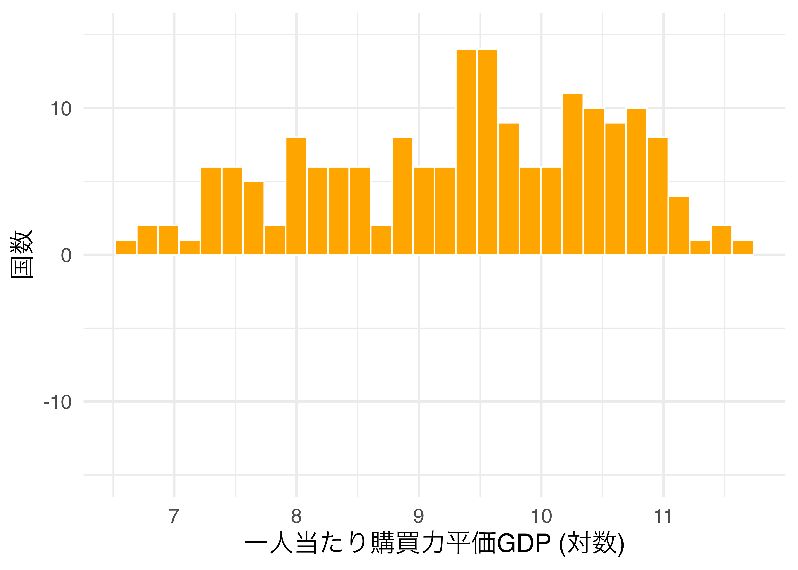

　このヒストグラムをなめらかにすると以下のような図になります。


```
## Warning: Removed 8 rows containing non-finite values (stat_density).
```


　この密度曲線を上下対称にすると以下のような図となり、これがバイオリンプロットです。ヒストグラムのようにデータの分布が分かりやすくなります。


```
## Warning: Removed 8 rows containing non-finite values (stat_density).
## Removed 8 rows containing non-finite values (stat_density).
```

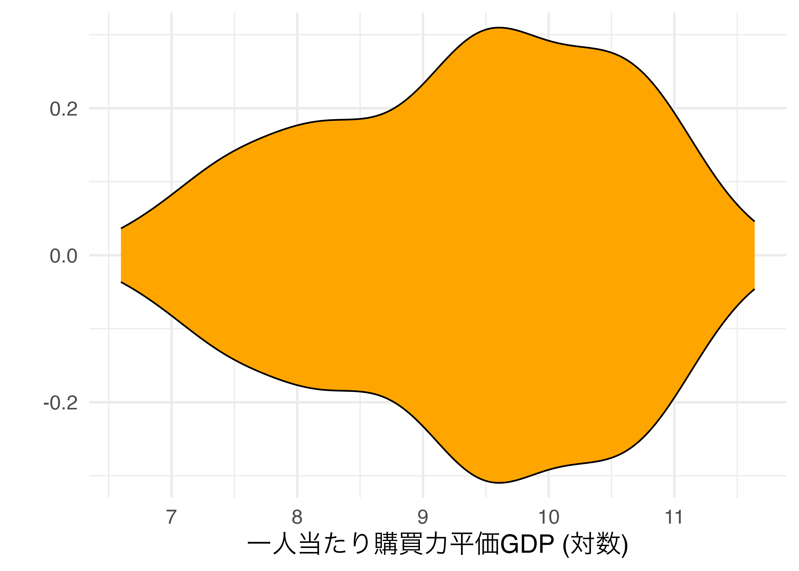

　しかし、この図の場合、ヒストグラムと同様、中央値や四分位数などの情報が含まれておりません。これらの箱ひげ図を使用した方が良いでしょう。バイオリンプロットの良い点はバイオリンの中に箱ひげ図を入れ、ヒストグラムと箱ひげ図両方の長所を取ることができる点です。たとえば、バイオリンプロットを90度回転させ、中にバイオリン図を入れると以下のようになります。


```
## Warning: Removed 8 rows containing non-finite values (stat_density).
## Removed 8 rows containing non-finite values (stat_density).
```

```
## Warning: Removed 8 rows containing non-finite values (stat_boxplot).
```


　それでは実際にバイオリンプロットを作ってみましょう。使い方は箱ひげ図（`geom_boxplot()`）と同じです。たとえば、横軸は大陸（`Continent`）に、縦軸は対数化した一人当たり購買力平価GDP（`PPP_per_capita`）にしたバイオリンプロットを作るには作るには`geom_violin()`幾何オブジェクトの中にマッピングするだけです。大陸ごとに色分けしたい場合は`fill`引数に`Continent`をマッピングします。


```{.r .numberLines}
Country_df %>%
    ggplot() +
    geom_violin(aes(x = Continent, y = PPP_per_capita, fill = Continent)) +
    labs(x = "大陸", y = "一人当たり購買力平価GDP (対数)") +
    scale_y_continuous(breaks = c(0, 1000, 10000, 100000),
                       labels = c(0, 1000, 10000, 100000),
                       trans  = "log10") + # y軸を対数化
    guides(fill = "none") + # fillのマッピング情報の凡例を隠す
    theme_minimal(base_family = "HiraKakuProN-W3",
                  base_size   = 16)
```

```
## Warning: Removed 8 rows containing non-finite values (stat_ydensity).
```


　ここに箱ひげ図も載せたい場合は、`geom_violin()`オブジェクトの後に`geom_boxplot()`オブジェクトを入れるだけで十分です。


```{.r .numberLines}
Country_df %>%
    ggplot() +
    geom_violin(aes(x = Continent, y = PPP_per_capita, fill = Continent)) +
    geom_boxplot(aes(x = Continent, y = PPP_per_capita),
                 width = 0.2) +
    labs(x = "大陸", y = "一人当たり購買力平価GDP (対数)") +
    scale_y_continuous(breaks = c(0, 1000, 10000, 100000),
                       labels = c(0, 1000, 10000, 100000),
                       trans = "log10") +
    guides(fill = "none") +
    theme_minimal(base_family = "HiraKakuProN-W3",
                  base_size   = 16)
```

```
## Warning: Removed 8 rows containing non-finite values (stat_ydensity).
```

```
## Warning: Removed 8 rows containing non-finite values (stat_boxplot).
```


　箱ひげ図は四分位範囲、四分位数、最小値、最大値などの情報を素早く読み取れますが、どの値当たりが分厚いかなどの情報が欠けています。これをバイオリンプロットで補うことで、よりデータの分布を的確に把握することができます。

---

## ラグプロット {#visual4-rug}

　ラグプロット（rug plot）は変数の分布を示す点ではヒストグラム、箱ひげ図、バイオリンプロットと同じ目的を持ちますが、大きな違いとしてはラグプロット単体で使われるケースがない（または、非常に稀）という点です。ラグプロットは上述しましたヒストグラムや箱ひげ図、または散布図などと組み合わせて使うのが一般的です。

　以下は`Country_df`の`PPP_per_capita`（常用対数変換）のヒストグラムです。


```{.r .numberLines}
Country_df %>%
    drop_na(PPP_per_capita) %>%
    ggplot() +
    geom_histogram(aes(x = PPP_per_capita), bins = 15, color = "white") +
    labs(x = "PPP per capita (USD; log scale)", 
         y = "Number of Countries") +
    scale_x_log10() +
    guides(fill = "none") +
    theme_minimal(base_size = 12)
```


　一変数の分布を確認する場合、ヒストグラムは情報量の損失が少ない方です。それでも値一つ一つの情報は失われますね。例えば、上記のヒストグラムで左端の度数は1です。左端の棒の区間はおおよそ500から780であり、一人当たりPPPがこの区間に属する国は1カ国ということです。ちなみに、その国はブルンジ共和国ですが、ブルンジ共和国の具体的な一人当たりPPPはヒストグラムから分かりません。情報量をより豊富に持たせるためには区間を細かく刻むことも出来ますが、逆に分布の全体像が読みにくくなります。

　ここで登場するのがラグプロットです。これは座標平面の端を使ってデータを一時現状に並べたものです。多くの場合、点ではなく、垂直線（｜）を使います。ラグプロットの幾何オブジェクトは{ggplot2}でデフォルトで提供されており、`geom_rug()`を使います。マッピングは`x`または`y`に対して行いますが、座標平面の下段にラグプロットを出力する場合は`x`に変数（ここでは`PPP_per_capita`）をマッピングします。


```{.r .numberLines}
Country_df %>%
    drop_na(PPP_per_capita) %>%
    ggplot() +
    geom_histogram(aes(x = PPP_per_capita), bins = 15, color = "white") +
    geom_rug(aes(x = PPP_per_capita))  +
    labs(x = "PPP per capita (USD; log scale)", 
         y = "Number of Countries") +
    scale_x_log10() +
    theme_minimal(base_size = 12)
```

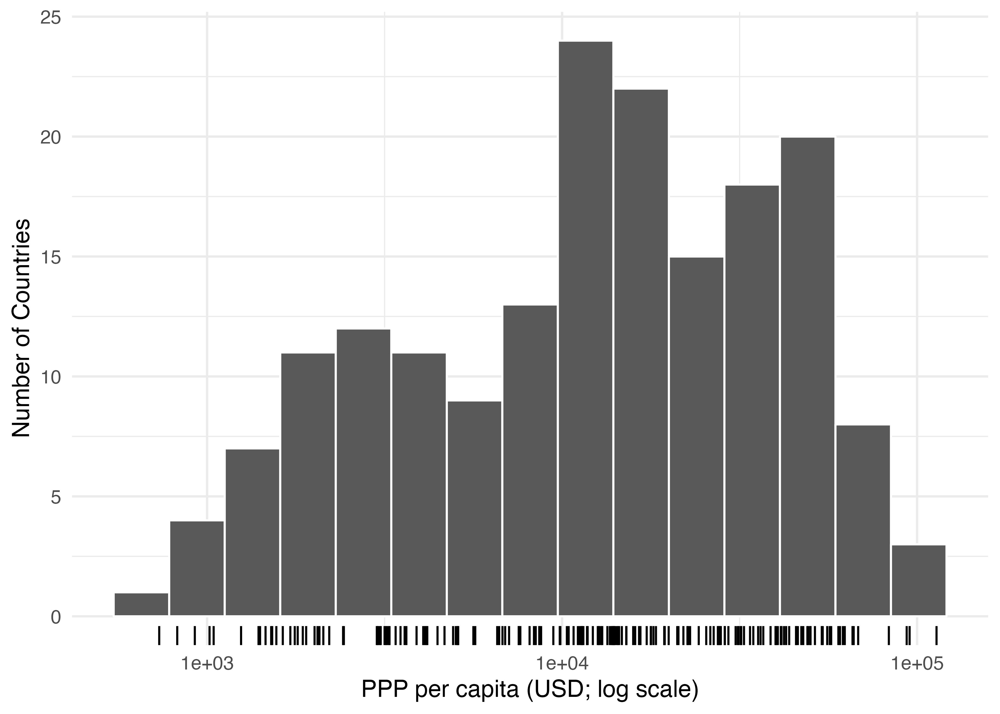

ラグプロットを使うと本来のヒストグラムの外見にほぼ影響を与えず、更に情報を付け加えることが可能です。点（｜）の密度でデータの分布を確認することもできますが、その密度の相対的な比較に関してはヒストグラムの方が良いでしょう。

ラグプロットは散布図に使うことも可能です。散布図は一つ一つの点が具体的な値がマッピングされるため、情報量の損失はほぼないでしょう。それでも散布図にラグプロットを加える意味はあります。まず、`Country_df`のフリーダムハウス指数（`FH_Total`）と一人当たりPPP（`PPP_per_capita`）の散布図を作ってみましょう。


```{.r .numberLines}
Country_df %>%
    drop_na(FH_Total, PPP_per_capita) %>%
    ggplot() +
    geom_point(aes(x = FH_Total, y = PPP_per_capita)) +
    labs(x = "Freedom House Score", y = "PPP per capita (USD)") +
    scale_y_continuous(breaks = seq(0, 120000, by = 10000),
                       labels = seq(0, 120000, by = 10000)) +
    guides(fill = "none") +
    theme_minimal(base_size = 12)
```


散布図の目的は二変量間の**関係**を確認することであって、それぞれの変数の分布を確認することではありません。もし、`FH_Total`と`PPP_per_capita`の分布が確認したいなら、それぞれのヒストグラムや箱ひげ図を作成した方が良いでしょう。しかし、ラグプロットを使えば、点（｜）の密度で大まかな分布は確認出来ますし、図の見た目にもほぼ影響を与えません。

横軸と縦軸両方のラグプロットは、`geom_rug()`に`x`と`y`両方マッピングするだけです。


```{.r .numberLines}
Country_df %>%
    drop_na(FH_Total, PPP_per_capita) %>%
    ggplot() +
    geom_point(aes(x = FH_Total, y = PPP_per_capita)) +
    geom_rug(aes(x = FH_Total, y = PPP_per_capita)) +
    labs(x = "Freedom House Score", y = "PPP per capita (USD)") +
    scale_y_continuous(breaks = seq(0, 120000, by = 10000),
                       labels = seq(0, 120000, by = 10000)) +
    guides(fill = "none") +
    theme_minimal(base_size = 12)
```

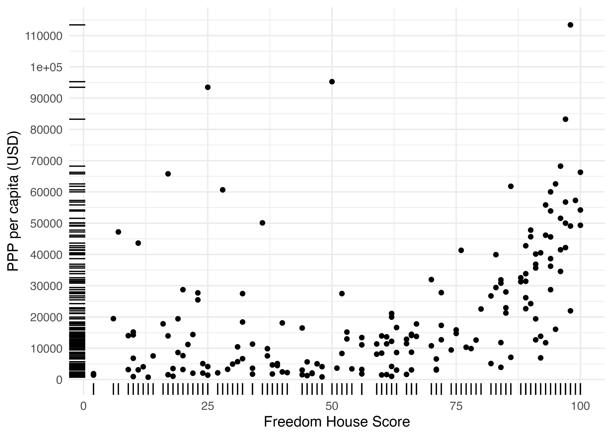

　これで`FH_Total`はほぼ均等に分布していて、`PPP_per_capita`は2万ドル以下に多く密集していることが確認できます。

　{ggExtra}の`ggMarginal()`を使えば、ラグプロットでなく、箱ひげ図やヒストグラムを付けることも可能です。{ggplot2}で作図した図をオブジェクトとして格納し、`ggMarginal()`の第一引数として指定します。第一引数のみだと密度のだけ出力されるため、箱ひげ図を付けるためには`type = "boxplot"`を指定します（既定値は`"density"`）。ヒストグラムを出力する場合は`"histogram"`と指定します。


```{.r .numberLines}
Scatter_Fig1 <- Country_df %>%
    drop_na(FH_Total, PPP_per_capita) %>%
    ggplot() +
    geom_point(aes(x = FH_Total, y = PPP_per_capita)) +
    labs(x = "Freedom House Score", y = "PPP per capita (USD)") +
    scale_y_continuous(breaks = seq(0, 120000, by = 10000),
                       labels = seq(0, 120000, by = 10000)) +
    guides(fill = "none") +
    theme_minimal(base_size = 12)

ggExtra::ggMarginal(Scatter_Fig1, type = "boxplot")
```


---

## リッジプロット {#visual4-ridge}

　リッジプロット（ridge plot）はある変数の分布をグループごとに出力する図です。大陸ごとの人間開発指数の分布を示したり、時系列データなら分布の変化を示す時にも使えます。ここでは大陸ごとの人間開発指数の分布をリッジプロットで示してみましょう。

　リッジプロットを作成する前に、`geom_density()`幾何オブジェクトを用い、変数の密度曲線（density curve）を作ってみます。マッピングは`x`に対し、分布を出力する変数名を指定します。また、密度曲線内部に色塗り（`fill`）をし、曲線を計算する際のバンド幅（`bw`）は0.054にします。`bw`が大きいほど、なめらかな曲線になります。


```{.r .numberLines}
Country_df %>%
  ggplot() +
  geom_density(aes(x = HDI_2018), fill = "gray70", bw = 0.054) +
  labs(x = "2018年人間開発指数", y = "大陸") +
  theme_minimal(base_family = "HiraKakuProN-W3",
                base_size   = 12)
```

```
## Warning: Removed 6 rows containing non-finite values (stat_density).
```


　これを大陸ごとに出力する場合、ファセット分割を行います。今回は大陸ごとに1列（`ncol = 1`）でファセットを分割します。


```{.r .numberLines}
Country_df %>%
  ggplot() +
  geom_density(aes(x = HDI_2018), fill = "gray70", bw = 0.054) +
  labs(x = "2018年人間開発指数", y = "大陸") +
  facet_wrap(~Continent, ncol = 1) +
  theme_minimal(base_family = "HiraKakuProN-W3",
                base_size   = 12)
```

```
## Warning: Removed 6 rows containing non-finite values (stat_density).
```


　それでは上のグラフをリッジプロットとして作図してみましょう。今回は{ggridges}パッケージを使います。


```{.r .numberLines}
pacman::p_load(ggridges)
```

　使用する幾何オブジェクトは`geom_density_ridges()`です。似たような幾何オブジェクトとして`geom_ridgeline()`がありますが、こちらは予め密度曲線の高さを計算しておく必要があります。一方、`geom_density_ridges()`は変数だけ指定すれば密度を自動的に計算してくれます。マッピングは`x`と`y`に対し、それぞれ分布を出力する変数名とグループ変数名を指定します。また、密度曲線が重なるケースもあるため、透明度（`alpha`）も0.5にしておきましょう。ここでは別途指定しませんが、ハンド幅も指定可能であり、`aes()`の外側に`bandwidth`を指定するだけです。


```{.r .numberLines}
Country_df %>%
  ggplot() +
  geom_density_ridges(aes(x = HDI_2018, y = Continent), 
                      alpha = 0.5) +
  labs(x = "2018年人間開発指数", y = "大陸") +
  theme_minimal(base_family = "HiraKakuProN-W3",
                base_size   = 12)
```

```
## Picking joint bandwidth of 0.054
```

```
## Warning: Removed 6 rows containing non-finite values (stat_density_ridges).
```


先ほど作図した図と非常に似た図が出来上がりました。ファセット分割に比べ、空間を最大限に活用していることが分かります。ファセットラベルがなく、グループ名が縦軸上に位置するからです。また、リッジプロットの特徴は密度曲線がオーバラップする点ですが、以下のように`scale = 1`を指定すると、オーバラップなしで作成することも可能です。もし、`scale = 3`にすると最大2つの密度曲線が重なることになります。たとえば最下段のアフリカはアメリカの行と若干オーバラップしていますが、`scale = 3`の場合、アジアの行までオーバーラップされうることになります。


```{.r .numberLines}
Country_df %>%
  ggplot() +
  geom_density_ridges(aes(x = HDI_2018, y = Continent), 
                      scale = 1, alpha = 0.5) +
  labs(x = "2018年人間開発指数", y = "大陸") +
  theme_minimal(base_family = "HiraKakuProN-W3",
                base_size   = 12)
```

```
## Picking joint bandwidth of 0.054
```

```
## Warning: Removed 6 rows containing non-finite values (stat_density_ridges).
```


　また、横軸の値に応じて背景の色をグラデーションで表現することも可能です。この場合、`geom_density_ridges()`幾何オブジェクトでなく、`geom_density_ridges_gradient()`を使い、`fill`にもマッピングをする必要があります。横軸（`x`）の値に応じて色塗りをする場合、`fill = stat(x)`とします。デフォルトでは横軸の値が高いほど空色、低いほど黒になります。ここでは高いほど黄色、低いほど紫ににするため、色弱にも優しい`scale_fill_viridis_c()`を使い[^viridis]、カラーオプションはplasmaにします（`option = "c"`）。

[^viridis]: 最後の`_c`はマッピングする変数（ここでは`HDI_2018`）が連続変数（**c**ontinuous）であることを意味します。


```{.r .numberLines}
Country_df %>%
  ggplot() +
  geom_density_ridges_gradient(aes(x = HDI_2018, y = Continent, fill = stat(x)), 
                               alpha = 0.5) +
  scale_fill_viridis_c(option = "C") +
  labs(x = "2018年人間開発指数", y = "大陸", fill = "2018年人間開発指数") +
  theme_minimal(base_family = "HiraKakuProN-W3",
                base_size   = 12) +
  theme(legend.position = "bottom")
```

```
## Picking joint bandwidth of 0.054
```

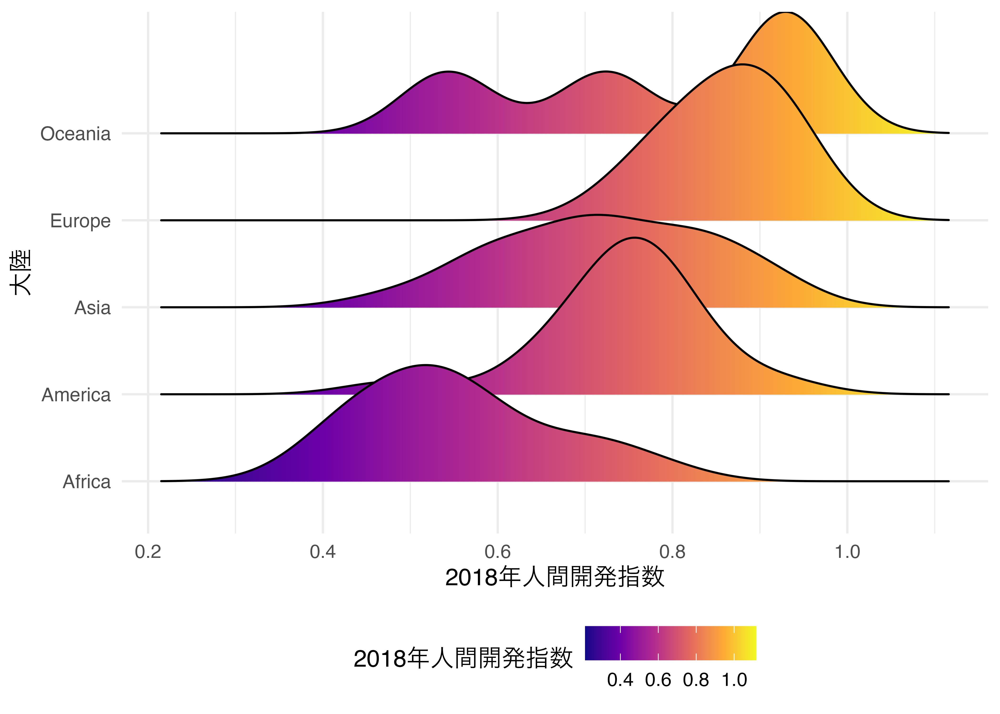

密度曲線は基本的にはなめらかな曲線であるため、データが存在しない箇所にも密度が高く見積もられるケースがあります。全体的な分布を俯瞰するには良いですが、情報の損失は避けられません。そこで出てくるのが点付きのリッジプロットです。`HDI_2018`の個々の値を点で出力するには`jittered_points = TRUE`を指定するだけです。これだけで密度曲線の内側に点が若干のズレ付き（jitter）で出力されます。ただし、密度曲線がオーバーラップされるリッジプロットの特徴を考えると、グループごとに点の色分けをする必要があります（同じ色になると、どのグループの点かが分からなくなるので）。この場合、`point_color`に対し、グループ変数（`Continent`）をマッピングします。また、密度曲線の色と合わせるために密度曲線の色塗りも`fill`で指定します。


```{.r .numberLines}
Country_df %>%
  ggplot() +
  geom_density_ridges(aes(x = HDI_2018, y = Continent, fill = Continent,
                          point_color = Continent), 
                      alpha = 0.5, jittered_points = TRUE) +
  guides(fill = "none", point_color = "none") + # 凡例を削除
  labs(x = "2018年人間開発指数", y = "大陸") +
  theme_minimal(base_family = "HiraKakuProN-W3",
                base_size   = 12)
```

```
## Picking joint bandwidth of 0.054
```

```
## Warning: Removed 6 rows containing non-finite values (stat_density_ridges).
```


　他にも密度曲線の下側にラグプロットを付けることも可能です。こうすれば点ごとに色訳をする必要もなくなります。ラグプロットを付けるためには点の形（`point_shape`）を「|」にする必要があります。ただ、これだけだと「|」が密度曲線内部に散らばる（jittered）だけです。散らばりをなくす、つまり密度曲線の下段に固定する必要があり、これは`aes()`その外側に`position = position_points_jitter(width = 0, height = 0)`を指定することで出来ます。


```{.r .numberLines}
Country_df %>%
  ggplot() +
  geom_density_ridges(aes(x = HDI_2018, y = Continent, fill = Continent), 
                      alpha = 0.5, jittered_points = TRUE,
                      position = position_points_jitter(width = 0, height = 0),
                      point_shape = "|", point_size = 3) +
  guides(fill = "none") +
  labs(x = "2018年人間開発指数", y = "大陸") +
  theme_minimal(base_family = "HiraKakuProN-W3",
                base_size   = 12)
```

```
## Picking joint bandwidth of 0.054
```

```
## Warning: Removed 6 rows containing non-finite values (stat_density_ridges).
```


　最後に密度曲線でなく、ヒストグラムで示す方法を紹介します。これは`geom_density_ridges()`の内部に`stat = "binline"`を指定するだけです。


```{.r .numberLines}
Country_df %>%
  ggplot() +
  geom_density_ridges(aes(x = HDI_2018, y = Continent), alpha = 0.5,
                      stat = "binline") +
  labs(x = "2018年人間開発指数", y = "大陸") +
  theme_minimal(base_family = "HiraKakuProN-W3",
                base_size   = 12)
```

```
## `stat_binline()` using `bins = 30`. Pick better value with `binwidth`.
```

```
## Warning: Removed 6 rows containing non-finite values (stat_binline).
```


---

## エラーバー付き散布図 {#visual4-pointrange}

　エラーバー付きの散布図は推定結果の点推定値とその不確実性（信頼区間など）を示す際によく使われる図です。以下の表は`Country_df`を用い、大陸（オセアニアを除く）ごとにフリーダムハウス・スコア（`FH_Total`）を一人当たりPPP GDP（`PPP_per_capita`）に回帰させた分析から得られたフリーダムハウス・スコア（`FH_Total`）の係数（以下の式の$\beta_1$）の点推定値と95%信頼区間です。

$$
\text{PPP per capita} = \beta_0 + \beta_1 \cdot \text{FH}\_\text{Total} + \varepsilon
$$


```r
Pointrange_df <- tibble(
    Continent = c("Asia", "Europe", "Africa", "America"),
    Coef      = c(65.3, 588.0, 53.4, 316.0),
    Conf_lwr  = c(-250.0, 376.0, -14.5, 128.0),
    Conf_upr  = c(380.0, 801.0, 121.0, 504.0)
)
```


```{.r .numberLines}
Pointrange_df
```

```
## # A tibble: 4 × 4
## # Groups:   Continent [4]
##   Continent  Coef Conf_lwr Conf_upr
##   <chr>     <dbl>    <dbl>    <dbl>
## 1 Asia       65.3   -250.      380.
## 2 Europe    588.     376.      801.
## 3 Africa     53.4    -14.5     121.
## 4 America   316.     128.      504.
```

　実は以上のデータは以下のようなコードで作成されています。{purrr}パッケージの使い方に慣れる必要があるので、第\@ref(iteration)章を参照してください。

```r
Pointrange_df <- Country_df %>%
    filter(Continent != "Oceania") %>%
    group_by(Continent) %>%
    nest() %>%
    mutate(Fit = map(data, ~lm(PPP_per_capita ~ FH_Total, data = .)),
           Est = map(Fit, broom::tidy, conf.int = TRUE)) %>%
    unnest(Est) %>%
    filter(term == "FH_Total") %>%
    select(Continent, Coef = estimate, 
           Conf_lwr = conf.low, Conf_upr = conf.high) 
```

この`Pointrange_df`を用いて横軸は大陸（`Continent`）、縦軸には点推定値（`Coef`）と95%信頼区間（`Conf_lwr`と`Conf_upr`）を出力します。ここで使う幾何オブジェクトは`geom_pointrange()`です。横軸`x`と点推定値`y`、95%信頼区間の下限の`ymin`、上限の`ymax`にマッピングします。エラーバー付き散布図を立てに並べたい場合は`y`と`x`、`xmin`、`xmax`にマッピングします。


```{.r .numberLines}
Pointrange_df %>%
    ggplot() +
    geom_hline(yintercept = 0, linetype = 2) +
    geom_pointrange(aes(x = Continent, y = Coef, 
                        ymin = Conf_lwr, ymax = Conf_upr),
                    size = 0.75) +
    labs(y = expression(paste(beta[1], " with 95% CI"))) +
    theme_bw(base_size = 12)
```

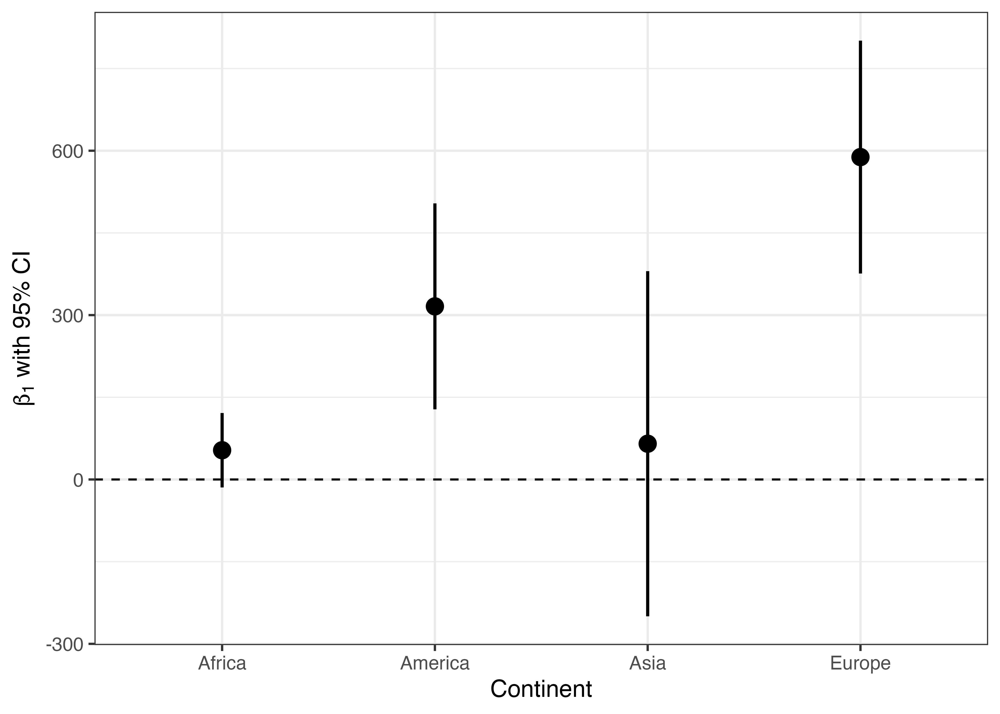

ここでもう一つの次元を追加することもあるでしょう。たとえば、複数のモデルを比較した場合がそうかもしれません。以下の`Pointrange_df2`について考えてみましょう。


```r
Pointrange_df2 <- tibble(
    Continent = rep(c("Asia", "Europe", "Africa", "America"), each = 2),
    Term      = rep(c("Civic Liverty", "Political Right"), 4),
    Coef      = c(207.747, 29.188, 1050.164, 1284.101,
                  110.025, 93.537, 581.4593, 646.9211),
    Conf_lwr  = c(-385.221, -609.771, 692.204, 768.209,
                  -12.648, -53.982, 262.056, 201.511),
    Conf_upr  = c(800.716, 668.147, 1408.125, 1801.994,
                  232.697, 241.057, 900.863, 1092.331))
```


```{.r .numberLines}
Pointrange_df2
```

```
## # A tibble: 8 × 5
## # Groups:   Continent [4]
##   Continent Term              Coef Conf_lwr Conf_upr
##   <chr>     <chr>            <dbl>    <dbl>    <dbl>
## 1 Asia      Civic Liberty    208.    -385.      801.
## 2 Asia      Political Right   29.2   -610.      668.
## 3 Europe    Civic Liberty   1050.     692.     1408.
## 4 Europe    Political Right 1285.     768.     1802.
## 5 Africa    Civic Liberty    110.     -12.6     233.
## 6 Africa    Political Right   93.5    -54.0     241.
## 7 America   Civic Liberty    581.     262.      901.
## 8 America   Political Right  647.     202.     1092.
```

このデータは以下の2つのモデルを大陸ごとに推定した$\beta_1$と$\gamma_1$の点推定値と95%信頼区間です。

$$
\begin{aligned}
\text{PPP per capita} & = \beta_0 + \beta_1 \cdot \text{FH}\_\text{CL} + \varepsilon \\
\text{PPP per capita} & = \gamma_0 + \gamma_1 \cdot \text{FH}\_\text{PR} + \upsilon
\end{aligned}
$$

　どの説明変数を用いたかでエラーバーと点の色分けを行う場合、`color`に対して`Term`をマッピングします。


```{.r .numberLines}
Pointrange_df2 %>%
    ggplot() +
    geom_hline(yintercept = 0, linetype = 2) +
    geom_pointrange(aes(x = Continent, y = Coef, 
                        ymin = Conf_lwr, ymax = Conf_upr,
                        color = Term), size = 0.75) +
    labs(y = expression(paste(beta[1], " and ", gamma[1], " with 95% CI")),
         color = "") +
    theme_bw(base_size = 12) +
    theme(legend.position = "bottom")
```


　何か違いますね。この2つのエラーバーと点の位置をずらす必要があるようです。これは3次元以上の棒グラフで使った`position`引数で調整可能です。今回は実引数として`position_dodge(0.5)`を指定してみましょう。


```{.r .numberLines}
Pointrange_df2 %>%
    ggplot() +
    geom_hline(yintercept = 0, linetype = 2) +
    geom_pointrange(aes(x = Continent, y = Coef, 
                        ymin = Conf_lwr, ymax = Conf_upr,
                        color = Term),
                    size = 0.75, position = position_dodge(0.5)) +
    labs(y = expression(paste(beta[1], " and ", gamma[1], " with 95% CI")),
         color = "") +
    theme_bw(base_size = 12) +
    theme(legend.position = "bottom")
```

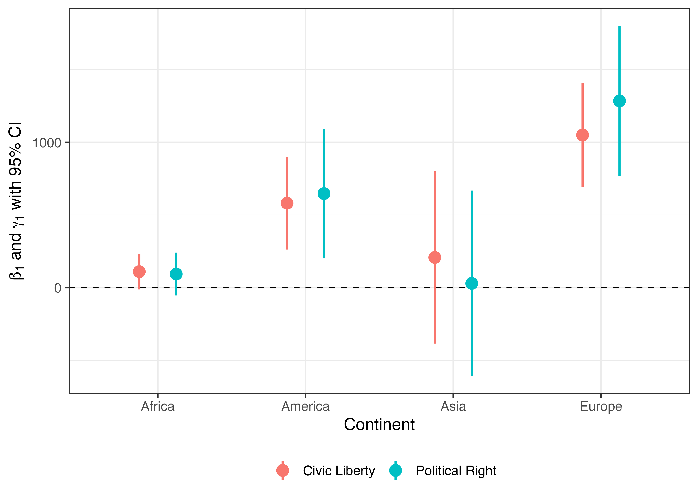

　これで完成です。更に、$\alpha = 0.05$水準で統計的に有意か否かを透明度で示し、透明度の凡例を非表示にしてみましょう。$\alpha = 0.05$水準で統計的に有意か否かは95%信頼区間の上限と下限の積が0より大きいか否かで判定できます。`ggplot()`にデータを渡す前に統計的有意か否かを意味する`Sig`変数を作成し、`geom_pointrage()`の内部では`alpha`に`Sig`をマッピングします。


```{.r .numberLines}
Pointrange_df2 %>%
    mutate(Sig = if_else(Conf_lwr * Conf_upr > 0, 
                         "Significant", "Insignificant")) %>%
    ggplot() +
    geom_hline(yintercept = 0, linetype = 2) +
    geom_pointrange(aes(x = Continent, y = Coef, 
                        ymin = Conf_lwr, ymax = Conf_upr,
                        color = Term, alpha = Sig),
                    size = 0.75, position = position_dodge(0.5)) +
    labs(y = expression(paste(beta[1], " and ", gamma[1], " with 95% CI")),
         color = "") +
    scale_alpha_manual(values = c("Significant" = 1, "Insignificant" = 0.35)) +
    guides(alpha = FALSE) +
    theme_bw(base_size = 12) +
    theme(legend.position = "bottom")
```

```
## Warning: `guides(<scale> = FALSE)` is deprecated. Please use `guides(<scale> =
## "none")` instead.
```

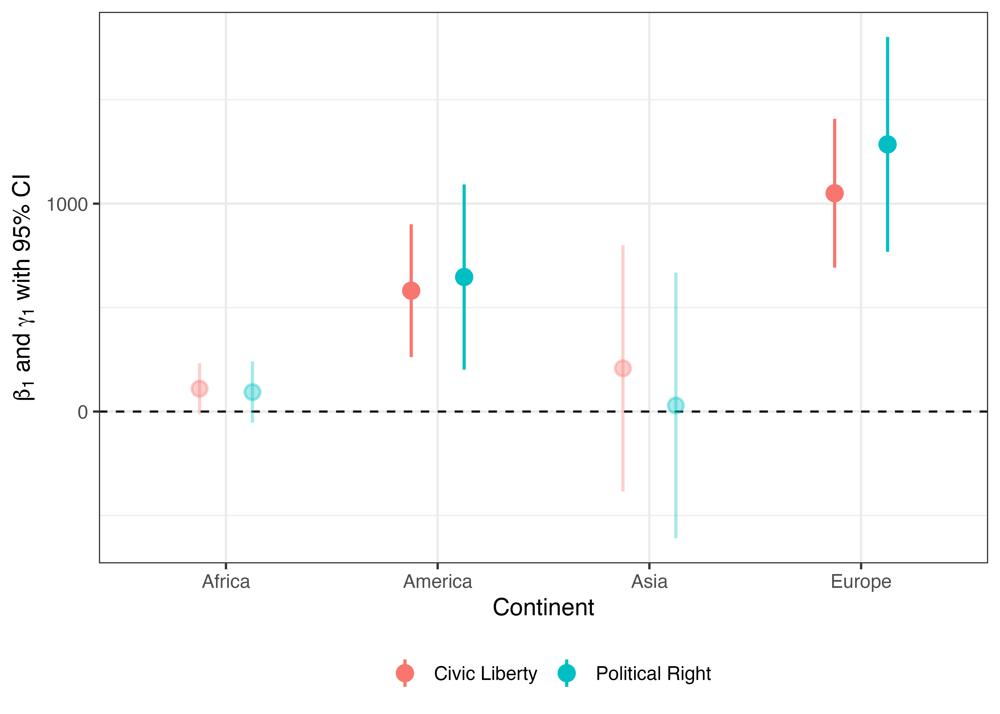

---

## ロリーポップチャート {#visual4-lollipop}

　ロリーポップチャートは棒グラフの特殊な形態であり、棒がロリーポップ（チュッパチャップス）の形をしているものを指します。したがって、2つの図は本質的に同じですが、棒が多い場合はロリーポップチャートを使うケースがあります。棒が非常に多い棒グラフの場合、図を不適切に縮小すると[モアレ](https://ja.wikipedia.org/wiki/%E3%83%A2%E3%82%A2%E3%83%AC)が生じるケースがあるからです。

　まず、`Country_df`を用い、ヨーロッパ諸国の一人当たりPPP GDP（`PPP_per_capita`）の棒グラフを作るとします。`PPP_per_capita`が欠損していないヨーロッパの国は46行であり、非常に棒が多い棒グラフになります。


```{.r .numberLines}
Country_df %>%
  filter(Continent == "Europe") %>%
  drop_na(PPP_per_capita) %>%
  ggplot() +
  geom_bar(aes(y = Country, x = PPP_per_capita), stat = "identity") +
  labs(x = "一人あたり購買力平価GDP", y = "国") +
  theme_bw(base_family = "HiraKakuProN-W3",
           base_size   = 12)
```


ここで登場するのがロリーポップチャートです。ロリーポップチャートの構成要素は棒とキャンディーの部分です。棒は線になるため`geom_segement()`を、キャンディーは散布図`geom_point()`を使います。散布図については既に第\@ref(visualization2)章で説明しましたので、ここでは`geom_segment()`について説明します。

　`geom_segment()`は直線を引く幾何オブジェクトであり、線の起点（`x`と`y`）と終点（`xend`と`yend`）に対してマッピングをする必要があります。横軸上の起点は0、縦軸上の起点は`Country`です。そして横軸上の終点は`PPP_per_capita`、縦軸上のそれは`Country`です。縦軸上の起点と終点が同じということは水平線を引くことになります。

　`geom_segment()`で水平線を描いたら、次は散布図をオーバーラップさせます。点の横軸上の位置は`PPP_per_capita`、縦軸上の位置は`Country`です。


```{.r .numberLines}
Country_df %>%
  filter(Continent == "Europe") %>%
  drop_na(PPP_per_capita) %>%
  ggplot() +
  geom_segment(aes(y = Country, yend = Country,
                   x = 0, xend = PPP_per_capita)) +
  geom_point(aes(y = Country, x = PPP_per_capita), color = "orange") +
  labs(x = "一人あたり購買力平価GDP (USD)", y = "国") +
  theme_bw(base_family = "HiraKakuProN-W3",
           base_size   = 12) +
  theme(panel.grid.major.y = element_blank(),
        panel.border = element_blank(),
        axis.ticks.y = element_blank())
```

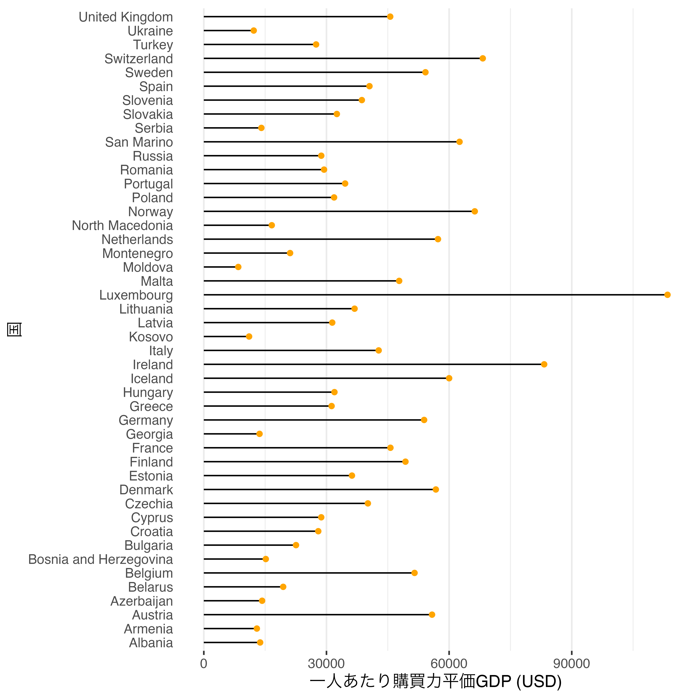

　これで完成です。もし一人当たりPPP GDP順で並べ替えたい場合は`fct_reorder()`を使います。`Country`を`PPP_per_capita`の低い方を先にくるようにするなら、`fct_reorder(Country, PPP_per_capita)`です。縦に並ぶの棒グラフなら最初に来る水準が下に位置されます。もし、順番を逆にしたいなら、更に`fct_rev()`で水準の順番を逆転させます。


```{.r .numberLines}
Country_df %>%
  filter(Continent == "Europe") %>%
  drop_na(PPP_per_capita) %>%
  mutate(Country = fct_reorder(Country, PPP_per_capita)) %>% 
  ggplot() +
  geom_segment(aes(y = Country, yend = Country,
                   x = 0, xend = PPP_per_capita)) +
  geom_point(aes(y = Country, x = PPP_per_capita), color = "orange") +
  labs(x = "一人あたり購買力平価GDP (USD)", y = "国") +
  theme_bw(base_family = "HiraKakuProN-W3",
           base_size   = 12) +
  theme(panel.grid.major.y = element_blank(),
        panel.border = element_blank(),
        axis.ticks.y = element_blank())
```


　ロリーポップロリーポップチャートで次元を追加するには点（キャンディー）の色分けが考えられます。たとえば、OECD加盟国か否かの次元を追加する場合、`geom_point()`において`color`をマッピングするだけです。


```{.r .numberLines}
Country_df %>%
  filter(Continent == "Europe") %>%
  drop_na(PPP_per_capita) %>%
  mutate(Country = fct_reorder(Country, PPP_per_capita),
         OECD    = if_else(OECD == 1, "OECD", "non-OECD"),
         OECD    = factor(OECD, levels = c("OECD", "non-OECD"))) %>% 
  ggplot() +
  geom_segment(aes(y = Country, yend = Country,
                   x = 0, xend = PPP_per_capita)) +
  geom_point(aes(y = Country, x = PPP_per_capita, color = OECD)) +
  scale_color_manual(values = c("OECD" = "orange", "non-OECD" = "royalblue")) +
  labs(x = "一人あたり購買力平価GDP (USD)", y = "国", color = "") +
  theme_bw(base_family = "HiraKakuProN-W3",
           base_size   = 12) +
  theme(panel.grid.major.y = element_blank(),
        panel.border       = element_blank(),
        axis.ticks.y       = element_blank(),
        legend.position    = "bottom")
```


　ファセット分割ももちろんできますが、この場合、OECD加盟国の一人当たりPPP GDPが相対的に高いことを示すなら、一つのファセットにまとめた方が良いでしょう。

　以下のようにロリーポップを横に並べることもできますが、棒の数が多いケースがほとんどであるロリーポップチャートではラベルの回転が必要になるため、読みにくくなるかも知れません。


```{.r .numberLines}
Country_df %>%
  filter(Continent == "Europe") %>%
  drop_na(PPP_per_capita) %>%
  mutate(Country = fct_reorder(Country, PPP_per_capita),
         Country = fct_rev(Country)) %>% 
  ggplot() +
  geom_segment(aes(x = Country, xend = Country,
                   y = 0, yend = PPP_per_capita)) +
  geom_point(aes(x = Country, y = PPP_per_capita), color = "orange") +
  labs(x = "国", y = "一人あたり購買力平価GDP (USD)") +
  theme_bw(base_family = "HiraKakuProN-W3",
           base_size   = 12) +
  theme(panel.grid.major.y = element_blank(),
        panel.border = element_blank(),
        axis.ticks.y = element_blank(),
        axis.text.x = element_text(angle = 90, vjust = 0.5, hjust = 1))
```


---

## 平滑化ライン {#visual4-smooth}

2次元平面上に散布図をプロットし、二変数間の関係を一本の線で要約するのは平滑化ラインです。{ggplot2}では`geom_smooth()`幾何オブジェクトを重ねることで簡単に平滑化ラインをプロットすることができます。まずは、横軸をフリーダムハウス・スコア（`FH_Total`）、縦軸を一人当たり購買力平価GDP（`PPP_per_capita`）にした散布図を出力し、その上に平滑化ラインを追加してみましょう。`geom_smooth()`にもマッピングが必要で、`aes()`の内部に`x`と`y`をマッピングします。今回は`geom_point()`と`geom_smooth()`が同じマッピング情報を共有するため、`ggplot()`内部でマッピングします。


```{.r .numberLines}
Country_df %>%
    ggplot(aes(x = FH_Total, y = PPP_per_capita)) +
    geom_point() +
    geom_smooth()  +
    labs(x = "Freedom House Score", y = "PPP per capita (USD)") +
    scale_y_continuous(breaks = seq(0, 120000, by = 10000),
                       labels = seq(0, 120000, by = 10000)) +
    theme_minimal(base_size = 12)
```

```
## `geom_smooth()` using method = 'loess' and formula 'y ~ x'
```

```
## Warning: Removed 8 rows containing non-finite values (stat_smooth).
```

```
## Warning: Removed 8 rows containing missing values (geom_point).
```

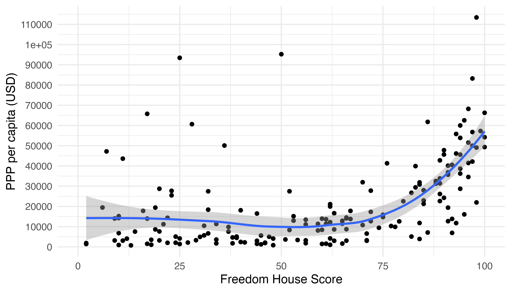

　青い線が平滑化ライン、網掛けの領域が95%信頼区間です。この線はLOESS (**LO**cal **E**stimated **S**catterplot **S**moothing)と呼ばれる非線形平滑化ラインです。どのようなラインを引くかは`method`引数で指定しますが、この`method`既定値が`"loess"`です。これを見るとフリーダムハウス・スコアが75以下の国では国の自由度と所得間の関係があまり見られませんが、75からは正の関係が確認できます。

　LOESS平滑化の場合、`span`引数を使って滑らかさを調整することができます。`span`の既定値は0.75ですが、これが小さいほど散布図によりフィットしたラインが引かれ、よりギザギザな線になります。たとえば、`span`を0.25にすると以下のようなグラフが得られます。


```{.r .numberLines}
Country_df %>%
    ggplot(aes(x = FH_Total, y = PPP_per_capita)) +
    geom_point() +
    geom_smooth(method = "loess", span = 0.25)  +
    labs(x = "Freedom House Score", y = "PPP per capita (USD)") +
    scale_y_continuous(breaks = seq(0, 120000, by = 10000),
                       labels = seq(0, 120000, by = 10000)) +
    theme_minimal(base_size = 12)
```

```
## `geom_smooth()` using formula 'y ~ x'
```

```
## Warning: Removed 8 rows containing non-finite values (stat_smooth).
```

```
## Warning: Removed 8 rows containing missing values (geom_point).
```


　他にも定番の回帰直線を引くこともできます。`method`の実引数を`"lm"`に変えるだけです。


```{.r .numberLines}
Country_df %>%
    ggplot(aes(x = FH_Total, y = PPP_per_capita)) +
    geom_point() +
    geom_smooth(method = "lm")  +
    labs(x = "Freedom House Score", y = "PPP per capita (USD)") +
    scale_y_continuous(breaks = seq(0, 120000, by = 10000),
                       labels = seq(0, 120000, by = 10000)) +
    theme_minimal(base_size = 12)
```

```
## `geom_smooth()` using formula 'y ~ x'
```

```
## Warning: Removed 8 rows containing non-finite values (stat_smooth).
```

```
## Warning: Removed 8 rows containing missing values (geom_point).
```


　信頼区間は既定値だと95%信頼区間が表示されますが、`level`引数で調整することができます。たとえば、99.9%信頼区間を表示したい場合、`level = 0.999`を指定します。


```{.r .numberLines}
Country_df %>%
    ggplot(aes(x = FH_Total, y = PPP_per_capita)) +
    geom_point() +
    geom_smooth(method = "lm", level = 0.999)  +
    labs(x = "Freedom House Score", y = "PPP per capita (USD)") +
    scale_y_continuous(breaks = seq(0, 120000, by = 10000),
                       labels = seq(0, 120000, by = 10000)) +
    theme_minimal(base_size = 12)
```

```
## `geom_smooth()` using formula 'y ~ x'
```

```
## Warning: Removed 8 rows containing non-finite values (stat_smooth).
```

```
## Warning: Removed 8 rows containing missing values (geom_point).
```


　信頼区間を消したい場合は`se = FALSE`を指定します（既定値は`TRUE`）。


```{.r .numberLines}
Country_df %>%
    ggplot(aes(x = FH_Total, y = PPP_per_capita)) +
    geom_point() +
    geom_smooth(method = "lm", se = FALSE)  +
    labs(x = "Freedom House Score", y = "PPP per capita (USD)") +
    scale_y_continuous(breaks = seq(0, 120000, by = 10000),
                       labels = seq(0, 120000, by = 10000)) +
    theme_minimal(base_size = 12)
```

```
## `geom_smooth()` using formula 'y ~ x'
```

```
## Warning: Removed 8 rows containing non-finite values (stat_smooth).
```

```
## Warning: Removed 8 rows containing missing values (geom_point).
```


　最後にデータのサブセットごとに回帰直線を引く方法について説明します。散布図で色分けを行う場合、`aes()`内で`color`引数を指定しますが、これだけで十分です。今回はこれまでの散布図をOECD加盟有無ごとに色分けし、それぞれ別の回帰直線を重ねてみましょう。回帰直線も色分けしたいので`color`引数で次元を増やす必要があり、これは`geom_point()`と共通であるため、`ggplot()`内でマッピングします。


```{.r .numberLines}
Country_df %>%
    mutate(OECD = if_else(OECD == 1, "加盟国", "非加盟国")) %>%
    ggplot(aes(x = FH_Total, y = PPP_per_capita, color = OECD)) +
    geom_point() +
    geom_smooth(method = "lm")  +
    labs(x = "Freedom House Score", y = "PPP per capita (USD)") +
    scale_y_continuous(breaks = seq(0, 120000, by = 10000),
                       labels = seq(0, 120000, by = 10000)) +
    coord_cartesian(ylim = c(0, 120000)) +
    theme_bw(base_family = "HiraKakuProN-W3",
             base_size = 12)
```

```
## `geom_smooth()` using formula 'y ~ x'
```

```
## Warning: Removed 8 rows containing non-finite values (stat_smooth).
```

```
## Warning: Removed 8 rows containing missing values (geom_point).
```

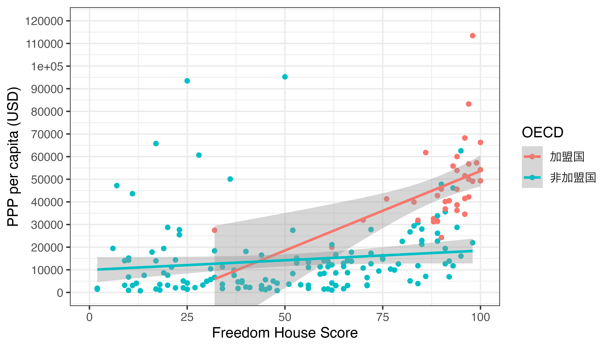

　これを見ると、国の自由度と所得の間に関係が見られるのはOECD加盟国で、非加盟国では非常に関係が弱いことが分かります。

　あまりいい方法ではないと思いますが、散布図は色（`color`）で分け、回帰直線は線の種類（`linetype`）で分けるならどうすれば良いでしょうか。この場合は`color`は`geom_point()`内部で、`linetype`は`geom_smooth()`でマッピングします。


```{.r .numberLines}
Country_df %>%
    mutate(OECD = if_else(OECD == 1, "加盟国", "非加盟国")) %>%
    ggplot(aes(x = FH_Total, y = PPP_per_capita)) +
    geom_point(aes(color = OECD)) +
    geom_smooth(aes(linetype = OECD), method = "lm", color = "black")  +
    labs(x = "Freedom House Score", y = "PPP per capita (USD)") +
    scale_y_continuous(breaks = seq(0, 120000, by = 10000),
                       labels = seq(0, 120000, by = 10000)) +
    coord_cartesian(ylim = c(0, 120000)) +
    theme_bw(base_family = "HiraKakuProN-W3",
             base_size = 12)
```

```
## `geom_smooth()` using formula 'y ~ x'
```

```
## Warning: Removed 8 rows containing non-finite values (stat_smooth).
```

```
## Warning: Removed 8 rows containing missing values (geom_point).
```

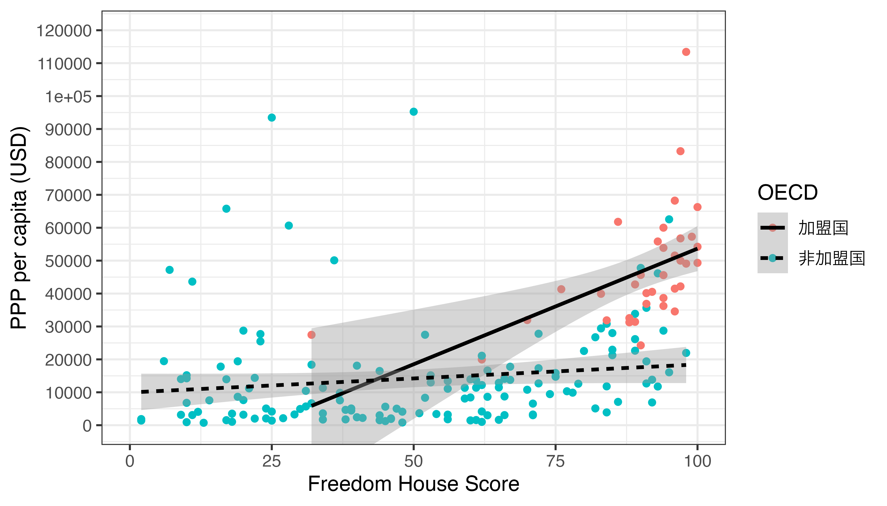

　{ggplot2}が提供する平滑化ラインにはLOESSと回帰直線以外にも`"glm"`や`"gam"`などがります。詳細はRコンソール上で`?geom_smooth`を入力し、ヘルプを参照してください。

---

## ヒートマップ {#visual4-heatmap}

### 2つの離散変数の分布を表すヒートマップ

　ヒートマップ（heat map）には2つの使い方があります。まずは、離散変数$\times$離散変数の同時分布を示す時です。これは後ほど紹介するモザイク・プロットと目的は同じですが、モザイク・プロットはセルの**面積**で密度や度数を表すに対し、ヒートマップは主に**色**で密度や度数を表します。

　ここでは一人当たり購買力平価GDP（`PPP_per_capita`）を「1万ドル未満」、「1万ドル以上・2万ドル未満」、「2万ドル以上、3万ドル未満」、「3万ドル以上」の離散変数に変換し、大陸ごとの国家数をヒートマップとして示してみたいと思います。まずは、変数のリコーディングをし、全てfactor化します。最後に国家名（`Country`）、大陸（`Continent`）、所得（`Income`）、フリーダム・ハウス・スコア（`FH_Total`）、人間開発指数（`HDI_2018`）列のみ抽出し、`Heatmap_df`という名のオブジェクトとして格納しておきます。


```{.r .numberLines}
Heatmap_df <- Country_df %>%
  filter(!is.na(PPP_per_capita)) %>%
  mutate(Continent = recode(Continent,
                            "Africa"  = "アフリカ",
                            "America" = "アメリカ",
                            "Asia"    = "アジア",
                            "Europe"  = "ヨーロッパ",
                            .default  = "オセアニア"),
         Continent = factor(Continent, levels = c("アフリカ", "アメリカ", "アジア", 
                                                  "ヨーロッパ", "オセアニア")),
         Income    = case_when(PPP_per_capita < 10000 ~ "1万ドル未満",
                               PPP_per_capita < 20000 ~ "1万ドル以上\n2万ドル未満",
                               PPP_per_capita < 30000 ~ "2万ドル以上\n3万ドル未満",
                               TRUE                   ~ "3万ドル以上"),
         Income    = factor(Income, levels = c("1万ドル未満", "1万ドル以上\n2万ドル未満",
                                               "2万ドル以上\n3万ドル未満", "3万ドル以上"))) %>%
  select(Country, Continent, Income, FH_Total, HDI_2018)

Heatmap_df
```

```
## # A tibble: 178 × 5
##    Country             Continent  Income                     FH_Total HDI_2018
##    <chr>               <fct>      <fct>                         <dbl>    <dbl>
##  1 Afghanistan         アジア     "1万ドル未満"                    27    0.496
##  2 Albania             ヨーロッパ "1万ドル以上\n2万ドル未満"       67    0.791
##  3 Algeria             アフリカ   "1万ドル以上\n2万ドル未満"       34    0.759
##  4 Angola              アフリカ   "1万ドル未満"                    32    0.574
##  5 Antigua and Barbuda アメリカ   "2万ドル以上\n3万ドル未満"       85    0.776
##  6 Argentina           アメリカ   "2万ドル以上\n3万ドル未満"       85    0.83 
##  7 Armenia             ヨーロッパ "1万ドル以上\n2万ドル未満"       53    0.76 
##  8 Australia           オセアニア "3万ドル以上"                    97    0.938
##  9 Austria             ヨーロッパ "3万ドル以上"                    93    0.914
## 10 Azerbaijan          ヨーロッパ "1万ドル以上\n2万ドル未満"       10    0.754
## # … with 168 more rows
```

　次は`group_by()`と`summarise()`を使って、各カテゴリーに属するケース数を計算し、`N`という名の列として追加します。


```{.r .numberLines}
Heatmap_df1 <- Heatmap_df %>%
  group_by(Continent, Income) %>%
  summarise(N       = n(),
            .groups = "drop")

Heatmap_df1
```

```
## # A tibble: 18 × 3
##    Continent  Income                         N
##    <fct>      <fct>                      <int>
##  1 アフリカ   "1万ドル未満"                 41
##  2 アフリカ   "1万ドル以上\n2万ドル未満"     9
##  3 アフリカ   "2万ドル以上\n3万ドル未満"     2
##  4 アメリカ   "1万ドル未満"                 10
##  5 アメリカ   "1万ドル以上\n2万ドル未満"    14
##  6 アメリカ   "2万ドル以上\n3万ドル未満"     6
##  7 アメリカ   "3万ドル以上"                  5
##  8 アジア     "1万ドル未満"                 17
##  9 アジア     "1万ドル以上\n2万ドル未満"    10
## 10 アジア     "2万ドル以上\n3万ドル未満"     3
## 11 アジア     "3万ドル以上"                 11
## 12 ヨーロッパ "1万ドル未満"                  1
## 13 ヨーロッパ "1万ドル以上\n2万ドル未満"    10
## 14 ヨーロッパ "2万ドル以上\n3万ドル未満"     7
## 15 ヨーロッパ "3万ドル以上"                 28
## 16 オセアニア "1万ドル未満"                  1
## 17 オセアニア "1万ドル以上\n2万ドル未満"     1
## 18 オセアニア "3万ドル以上"                  2
```

　これでデータの準備は終わりました。ヒートマップを作成する幾何オブジェクトは`geom_tile()`です。同時分布を示したい変数を、それぞれ`x`と`y`にマッピングし、密度、または度数を表す変数を`fill`にマッピングします。ここでは横軸を大陸（`Continent`）、縦軸を一人当たり購買力平価GDP（`Income`）とし、`fill`には`N`変数をマッピングします。


```{.r .numberLines}
Heatmap_df1 %>%
  ggplot() +
  geom_tile(aes(x = Continent, y = Income, fill = N)) +
  labs(x = "大陸", y = "一人当たり購買力平価GDP（ドル）", fill = "国家数") +
  theme_bw(base_family = "HiraKakuProN-W3",
           base_size = 12) +
  theme(panel.grid = element_blank()) # グリッドラインを消す
```


　明るいほどカテゴリーに属するケースが多く、暗いほど少ないことを意味します。これを見ると世界で最も多くの割合を占めているのは、一人当たり購買力平価GDPが1万ドル未満のアフリカの国で、次は一人当たり購買力平価GDPが3万ドル以上のヨーロッパの国であることが分かります。欠損している（ケース数が0）セルは白の空白となります。

　色をカスタマイズするには`scale_fill_gradient()`です。これは第\@ref(visualization3)章で紹介しました`scale_color_gradient()`と使い方は同じです。`scale_fill_gradient()`は中間点なし、`scale_fill_gradient2()`は中間点ありの場合に使いますが、ここでは度数が小さい場合は<span style="color:#FFF8DC;font-weight:bold;">cornsilk</span>色を、大きい場合は<span style="color:#cd3333;font-weight:bold;">brown3</span>色を使います。それぞれ`low`と`high`に色を指定するだけです。


```{.r .numberLines}
Heatmap_df1 %>%
  ggplot() +
  geom_tile(aes(x = Continent, y = Income, fill = N)) +
  labs(x = "大陸", y = "一人当たり購買力平価GDP（ドル）", fill = "国家数") +
  scale_fill_gradient(low  = "cornsilk", 
                      high = "brown3") +
  theme_bw(base_family = "HiraKakuProN-W3",
           base_size = 12) +
  theme(panel.grid = element_blank()) # グリッドラインを消す
```


　気のせいかも知れませんが、先ほどよりは読みやすくなったような気がしますね。

### 離散変数$\times$離散変数における連続変数の値を示すヒートマップ

　次は、離散変数$\times$離散変数における連続変数の値を示すヒートマップを作ってみましょう。ヒートマップにおけるそれぞれのタイル（tile）は横軸上の位置と縦軸上の位置情報を持ち、これは前回と同様、離散変数でマッピングされます。そして、タイルの色は何らかの連続変数にマッピングされます。前回作成しましたヒートマップは度数、または密度であり、これも実は連続変数だったので、図の作り方は本質的には同じです。

　ここでは大陸と所得ごとに人間開発指数の平均値を表すヒートマップを作ってみましょう。大陸（`Continent`）と所得（`Income`）でグループ化し、人間開発指数（`HDI_2018`）の平均値を計算したものを`Heatmap_df2`という名のオブジェクトとして格納します。


```{.r .numberLines}
Heatmap_df2 <- Heatmap_df %>%
  group_by(Continent, Income) %>%
  summarise(HDI     = mean(HDI_2018, na.rm = TRUE),
            .groups = "drop")

Heatmap_df2
```

```
## # A tibble: 18 × 3
##    Continent  Income                       HDI
##    <fct>      <fct>                      <dbl>
##  1 アフリカ   "1万ドル未満"              0.510
##  2 アフリカ   "1万ドル以上\n2万ドル未満" 0.697
##  3 アフリカ   "2万ドル以上\n3万ドル未満" 0.798
##  4 アメリカ   "1万ドル未満"              0.638
##  5 アメリカ   "1万ドル以上\n2万ドル未満" 0.752
##  6 アメリカ   "2万ドル以上\n3万ドル未満" 0.806
##  7 アメリカ   "3万ドル以上"              0.841
##  8 アジア     "1万ドル未満"              0.624
##  9 アジア     "1万ドル以上\n2万ドル未満" 0.730
## 10 アジア     "2万ドル以上\n3万ドル未満" 0.818
## 11 アジア     "3万ドル以上"              0.872
## 12 ヨーロッパ "1万ドル未満"              0.711
## 13 ヨーロッパ "1万ドル以上\n2万ドル未満" 0.776
## 14 ヨーロッパ "2万ドル以上\n3万ドル未満" 0.827
## 15 ヨーロッパ "3万ドル以上"              0.902
## 16 オセアニア "1万ドル未満"              0.543
## 17 オセアニア "1万ドル以上\n2万ドル未満" 0.724
## 18 オセアニア "3万ドル以上"              0.930
```

　作図の方法は前回と同じですが、今回はタイルの色塗り（`fill`）を人間開発指数の平均値（`HDI`）でマッピングする必要があります。他の箇所は同じコードでも良いですが、ここでは色塗りの際、中間点を指定してみましょう。たとえば人間開発指数が0.75なら色を<span style="color:#fff8dc;font-weight:bold;background-color:#000000;">cornsilk</span>色とし、これより低いっほど<span style="color:#6495ED;font-weight:bold;">cornflowerblue</span>色に、高いほど<span style="color:#cd3333;font-weight:bold;">brown3</span>色になるように指定します。中間点を持つグラデーション色塗りは`scale_fill_gradient2()`で調整することができます。使い方は`scale_fill_gradient()`とほぼ同じですが、中間点の色（`mid`）と中間点の値（`midpoint`）をさらに指定する必要があります。


```{.r .numberLines}
Heatmap_df2 %>%
  ggplot() +
  geom_tile(aes(x = Continent, y = Income, fill = HDI)) +
  labs(x = "大陸", y = "一人当たり購買力平価GDP（ドル）", 
       fill = "人間開発指数の平均値 (2018)") +
  scale_fill_gradient2(low  = "cornflowerblue", 
                       mid  = "cornsilk",
                       high = "brown3",
                       midpoint = 0.75) +
  theme_bw(base_family = "HiraKakuProN-W3",
           base_size = 12) +
  theme(legend.position = "bottom",
        panel.grid      = element_blank())
```


---

## 等高線図 {#visual4-contour}

連続変数$\times$連続変数の同時分布


```{.r .numberLines}
Country_df %>%
  ggplot(aes(x = FH_Total, y = HDI_2018)) +
  geom_density_2d() +
  labs(x = "フリーダム・ハウス・スコア", y = "人間開発指数 (2018)") +
  theme_minimal(base_family = "HiraKakuProN-W3",
                base_size = 12)
```

```
## Warning: Removed 6 rows containing non-finite values (stat_density2d).
```


```{.r .numberLines}
Country_df %>%
  ggplot(aes(x = FH_Total, y = HDI_2018)) +
  geom_point() +
  geom_density_2d() +
  labs(x = "フリーダム・ハウス・スコア", y = "人間開発指数 (2018)") +
  theme_minimal(base_family = "HiraKakuProN-W3",
                base_size = 12)
```

```
## Warning: Removed 6 rows containing non-finite values (stat_density2d).
```

```
## Warning: Removed 6 rows containing missing values (geom_point).
```


```{.r .numberLines}
Country_df %>%
  ggplot(aes(x = FH_Total, y = HDI_2018)) +
  geom_density_2d_filled() +
  labs(x = "フリーダム・ハウス・スコア", y = "人間開発指数 (2018)",
       fill = "密度") +
  theme_minimal(base_family = "HiraKakuProN-W3",
                base_size = 12)
```

```
## Warning: Removed 6 rows containing non-finite values (stat_density2d_filled).
```


　`geom_density_2d_filled()`オブジェクトの後に`geom_density_2d()`オブジェクトを重ねると、区間の区画線を追加することもできます。


```{.r .numberLines}
Country_df %>%
  ggplot(aes(x = FH_Total, y = HDI_2018)) +
  geom_density_2d_filled() +
  geom_density_2d(color = "black") +
  labs(x = "フリーダム・ハウス・スコア", y = "人間開発指数 (2018)",
       fill = "密度") +
  theme_minimal(base_family = "HiraKakuProN-W3",
                base_size = 12)
```

```
## Warning: Removed 6 rows containing non-finite values (stat_density2d_filled).
```

```
## Warning: Removed 6 rows containing non-finite values (stat_density2d).
```


　色が気に入らない場合、自分で調整することも可能です。`scale_fill_manual()`で各区間ごとの色を指定することもできませんが、あまり効率的ではありません。ここでは`scale_fill_brewer()`関数を使って、[ColorBrewer](https://colorbrewer2.org/)のパレットを使ってみましょう。引数なしでも使えますが、既定値のパレットは区間が9つまで対応します。今回の等高線図は全部で10区間ですので、あまり適切ではありません。ここでは11区間まで対応可能な`"Spectral"`パレットを使いますが、これは`palette`引数で指定できます。


```{.r .numberLines}
Country_df %>%
  ggplot(aes(x = FH_Total, y = HDI_2018)) +
  geom_density_2d_filled() +
  scale_fill_brewer(palette = "Spectral") +
  labs(x = "フリーダム・ハウス・スコア", y = "人間開発指数 (2018)",
       fill = "密度") +
  theme_minimal(base_family = "HiraKakuProN-W3",
                base_size = 12)
```

```
## Warning: Removed 6 rows containing non-finite values (stat_density2d_filled).
```


　`palette`で指定可能なカラーパレットの一覧は{RColorBrewer}の`display.brewer.all()`関数で確認することが出来ます。各パレットが何区間まで対応できるかを見てから自分でパレットを作成することも可能ですが、詳細はネット上の各種記事を参照してください。


```{.r .numberLines}
RColorBrewer::display.brewer.all()
```

<div class="figure" style="text-align: center">

<p class="caption">(\#fig:visual4-contour6){RColorBrewer}が提供するパレート一覧</p>
</div>

---

## 地図 {#visual4-map}

### 世界地図

{ggplot2}で地図をプロットする方法は色々あります。理想としては各国政府が提供する地図データをダウンロードし、それを読み込み・加工してプロットすることでしょうが、ここではパッケージを使ったマッピングについて紹介します。

　今回使用するパッケージは{rnaturalearth}、{rnaturalearthdata}、{rgeos}です。他にも使うパッケージはありますが、世界地図ならとりあえずこれで十分です。


```{.r .numberLines}
pacman::p_load(rnaturalearth, rnaturalearthdata, rgeos)
```

　世界地図を読み込む関数は{rnaturalearth}が提供する`ne_countries()`です。とりあえず指定する引数は`scale`と`retunrclass`です。`scale`は地図の解像度であり、世界地図なら`"small"`で十分です。もう少し拡大される大陸地図なら`"medium"`が、一国だけの地図なら`"large"`が良いかも知れません。`reutrnclass`は`"sf"`と指定します。今回は低解像度の世界地図をsfクラスで読み込んでみましょう。


```{.r .numberLines}
world_map <- ne_countries(scale = "small", returnclass = "sf")

class(world_map)
```

```
## [1] "sf"         "data.frame"
```

　クラスはdata.frameとsfであり、実際、`world_map`を出力してみると、見た目がデータフレームであることが分かります。地図の出力は`geom_sf()`幾何オブジェクトを使用します。とりあえず、やってみましょう。


```{.r .numberLines}
world_map %>% 
  ggplot() +
  geom_sf() +
  theme_void() # 何もないテーマを指定する。ここはお好みで
```


　もし、各国の人口に応じて色塗りをする場合はどうすれば良いでしょうか。実は、今回使用するデータがデータフレーム形式であることを考えると、これまでの{ggplot2}の使い方とあまり変わりません。{rnaturalearth}から読み込んだデータには既に`pop_est`という各国の人口データが含まれて負います。この値に応じて色塗りを行うため、`geom_sf()`内に`fill = pop_est`でマッピングするだけです。

　他にも自分で構築したデータがあるなら、データを結合して使用すれば良いでしょう。これについては後述します。


```{.r .numberLines}
world_map %>% 
  ggplot() +
  geom_sf(aes(fill = pop_est)) +
  # 人口が少ない国はcornflowerblue色に、多い国はbrown3色とする
  scale_fill_gradient(low = "cornflowerblue", high = "brown3") +
  labs(fill = "人口") +
  theme_minimal(base_family = "HiraginoSans-W3") +
  theme_void()
```


　もし、世界でなく一部の地域だけを出力するなら、`coord_sf()`で座標系を調整します。東アジアと東南アジアの一部を出力したいとします。この場合、経度は90度から150度まで、緯度は10度から50度に絞ることになります。経度は`xlim`で、緯度は`ylim`で調整します。


```{.r .numberLines}
world_map %>% 
  ggplot() +
  geom_sf(aes(fill = pop_est)) +
  scale_fill_gradient(low = "cornflowerblue", high = "brown3") +
  labs(fill = "人口") +
  coord_sf(xlim = c(90, 150), ylim = c(10, 50)) +
  theme_minimal(base_family = "HiraKakuProN-W3") +
  theme(legend.position = "bottom")
```

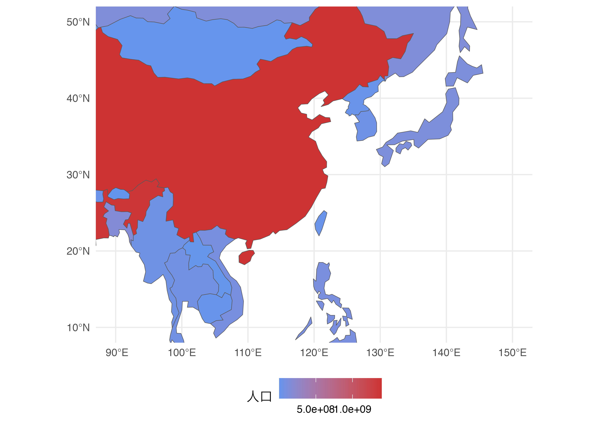

　他にも`ne_countries()`内に`continent`引数を指定し、特定の大陸だけを読み込むことで可能です。ここではアジアの国のみを抽出し、`asia_map`という名のオブジェクトとして格納します。解像度は中程度とします。


```{.r .numberLines}
asia_map <- ne_countries(scale = "medium", continent = "Asia", 
                         returnclass = "sf")

asia_map %>%
    ggplot() +
    # 所得グループで色塗り
    geom_sf(aes(fill = income_grp)) +
    theme_void() +
    labs(fill = "Income Group")
```


　アジアの中から更に東アジアに絞りたい場合は`filter()`を使用し、`subregion`列を基準に抽出することも可能です。


```{.r .numberLines}
asia_map %>%
    filter(subregion == "Eastern Asia") %>%
    ggplot() +
    geom_sf(aes(fill = income_grp)) +
    theme_void() +
    labs(fill = "Income Group")
```


　`subregion`の値は以下のように確認可能です。


```{.r .numberLines}
unique(asia_map$subregion)
```

```
## [1] "Southern Asia"           "Western Asia"           
## [3] "South-Eastern Asia"      "Eastern Asia"           
## [5] "Seven seas (open ocean)" "Central Asia"
```

　これまで使用してきたデータがデータフレームと同じ見た目をしているため、{dplyr}を用いたデータハンドリングも可能です。たとえば、人口を連続変数としてでなく、factor型に変換してからマッピングをしてみましょう。


```{.r .numberLines}
asia_map %>% 
  mutate(Population = case_when(pop_est < 10000000  ~ "1千万未満",
                                pop_est < 50000000  ~ "5千万未満",
                                pop_est < 100000000 ~ "1億未満",
                                pop_est < 500000000 ~ "5億未満",
                                TRUE                ~ "5億以上"),
         Population = factor(Population, 
                             levels = c("1千万未満", "5千万未満", "1億未満",
                                        "5億未満", "5億以上"))) %>%
  ggplot() +
  geom_sf(aes(fill = Population)) +
  scale_fill_brewer(palette = "Blues", drop = FALSE) +
  labs(fill = "人口") +
  theme_void(base_family = "HiraginoSans-W3") +
  theme(legend.position = "bottom")
```


　`scale_fill_brewer()`の`palette`引数は等高線図のときに紹介しましたパレート一覧を参照してください。

### 日本地図（全体）

　次は日本地図の出力についてです。日本全土だけを出力するなら、これまで使いました`ne_countries`に`country`引数を指定するだけで使えます。たとえば、日本の地図だけなら、`country = "Japan"`を指定します。


```{.r .numberLines}
ne_countries(scale = "small", country = "Japan", returnclass = "sf") %>%
    ggplot() +
    geom_sf() +
    theme_void() # 空っぽのテーマ
```

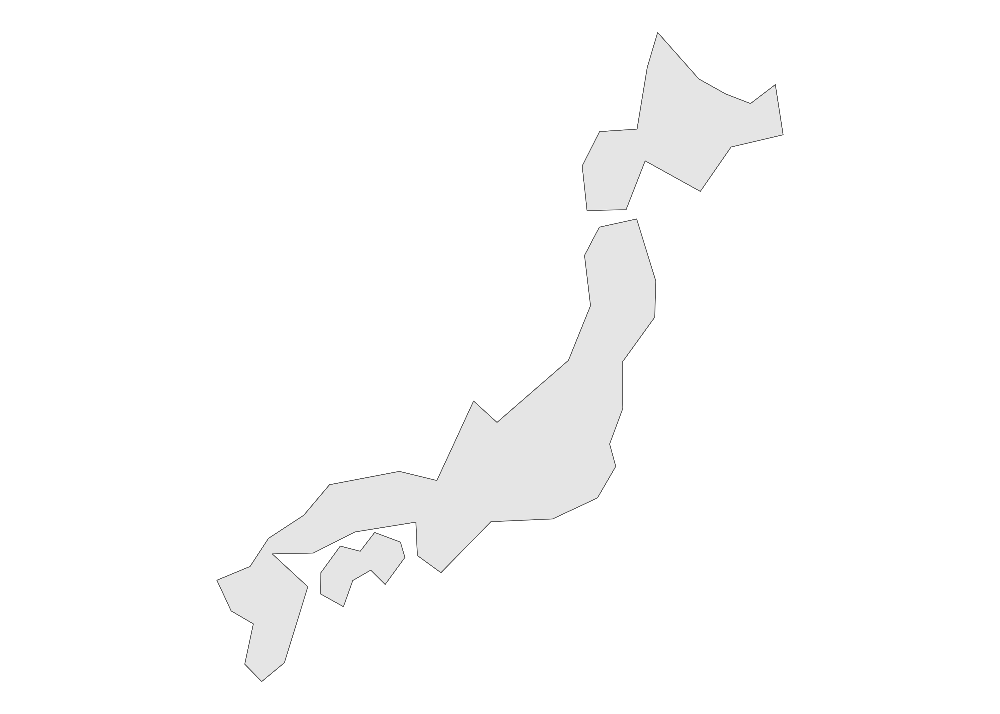

　これだと、物足りない感があるので、もう少し高解像度の地図にしてみましょう。高解像度の地図データを読み込む際は`scale = "large"`を指定します。


```{.r .numberLines}
ne_countries(scale = "large", country = "Japan", returnclass = "sf") %>%
    ggplot() +
    geom_sf() +
    theme_void() # 空っぽのテーマ
```


　ただ、日本地図を出すという場合、多くは都道府県レベルでマッピングが目的でしょう。世界地図のマッピングならこれで問題ありませんが、一国だけなら、その下の自治体の境界線も必要です。したがって、先ほど使用しましたパッケージのより高解像度の地図が含まれている{rnaturalearthhires}をインストールし、読み込みましょう。2022年 3月01日現在、{rnaturalearthhires}はCRANに登録されておらず、GitHubの[ropensciレポジトリー](https://github.com/ropensci)のみで公開されているため、今回は{pacman}の`p_load()`でなく、`p_load_gh()`を使用します。


```{.r .numberLines}
pacman::p_load_gh("ropensci/rnaturalearthhires")
```

　地図データの抽出には`ne_states()`関数を使用します。第一引数として国家名を指定し、地図データのクラスはsfとします。抽出したデータの使い方は世界地図の時と同じです。


```{.r .numberLines}
Japan_Map <- ne_states("Japan", returnclass = "sf")

Japan_Map %>%
  ggplot() +
  geom_sf() +
  theme_void()
```

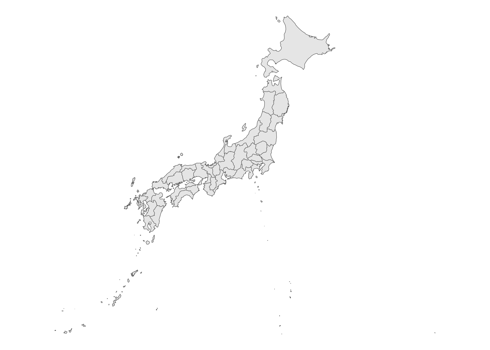

　今回は各都道府県を人口密度ごとに色塗りをしてみましょう。`ne_states()`で読み込んだデータに人口密度のデータはないため、別途のデータと結合する必要があります。筆者が予め作成しておいた[データ](Data/Japan_Density.csv)を読み込み、中身を確認してみます。


```{.r .numberLines}
Japan_Density <- read_csv("Data/Japan_Density.csv")
```

```
## Rows: 47 Columns: 3
## ── Column specification ────────────────────────────────────────────────────────
## Delimiter: ","
## chr (1): Name
## dbl (2): Code, Density
## 
## ℹ Use `spec()` to retrieve the full column specification for this data.
## ℹ Specify the column types or set `show_col_types = FALSE` to quiet this message.
```

```{.r .numberLines}
Japan_Density
```

```
## # A tibble: 47 × 3
##     Code Name   Density
##    <dbl> <chr>    <dbl>
##  1     1 北海道    66.6
##  2     2 青森県   128. 
##  3     3 岩手県    79.2
##  4     4 宮城県   316. 
##  5     5 秋田県    82.4
##  6     6 山形県   115. 
##  7     7 福島県   133  
##  8     8 茨城県   470. 
##  9     9 栃木県   302. 
## 10    10 群馬県   305. 
## # … with 37 more rows
```

　各都道府県の人口密度がついております、左側の`Code`は何でしょうか。これは各都道府県のISOコードであり、このコードをキー変数としてデータを結合することとなります。各都道府県のコードは[国土交通省のホームページ](https://nlftp.mlit.go.jp/ksj/gml/codelist/PrefCd.html)から確認可能です。

　それではデータを結合してみましょう。`ne_states()`で読み込んだデータの場合、地域のコードは`iso_3166_2`という列に格納されています。


```{.r .numberLines}
Japan_Map$iso_3166_2
```

```
##  [1] "JP-46" "JP-44" "JP-40" "JP-41" "JP-42" "JP-43" "JP-45" "JP-36" "JP-37"
## [10] "JP-38" "JP-39" "JP-32" "JP-35" "JP-31" "JP-28" "JP-26" "JP-18" "JP-17"
## [19] "JP-16" "JP-15" "JP-06" "JP-05" "JP-02" "JP-03" "JP-04" "JP-07" "JP-08"
## [28] "JP-12" "JP-13" "JP-14" "JP-22" "JP-23" "JP-24" "JP-30" "JP-27" "JP-33"
## [37] "JP-34" "JP-01" "JP-47" "JP-10" "JP-20" "JP-09" "JP-21" "JP-25" "JP-11"
## [46] "JP-19" "JP-29"
```

　こちらは文字列となっていますね。これを左から4番目の文字から切り取り、数値型に変換します。変換したコードは結合のために`Code`という名の列として追加しましょう。


```{.r .numberLines}
Japan_Map <- Japan_Map %>%
    mutate(Code = str_sub(iso_3166_2, 4),
           Code = as.numeric(Code))

Japan_Map$Code
```

```
##  [1] 46 44 40 41 42 43 45 36 37 38 39 32 35 31 28 26 18 17 16 15  6  5  2  3  4
## [26]  7  8 12 13 14 22 23 24 30 27 33 34  1 47 10 20  9 21 25 11 19 29
```

　続いて、`Japan_Map`と`Japan_Density`を`Code`列をキー変数として結合します。データの中身を確認すると、`Density`列が最後(の直前)の列に追加されたことが分かります。


```{.r .numberLines}
Japan_Map <- left_join(Japan_Map, Japan_Density, by = "Code")

Japan_Map
```

```
## Simple feature collection with 47 features and 86 fields
## Geometry type: MULTIPOLYGON
## Dimension:     XY
## Bounding box:  xmin: 122.9382 ymin: 24.2121 xmax: 153.9856 ymax: 45.52041
## Geodetic CRS:  SOURCECRS
## First 10 features:
##            featurecla scalerank adm1_code diss_me iso_3166_2 wikipedia iso_a2
## 1  Admin-1 scale rank         2  JPN-3501    3501      JP-46      <NA>     JP
## 2  Admin-1 scale rank         6  JPN-1835    1835      JP-44      <NA>     JP
## 3  Admin-1 scale rank         6  JPN-1829    1829      JP-40      <NA>     JP
## 4  Admin-1 scale rank         6  JPN-1827    1827      JP-41      <NA>     JP
## 5  Admin-1 scale rank         2  JPN-3500    3500      JP-42      <NA>     JP
## 6  Admin-1 scale rank         6  JPN-1830    1830      JP-43      <NA>     JP
## 7  Admin-1 scale rank         6  JPN-1831    1831      JP-45      <NA>     JP
## 8  Admin-1 scale rank         6  JPN-1836    1836      JP-36      <NA>     JP
## 9  Admin-1 scale rank         6  JPN-1833    1833      JP-37      <NA>     JP
## 10 Admin-1 scale rank         6  JPN-1832    1832      JP-38      <NA>     JP
##    adm0_sr      name name_alt name_local type    type_en code_local code_hasc
## 1        5 Kagoshima     <NA>       <NA>  Ken Prefecture       <NA>     JP.KS
## 2        1      Oita     <NA>       <NA>  Ken Prefecture       <NA>     JP.OT
## 3        1   Fukuoka  Hukuoka       <NA>  Ken Prefecture       <NA>     JP.FO
## 4        1      Saga     <NA>       <NA>  Ken Prefecture       <NA>     JP.SG
## 5        3  Nagasaki     <NA>       <NA>  Ken Prefecture       <NA>     JP.NS
## 6        1  Kumamoto     <NA>       <NA>  Ken Prefecture       <NA>     JP.KM
## 7        1  Miyazaki     <NA>       <NA>  Ken Prefecture       <NA>     JP.MZ
## 8        1 Tokushima Tokusima       <NA>  Ken Prefecture       <NA>     JP.TS
## 9        1    Kagawa     <NA>       <NA>  Ken Prefecture       <NA>     JP.KG
## 10       4     Ehime     <NA>       <NA>  Ken Prefecture       <NA>     JP.EH
##    note hasc_maybe  region region_cod provnum_ne gadm_level check_me datarank
## 1  <NA>      JP.NR  Kyushu    JPN-KYS          3          1       20        9
## 2  <NA>      JP.ON  Kyushu    JPN-SHK         48          1       20        2
## 3  <NA>      JP.NS  Kyushu    JPN-KYS         46          1       20        2
## 4  <NA>      JP.OS    <NA>       <NA>         47          1       20        2
## 5  <NA>      JP.OY    <NA>       <NA>          5          1       20        9
## 6  <NA>      JP.NI  Kyushu    JPN-KYS          6          1       20        2
## 7  <NA>      JP.OT  Kyushu    JPN-KYS         49          1       20        2
## 8  <NA>      JP.SZ Shikoku    JPN-SHK         45          1       20        2
## 9  <NA>      JP.SH Shikoku    JPN-SHK          4          1       20        2
## 10 <NA>      JP.ST Shikoku    JPN-SHK         14          1       20        2
##    abbrev postal area_sqkm sameascity labelrank name_len mapcolor9 mapcolor13
## 1    <NA>   <NA>         0         NA         2        9         5          4
## 2    <NA>     OT         0          7         7        4         5          4
## 3    <NA>     FO         0          7         7        7         5          4
## 4    <NA>     SG         0         NA         6        4         5          4
## 5    <NA>   <NA>         0         NA         2        8         5          4
## 6    <NA>     KM         0         NA         6        8         5          4
## 7    <NA>     MZ         0         NA         6        8         5          4
## 8    <NA>     TS         0         NA         6        9         5          4
## 9    <NA>     KG         0         NA         6        6         5          4
## 10   <NA>     EH         0         NA         6        5         5          4
##    fips fips_alt   woe_id                       woe_label  woe_name latitude
## 1  JA18     JA28  2345867 Kagoshima Prefecture, JP, Japan Kagoshima  29.4572
## 2  JA30     JA47  2345879      Oita Prefecture, JP, Japan      Oita  33.2006
## 3  JA07     JA27 58646425   Fukuoka Prefecture, JP, Japan   Fukuoka  33.4906
## 4  JA33     JA32  2345882      Saga Prefecture, JP, Japan      Saga  33.0097
## 5  JA27     JA31  2345876  Nagasaki Prefecture, JP, Japan  Nagasaki  32.6745
## 6  JA21     JA29  2345870  Kumamoto Prefecture, JP, Japan  Kumamoto  32.5880
## 7  JA25     JA30  2345874  Miyazaki Prefecture, JP, Japan  Miyazaki  32.0981
## 8  JA39     JA37  2345888 Tokushima Prefecture, JP, Japan Tokushima  33.8546
## 9  JA17     JA35  2345866    Kagawa Prefecture, JP, Japan    Kagawa  34.2162
## 10 JA05     JA34  2345855     Ehime Prefecture, JP, Japan     Ehime  33.8141
##    longitude sov_a3 adm0_a3 adm0_label admin geonunit gu_a3   gn_id
## 1    129.601    JPN     JPN          4 Japan    Japan   JPN 1860825
## 2    131.449    JPN     JPN          4 Japan    Japan   JPN 1854484
## 3    130.616    JPN     JPN          4 Japan    Japan   JPN 1863958
## 4    130.147    JPN     JPN          4 Japan    Japan   JPN 1853299
## 5    128.755    JPN     JPN          4 Japan    Japan   JPN 1856156
## 6    130.834    JPN     JPN          4 Japan    Japan   JPN 1858419
## 7    131.286    JPN     JPN          4 Japan    Japan   JPN 1856710
## 8    134.200    JPN     JPN          4 Japan    Japan   JPN 1850157
## 9    134.001    JPN     JPN          4 Japan    Japan   JPN 1860834
## 10   132.916    JPN     JPN          4 Japan    Japan   JPN 1864226
##          gn_name  gns_id      gns_name gn_level gn_region gn_a1_code region_sub
## 1  Kagoshima-ken -231556 Kagoshima-ken        1      <NA>      JP.18       <NA>
## 2       Oita-ken -240089      Oita-ken        1      <NA>      JP.30       <NA>
## 3    Fukuoka-ken -227382   Fukuoka-ken        1      <NA>      JP.07       <NA>
## 4       Saga-ken -241905      Saga-ken        1      <NA>      JP.33       <NA>
## 5   Nagasaki-ken -237758  Nagasaki-ken        1      <NA>      JP.27       <NA>
## 6   Kumamoto-ken -234759  Kumamoto-ken        1      <NA>      JP.21       <NA>
## 7   Miyazaki-ken -236958  Miyazaki-ken        1      <NA>      JP.25       <NA>
## 8  Tokushima-ken -246216 Tokushima-ken        1      <NA>      JP.39       <NA>
## 9     Kagawa-ken -231546    Kagawa-ken        1      <NA>      JP.17       <NA>
## 10     Ehime-ken -227007     Ehime-ken        1      <NA>      JP.05       <NA>
##    sub_code gns_level gns_lang gns_adm1 gns_region min_label max_label min_zoom
## 1      <NA>         1      jpn     JA18       <NA>         7        11        3
## 2      <NA>         1      jpn     JA30       <NA>         7        11        3
## 3      <NA>         1      jpn     JA07       <NA>         7        11        3
## 4      <NA>         1      jpn     JA33       <NA>         7        11        3
## 5      <NA>         1      jpn     JA27       <NA>         7        11        3
## 6      <NA>         1      jpn     JA21       <NA>         7        11        3
## 7      <NA>         1      jpn     JA25       <NA>         7        11        3
## 8      <NA>         1      jpn     JA39       <NA>         7        11        3
## 9      <NA>         1      jpn     JA17       <NA>         7        11        3
## 10     <NA>         1      jpn     JA05       <NA>         7        11        3
##    wikidataid name_ar name_bn              name_de              name_en
## 1      Q15701    <NA>    <NA> Präfektur Kagoshima Kagoshima Prefecture
## 2     Q133924    <NA>    <NA>      Präfektur Oita      Oita Prefecture
## 3     Q123258    <NA>    <NA>   Präfektur Fukuoka   Fukuoka Prefecture
## 4     Q160420    <NA>    <NA>      Präfektur Saga      Saga Prefecture
## 5     Q169376    <NA>    <NA>  Präfektur Nagasaki  Nagasaki Prefecture
## 6     Q130308    <NA>    <NA>  Präfektur Kumamoto  Kumamoto Prefecture
## 7     Q130300    <NA>    <NA>  Präfektur Miyazaki  Miyazaki Prefecture
## 8     Q160734    <NA>    <NA> Präfektur Tokushima Tokushima Prefecture
## 9     Q161454    <NA>    <NA>    Präfektur Kagawa    Kagawa Prefecture
## 10    Q123376    <NA>    <NA>     Präfektur Ehime     Ehime Prefecture
##                    name_es                  name_fr name_el name_hi
## 1  Prefectura de Kagoshima Préfecture de Kagoshima    <NA>    <NA>
## 2       Prefectura de Oita       Préfecture d'Oita    <NA>    <NA>
## 3    Prefectura de Fukuoka   Préfecture de Fukuoka    <NA>    <NA>
## 4       Prefectura de Saga      Préfecture de Saga    <NA>    <NA>
## 5   Prefectura de Nagasaki  Préfecture de Nagasaki    <NA>    <NA>
## 6   Prefectura de Kumamoto  Préfecture de Kumamoto    <NA>    <NA>
## 7   Prefectura de Miyazaki  Préfecture de Miyazaki    <NA>    <NA>
## 8  Prefectura de Tokushima Préfecture de Tokushima    <NA>    <NA>
## 9     Prefectura de Kagawa    Préfecture de Kagawa    <NA>    <NA>
## 10     Prefectura de Ehime      Préfecture d'Ehime    <NA>    <NA>
##                  name_hu             name_id                 name_it name_ja
## 1   Kagosima prefektúra Prefektur Kagoshima prefettura di Kagoshima    <NA>
## 2      Óita prefektúra      Prefektur Oita      prefettura di Oita    <NA>
## 3    Fukuoka prefektúra   Prefektur Fukuoka   prefettura di Fukuoka    <NA>
## 4      Szaga prefektúra      Prefektur Saga      Prefettura di Saga    <NA>
## 5  Nagaszaki prefektúra  Prefektur Nagasaki  prefettura di Nagasaki    <NA>
## 6   Kumamoto prefektúra  Prefektur Kumamoto  prefettura di Kumamoto    <NA>
## 7   Mijazaki prefektúra  Prefektur Miyazaki  prefettura di Miyazaki    <NA>
## 8   Tokusima prefektúra Prefektur Tokushima prefettura di Tokushima    <NA>
## 9     Kagava prefektúra    Prefektur Kagawa    prefettura di Kagawa    <NA>
## 10     Ehime prefektúra     Prefektur Ehime     prefettura di Ehime    <NA>
##    name_ko   name_nl              name_pl   name_pt name_ru             name_sv
## 1     <NA> Kagoshima Prefektura Kagoshima Kagoshima    <NA> Kagoshima prefektur
## 2     <NA>      Oita      Prefektura Oita      Oita    <NA>      Oita prefektur
## 3     <NA>   Fukuoka   Prefektura Fukuoka   Fukuoka    <NA>   Fukuoka prefektur
## 4     <NA>      Saga      Prefektura Saga      Saga    <NA>      Saga prefektur
## 5     <NA>  Nagasaki  Prefektura Nagasaki  Nagasaki    <NA>  Nagasaki prefektur
## 6     <NA>  Kumamoto  Prefektura Kumamoto  Kumamoto    <NA>  Kumamoto prefektur
## 7     <NA>  Miyazaki  Prefektura Miyazaki  Miyazaki    <NA>  Miyazaki prefektur
## 8     <NA> Tokushima Prefektura Tokushima Tokushima    <NA> Tokushima prefektur
## 9     <NA>    Kagawa    Prefektura Kagawa    Kagawa    <NA>    Kagawa prefektur
## 10    <NA>     Ehime     Prefektura Ehime     Ehime    <NA>     Ehime prefektur
##         name_tr   name_vi name_zh      ne_id Code     Name Density
## 1  Kagosima ili Kagoshima    <NA> 1159315225   46 鹿児島県   172.9
## 2          Oita      Oita    <NA> 1159311905   44   大分県   177.2
## 3       Fukuoka   Fukuoka    <NA> 1159311899   40   福岡県  1029.8
## 4          Saga      Saga    <NA> 1159311895   41   佐賀県   332.5
## 5      Nagasaki  Nagasaki    <NA> 1159315235   42   長崎県   317.7
## 6      Kumamoto  Kumamoto    <NA> 1159311901   43   熊本県   234.6
## 7      Miyazaki  Miyazaki    <NA> 1159311903   45   宮崎県   138.3
## 8     Tokushima Tokushima    <NA> 1159311909   36   徳島県   173.5
## 9        Kagawa    Kagawa    <NA> 1159311907   37   香川県   506.3
## 10        Ehime     Ehime    <NA> 1159311139   38   愛媛県   235.2
##                          geometry
## 1  MULTIPOLYGON (((129.7832 31...
## 2  MULTIPOLYGON (((131.2009 33...
## 3  MULTIPOLYGON (((130.0363 33...
## 4  MULTIPOLYGON (((129.8145 33...
## 5  MULTIPOLYGON (((130.2041 32...
## 6  MULTIPOLYGON (((130.3446 32...
## 7  MULTIPOLYGON (((131.8723 32...
## 8  MULTIPOLYGON (((134.4424 34...
## 9  MULTIPOLYGON (((133.5919 34...
## 10 MULTIPOLYGON (((132.6399 32...
```

　それではマッピングをしてみましょう。人口密度を5つのカテゴリーに順序付きfactor化してから、そのカテゴリーに応じて色塗りをします。


```{.r .numberLines}
Japan_Map %>%
    mutate(Density2 = case_when(Density >= 3000 ~ "3000人以上",
                                Density >= 1000 ~ "1000人以上",
                                Density >=  500 ~ "500人以上",
                                Density >=  100 ~ "100人以上",
                                TRUE            ~ "100人未満"),
           Density2 = factor(Density2, ordered = TRUE,
                             levels = c("3000人以上", "1000人以上", "500人以上",
                                        "100人以上", "100人未満"))) %>%
    ggplot() +
    geom_sf(aes(fill = Density2)) +
    labs(fill = "人口密度 (km^2)") +
    theme_void(base_family = "HiraginoSans-W3")
```

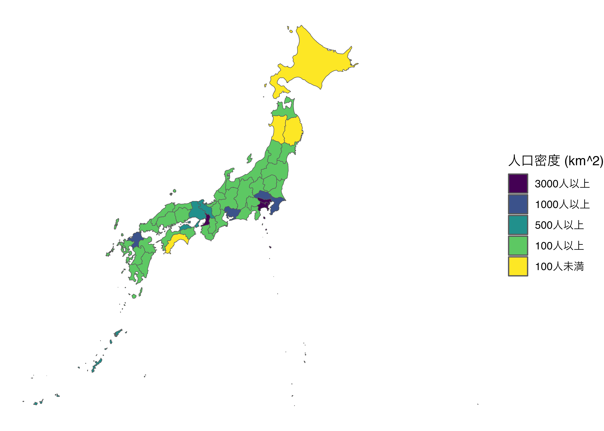

　世界地図でも同じやり方でデータの結合が可能です。この場合はISO3コードかISO2コードがキー変数となります。ISO3コードは`iso_a3`、ISO2コードは`iso_a2`列に格納されています。他に使用可能なキー変数は`iso_n3`であり、こちらは各国を識別する3桁の数字となります。

### 日本地図（特定の都道府県）

　また日本地図のマッピングですが、今回は市区町村レベルまで見てみましょう。`ne_states()`では市区町村までマッピングすることはできませんので、今回は徳島大学の[瓜生真也](https://twitter.com/u_ribo)先生が公開しました{jpndistrict}を使います。


```{.r .numberLines}
pacman::p_load_gh("uribo/jpndistrict")
```

　今回は大阪府の地図を出力してみましょう。特定の都道府県の地図を読み込むためには`jpn_pref()`関数を使用します。都道府県は`pref_code`または`admin_name`で指定します。大阪のコードは27であるため、`pref_code = 27`でも良いですし、`admin_name = "大阪府"`でも同じです。


```{.r .numberLines}
# Osaka_map <- jpn_pref(admin_name = "大阪府") でも同じ
Osaka_map <- jpn_pref(pref_code = 27)

class(Osaka_map)
```

```
## [1] "sf"         "tbl_df"     "tbl"        "data.frame"
```

　プロットの方法は同じです。


```{.r .numberLines}
Osaka_map %>%
  ggplot() +
  geom_sf() +
  theme_minimal()
```


　ここでもデータの結合&マッピングが可能です。大阪府内自治体の人口と学生数が格納された[データ](data/Osaka_Student.csv)を読み込んでみましょう。こちらは2015年国勢調査の結果から取得したデータです。


```{.r .numberLines}
Osaka_Student <- read_csv("data/Osaka_Student.csv")
```

```
## Rows: 75 Columns: 4
## ── Column specification ────────────────────────────────────────────────────────
## Delimiter: ","
## chr (1): Name
## dbl (3): Code, Pop, Student
## 
## ℹ Use `spec()` to retrieve the full column specification for this data.
## ℹ Specify the column types or set `show_col_types = FALSE` to quiet this message.
```

```{.r .numberLines}
Osaka_Student
```

```
## # A tibble: 75 × 4
##     Code Name                Pop Student
##    <dbl> <chr>             <dbl>   <dbl>
##  1 27000 大阪府          8839469  438901
##  2 27100 大阪市          2691185  104208
##  3 27102 大阪市 都島区    104727    3889
##  4 27103 大阪市 福島区     72484    2448
##  5 27104 大阪市 此花区     66656    2478
##  6 27106 大阪市 西区       92430    2633
##  7 27107 大阪市 港区       82035    3072
##  8 27108 大阪市 大正区     65141    2627
##  9 27109 大阪市 天王寺区   75729    3480
## 10 27111 大阪市 浪速区     69766    1409
## # … with 65 more rows
```

　各市区町村にもコードが指定されており、`Osaka_Student`では`Code`列、`Osaka_map`では`citi_code`列となります。`Osaka_map`の`city_code`は文字列であるため、こちらを数値型に変換し`Code`という名の列として追加しておきましょう。続いて、`Code`列をキー変数とし、2つのデータセットを結合します。


```{.r .numberLines}
Osaka_map <- Osaka_map %>%
    mutate(Code = as.numeric(city_code))

Osaka_map <- left_join(Osaka_map, Osaka_Student, by = "Code")
```

　最後にマッピングです。ここでは人口1万人当たり学生数を`Student_Ratio`という列として追加し、こちらの値に合わせて色塗りをしてみましょう。`scale_fill_gradient()`を使用し、人口1万人当たり学生数が少ないほど白、多いほど黒塗りします。


```{.r .numberLines}
Osaka_map %>%
  mutate(Student_Ratio = Student / Pop * 10000) %>%
  ggplot() +
  geom_sf(aes(fill = Student_Ratio)) +
  scale_fill_gradient(low = "white", high = "black") +
  labs(fill = "1万人当たり学生数 (人)") +
  theme_minimal(base_family = "HiraginoSans-W3") +
  theme(legend.position = "bottom")
```

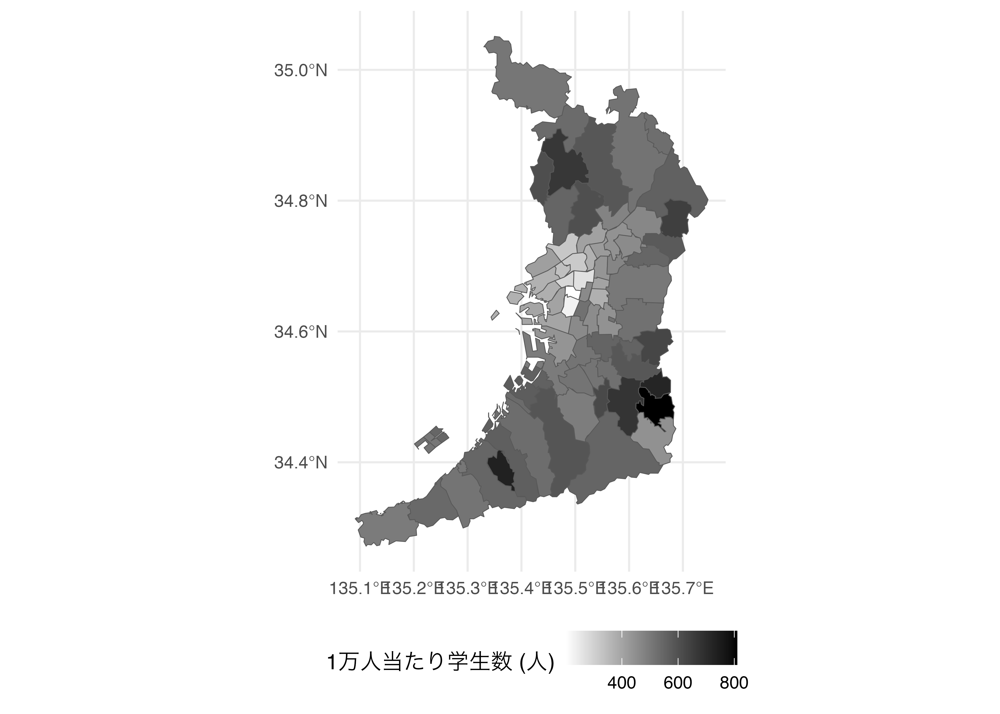

---

## 非巡回有向グラフ {#visual4-dag}

　近年、因果推論の界隈でよく登場する非巡回有向グラフ（DAG）ですが、「グラフ」からも分かるように、DAGの考え方に基づく因果推論の研究には多くの図が登場します。DAGを作図するには{ggplot2}のみでも可能ですが、{dagitty}パッケージでDAGの情報を含むオブジェクトを生成し、{ggdag}で作図した方が簡単です。以下の図はDAGの一例です。

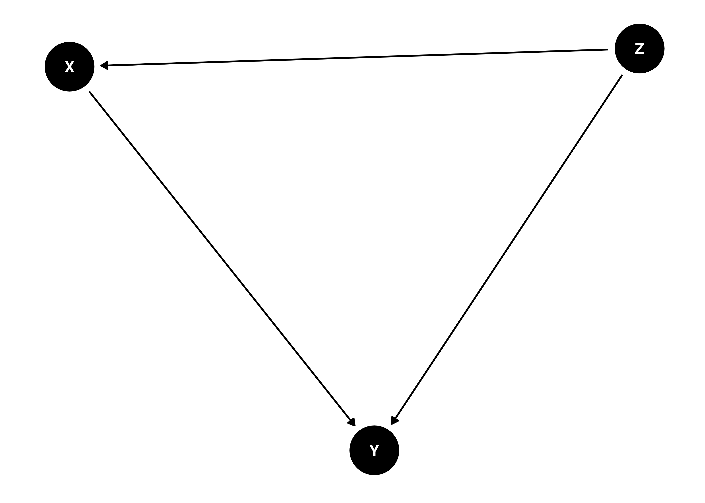

　ここでX、Y、Zはノード（node）と呼ばれ、それぞれのノードをつなぐ線のことをエッジ（edge）と呼びます。また、これらのエッジには方向があります（有向）。簡単に言うと原因と結果といった関係ですが、DAGを描く際は、各ノード間の関係を記述する必要があります。

　それではまず、以上の図を作ってみましょう。最初のステップとして{dagitty}と{ggdag}をインストールし、読み込みましょう。


```{.r .numberLines}
pacman::p_load(dagitty, ggdag)
```

　つづいて、DAGの情報を含むオブジェクトを作成します。使用する関数は`dagify()`であり、ここには`結果 ~ 原因`の形で各ノード間の関係を記述します。先ほどの図では`X`は`Y`の原因（`X ~ Y`）、`Z`は`X`と`Y`の原因（`X ~ Z`と`Y ~ Z`）です。これらの情報を`dagify()`内で指定します。


```{.r .numberLines}
DAG_data1 <- dagify(X ~ Z,
                    Y ~ Z,
                    Y ~ X,
                    exposure = "X",
                    outcome  = "Y")

DAG_data1
```

```
## dag {
## X [exposure]
## Y [outcome]
## Z
## X -> Y
## Z -> X
## Z -> Y
## }
```

　`Y ~ X`と`Y ~ Z`は`Y ~ X + Z`とまとめることも可能です。これは「`Y`の原因は`X`と`Z`である」という意味であり、「`Y`の原因は`X`であり、`Y`の原因は`Z`である」と同じ意味です。また、DAGを作図する際、`dagify()`内に`exposure`と`outcome`は不要ですが、もし`adjustmentSets()`関数などを使って統制変数を特定したい場合は処置変数（`exposure`）と応答変数（`outcome`）にそれぞれ変数名を指定します。ちなみに、以上のコードは以下のように書くことも可能です。


```{.r .numberLines}
DAG_data1 <- dagitty(
  "dag{
  X -> Y
  X <- Z -> Y
  X [exposure]
  Y [outcome]
  }")

DAG_data1
```

```
## dag {
## X [exposure]
## Y [outcome]
## Z
## X -> Y
## Z -> X
## Z -> Y
## }
```

　格納された`DAG_data1`オブジェクトのクラスは`"dagitty"`です。`"dagitty"`の可視化には{ggdag}の`ggdag()`を使用します。


```{.r .numberLines}
DAG_data1 %>%
  ggdag()
```


　DAGにおいて背景、軸の目盛り、ラベルは不要ですので、`theme_dag_blank()`テーマを指定して全て除去します。


```{.r .numberLines}
DAG_data1 %>%
  ggdag() +
  theme_dag_blank()
```


### ノードの位置を指定する

　読者の多くは以上のグラフと異なるものが得られたかも知れません。ノード間の関係は同じはずですが、ノードの位置が異なるでしょう。また、同じコードを実行する度にノードの位置は変わります。以下ではノードの位置を固定する方法について紹介します。位置を指定するには`dagify()`内で`coords`引数に各ノードの情報が格納されたリスト型オブジェクトを指定する必要があります。リストの長さは2であり、それぞれの名前は`x`と`y`です。そしてリストの各要素にはベクトルが入ります。たとえば、ノード`X`の位置を (1, 1)、`Y`の位置を (3, 1)、`Z`の位置を (2, 2)に指定してみましょう。`dagify()`内で直接リストを書くことも可能ですが、コードの可読性が落ちるため、別途のオブジェクト（`DAG_Pos2`）として格納しておきます。


```{.r .numberLines}
DAG_Pos2  <- list(x = c(X = 1, Y = 3, Z = 2),
                  y = c(X = 1, Y = 1, Z = 2))
```

　続いて、`dagify()`内で`coords`引数を追加し、ノードの位置情報が格納されている`DAG_Pos2`を指定します。


```{.r .numberLines}
DAG_data2 <- dagify(X ~ Z,
                    Y ~ X + Z,
                    exposure = "X",
                    outcome  = "Y",
                    coords   = DAG_Pos2)

DAG_data2
```

```
## dag {
## X [exposure,pos="1.000,1.000"]
## Y [outcome,pos="3.000,1.000"]
## Z [pos="2.000,2.000"]
## X -> Y
## Z -> X
## Z -> Y
## }
```

　可視化の方法は同じです。


```{.r .numberLines}
DAG_data2 %>%
  ggdag() +
  theme_dag_blank()
```


　以上の使い方だけでも、ほとんどのDAGは描けるでしょう。また、ノードを若干オシャレ（?）にするには、`ggdag()`内で`stylized = TRUE`を指定します。


```{.r .numberLines}
DAG_Pos3  <- list(x = c(X1 = 3, X2 = 3, X3 = 1, T = 2, Y = 4),
                  y = c(X1 = 1, X2 = 2, X3 = 2, T = 3, Y = 3))

DAG_data3 <- dagify(Y  ~ T + X1 + X2,
                    T  ~ X3,
                    X2 ~ T +X1 + X3,
                    exposure = "T",
                    outcome  = "Y",
                    coords   = DAG_Pos3)

DAG_data3 %>%
  ggdag(stylized = TRUE) +
  theme_dag_blank()
```


　可視化の話ではありませんが、`adjustmentSets()`関数を用いると、処置変数`T`の総効果（total effect）を推定するためにはどの変数を統制（調整）する必要があるかを調べることも可能です。


```{.r .numberLines}
adjustmentSets(DAG_data3, effect = "total")
```

```
## { X3 }
```

　`X3`変数のみ統制すれば良いという結果が得られました。また、`T`から`Y`への直接効果（direct effect）の場合、`effect = "direct"`を指定します。


```{.r .numberLines}
adjustmentSets(DAG_data3, effect = "direct")
```

```
## { X1, X2 }
```

　`X1`と`X2`を統制する必要があることが分かりますね。

---

## バンプチャート {#visual4-bump}

　バンプチャート (bump chart)は順位の変化などを示す時に有効なグラフです。たとえば、G7構成国の新型コロナ感染者数の順位の変化を示すにはどうすれば良いでしょうか。そもそもどのような形式のデータが必要でしょうか。まずは必要なデータ形式を紹介したいと思います。

　まず、{ggplot2}によるバンプチャートの作成を支援する{ggbump}パッケージをインストールし、読み込みましょう[^bump1]。

[^bump1]: これから登場する`geom_bump()`幾何オブジェクトが使えるようになります。{ggbump}を使用せず、{ggplot2}が提供する`geom_line()`でも代替可能です。`geom_line()`の場合、直線で順位の変化が表示され、`geom_bump()`の場合は曲線で表示されます。丸い感じの図を好まない方なら、{ggbump}を読み込まず、`geom_bump()`を`geom_line()`に書き換えてください。


```{.r .numberLines}
pacman::p_load(ggbump)
```

　ここではG7構成国の100万人当り新型コロナ感染者数の順位がどのように変化したのかを2020年4月から7月まで1ヶ月単位で表したデータが必要です。データは以下のようなコードで作成しますが、[本書のサポートページ](https://github.com/JaehyunSong/RBook)からもダウンロード可能です。


```{.r .numberLines}
Bump_df <- left_join(COVID19_df, Country_df, by = "Country") %>%
  select(Country, Date, Population, Confirmed_Total, G7) %>%
  separate(Date, into = c("Year", "Month", "Day"), sep = "/") %>%
  mutate(Month = as.numeric(Month)) %>%
  filter(Month >= 4, G7 == 1) %>%
  group_by(Country, Month) %>%
  summarise(Population            = mean(Population),
            New_Cases             = sum(Confirmed_Total, na.rm = TRUE),
            New_Cases_per_million = New_Cases / Population * 1000000,
            .groups               = "drop") %>%
  select(Country, Month, New_Cases_per_million)
```


```{.r .numberLines}
Bump_df <- Bump_df %>%
  group_by(Month) %>%
  mutate(Rank = rank(New_Cases_per_million, ties.method = "random")) %>%
  ungroup() %>%
  select(Country, Month, Rank, New_Cases_per_million)
```

　必要なデータは以下のような形式です。ちなみにバンプチャートを作成するためには最後の`New_Cases_per_million`列 (100万人当り新型コロナ感染者数)は不要です。つまり、国名、月、順位のみで十分です。

```r
# 以上のコードを省略し、加工済みのデータを読み込んでもOK
# Bump_df <- read_csv("Data/Bumpchart.csv")
Bump_df
```


```{=html}
<div id="htmlwidget-928ccb57396ac5e93d96" style="width:100%;height:auto;" class="datatables html-widget"></div>
<script type="application/json" data-for="htmlwidget-928ccb57396ac5e93d96">{"x":{"filter":"none","vertical":false,"data":[["1","2","3","4","5","6","7","8","9","10","11","12","13","14","15","16","17","18","19","20","21","22","23","24","25","26","27","28"],["Canada","Canada","Canada","Canada","France","France","France","France","Germany","Germany","Germany","Germany","Italy","Italy","Italy","Italy","Japan","Japan","Japan","Japan","United Kingdom","United Kingdom","United Kingdom","United Kingdom","United States","United States","United States","United States"],[4,5,6,7,4,5,6,7,4,5,6,7,4,5,6,7,4,5,6,7,4,5,6,7,4,5,6,7],[2,2,3,3,5,4,4,4,3,3,2,2,7,6,5,5,1,1,1,1,4,5,6,6,6,7,7,7],[24637.9154724449,62787.0894703042,79922.1210320958,28516.76139099,54618.9011745094,81421.0565109242,85834.8084016522,30116.9264854476,47060.6288732512,64783.4760508165,67683.1605750897,23598.8299524031,81514.6403285935,114367.419204309,117681.394538101,39973.3378876119,2257.49517137422,4100.01984479942,4324.67034320323,1622.05677149679,48576.4676505625,102407.379263796,119872.185871719,41919.1582848447,58486.8693972508,135824.160741713,194232.174864135,87484.5641143518]],"container":"<table class=\"display\">\n  <thead>\n    <tr>\n      <th> <\/th>\n      <th>Country<\/th>\n      <th>Month<\/th>\n      <th>Rank<\/th>\n      <th>New_Cases_per_million<\/th>\n    <\/tr>\n  <\/thead>\n<\/table>","options":{"columnDefs":[{"className":"dt-right","targets":[2,3,4]},{"orderable":false,"targets":0}],"order":[],"autoWidth":false,"orderClasses":false}},"evals":[],"jsHooks":[]}</script>
```

　それでは{ggbump}が提供する`geom_bump()`幾何オブジェクトを使用し、簡単なバンプチャートを作成してみましょう。必要なマッピング要素は`x`と`y`、`color`です。`x`には時間を表す変数である`Month`を、`y`には順位を表す`Rank`をマッピングします。また、7本の線が出るため、月と順位、それぞれの値がどの国の値かを特定する必要があります。`groups`に国名である`Country`をマッピングしても線は引けますが、どの線がどの国かが分からなくなるため、`color`に`Country`をマッピングし、線の色分けをします。


```{.r .numberLines}
Bump_df %>%
  ggplot(aes(x = Month, y = Rank, color = Country)) +
  geom_bump()
```


　これで最低限のバンプチャートはできましたが、もう少し見やすく、可愛くしてみましょう。今は線が細いのでややぶ厚めにします。これは`geom_bump()`レイヤーの`size`引数で指定可能です。また、各月に点を付けることによって、同時期における順位の比較をよりしやすくしてみましょう。これは散布図と同じであるため、`geom_point()`幾何オブジェクトを使用します。


```{.r .numberLines}
Bump_df %>%
  ggplot(aes(x = Month, y = Rank, color = Country)) +
  geom_point(size = 7) +
  geom_bump(size = 2) +
  theme_minimal(base_size = 14)
```


　これでだいぶ見やすくなりましたが、凡例における国名の順番がやや気になりますね。7月の時点において順位が最も高い国はアメリカ、最も低い国は日本ですが、凡例の順番はアルファベット順となっています。この凡例の順番を7月時点における`Rank`の値に合わせた方がより見やすいでしょう。ここで第\@ref(factor-forcat-reorder2)で紹介しました`fct_reorder2()`を使って`Country`変数の水準 (level)を7月時点における`Rank`の順位に合わせます。この場合、`Country`変数 (`.f = Country`)の水準を`Month`が (`.x = Month`)最も大きい (`.fun = last2`)時点における`Rank`の順番に合わせる (`.y = Rank`)こととなります。`fct_reorder2()`内の引数の順番の既定値は`.f`、`.x`、`.y`、`.fun`となります。


```{.r .numberLines}
Bump_df %>%
  mutate(Country = fct_reorder2(Country, Month, Rank, last2)) %>%
  ggplot(aes(x = Month, y = Rank, color = Country)) +
  geom_point(size = 7) +
  geom_bump(size = 2) +
  theme_minimal(base_size = 14)
```


　最後に縦軸の目盛りラベルを付けます。上に行くほど順位が高くなりますので、1を7に、2を6に、...、7を1に変更します。また、図内のグリッドも不要ですので、`theme()`を使用し、グリッドを削除します (`panel.grid = element_blank()`)。


```{.r .numberLines}
Bump_df %>%
  mutate(Country = fct_reorder2(Country, Month, Rank, last2)) %>%
  ggplot(aes(x = Month, y = Rank, color = Country)) +
  geom_point(size = 7) +
  geom_bump(size = 2) +
  scale_y_continuous(breaks = 1:7, labels = 7:1) +
  theme_minimal(base_size = 14) +
  theme(panel.grid = element_blank())
```


　これでバンプチャートの完成です。このままでの良いかも知れませんが、もう少し手間を掛けることでより読みやすいグラフが作れます。たとえば、今のままだと「日本のトレンド」を確認したい場合、まず凡例から日本の色を確認し、その色に該当する点と線を見つけてトレンドを見る必要がありますね。もし、ここで図の左端と右端の点の横に国名を出力すると、凡例がなくても良いですし、4月の時点から日本のトレンドを確認することも、7月の時点から遡る形で日本のトレンドを確認することも可能かも知れません。

　図に文字列を追加するためには`geom_text()`幾何オブジェクトを使用します。マッピング要素は文字列の横軸上の位置 (`x`)、縦軸上の位置 (`y`)、そして出力する文字列 (`label`)です。左端に文字列を出力するのであれば、横軸上の位置は4 (= 4月)よりも若干左側が良いでしょう。ぴったり4になると、点と文字列が重なって読みにくくなりますね。縦軸上の位置は**4月の時点**での順位 (`Rank`)で、出力する文字列は国名 (`Country`)です。現在、使用しているデータは4月から7月までのデータですが、4月に限定したデータを使いたいので、`geom_text()`内に`data`引数を追加し、`Bump_df`から`Month`の値が4の行のみを抽出したデータを割り当てます (`data = filter(Bump_df, Month == 4`)、または`data = Bump_df %>% filter(Month == 4)`)。右端についても同じです。横軸上の位置は7から右方向へずらし、使用するデータは7月のデータとなります。

　最後にもう一点調整が必要ですが、それは座標系です。図の座標系は`ggplot()`関数で使用するデータに基づきます。`Bump_df`の場合、横軸 (`Month`)は4から7です。しかし、文字列を追加した場合、文字列がすべて出力されないかも知れません。したがって、座標系を横方向に広める必要があります。今回は3から8までに調整します。座標系や文字列の位置調整は出力結果を見ながら、少しずつ調整していきましょう。


```{.r .numberLines}
Bump_df %>%
  ggplot(aes(x = Month, y = Rank, color = Country)) +
  geom_point(size = 7) +
  geom_bump(size = 2) +
  # 4月の時点での行のみ抽出し、xはMonthより0.15分左方向、
  # yはRankの値の位置に国名を出力する。揃える方向は右揃え (hjust = 1)
  geom_text(data = filter(Bump_df, Month == 4),
            aes(x = Month - 0.15, y = Rank, label = Country), hjust = 1) +
  # 7月の時点での行のみ抽出し、xはMonthより0.15分右方向、
  # yはRankの値の位置に国名を出力する。揃える方向は左揃え (hjust = 0)
  geom_text(data = filter(Bump_df, Month == 7),
            aes(x = Month + 0.15, y = Rank, label = Country), hjust = 0) +
  # 座標系の調整
  coord_cartesian(xlim = c(3, 8)) +
  scale_x_continuous(breaks = 4:7, labels = 4:7) +
  scale_y_continuous(breaks = 1:7, labels = 7:1) +
  labs(y = "Rank", x = "Month") +
  theme_minimal(base_size = 14) +
  theme(legend.position = "none",
        panel.grid      = element_blank())
```


---

## 沖積図 {#visual4-alluvial}

　沖積図 (alluvial plot)は同じ対象を複数回観察したデータ（パネル・データなど）から変化を示すことに適したグラフです。たとえば、同じ回答者を対象に2回世論調査を実施し、1回目調査時の支持政党と2回目調査時の支持政党を変化を見ることも可能です。もし、変化が大きい場合は政党支持態度は弱いこととなりますし、変化が小さい場合は安定していると解釈できるでしょう。

　ここでは2009年の衆院選と2010年の参院選における投票先の変化を沖積図で確認してみたいと思います。まずは、沖積図の作成に特化した{ggalluvial}パッケージをインストールし、読み込みます。


```{.r .numberLines}
pacman::p_load(ggalluvial)
```

　続きまして、実習用データを読み込みます。データは @Nakazawa:2014 の表3を元に筆者 (宋)が作成したものです。


```{.r .numberLines}
Vote_0910 <- read_csv("Data/Vote_09_10.csv")

head(Vote_0910, 20)
```

```
## # A tibble: 20 × 3
##       ID Vote09     Vote10    
##    <dbl> <chr>      <chr>     
##  1     1 棄権       棄権      
##  2     2 民主       民主      
##  3     3 民主       民主      
##  4     4 自民       民主      
##  5     5 自民       共産・社民
##  6     6 民主       共産・社民
##  7     7 その他     その他    
##  8     8 自民       自民      
##  9     9 民主       民主      
## 10    10 共産・社民 共産・社民
## 11    11 棄権       自民      
## 12    12 自民       民主      
## 13    13 棄権       棄権      
## 14    14 自民       自民      
## 15    15 共産・社民 共産・社民
## 16    16 DK         共産・社民
## 17    17 自民       DK        
## 18    18 民主       民主      
## 19    19 民主       民主      
## 20    20 民主       民主
```

|変数名|説明|
|---|---|
|`ID`|回答者ID|
|`Vote09`|2009年衆院選における投票先|
|`Vote10`|2010年参院選における投票先|

　たとえば、1番目の回答者は2009年に棄権し、2010年も棄権したことを意味する。また、5番目の回答者は2009年に自民党に投票し、2010年は共産党または社民党に投票したことを意味する。続いて、このデータを{ggalluvial}に適した形式のデータに加工します。具体的には「2009年棄権、かつ2010年棄権」、「2009年棄権、かつ2010年自民党投票」、...、「2009年民主党投票、かつ2010年自民党投票」のように全ての組み合わせに対し、該当するケース数を計算する必要があります。今回のデータだと、投票先はいずれも自民、民主、公明、共産・社民、その他、棄権、DK (わからない)の7であるため、49パターンができます。それぞれのパターンに該当するケース数を計算するためには`Vote09`と`Vote10`でデータをグループ化し、ケース数を計算します。


```{.r .numberLines}
Vote_0910 <- Vote_0910 %>%
  group_by(Vote09, Vote10) %>%
  summarise(Freq    = n(),
            .groups = "drop")

Vote_0910
```

```
## # A tibble: 47 × 3
##    Vote09 Vote10      Freq
##    <chr>  <chr>      <int>
##  1 DK     DK           111
##  2 DK     その他         8
##  3 DK     棄権          57
##  4 DK     共産・社民    15
##  5 DK     公明           7
##  6 DK     自民          29
##  7 DK     民主         116
##  8 その他 DK            18
##  9 その他 その他        73
## 10 その他 棄権          18
## # … with 37 more rows
```

　2009年の調査で「わからない」と回答し、2010年の調査でも「わからない」と回答した回答者数は111名、2009年の調査で「わからない」と回答し、2010年の調査では「棄権」と回答した回答者数は8名、...といったことが分かりますね。

　続いて、グラフを作成する前に投票先変数 (`Vote09`と`Vote10`)をfactor化します。可視化の際、投票先が出力される順番に決まりはありませんが、自民、民主、公明、...、DKの順が自然かと思います。むろん、こちらは自分から見て分かりやいように順番を決めましょう。ただし、2変数における水準 (level)の順番は一致させた方が良いでしょう。


```{.r .numberLines}
Vote_0910 <- Vote_0910 %>%
  mutate(Vote09 = factor(Vote09, levels = c("自民", "民主", "公明", "共産・社民", 
                                            "その他", "棄権", "DK")),
         Vote10 = factor(Vote10, levels = c("自民", "民主", "公明", "共産・社民", 
                                            "その他", "棄権", "DK")))
```

　それでは沖積図を描いてみましょう。使用する幾何オブジェクトは`geom_alluvium()`と`geom_stratum()`です。必ずこの順番でレイヤーを重ねてください。マッピングは`y`、`axis1`、`axis2`に対し、`y`には当該パターン内のケース数 (`Freq`)、`axis1`は2009年の投票先 (`Vote09`)、`axis2`は2010年の投票先 (`Vote10`)を指定します[^alluvial1]。これらのマッピングは`geom_stratum()`と`geom_alluvim()`共通であるため、`ggplot()`内でマッピングした方が効率的です。

[^alluvial1]: 今回は2期間の変化を示していますが、3期以上の場合、`axis3`、`axis4`、...と追加してください。


```{.r .numberLines}
Vote_0910 %>%
    ggplot(aes(y = Freq, axis1 = Vote09, axis2 = Vote10)) +
    geom_alluvium() +
    geom_stratum()
```


　何かの図は出てきましたが、これだけだと、それぞれの四角形がどの政党を示しているのかが分かりませんね。四角形内に政党名を出力するためには{ggplot2}内蔵の`geom_text()`を使用します。マッピング要素は`ggplot()`内でマッピングしたものに加え、`label`が必要ですが、ここでは`after_stat(stratum)`を指定します。そして、`aes()`のその側に`stat = "stratum"`を指定するだけです。フォントの指定が必要な場合は`family`を使います。`theme_*()`内で`base_family`を指定した場合でも必要です。


```{.r .numberLines}
Vote_0910 %>%
    ggplot(aes(y = Freq, axis1 = Vote09, axis2 = Vote10)) +
    geom_alluvium() +
    geom_stratum() +
    geom_text(aes(label = after_stat(stratum)), 
              stat = "stratum", family = "HiraginoSans-W3")
```


　これで沖積図はとりあえず完成ですが、少し読みやすく加工してみましょう。たとえば、2010年に民主党に投票した回答者において2009年の投票先の割合を見たいとした場合、`geom_alluvium()`内に`fill = Vote09`をマッピングします。これで帯に2009年の投票先ごとの色付けができます。


```{.r .numberLines}
Vote_0910 %>%
    ggplot(aes(y = Freq, axis1 = Vote09, axis2 = Vote10)) +
    geom_alluvium(aes(fill = Vote09)) +
    geom_stratum() +
    geom_text(aes(label = after_stat(stratum)), 
              stat = "stratum", family = "HiraginoSans-W3")
```

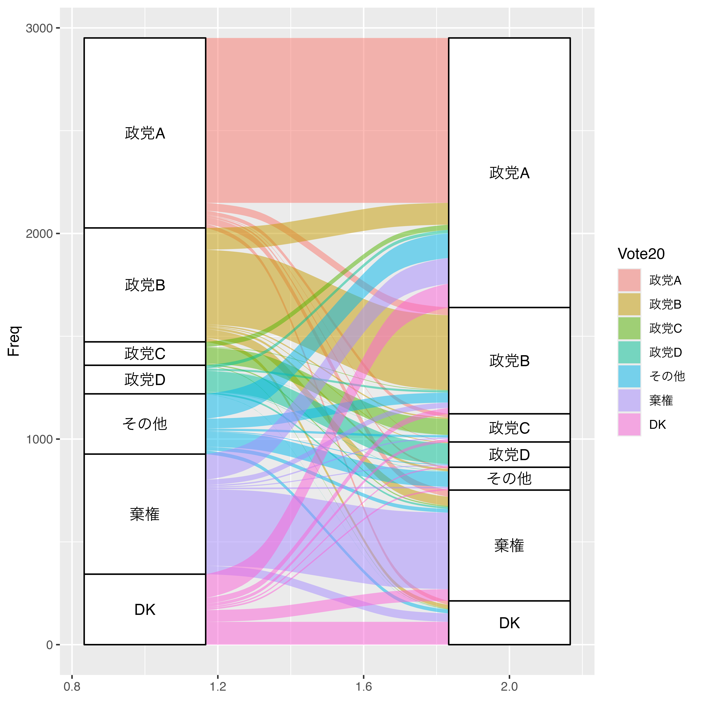

　`fill = Vote10`とマッピングした場合は、感覚が変わります。実際にやってみましょう。


```{.r .numberLines}
Alluvial_Plot <- Vote_0910 %>%
    ggplot(aes(y = Freq, axis1 = Vote09, axis2 = Vote10)) +
    geom_alluvium(aes(fill = Vote10)) +
    geom_stratum() +
    geom_text(aes(label = after_stat(stratum)), 
              stat = "stratum", family = "HiraginoSans-W3")

Alluvial_Plot
```


　この場合、2009年に民主党に投票した人が2010年にどこに流れたかが分かりやすくなります。`Vote09`に色分けするか、`Vote10`に色分けするかは作成する人が決める問題であり、自分の主張・メッセージに適したマッピングをしましょう。

　最後に、図をもう少し加工してみましょう。まず、横軸に0.8、1.2、1.6、2.0となっている目盛りを修正し、1と2の箇所に「2009年衆院選」と「2010年参院選」を出力します。これは`scale_x_continuous()`で調整可能です。そして、`theme_minimal()`で余計なものを排除したテーマを適用します。最後に`theme()`内で全ての凡例を削除 (`legend.position = "none"`)し、パネルのグリッド (`panel.grid`)と縦軸・横軸のタイトル (`axis.title`)、縦軸の目盛りラベル (`axis.text.y`)を削除 (`element_blank()`)します。


```{.r .numberLines}
Alluvial_Plot +
    scale_x_continuous(breaks = 1:2, 
                       labels = c("2009年衆院選", "2010年参院選")) +
    theme_minimal(base_family = "HiraginoSans-W3",
                  base_size   = 16) +
    theme(legend.position = "none",
          panel.grid = element_blank(),
          axis.title = element_blank(),
          axis.text.y = element_blank())
```


　これでだいぶスッキリした沖積図が出来上がりました。

---

## ツリーマップ {#visual4-tree}

　ツリーマップ（tree map）は変数の値の大きさを長方形の面積として表すグラフです。全体におけるシェアを示す時に使う点で、円グラフの代替案の一つになります。円グラフは項目が多すぎると読みにくいデメリットがありますが、ツリーマップは項目が多い場合でも有効です。むろん、多すぎると読みにくいことは同じですので、注意が必要です。

　ツリーマップを作成するためには{treemapify}パッケージの`geom_treemap()`幾何オブジェクトを使用します。まず、{treemapify}をインストールし、読み込みます。


```{.r .numberLines}
pacman::p_load(treemapify)
```

　ここでは`Country_df`からアジア諸国の人口（`Population`）をツリーマップをして可視化したいと思います。`geom_treemap()`の場合、各長方形は面積の情報のみを持ちます。この面積の情報を`area`にマッピングします。


```{.r .numberLines}
Country_df %>%
  filter(Continent == "Asia") %>%
  ggplot() +
  geom_treemap(aes(area = Population))
```


　これだけだと各長方形がどの国を指しているのかが分かりませんね。長方形の上に国名（`Country`）を追加するためには`geom_treemap_text()`幾何オブジェクトを使用します。マッピングは`area`と`label`に対し、それぞれ面積を表す`Population`と国名を表す`Country`を指定します。`area`は`geom_treemap()`と`geom_treemap_text()`両方で使われるので`ggplot()`の内部でマッピングしても問題ありません[^tree_mapping]。また、`aes()`の外側に`color = "white"`で文字を白に指定し、`place = "center"`で長方形の真ん中にラベルが付くようにします。

[^tree_mapping]: 今回の例だと、`label`も`ggplot()`内部でマッピング可能です。


```{.r .numberLines}
Country_df %>%
  filter(Continent == "Asia") %>%
  ggplot(aes(area = Population)) +
  geom_treemap() +
  geom_treemap_text(aes(label = Country), color = "white", place = "center")
```


　これでツリーマップが完成しました。インドと中国の存在感がかなり大きいですね。更にラベルのサイズを長方形に合わせると、その存在感をより高めることができます。ラベルの大きさを長方形に合わせるには`geom_treepmap_text()`の内部に`grow = TRUE`を指定します。


```{.r .numberLines}
Country_df %>%
  filter(Continent == "Asia") %>%
  ggplot(aes(area = Population, label = Country)) +
  geom_treemap() +
  geom_treemap_text(color = "white", place = "center",
                    grow = TRUE)
```


　ここで更に次元を追加するために、色塗りをしてみましょう。たとえば、G20加盟国か否かで色分けをしたい場合、`fill`に`G20`をマッピングします。ただし、今のままだと`G20`は連続変数扱いになりますので、character型、またはfactor型に変換します。


```{.r .numberLines}
Country_df %>%
  mutate(G20 = if_else(G20 == 1, "Member", "Non-member")) %>%
  filter(Continent == "Asia") %>%
  ggplot(aes(area = Population, fill = G20,
             label = Country)) +
  geom_treemap() +
  geom_treemap_text(color = "white", place = "centre",
                    grow = TRUE) +
  labs(fill = "G20") +
  ggtitle("Population in Asia") +
  theme(legend.position = "bottom")
```


　色塗りは連続変数に対して行うことも可能です。ここでは2018年人間開発指数（`HDI_2108`）の値に応じて色塗りをしてみます。また、`HDI_2018`が低い（`low`）と<span style = "color:#CD3333;">**brown3**</span>、高い（`high`）と<span style = "color:#6495ED;">**cornflowerblue**</span>色にします。真ん中の値（`midpoint`）は0.7とし、色（`mid`）は<span style = "color:#FFF8DC;background-color:#7F7F7F;">**cornsilk**</span>を使います。

　連続変数でマッピングされた色塗り（`fill`）の調整には`scale_fill_gradient()`、または`scale_fill_gradient2()`を使います。前者は中間点なし、後者は中間点ありです。これらの使い方は第\@ref(visualization3)章で紹介しました`scale_color_gradient()`と同じです。


```{.r .numberLines}
Country_df %>%
  filter(Continent == "Asia") %>%
  ggplot(aes(area = Population, fill = HDI_2018,
             label = Country)) +
  geom_treemap() +
  geom_treemap_text(color = "white", place = "centre",
                    grow = TRUE) +
  scale_fill_gradient2(low = "brown3",
                       mid = "cornsilk",
                       high = "cornflowerblue",
                       midpoint = 0.7) +
  labs(fill = "UN Human Development Index (2018)") +
  ggtitle("Population in Asia") +
  theme(legend.position = "bottom")
```

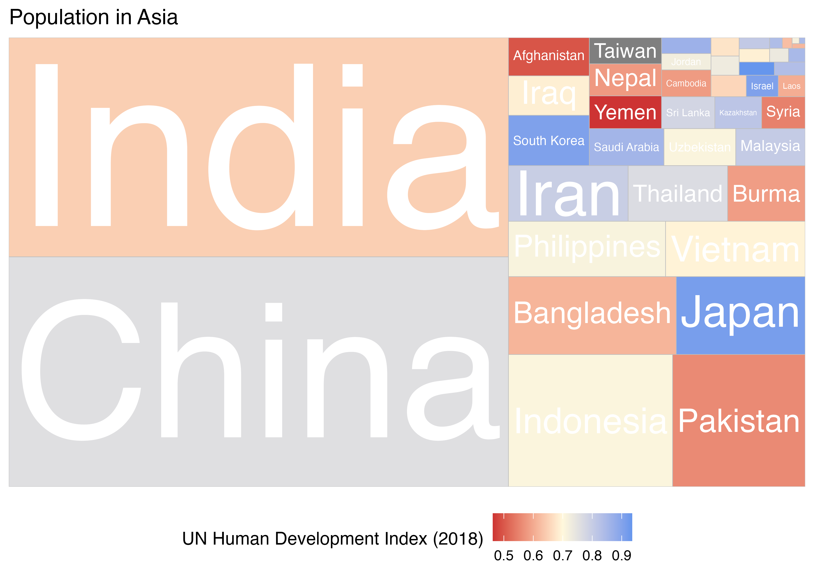

　ちなみに以上の図を円グラフにすると以下のようになります（国名は人口の割合が2.5%を超える国のみ表示）。ツリーマップと比較してかなり読みにくいことが分かります。


```{.r .numberLines}
Country_df %>%
  filter(Continent == "Asia") %>%
  arrange(Population) %>%
  mutate(Prop        = Population / sum(Population) * 100,
         LabelY      = 100 - (cumsum(Prop) - 0.5 * Prop),
         CountryName = if_else(Prop < 2.5, "", Country),
         Country     = fct_inorder(Country)) %>%
  ggplot() +
  geom_bar(aes(x = 1, y = Prop, group = Country, fill = HDI_2018), 
           color = "black", stat = "identity", width = 1) +
  geom_text(aes(x = 1, y = LabelY, label = CountryName)) +
  coord_polar("y", start = 0) +
  scale_fill_gradient2(low = "brown3",
                       mid = "cornsilk",
                       high = "cornflowerblue",
                       midpoint = 0.7) +
  labs(fill = "UN Human Development Index (2018)") +
  ggtitle("Population in Asia") +
  theme_minimal() +
  theme(legend.position = "bottom",
        panel.grid = element_blank(),
        axis.title = element_blank(),
        axis.text  = element_blank())
```


　ただし、ツリーマップが必ずしも円グラフより優れているとは言えません。たとえば、 @Heer_Bostock:2010 の研究では円グラフとツリーマップを含む9種類のグラフを用い、被験者に大小関係を判断してもらう実験を行いましたが、ツリーマップ（四角形の面積）は円グラフ（角度）よりも判断までの所要時間が長いことが述べています。

---

## モザイクプロット {#visual4-mosaic}

モザイクプロットは2つの離散変数（おもに名目変数）の関係を可視化するために @Hargian_Kleiner:1984 が考案した図です。2つの名目変数間の関係を見る際によく使われるものはクロス表（クロス集計表）でしょう。


```{.r .numberLines}
pacman::p_load(ggmosaic)
```


```{.r .numberLines}
Mosaic_df <- Country_df %>%
    select(Country, Continent, Polity = Polity_Type, PPP = PPP_per_capita) %>%
    mutate(Continent = factor(Continent, 
                              levels = c("Africa", "America", "Asia",
                                         "Europe", "Oceania")),
           Polity    = factor(Polity,
                              levels = c("Autocracy", "Closed Anocracy",
                                         "Open Anocracy", "Democracy",
                                         "Full Democracy")),
           PPP       = if_else(PPP >= 15000, "High PPP", "Low PPP"),
           PPP       = factor(PPP, levels = c("Low PPP", "High PPP"))) %>%
    drop_na()
```


```{.r .numberLines}
head(Mosaic_df)
```

```
## # A tibble: 6 × 4
##   Country     Continent Polity          PPP     
##   <chr>       <fct>     <fct>           <fct>   
## 1 Afghanistan Asia      Closed Anocracy Low PPP 
## 2 Albania     Europe    Democracy       Low PPP 
## 3 Algeria     Africa    Open Anocracy   Low PPP 
## 4 Angola      Africa    Closed Anocracy Low PPP 
## 5 Argentina   America   Democracy       High PPP
## 6 Armenia     Europe    Democracy       Low PPP
```

　クロス表を作成する内蔵関数としては`table()`があります。2つの変数が必要となり、第一引数が行、第二引数が列を表します。


```{.r .numberLines}
Mosaic_Tab <- table(Mosaic_df$Continent, Mosaic_df$Polity)
Mosaic_Tab
```

```
##          
##           Autocracy Closed Anocracy Open Anocracy Democracy Full Democracy
##   Africa          3              14            11        18              1
##   America         0               1             4        16              5
##   Asia           13               6             0        15              3
##   Europe          2               1             2        16             20
##   Oceania         0               0             2         0              2
```

　この`Mosaic_Tab`のクラスは`"table"`ですが、`"table"`クラスのオブジェクトを`plot()`に渡すと別途のパッケージを使わずモザイクプロットを作成することができます。


```{.r .numberLines}
plot(Mosaic_Tab)
```

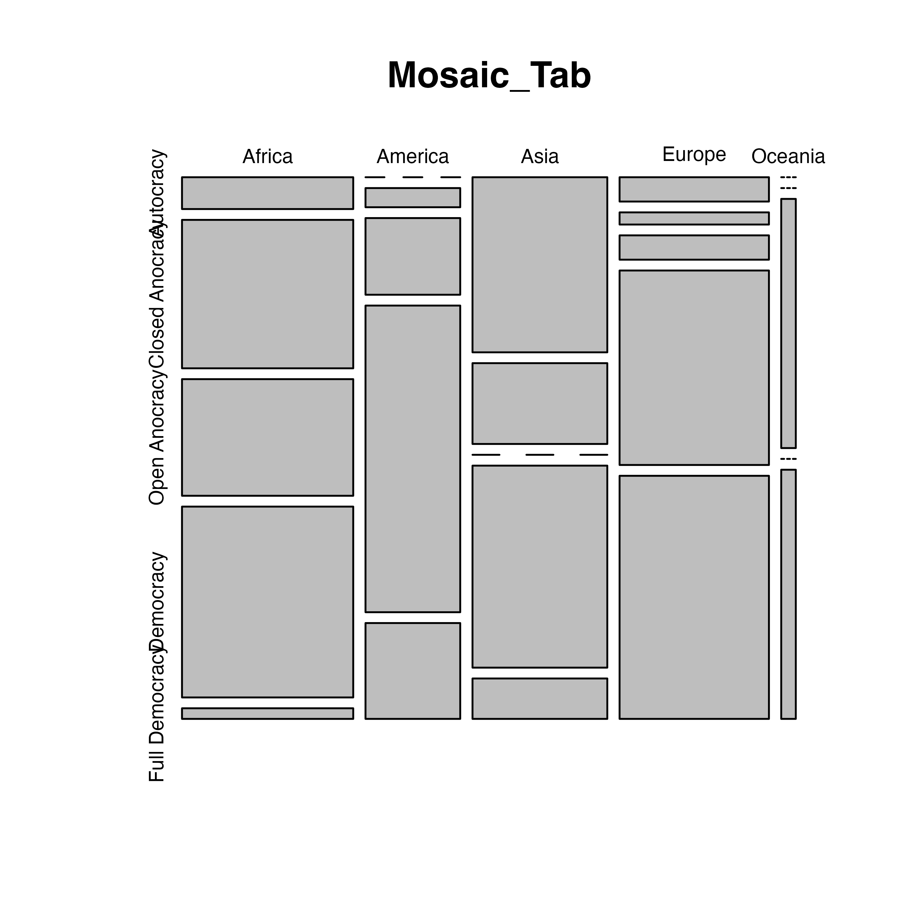

　やや地味ではありますが、モザイクプロットが出来ました。ここからはより読みやすいモザイクプロットを作成するために{ggmosaic}パッケージの`geom_mosaic()`関数を使います。

　`geom_mosaic()`の場合、`x`のみのマッピングで十分です。ただし、特定の変数を指定するのではなく、`product(変数1, 変数2)`を`x`にマッピングする必要があります。`table()`関数同様、変数1は行、変数2は列です。また、欠損値が含まれている行がある場合は、`aes()`の外側に`na.rm = TRUE`を指定する必要があります。今回は`drop_na()`で欠損値をすべて除外しましたが、念の為に指定しておきます。


```{.r .numberLines}
Mosaic_df %>%
    ggplot() +
    geom_mosaic(aes(x = product(Polity, Continent)), na.rm = TRUE) +
    labs(x = "Continent", y = "Polity Type") +
    theme_minimal() +
    theme(panel.grid = element_blank())
```

```
## Warning: `unite_()` was deprecated in tidyr 1.2.0.
## Please use `unite()` instead.
## This warning is displayed once every 8 hours.
## Call `lifecycle::last_lifecycle_warnings()` to see where this warning was generated.
```


　これで出来上がりですが、`"table"`オブジェクトを`plot()`に渡した結果とあまり変わらないですね。続いて、この図を少し改良してみましょう。まずはセルの色分けですが、これは`fill`に色分けする変数をマッピングするだけです。今回は政治体制ごとにセルを色分けしましょう。また、文字を大きめにし、横軸の目盛りラベルを回転します。


```{.r .numberLines}
Mosaic_df %>%
    ggplot() +
    geom_mosaic(aes(x = product(Polity, Continent), fill = Polity), 
                na.rm = TRUE) +
    labs(x = "Continent", y = "Polity Type") +
    theme_minimal(base_size   = 16) +
    theme(legend.position = "none",
          panel.grid      = element_blank(),
          axis.text.x     = element_text(angle = 90, vjust = 0.5, hjust = 1))
```

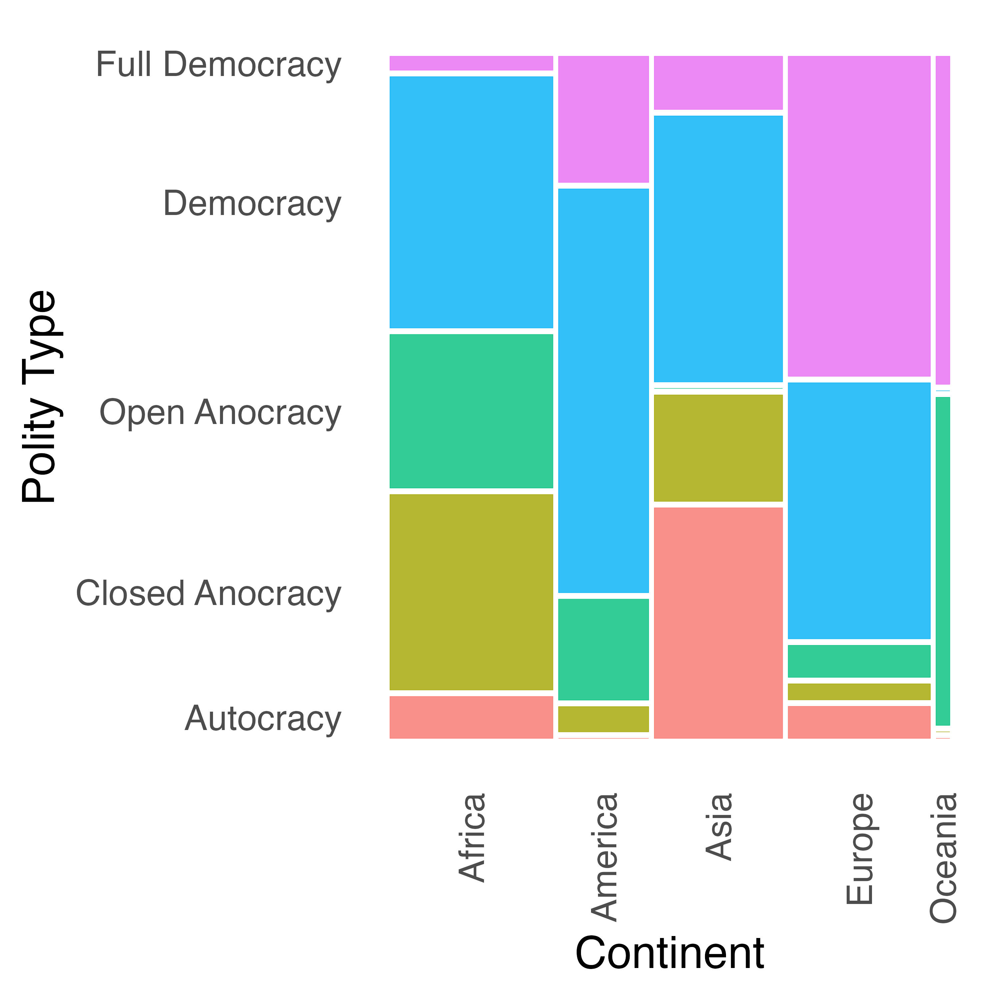

　次元を追加するためにはファセット分割を使います。たとえば、一人当たりPPP GDPの高低（`PPP`）でファセットを分割する場合、`facet_wrap(~PPP)`レイヤーを足すだけです。


```{.r .numberLines}
Mosaic_df %>%
    ggplot() +
    geom_mosaic(aes(x = product(Polity, Continent), fill = Polity), 
                na.rm = TRUE) +
    labs(x = "Continent", y = "Polity Type") +
    facet_wrap(~PPP, ncol = 2) +
    theme_minimal(base_size   = 16) +
    theme(legend.position = "none",
          panel.grid      = element_blank(),
          axis.text.x     = element_text(angle = 90, vjust = 0.5, hjust = 1))
```


　ただし、一つ問題があります。それは目盛りラベルの位置です。例えば、右側の横軸目盛りラベルの場合、セルの位置とラベルの位置がずれています。これは2つのファセットが同じ目盛りを共有し、左側の方に合わせられたため生じるものです。よく見ると横軸も縦軸も目盛りラベルに位置が同じであることが分かります。これを解消するためには、`facet_wrap()`の内部に`scale = "free"`を指定します[^facet_scale]。これは各ファセットが独自のスケールを有することを意味します。

[^facet_scale]: 他にも**縦**軸のみ共有する`"free_x"`、横軸のみ共有する`"free_y"`があり、既定値は`"fixed"`です。


```{.r .numberLines}
Mosaic_df %>%
    ggplot() +
    geom_mosaic(aes(x = product(Polity, Continent), fill = Polity), 
                na.rm = TRUE) +
    labs(x = "Continent", y = "Polity Type") +
    facet_wrap(~PPP, ncol = 2, scale = "free") +
    theme_minimal(base_size   = 16) +
    theme(legend.position = "none",
          panel.grid      = element_blank(),
          axis.text.x     = element_text(angle = 90, vjust = 0.5, hjust = 1))
```


　右側ファセットの横軸ラベルが重なってしまいましたが、これでとりあえず完成です。アフリカにおけるOpen AnocracyとClosed Anocracyの頻度が0であるため、これは仕方ありません。一つの対処方法としては以下のように縦軸目盛りを削除し、凡例で代替することが考えられます。


```{.r .numberLines}
Mosaic_df %>%
    ggplot() +
    geom_mosaic(aes(x = product(Polity, Continent), fill = Polity), 
                na.rm = TRUE) +
    labs(x = "Continent", y = "Polity Type", fill = "Polity Type") +
    facet_wrap(~PPP, ncol = 2, scale = "free_x") +
    theme_minimal(base_size   = 16) +
    theme(panel.grid  = element_blank(),
          axis.text.y = element_blank(),
          axis.text.x = element_text(angle = 90, vjust = 0.5, hjust = 1))
```


---

## その他のグラフ {#visual4-further}

[The R Graph Gallery](https://www.r-graph-gallery.com/)では本書で紹介できなかった様々な図のサンプルおよびコードを見ることができます。ここまで読み終わった方なら問題なくコードの意味が理解できるでしょう。{ggplot2}では作成できないグラフ（アニメーションや3次元図、インタラクティブなグラフ）についても、他のパッケージを利用した作成方法について紹介されているので、「こんな図が作りたいけど、作り方が分からん！」の時には、まず[The R Graph Gallery](https://www.r-graph-gallery.com/)に目を通してみましょう。
