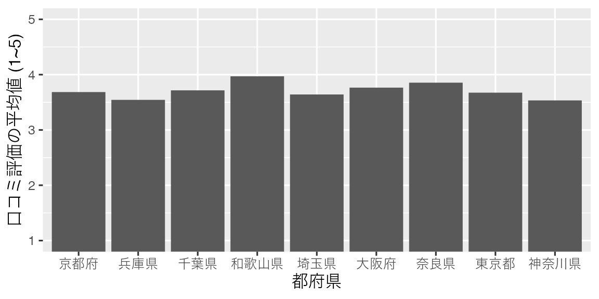
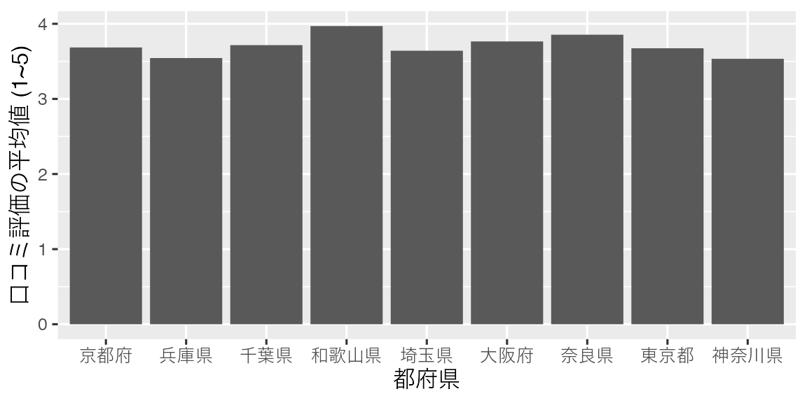
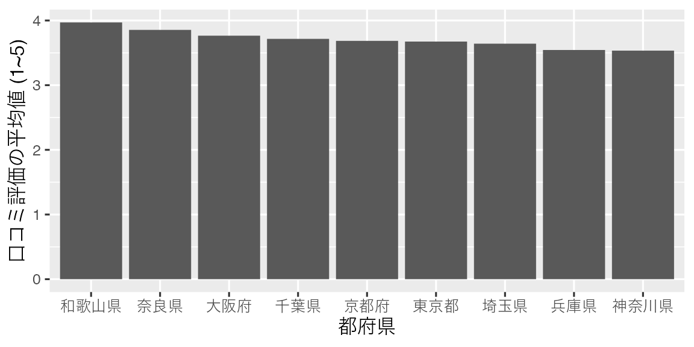
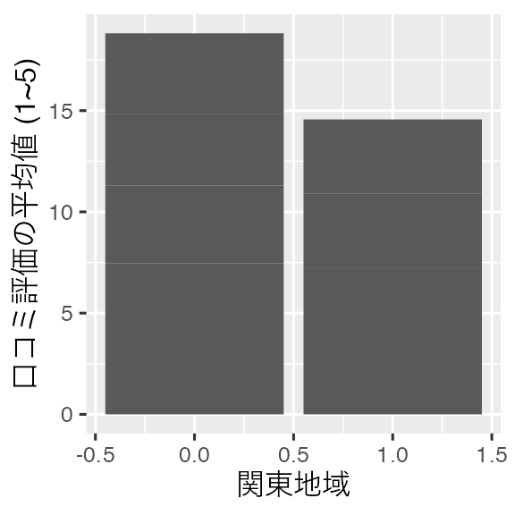
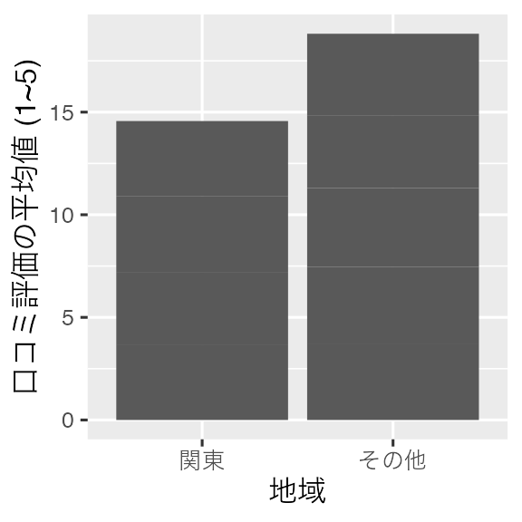
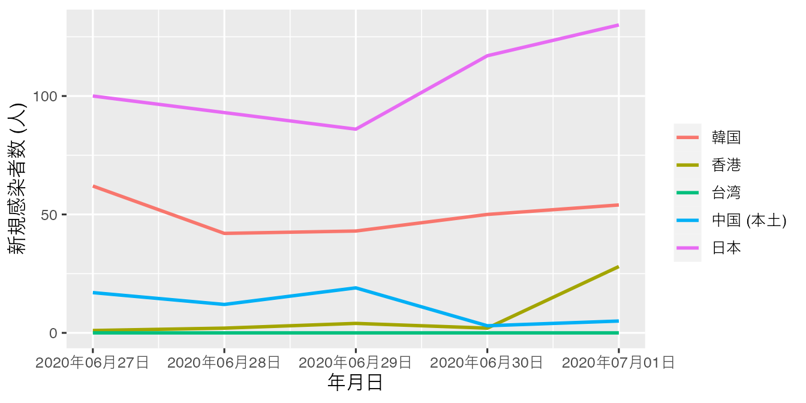
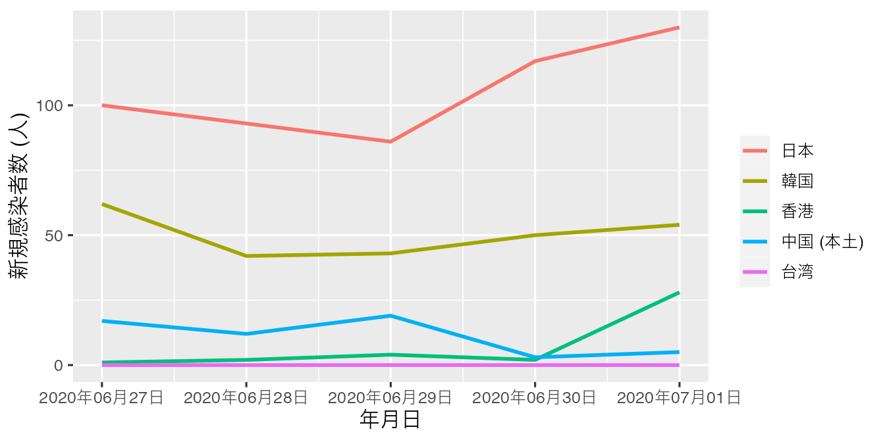

# データハンドリング [基礎編: factor型] {#factor}


## 名目変数を含むグラフを作成する際の注意点

ここからは楽しい可視化、つまりグラフの作成について解説します。ただし、その前に、名目変数の扱いと簡潔データ構造について話したいと思います。本章では名目変数の扱いについて解説し、次章は簡潔データ構造について解説します。

横軸、または縦軸が気温、成績、身長のような連続変数ではなく、都道府県や国、企業のような名目変数になる場合があります。たとえば、棒グラフの横軸は図\@ref(fig:factor1)のように、一般的に名目変数になる場合が多いです。

<div class="figure" style="text-align: center">

<p class="caption">(\#fig:factor1)横軸が名目変数の棒グラフ</p>
</div>

ここでは横軸の順番に注目してください。京都府、埼玉県、神奈川県、...の順番になっていますね。「この順番で大満足だよ!」という方がいるかも知れませんが、そうでない方もおおいでしょう。普通考えられるものとしては、都道府県コードの順か、縦軸が高い順 (低い順)でしょう。都道府県コードの順だと、埼玉県、千葉県、東京都、神奈川県、京都府、大阪府、兵庫県、奈良県、和歌山県の順番になります。または、縦軸 (口コミ評価の平均値)が高い順なら和歌山県、奈良県、大阪府、...の順番になります。あるいは50音順も考えられるでしょう。アメリカの場合、州を並べる際、アルファベット順で並べます。

自分でこの順番をコントロールするには可視化の前の段階、つまりデータハンドリングの段階で順番を決めなくてはなりません。これを決めておかない場合、Rが勝手に順番を指定します。具体的にはロケール (locale)というパソコン内の空間に文字情報が含まれているわけですが、そこに保存されている文字の順番となります。たとえば、日本語ロケールには「京」が「埼」よりも先に保存されているわけです。

したがって、名目変数がグラフに含まれる場合は、名目変数の表示順番を決める必要があり、そこで必要なのがfactor型です。名目変数がcharacter型の場合、ロケールに保存されている順でソートされますが、factor型の場合、予め指定した順番でソートされます。

たとえば、[前章で使用したデータ](Data/Ramen.csv)を用いて、都道府県ごとの口コミ評価の平均値を計算し、その結果を`Score_df`として保存します。


```{.r .numberLines}
# tidyverseパッケージの読み込み
pacman::p_load(tidyverse)
# データの読み込み
df <- read_csv("Data/Ramen.csv")
```


```{.r .numberLines}
Score_df <- df %>%
    group_by(Pref) %>%
    summarise(Score   = mean(Score, na.rm = TRUE),
              .groups = "drop")

Score_df
```

```
## # A tibble: 9 × 2
##   Pref     Score
##   <chr>    <dbl>
## 1 京都府    3.68
## 2 兵庫県    3.54
## 3 千葉県    3.72
## 4 和歌山県  3.97
## 5 埼玉県    3.64
## 6 大阪府    3.77
## 7 奈良県    3.85
## 8 東京都    3.67
## 9 神奈川県  3.53
```

この時点で勝手にロケール順になります。実際、表示された`Score_df`を見ると`Pref`の下に``<chr>`と表記されており、`Pref`はcharacter型であることが分かります。これをこのまま棒グラフに出してみましょう。可視化の方法はこれから詳細に解説するので、ここでは結果だけに注目してください。


```{.r .numberLines}
Score_df %>%
  ggplot() +
  geom_bar(aes(x = Pref, y = Score), stat = "identity") +
  labs(x = "都府県", y = "口コミ評価の平均値 (1~5)") +
  theme_gray(base_size = 12)
```

<div class="figure" style="text-align: center">

<p class="caption">(\#fig:factor2)Prefがcharacter型の場合 (1)</p>
</div>

横軸の順番があまり直感的ではありませんね。それでは、`Score_df`を`Score`が高い順にソートし、`Score_df2`で保存してから、もう一回試してみます。


```{.r .numberLines}
Score_df2 <- Score_df %>%
  arrange(desc(Score))

Score_df2
```

```
## # A tibble: 9 × 2
##   Pref     Score
##   <chr>    <dbl>
## 1 和歌山県  3.97
## 2 奈良県    3.85
## 3 大阪府    3.77
## 4 千葉県    3.72
## 5 京都府    3.68
## 6 東京都    3.67
## 7 埼玉県    3.64
## 8 兵庫県    3.54
## 9 神奈川県  3.53
```

ここでも`Pref`はcharacter型ですが、とりあえず、これで図を出してみます。


```{.r .numberLines}
Score_df2 %>%
  ggplot() +
  geom_bar(aes(x = Pref, y = Score), stat = "identity") +
  labs(x = "都府県", y = "口コミ評価の平均値 (1~5)") +
  theme_gray(base_size = 12)
```

<div class="figure" style="text-align: center">

<p class="caption">(\#fig:factor3)Prefがcharacter型の場合 (2)</p>
</div>

結果は全く変わっておりません。それでは、`Score_df`の`Pref`列をfactor型に変換し、順番は口コミ評価の平均値が高い順番にしてみましょう。結果は`Score_df_f1`という名で保存します。


```{.r .numberLines}
Score_df_f1 <- Score_df %>%
  mutate(Pref = factor(Pref, levels = c("和歌山県", "奈良県", "大阪府",
                                        "千葉県", "京都府", "東京都",
                                        "埼玉県", "兵庫県", "神奈川県")))

Score_df_f1
```

```
## # A tibble: 9 × 2
##   Pref     Score
##   <fct>    <dbl>
## 1 京都府    3.68
## 2 兵庫県    3.54
## 3 千葉県    3.72
## 4 和歌山県  3.97
## 5 埼玉県    3.64
## 6 大阪府    3.77
## 7 奈良県    3.85
## 8 東京都    3.67
## 9 神奈川県  3.53
```

表示される順番は`Score_df`と`Score_df_f1`も同じですが、`Pref`のデータ型が`<fct>`、つまりfactor型であることが分かります。実際、`Pref`列だけ抽出した場合、factor型として、和歌山県から神奈川県の順になっていることが確認できます。


```{.r .numberLines}
Score_df_f1$Pref
```

```
## [1] 京都府   兵庫県   千葉県   和歌山県 埼玉県   大阪府   奈良県   東京都  
## [9] 神奈川県
## 9 Levels: 和歌山県 奈良県 大阪府 千葉県 京都府 東京都 埼玉県 ... 神奈川県
```

この`Score_df_f1`データを使って、図\@ref(fig:factor2)と全く同じコードを実行した結果が図\@ref(fig:factor4)です。

<div class="figure" style="text-align: center">

<p class="caption">(\#fig:factor4)Prefがfactor型の場合 (1)</p>
</div>

これまでの話をまとめるの以下の2点が分かります。

1. 変数がcharacter型である場合、自動的にロケール順でソートされる。
2. 変数がfactor型である場合、データ内の順番やロケール順と関係なく、指定されたレベル (水準)の順でソートされる。

とくに2番目の点についてですが、これは必ずしも順序付きfactorである必要はありません。順序付きfactor型でなくても、`factor()`内で指定した順にソートされます。むろん、順序付きfactor型なら指定された順序でソートされます。

これからはfactor型変換の際に便利な関数をいくつか紹介しますが、その前に数値として表現された名目変数について話します。たとえば、`Score_df_f1`に関東地域なら`1`を、その他の地域なら`0`を付けた`Kanto`という変数があるとします。


```{.r .numberLines}
Score_df_f1 <- Score_df_f1 %>%
  mutate(Kanto = ifelse(Pref %in% c("東京都", "神奈川県", "千葉県", "埼玉県"), 1, 0))

Score_df_f1
```

```
## # A tibble: 9 × 3
##   Pref     Score Kanto
##   <fct>    <dbl> <dbl>
## 1 京都府    3.68     0
## 2 兵庫県    3.54     0
## 3 千葉県    3.72     1
## 4 和歌山県  3.97     0
## 5 埼玉県    3.64     1
## 6 大阪府    3.77     0
## 7 奈良県    3.85     0
## 8 東京都    3.67     1
## 9 神奈川県  3.53     1
```

`Kanto`変数のデータ型は、`<dbl>`、つまりnumeric型です。しかし、これは明らかに名目変数ですね。これをこのまま`Kanto`を横軸にした図を出すと図\@ref(fig:factor5)のようになります。

<div class="figure" style="text-align: center">

<p class="caption">(\#fig:factor5)Kantoがnumeric型の場合</p>
</div>

この場合、図の横軸は`Kanto`の値が小さい順でソートされます。ただし、このような図は非常に見にくいため、`1`に`"関東"`、`0`に`"関西"`とラベルを付けたfactor型に変換した方が望ましいです。numeric型をラベル付きのfactor型にするためには、`levels`引数には元の数値を、`labels`引数にはそれぞれの数値に対応したラベルを指定します。また、関東の方を先に出したいので、`factor()`内の`levels`引数は`c(0, 1)`でなく、`c(1, 0)`にします。


```{.r .numberLines}
Score_df_f1 <- Score_df_f1 %>%
  mutate(Kanto = factor(Kanto, levels = c(1, 0), labels = c("関東", "その他")))

Score_df_f1
```

```
## # A tibble: 9 × 3
##   Pref     Score Kanto 
##   <fct>    <dbl> <fct> 
## 1 京都府    3.68 その他
## 2 兵庫県    3.54 その他
## 3 千葉県    3.72 関東  
## 4 和歌山県  3.97 その他
## 5 埼玉県    3.64 関東  
## 6 大阪府    3.77 その他
## 7 奈良県    3.85 その他
## 8 東京都    3.67 関東  
## 9 神奈川県  3.53 関東
```

`Kanto`変数がfactor型に変換されたことが分かります。


```{.r .numberLines}
Score_df_f1$Kanto
```

```
## [1] その他 その他 関東   その他 関東   その他 その他 関東   関東  
## Levels: 関東 その他
```

また、`"関東"`、`"その他"`の順になっていますね。これを図として出力した結果が図\@ref(fig:factor6)です。

<div class="figure" style="text-align: center">

<p class="caption">(\#fig:factor6)Kantoがfactor型の場合</p>
</div>

このように数値型名目変数でも、factor化することによって、自由に横軸の順番を変えることができます。それでは、factor化に使える便利な関数をいくつか紹介します。

## {forcats}パッケージについて

実はfactor型への変換や、順番に変更などは全てR内蔵の`factor()`関数で対応可能ですが、ここでは{forcats}パッケージが提供している`fct_*()`関数を使用します。`forcats`パッケージは{tidyverse}を読み込む際、自動的に読み込まれるため、既に{tidyverse}を読み込んでいる場合、別途のコードは要りません。

### `fct_relevel()`: 水準の順番を変更する

`Score_df_f1`の`f1`は`Score`が高い順になっています。これを50音順に変更する際、`fct_relevel()`関数を使います。


```{.r .numberLines}
# 新しい変数名と元となる変数名が一致すると上書きになる
データフレーム名 %>%
  mutate(新しい変数名 = fct_releve(元となる変数名, 
                                    "水準1", "水準2", "水準3", ...))
```

ここでは、`Pref`変数を再調整した`Pref2`変数を作ってみましょう。


```{.r .numberLines}
Score_df_f1 <- Score_df_f1 %>%
  mutate(Pref2 = fct_relevel(Pref, "大阪府", "神奈川県", "京都府", 
                             "埼玉県", "千葉県", "東京都", 
                             "奈良県", "兵庫県", "和歌山県"))

Score_df_f1
```

```
## # A tibble: 9 × 4
##   Pref     Score Kanto  Pref2   
##   <fct>    <dbl> <fct>  <fct>   
## 1 京都府    3.68 その他 京都府  
## 2 兵庫県    3.54 その他 兵庫県  
## 3 千葉県    3.72 関東   千葉県  
## 4 和歌山県  3.97 その他 和歌山県
## 5 埼玉県    3.64 関東   埼玉県  
## 6 大阪府    3.77 その他 大阪府  
## 7 奈良県    3.85 その他 奈良県  
## 8 東京都    3.67 関東   東京都  
## 9 神奈川県  3.53 関東   神奈川県
```

一見、`Pref`と`Pref2`変数は同じように見えますが、水準はどうなっているでしょうか。


```{.r .numberLines}
levels(Score_df_f1$Pref)  # Prefの水準
```

```
## [1] "和歌山県" "奈良県"   "大阪府"   "千葉県"   "京都府"   "東京都"   "埼玉県"  
## [8] "兵庫県"   "神奈川県"
```

```{.r .numberLines}
levels(Score_df_f1$Pref2) # Pref2の水準
```

```
## [1] "大阪府"   "神奈川県" "京都府"   "埼玉県"   "千葉県"   "東京都"   "奈良県"  
## [8] "兵庫県"   "和歌山県"
```

問題なく50音順になっていることが分かります。他にも`fct_relevel()`には全ての水準名を指定する必要がありません。一部の水準名も可能です。たとえば、「関東が関西の先に来るなんでけしからん！」と思う読者もいるでしょう。この場合、関西の府県名を入れると、指定した水準が最初に位置するようになります。


```{.r .numberLines}
Score_df_f1 <- Score_df_f1 %>%
  mutate(Pref3 = fct_relevel(Pref, "京都府", "大阪府",
                             "兵庫県", "奈良県", "和歌山県"))

levels(Score_df_f1$Pref3) # Pref3の水準
```

```
## [1] "京都府"   "大阪府"   "兵庫県"   "奈良県"   "和歌山県" "千葉県"   "東京都"  
## [8] "埼玉県"   "神奈川県"
```

一部の水準名のみを指定するとその水準が最初に移動されますが、`after`引数を指定すると、位置を調整することも可能です。`after = 2`の場合、元となる変数の1、3番目の水準は維持され、3番目以降に指定した水準、それに続いて指定されていない水準の順番になります。`Pref`は和歌山、奈良、大阪の順ですが、ここで京都と東京を、奈良と大阪の間に移動するなら、


```{.r .numberLines}
Score_df_f1 <- Score_df_f1 %>%
  mutate(Pref4 = fct_relevel(Pref, "京都府", "東京都", after = 2))

levels(Score_df_f1$Pref4) # Pref4の水準
```

```
## [1] "和歌山県" "奈良県"   "京都府"   "東京都"   "大阪府"   "千葉県"   "埼玉県"  
## [8] "兵庫県"   "神奈川県"
```

のように書きます。`after`を指定しない場合のデフォルト値は0であるため、最初に移動します。

### `fct_recode()`: 水準のラベルを変更する

`fct_recode()`は水準のラベルを変更する時に使う関数で、以下のように使います。


```{.r .numberLines}
# 新しい変数名と元となる変数名が一致すると上書きになる
データフレーム名 %>%
  mutate(新しい変数名 = fct_recode(元となる変数名, 
                                   新しいラベル1 = "既存のラベル1",
                                   新しいラベル2 = "既存のラベル2",
                                   新しいラベル3 = "既存のラベル3",
                                   ...))
```

注意点としては新しいラベルは`"`で囲まず、既存のラベルは`"`で囲む点です。それでは、`Pref`のラベルをローマ字に変更してみましょう。


```{.r .numberLines}
Score_df_f1 <- Score_df_f1 %>%
  mutate(Pref5 = fct_recode(Pref,
                            Saitama  = "埼玉県",
                            Wakayama = "和歌山県",
                            Kyoto    = "京都府",
                            Osaka    = "大阪府",
                            Tokyo    = "東京都",
                            Nara     = "奈良県",
                            Kanagawa = "神奈川県",
                            Hyogo    = "兵庫県",
                            Chiba    = "千葉県"))

Score_df_f1
```

```
## # A tibble: 9 × 7
##   Pref     Score Kanto  Pref2    Pref3    Pref4    Pref5   
##   <fct>    <dbl> <fct>  <fct>    <fct>    <fct>    <fct>   
## 1 京都府    3.68 その他 京都府   京都府   京都府   Kyoto   
## 2 兵庫県    3.54 その他 兵庫県   兵庫県   兵庫県   Hyogo   
## 3 千葉県    3.72 関東   千葉県   千葉県   千葉県   Chiba   
## 4 和歌山県  3.97 その他 和歌山県 和歌山県 和歌山県 Wakayama
## 5 埼玉県    3.64 関東   埼玉県   埼玉県   埼玉県   Saitama 
## 6 大阪府    3.77 その他 大阪府   大阪府   大阪府   Osaka   
## 7 奈良県    3.85 その他 奈良県   奈良県   奈良県   Nara    
## 8 東京都    3.67 関東   東京都   東京都   東京都   Tokyo   
## 9 神奈川県  3.53 関東   神奈川県 神奈川県 神奈川県 Kanagawa
```

`fct_recode()`の中に指定する水準の順番は無視されます。つまり、水準の順番はそのまま維持されるため、好きな順番で結構です。また、全ての水準を指定せず、一部のみ変更することも可能です。それでは`Pref5`の順番が`Pref`の順番と同じかを確認してみましょう。


```{.r .numberLines}
levels(Score_df_f1$Pref)  # Prefの水準
```

```
## [1] "和歌山県" "奈良県"   "大阪府"   "千葉県"   "京都府"   "東京都"   "埼玉県"  
## [8] "兵庫県"   "神奈川県"
```

```{.r .numberLines}
levels(Score_df_f1$Pref5) # Pref5の水準
```

```
## [1] "Wakayama" "Nara"     "Osaka"    "Chiba"    "Kyoto"    "Tokyo"    "Saitama" 
## [8] "Hyogo"    "Kanagawa"
```

### `fct_rev()`: 水準の順番を反転させる

水準の順番を反転することは非常によくあります。たとえば、グラフの読みやすさのために、左右または上下を反転するケースがあります。既に何回も強調しましたように、名目変数は基本的にfactor型にすべきであり、ここで`fct_rev()`関数が非常に便利です。たとえば、`Pref2`の水準は50音順でありますが、これを反転し、`Pref6`という名の列として追加してみましょう。


```{.r .numberLines}
Score_df_f1 <- Score_df_f1 %>%
  mutate(Pref6 = fct_rev(Pref2))

levels(Score_df_f1$Pref6)
```

```
## [1] "和歌山県" "兵庫県"   "奈良県"   "東京都"   "千葉県"   "埼玉県"   "京都府"  
## [8] "神奈川県" "大阪府"
```

関数一つで水準の順番が反転されました。

### `fct_infreq()`: 頻度順に順番を変更する

続いて、水準の順番を頻度順に合わせる`fct_infreq()`関数です。たとえば、`Score`が欠損でないケースのみで構成された`df2`を考えてみましょう。


```{.r .numberLines}
df2 <- df %>%
  filter(!is.na(Score))
```

そして、都府県ごとのケース数を計算します。


```{.r .numberLines}
table(df2$Pref)
```

```
## 
##   京都府   兵庫県   千葉県 和歌山県   埼玉県   大阪府   奈良県   東京都 
##       79       85      108       24      118      175       28      298 
## 神奈川県 
##      219
```

ここで`Pref`をfactor化しますが、水準の順番を店舗数が多い方を先にするにはどうすれば良いでしょうか。`fct_infreq()`関数は指定された変数の各値の個数を計算し、多い順にfactorの水準を調整します。


```{.r .numberLines}
df2 <- df2 %>%
  # 多く出現した値順でfactor化する
  mutate(Pref = fct_infreq(Pref))

levels(df2$Pref) # df2のPref変数の水準を出力
```

```
## [1] "東京都"   "神奈川県" "大阪府"   "埼玉県"   "千葉県"   "兵庫県"   "京都府"  
## [8] "奈良県"   "和歌山県"
```

`"東京都"`、`"神奈川県"`、`"大阪府"`、...の順で水準の順番が調整され、これは`table(df$Pref2)`の順位とも一致します。

### `fct_inorder()`: データ内の出現順番に順番を変更する

続いて、`fct_inorder()`ですが、これは意外と頻繁に使われる関数です。たとえば、自分でデータフレームなどを作成し、ケースの順番も綺麗に整えたとします。しかし、既に指摘した通り、データフレーム (または、tibble)での順番とグラフにおける順番は一致するとは限りません。データフレームに格納された順番でfactorの水準が設定できれば非常に便利でしょう。そこで使うのが`fct_inorder()`です。

たとえば、`df`の`Pref`は`"東京都"`が1000個並び、続いて`"神奈川県"`が1000個、`"千葉県"`が1000個、...の順番で格納されています。この順番をそのままfactorの順番にするには以下のように書きます。


```{.r .numberLines}
df3 <- df %>%
  # Pref変数をfactor化し、水準は出現順とする
  # 変換後の結果はPrefに上書きする
  mutate(Pref = fct_inorder(Pref))

levels(df3$Pref)
```

```
## [1] "東京都"   "神奈川県" "千葉県"   "埼玉県"   "大阪府"   "京都府"   "兵庫県"  
## [8] "奈良県"   "和歌山県"
```

### `fct_shift()`: 水準の順番をずらす

続いて、水準の順番をずらす`fct_shift()`関数を紹介します。たとえば、「1:そう思う」〜「5:そう思わない」、「9:答えたくない」の6水準で構成された変数があるとします。


```{.r .numberLines}
df4 <- tibble(
  ID = 1:10,
  Q1 = c(1, 5, 3, 2, 9, 2, 4, 9, 5, 1)
) 

df4 <- df4 %>%
  mutate(Q1 = factor(Q1, levels = c(1:5, 9),
                     labels = c("そう思う", 
                                "どちらかと言えばそう思う",
                                "どちらとも言えない",
                                "どちらかと言えばそう思わない",
                                "そう思わない",
                                "答えたくない")))

df4
```

```
## # A tibble: 10 × 2
##       ID Q1                          
##    <int> <fct>                       
##  1     1 そう思う                    
##  2     2 そう思わない                
##  3     3 どちらとも言えない          
##  4     4 どちらかと言えばそう思う    
##  5     5 答えたくない                
##  6     6 どちらかと言えばそう思う    
##  7     7 どちらかと言えばそう思わない
##  8     8 答えたくない                
##  9     9 そう思わない                
## 10    10 そう思う
```

水準の順番も「そう思う」〜「答えたくない」順で綺麗に整っています。この水準を反転するには`fct_rev()`関数が便利です。`Q1`の水準を反転した変数を`Q1_R`という新しい列として追加し、水準を確認してみましょう。


```{.r .numberLines}
df4 <- df4 %>%
  mutate(Q1_R = fct_rev(Q1))

df4
```

```
## # A tibble: 10 × 3
##       ID Q1                           Q1_R                        
##    <int> <fct>                        <fct>                       
##  1     1 そう思う                     そう思う                    
##  2     2 そう思わない                 そう思わない                
##  3     3 どちらとも言えない           どちらとも言えない          
##  4     4 どちらかと言えばそう思う     どちらかと言えばそう思う    
##  5     5 答えたくない                 答えたくない                
##  6     6 どちらかと言えばそう思う     どちらかと言えばそう思う    
##  7     7 どちらかと言えばそう思わない どちらかと言えばそう思わない
##  8     8 答えたくない                 答えたくない                
##  9     9 そう思わない                 そう思わない                
## 10    10 そう思う                     そう思う
```

```{.r .numberLines}
levels(df4$Q1_R)
```

```
## [1] "答えたくない"                 "そう思わない"                
## [3] "どちらかと言えばそう思わない" "どちらとも言えない"          
## [5] "どちらかと言えばそう思う"     "そう思う"
```

「答えたくない」が最初の順番に来ましてね。できれば、「そう思わない」〜「そう思う」、「答えたくない」の順番にしたいところです。ここで使うのが`fct_shift()`ですが、書き方がややこしいので、噛み砕いて解説します。


```{.r .numberLines}
# fct_shift()の使い方
データ名 %>%
  mutate(新しい変数名 = fct_shift(元の変数名, n = 左方向へずらす個数))
```

問題は`n =`引数ですが、その挙動については以下の表を参照してください。

<table class="table table-striped" style="width: auto !important; margin-left: auto; margin-right: auto;">
 <thead>
  <tr>
   <th style="text-align:left;"> 水準の順番 </th>
   <th style="text-align:center;"> 1番目 </th>
   <th style="text-align:center;"> 2番目 </th>
   <th style="text-align:center;"> 3番目 </th>
   <th style="text-align:center;"> 4番目 </th>
   <th style="text-align:center;"> 5番目 </th>
   <th style="text-align:center;"> 6番目 </th>
  </tr>
 </thead>
<tbody>
  <tr>
   <td style="text-align:left;"> `n = -2` </td>
   <td style="text-align:center;"> `E` </td>
   <td style="text-align:center;"> `F` </td>
   <td style="text-align:center;"> `A` </td>
   <td style="text-align:center;"> `B` </td>
   <td style="text-align:center;"> `C` </td>
   <td style="text-align:center;"> `D` </td>
  </tr>
  <tr>
   <td style="text-align:left;"> `n = -1` </td>
   <td style="text-align:center;"> `F` </td>
   <td style="text-align:center;"> `A` </td>
   <td style="text-align:center;"> `B` </td>
   <td style="text-align:center;"> `C` </td>
   <td style="text-align:center;"> `D` </td>
   <td style="text-align:center;"> `E` </td>
  </tr>
  <tr>
   <td style="text-align:left;"> `n = 0` </td>
   <td style="text-align:center;"> `A` </td>
   <td style="text-align:center;"> `B` </td>
   <td style="text-align:center;"> `C` </td>
   <td style="text-align:center;"> `D` </td>
   <td style="text-align:center;"> `E` </td>
   <td style="text-align:center;"> `F` </td>
  </tr>
  <tr>
   <td style="text-align:left;"> `n = 1` </td>
   <td style="text-align:center;"> `B` </td>
   <td style="text-align:center;"> `C` </td>
   <td style="text-align:center;"> `D` </td>
   <td style="text-align:center;"> `E` </td>
   <td style="text-align:center;"> `F` </td>
   <td style="text-align:center;"> `A` </td>
  </tr>
  <tr>
   <td style="text-align:left;"> `n = 2` </td>
   <td style="text-align:center;"> `C` </td>
   <td style="text-align:center;"> `D` </td>
   <td style="text-align:center;"> `E` </td>
   <td style="text-align:center;"> `F` </td>
   <td style="text-align:center;"> `A` </td>
   <td style="text-align:center;"> `B` </td>
  </tr>
</tbody>
</table>

具体的には水準は左方向へ`n`個移動します。元の水準が`A`, `B`, `C`, ..., `F`の順で、`n = 1`の場合、`A`が`F`の後ろへ移動し、`B`, `C`, `D`, `E`, `F`が前の方へ1つずつ移動します。逆に右側へ1つ移動したい場合は`n = -1`のように書きます。今回は最初の水準を最後に移動させたいので、`n = 1`と指定します。


```{.r .numberLines}
df4 <- df4 %>%
  # Q1_Rの水準を左方向で1ずらす
  mutate(Q1_R = fct_shift(Q1_R, n = 1))

levels(df4$Q1_R)
```

```
## [1] "そう思わない"                 "どちらかと言えばそう思わない"
## [3] "どちらとも言えない"           "どちらかと言えばそう思う"    
## [5] "そう思う"                     "答えたくない"
```

これで水準の反転が完了しました。`fct_shift()`はこのように世論調査データの処理に便利ですが、他にも曜日の処理に使えます。例えば、1週間の始まりを月曜にするか日曜にするかによって、`fct_shift()`を使うケースがあります。

### `fct_shuffle()`: 水準の順番をランダム化する

あまり使わない機能ですが、水準の順番をランダム化することも可能です。使い方は非常に簡単で、`fct_shuffle()`に元の変数名を入れるだけです。たとえば、`Score_df`の`Pref`の順番をランダム化し、`Pref2`として追加します。同じことをもう2回繰り返し、それぞれ`Pref3`と`Pref4`という名前で追加してみましょう。


```{.r .numberLines}
Score_df <- Score_df %>%
  mutate(Pref2 = fct_shuffle(Pref),
         Pref3 = fct_shuffle(Pref),
         Pref4 = fct_shuffle(Pref))

Score_df
```

```
## # A tibble: 9 × 5
##   Pref     Score Pref2    Pref3    Pref4   
##   <chr>    <dbl> <fct>    <fct>    <fct>   
## 1 京都府    3.68 京都府   京都府   京都府  
## 2 兵庫県    3.54 兵庫県   兵庫県   兵庫県  
## 3 千葉県    3.72 千葉県   千葉県   千葉県  
## 4 和歌山県  3.97 和歌山県 和歌山県 和歌山県
## 5 埼玉県    3.64 埼玉県   埼玉県   埼玉県  
## 6 大阪府    3.77 大阪府   大阪府   大阪府  
## 7 奈良県    3.85 奈良県   奈良県   奈良県  
## 8 東京都    3.67 東京都   東京都   東京都  
## 9 神奈川県  3.53 神奈川県 神奈川県 神奈川県
```

```{.r .numberLines}
levels(Score_df$Pref2)
```

```
## [1] "兵庫県"   "奈良県"   "千葉県"   "神奈川県" "大阪府"   "京都府"   "埼玉県"  
## [8] "和歌山県" "東京都"
```

```{.r .numberLines}
levels(Score_df$Pref3)
```

```
## [1] "千葉県"   "和歌山県" "神奈川県" "埼玉県"   "奈良県"   "兵庫県"   "大阪府"  
## [8] "東京都"   "京都府"
```

```{.r .numberLines}
levels(Score_df$Pref4)
```

```
## [1] "奈良県"   "東京都"   "千葉県"   "兵庫県"   "大阪府"   "京都府"   "埼玉県"  
## [8] "和歌山県" "神奈川県"
```

`Pref`から`Pref4`まで同じように見えますが、水準の順番が異なります (`Pref`はcharacter型だから水準がありません)。

### `fct_reorder()`: 別の1変数の値を基準に水準の順番を変更する

`fct_infreq()`は出現頻度順に並び替える関数でしたが、それと似たような関数として`fct_reorder()`があります。ただし、これは出現頻度を基準にするのではなく、ある変数の平均値が低い順、中央値が高い順などでソートされます。まずは使い方から確認します。


```{.r .numberLines}
データ名 %>%
  mutate(新しい変数名 = fct_reorder(元の変数名, 基準となる変数, 
                                   関数名, 関数の引数))
```

必要な引数が多いですね。解説よりも実際の例を見ながら説明します。今回も`Pref`をfactor変数にし、`Pref_R`という列で格納しますが、平均予算が安い順でfactorの水準を決めたいと思います。


```{.r .numberLines}
df <- df %>%
  mutate(Pref_R = fct_reorder(Pref, Budget, mean, na.rm = TRUE))

levels(df$Pref_R)
```

```
## [1] "千葉県"   "埼玉県"   "奈良県"   "兵庫県"   "大阪府"   "神奈川県" "和歌山県"
## [8] "東京都"   "京都府"
```

`Pref_R`の水準は千葉県、埼玉県、奈良県、...の順ですが、本当にそうでしょうか。`group_by()`と`summarise()`などを使って確認してみましょう。


```{.r .numberLines}
df %>% 
  group_by(Pref) %>%
  summarise(Budget  = mean(Budget, na.rm = TRUE),
            .groups = "drop") %>%
  arrange(Budget)
```

```
## # A tibble: 9 × 2
##   Pref     Budget
##   <chr>     <dbl>
## 1 千葉県    1124.
## 2 埼玉県    1147.
## 3 奈良県    1169.
## 4 兵庫県    1197.
## 5 大阪府    1203.
## 6 神奈川県  1239.
## 7 和歌山県  1252 
## 8 東京都    1283.
## 9 京都府    1399.
```

問題なくソートされましたね。注意点としては`fct_reorder()`内に関数名を書く際、`()`は不要という点です。関数名の次の引数としてはその関数に別途必要な引数を指定します。引数が省略可能、あるいは不要な関数を使う場合は、省略しても構いませんし、数に制限はありません。

また、低い順ではなく、高い順にすることも可能です。次は`Score`の中央値が高い順に水準を設定した`Pref_R2`を作ってみましょう。


```{.r .numberLines}
df <- df %>%
  mutate(Pref_R2 = fct_reorder(Pref, Score, median, na.rm = TRUE, .desc = TRUE))

levels(df$Pref_R2)
```

```
## [1] "和歌山県" "奈良県"   "千葉県"   "大阪府"   "東京都"   "埼玉県"   "京都府"  
## [8] "兵庫県"   "神奈川県"
```

変わったのは`mean`の代わりに`median`を使ったこと、そして`.desc`引数が追加された点です。`fct_reorder()`には`.desc = FALSE`がデフォルトとして指定されており、省略した場合は昇順でfactorの水準が決まります。ここで`.desc = TRUE`を指定すると、降順となります。実際、`Score`の中央値順になっているかを確認してみましょう。


```{.r .numberLines}
df %>% 
  group_by(Pref) %>%
  summarise(Score   = median(Score, na.rm = TRUE),
            .groups = "drop") %>%
  arrange(desc(Score))
```

```
## # A tibble: 9 × 2
##   Pref     Score
##   <chr>    <dbl>
## 1 和歌山県  4   
## 2 奈良県    3.88
## 3 千葉県    3.75
## 4 大阪府    3.75
## 5 東京都    3.64
## 6 埼玉県    3.61
## 7 京都府    3.5 
## 8 兵庫県    3.5 
## 9 神奈川県  3.5
```

### `fct_reorder2()`: 別の2変数の値を基準に水準の順番を変更する  {#factor-forcat-reorder2}

この関数は別の変数を基準に水準が調整される点では`fct_reorder()`と類似しています。ただし、よく誤解されるのは「変数Aの値が同じなら変数Bを基準に...」といったものではありません。たとえば、`fct_reorder(x, y, mean)`の場合、`y`の平均値 (`mean()`)の順で`x`の水準を調整するという意味です。この`mean()`関数に必要なデータはベクトル1つです。しかし、関数によっては2つの変数が必要な場合があります。

これは頻繁に直面する問題ではありませんが、この`fct_reorder2()`関数が活躍するケースを紹介します。以下は6月27日から7月1日までの5日間、5地域におけるCOVID-19新規感染者数を表したデータです[^fct_reorder2]。入力が面倒な方は[ここ](Data/COVID19.csv)からダウンロードして読み込んでください。

[^fct_reorder2]: データの出典は[Google](https://news.google.com/covid19/map)です。


```{.r .numberLines}
# 入力が面倒ならデータをダウンロードし、
# Reorder2_df <- read_csv("Data/COVID19.csv")
Reorder2_df <- tibble(
  Country = rep(c("日本", "韓国", "中国 (本土)", "台湾", "香港"),
                each = 5),
  Date    = rep(c("2020/06/27", "2020/06/28", "2020/06/29",
                  "2020/06/30", "2020/07/01"), 5),
  NewPat  = c(100, 93, 86, 117, 130, 
               62, 42, 43,  50,  54,
               17, 12, 19,   3,   5,
                0,  0,  0,   0,   0,
                1,  2,  4,   2,  28)
)

Reorder2_df <- Reorder2_df %>%
  mutate(Date = as.Date(Date))

Reorder2_df
```

```
## # A tibble: 25 × 3
##    Country Date       NewPat
##    <chr>   <date>      <dbl>
##  1 日本    2020-06-27    100
##  2 日本    2020-06-28     93
##  3 日本    2020-06-29     86
##  4 日本    2020-06-30    117
##  5 日本    2020-07-01    130
##  6 韓国    2020-06-27     62
##  7 韓国    2020-06-28     42
##  8 韓国    2020-06-29     43
##  9 韓国    2020-06-30     50
## 10 韓国    2020-07-01     54
## # … with 15 more rows
```

可視化のコードはとりあえず無視し、グラフを出力してみましょう。


```{.r .numberLines}
Reorder2_df %>%
  ggplot() +
  geom_line(aes(x = Date, y = NewPat, color = Country),
            size = 1) +
  scale_x_date(date_labels = "%Y年%m月%d日") +
  labs(x = "年月日", y = "新規感染者数 (人)", color = "") +
  theme_gray(base_size = 12)
```



このグラフに違和感はあまりありませんが、「読みやすさ」の麺では改善の余地があります。たとえば、7月1日の時点で、新規感染者数が多いのは日本、韓国、香港、中国 (本土)、台湾の順です。しかし、右側の凡例の順番はそうではありません。この順番が一致すれば、更に図は読みやすくなるでしょう。


```{.r .numberLines}
factor(Reorder2_df$Country)
```

```
##  [1] 日本        日本        日本        日本        日本        韓国       
##  [7] 韓国        韓国        韓国        韓国        中国 (本土) 中国 (本土)
## [13] 中国 (本土) 中国 (本土) 中国 (本土) 台湾        台湾        台湾       
## [19] 台湾        台湾        香港        香港        香港        香港       
## [25] 香港       
## Levels: 中国 (本土) 台湾 日本 韓国 香港
```

実際、何も指定せずに`Reorder2_df`の`Country`をfactor化すると、韓国、香港、台湾、...の順であり、これは上のグラフと一致します。これをグラフにおける7月1日の新規感染者数の順で並べるためには、`Date`を昇順にソートし、そして最後の要素 (`"2020/07/01"`)内で新規感染者数 (`NewPat`)を降順に並べ替えた場合の順番にする必要があります。実際、`Reorder2_df`を`Date`で昇順、`NewPat`で降順にソートし、最後の5行を抽出した結果が以下のコードです。


```{.r .numberLines}
Reorder2_df %>%
  arrange(Date, desc(NewPat)) %>%
  slice_tail(n = 5)
```

```
## # A tibble: 5 × 3
##   Country     Date       NewPat
##   <chr>       <date>      <dbl>
## 1 日本        2020-07-01    130
## 2 韓国        2020-07-01     54
## 3 香港        2020-07-01     28
## 4 中国 (本土) 2020-07-01      5
## 5 台湾        2020-07-01      0
```

このように、水準を調整する際に2つの変数 (`Date`と`NewPat`)が使用されます。`fct_reorder2()`は`fct_reorder()`と買い方がほぼ同じですが、基準となる変数がもう一つ加わります。


```{.r .numberLines}
データ名 %>%
  mutate(新しい変数名 = fct_reorder2(元の変数名, 
                                    基準となる変数1, 基準となる変数2,
                                    関数名, 関数の引数))
```

重要なのはここの関数のところですが、`fct_reorder2()`はデフォルトで`last2()`という関数が指定されており、まさに私たちに必要な関数です。したがって、ここでは関数名も省略できますが、ここでは一応明記しておきます。


```{.r .numberLines}
Reorder2_df <- Reorder2_df %>%
  mutate(Country2 = fct_reorder2(Country, Date, NewPat, last2)) 
```

それでは新しく出来た`Country2`の水準を確認してみましょう。


```{.r .numberLines}
levels(Reorder2_df$Country2)
```

```
## [1] "日本"        "韓国"        "香港"        "中国 (本土)" "台湾"
```

ちゃんと7月1日の新規感染者数基準で水準の順番が調整されましたので、これを使ってグラフをもう一回作ってみます。


```{.r .numberLines}
Reorder2_df %>%
  ggplot() +
  geom_line(aes(x = Date, y = NewPat, color = Country2),
            size = 1) +
  scale_x_date(date_labels = "%Y年%m月%d日") +
  labs(x = "年月日", y = "新規感染者数 (人)", color = "") +
  theme_gray(base_size = 12)
```



これで図がさらに読みやすくなりました。ちなみに、{forcats}パッケージは`last2()`以外にも`first2()`という関数も提供しております。これを使うと、7月1日でなく、6月27日の新規感染者数の降順で水準の順番が調整されます。他にも引数を2つ使用する自作関数も使えますが、`fct_reorder2()`の主な使いみちは`last2()`で十分でしょう。

### `fct_collapse()`: 水準を統合する

水準数をより水準数に減らすためには、`fct_recode()`を使います。先ほど、`fct_shift()`で使った`df4`の例を考えてみましょう。`df4`の`Q1`の水準数は6つです。


```{.r .numberLines}
levels(df4$Q1)
```

```
## [1] "そう思う"                     "どちらかと言えばそう思う"    
## [3] "どちらとも言えない"           "どちらかと言えばそう思わない"
## [5] "そう思わない"                 "答えたくない"
```

これを4つに減らして見ましょう。具体的には「そう思う」と「どちらかと言えばそう思う」を「そう思う」に、「そう思わない」と「どちらかと言えばそう思わない」を「そう思わない」に統合します。これを`fct_recode()`で処理したのが以下のコードです。


```{.r .numberLines}
# fct_recode()を使った例
df4 <- df4 %>% 
    mutate(Q1_R2 = fct_recode(Q1,
                              そう思う          = "そう思う",
                              そう思う          = "どちらかと言えばそう思う",
                              どちらとも言えない  = "どちらとも言えない",
                              そう思わない       = "どちらかと言えばそう思わない",
                              そう思わない       = "そう思わない",
                              答えたくない       = "答えたくない"))

df4
```

```
## # A tibble: 10 × 4
##       ID Q1                           Q1_R                         Q1_R2        
##    <int> <fct>                        <fct>                        <fct>        
##  1     1 そう思う                     そう思う                     そう思う     
##  2     2 そう思わない                 そう思わない                 そう思わない 
##  3     3 どちらとも言えない           どちらとも言えない           どちらとも言…
##  4     4 どちらかと言えばそう思う     どちらかと言えばそう思う     そう思う     
##  5     5 答えたくない                 答えたくない                 答えたくない 
##  6     6 どちらかと言えばそう思う     どちらかと言えばそう思う     そう思う     
##  7     7 どちらかと言えばそう思わない どちらかと言えばそう思わない そう思わない 
##  8     8 答えたくない                 答えたくない                 答えたくない 
##  9     9 そう思わない                 そう思わない                 そう思わない 
## 10    10 そう思う                     そう思う                     そう思う
```

```{.r .numberLines}
levels(df4$Q1_R2)
```

```
## [1] "そう思う"           "どちらとも言えない" "そう思わない"      
## [4] "答えたくない"
```

しかし、水準を統合するに特化した`fct_collapse()`を使えばより便利です。使い方は、`fct_recode()`に非常に似ているため省略しますが、`=`の右側を`c()`でまとめることが出来ます。


```{.r .numberLines}
# fct_collapse()を使った例
df4 <- df4 %>% 
    mutate(Q1_R3 = fct_collapse(Q1,
                                そう思う = c("そう思う", "どちらかと言えばそう思う"),
                                どちらとも言えない = "どちらとも言えない",
                                そう思わない = c( "どちらかと言えばそう思わない", "そう思わない"),
                                答えたくない = "答えたくない"))

df4
```

```
## # A tibble: 10 × 5
##       ID Q1                           Q1_R                         Q1_R2   Q1_R3
##    <int> <fct>                        <fct>                        <fct>   <fct>
##  1     1 そう思う                     そう思う                     そう思… そう…
##  2     2 そう思わない                 そう思わない                 そう思… そう…
##  3     3 どちらとも言えない           どちらとも言えない           どちら… どち…
##  4     4 どちらかと言えばそう思う     どちらかと言えばそう思う     そう思… そう…
##  5     5 答えたくない                 答えたくない                 答えた… 答え…
##  6     6 どちらかと言えばそう思う     どちらかと言えばそう思う     そう思… そう…
##  7     7 どちらかと言えばそう思わない どちらかと言えばそう思わない そう思… そう…
##  8     8 答えたくない                 答えたくない                 答えた… 答え…
##  9     9 そう思わない                 そう思わない                 そう思… そう…
## 10    10 そう思う                     そう思う                     そう思… そう…
```

```{.r .numberLines}
levels(df4$Q1_R3)
```

```
## [1] "そう思う"           "どちらとも言えない" "そう思わない"      
## [4] "答えたくない"
```

`fct_recode()`の結果と同じ結果が得られました。元の水準数や、減らされる水準数などによっては書く手間があまり変わらないので、好きな方を使っても良いでしょう。

### `fct_drop()`: 使われていない水準を除去する

水準としては存在するものの、データとしては存在しないケースもあります。これをここでは「空水準 (empty levels)」と呼びます。たとえば、以下のコードは`Pref`をfactor化してから`Pref == "奈良県"`のケースを落としたものです。


```{.r .numberLines}
Score_df_f2 <- df %>%
  mutate(Pref = fct_inorder(Pref)) %>%
  filter(Pref != "奈良県") %>%
  group_by(Pref) %>%
  summarise(Score   = mean(Score, na.rm = TRUE),
            .groups = "drop")

Score_df_f2
```

```
## # A tibble: 8 × 2
##   Pref     Score
##   <fct>    <dbl>
## 1 東京都    3.67
## 2 神奈川県  3.53
## 3 千葉県    3.72
## 4 埼玉県    3.64
## 5 大阪府    3.77
## 6 京都府    3.68
## 7 兵庫県    3.54
## 8 和歌山県  3.97
```

このように結果としては、奈良県のデータを除外したため空水準である奈良県は表示されませんが、`Pref`変数はどうでしょうか。


```{.r .numberLines}
levels(Score_df_f2$Pref)
```

```
## [1] "東京都"   "神奈川県" "千葉県"   "埼玉県"   "大阪府"   "京都府"   "兵庫県"  
## [8] "奈良県"   "和歌山県"
```

このように水準としては残っていることが分かります。使われていない水準が分析や可視化に影響を与えないケースもありますが、与えるケースもあります。これもこれまで勉強してきた`fct_*()`関数群で対応可能ですが、`fct_drop()`関数を使えば一発で終わります。実際にやってみましょう。


```{.r .numberLines}
Score_df_f2 <- Score_df_f2 %>%
  mutate(Pref = fct_drop(Pref))
```


```{.r .numberLines}
levels(Score_df_f2$Pref)
```

```
## [1] "東京都"   "神奈川県" "千葉県"   "埼玉県"   "大阪府"   "京都府"   "兵庫県"  
## [8] "和歌山県"
```

水準から奈良県が消えました。同じ機能をする関数としてはR内蔵関数である`droplevels()`関数があり、使い方は`fct_drop()`と同じです。

### `fct_expand()`: 水準を追加する

一方、空水準を追加することも可能です。`fct_expand()`関数には元の変数名に加え、追加する水準名を入れるだけです。たとえば、`df`の`Pref`の水準は関東と関西の9都府県名となっていますが、ここに`"滋賀県"`という水準を追加してみます。。


```{.r .numberLines}
df5 <- df %>%
  mutate(Pref = fct_expand(Pref, "滋賀県"))

levels(df5$Pref)
```

```
##  [1] "京都府"   "兵庫県"   "千葉県"   "和歌山県" "埼玉県"   "大阪府"  
##  [7] "奈良県"   "東京都"   "神奈川県" "滋賀県"
```

`"滋賀県"`という新しい水準が出来ましたね。ただし、新しく追加された水準は最後の順番になりますので、修正が必要な場合は`fct_relevel()`などを使って適宜修正してください。

新しく水準が追加されることによって、何かの変化はあるでしょうか。まずは都府県ごとに`Score`の平均値とケース数を計算してみましょう。


```{.r .numberLines}
df5 %>%
  group_by(Pref) %>%
  summarise(Score   = mean(Score, na.rm = TRUE),
            N       = n(),
            .groups = "drop")
```

```
## # A tibble: 9 × 3
##   Pref     Score     N
##   <fct>    <dbl> <int>
## 1 京都府    3.68   414
## 2 兵庫県    3.54   591
## 3 千葉県    3.72  1000
## 4 和歌山県  3.97   140
## 5 埼玉県    3.64  1000
## 6 大阪府    3.77  1000
## 7 奈良県    3.85   147
## 8 東京都    3.67  1000
## 9 神奈川県  3.53  1000
```

見た目は全く変わらず、滋賀県の行が新しく出来たわけでもありません。`dplyr`の`group_by()`の場合、空水準はグループ化の対象になりません。一方、多くのR内蔵関数はケースとして存在しなくても計算の対象となります。たとえば、ベクトル内のある値が何個格納されているか確認する`table()`関数の例を見てみましょう。


```{.r .numberLines}
table(df5$Pref)
```

```
## 
##   京都府   兵庫県   千葉県 和歌山県   埼玉県   大阪府   奈良県   東京都 
##      414      591     1000      140     1000     1000      147     1000 
## 神奈川県   滋賀県 
##     1000        0
```

`"滋賀県"`という列があり、合致するケースが0と表示されます。`group_by()`でも空の水準まで含めて出力する引数`.drop`があります。デフォルトは`TRUE`ですが、これを`FALSE`に指定してみます。


```{.r .numberLines}
df5 %>%
  group_by(Pref, .drop = FALSE) %>%
  summarise(Score   = mean(Score, na.rm = TRUE),
            N       = n(),
            .groups = "drop")
```

```
## # A tibble: 10 × 3
##    Pref      Score     N
##    <fct>     <dbl> <int>
##  1 京都府     3.68   414
##  2 兵庫県     3.54   591
##  3 千葉県     3.72  1000
##  4 和歌山県   3.97   140
##  5 埼玉県     3.64  1000
##  6 大阪府     3.77  1000
##  7 奈良県     3.85   147
##  8 東京都     3.67  1000
##  9 神奈川県   3.53  1000
## 10 滋賀県   NaN        0
```

空水準も出力され、`Score`の平均値は計算不可 (`NaN`)、ケース数は0という結果が得られました。

### `fct_explicit_na()`: 欠損値に水準を与える

まずは、実習用データ`df6`を作ってみまます。`X1`はnumeric型変数ですが、これをfactor化します。最初から`tibble()`内でfactor化しておいても問題ありませんが、練習だと思ってください。


```{.r .numberLines}
df6 <- tibble(
  ID = 1:10,
  X1 = c(1, 3, 2, NA, 2, 2, 1, NA, 3, NA)
)

df6 <- df6 %>%
  mutate(X1 = factor(X1, 
                     levels = c(1, 2, 3),
                     labels = c("ラーメン", "うどん", "そば")))

df6
```

```
## # A tibble: 10 × 2
##       ID X1      
##    <int> <fct>   
##  1     1 ラーメン
##  2     2 そば    
##  3     3 うどん  
##  4     4 <NA>    
##  5     5 うどん  
##  6     6 うどん  
##  7     7 ラーメン
##  8     8 <NA>    
##  9     9 そば    
## 10    10 <NA>
```

それでは`X1`をグループ化変数とし、ケース数を計算してみましょう。


```{.r .numberLines}
df6 %>%
  group_by(X1) %>%
  summarise(N       = n(),
            .groups = "drop")
```

```
## # A tibble: 4 × 2
##   X1           N
##   <fct>    <int>
## 1 ラーメン     2
## 2 うどん       3
## 3 そば         2
## 4 <NA>         3
```

`NA`もグループ化の対象となります。以下はこの欠損値も一つの水準として指定する方法について紹介します。欠損値を欠損値のままにするケースが多いですが、欠損値が何らかの意味を持つ場合、分析の対象になります。たとえば、多項ロジスティック回帰の応答変数として「分からない/答えたくない」を含めたり、[「分からない/答えたくない」を選択する要因を分析](https://ci.nii.ac.jp/naid/40021269699)したい場合は、欠損値に値を与える必要があります。なぜなら、一般的な分析において欠損値は分析対象から除外されるからです。

まずは、これまで紹介した関数を使ったやり方から紹介します。


```{.r .numberLines}
df6 %>%
         # まず、X1をcharacter型に変換し、X2という列に保存
  mutate(X2 = as.character(X1),
         # X2がNAなら"欠損値"、それ以外なら元のX2の値に置換
         X2 = ifelse(is.na(X2), "欠損値", X2),
         # X2を再度factor化する
         X2 = factor(X2, 
                     levels = c("ラーメン", "うどん", "そば", "欠損値")))
```

```
## # A tibble: 10 × 3
##       ID X1       X2      
##    <int> <fct>    <fct>   
##  1     1 ラーメン ラーメン
##  2     2 そば     そば    
##  3     3 うどん   うどん  
##  4     4 <NA>     欠損値  
##  5     5 うどん   うどん  
##  6     6 うどん   うどん  
##  7     7 ラーメン ラーメン
##  8     8 <NA>     欠損値  
##  9     9 そば     そば    
## 10    10 <NA>     欠損値
```

`X1`をcharacter型に戻す理由[^fct_explicit_na1]は、水準にない値が入るとfactor化が解除されるからです。factor型をcharacter型に戻さずに`df6$X1`の`NA`を`"欠損値"`に置換すると、以下のようになります。

[^fct_explicit_na1]: character型でなく、numeric型でも出来ます。


```{.r .numberLines}
# df6のX1がNAなら"欠損"、それ以外なら元のX1の値を返す
ifelse(is.na(df6$X1), "欠損値", df6$X1)
```

```
##  [1] "1"      "3"      "2"      "欠損値" "2"      "2"      "1"      "欠損値"
##  [9] "3"      "欠損値"
```

`"ラーメン"`と`"うどん"`、`"そば"`がfactor化前の1, 2, 3に戻っただけでなく、`NA`が`"欠損値"`というcharacter型に置換されたため、全体がcharacter型に変換されました。このように欠損値に水準を与える作業は難しくはありませんが、面倒な作業です。そこで登場する関数が`fct_exlpicit_na()`関数です。使い方は、元の変数に加え、欠損値の水準名を指定する`na_level`です。


```{.r .numberLines}
df6 <- df6 %>%
  # na_levelのデフォルト値は"(Missing)"
  mutate(X2 = fct_explicit_na(X1, na_level = "欠損値"))

df6
```

```
## # A tibble: 10 × 3
##       ID X1       X2      
##    <int> <fct>    <fct>   
##  1     1 ラーメン ラーメン
##  2     2 そば     そば    
##  3     3 うどん   うどん  
##  4     4 <NA>     欠損値  
##  5     5 うどん   うどん  
##  6     6 うどん   うどん  
##  7     7 ラーメン ラーメン
##  8     8 <NA>     欠損値  
##  9     9 そば     そば    
## 10    10 <NA>     欠損値
```

欠損値が一つの水準になったことが分かります。


```{.r .numberLines}
df6 %>%
  group_by(X2) %>%
  summarise(N       = n(),
            .groups = "drop")
```

```
## # A tibble: 4 × 2
##   X2           N
##   <fct>    <int>
## 1 ラーメン     2
## 2 うどん       3
## 3 そば         2
## 4 欠損値       3
```

むろん、`group_by()`を使ってもちゃんと出力されます。

---

## 練習問題 {#factor-excersie}
