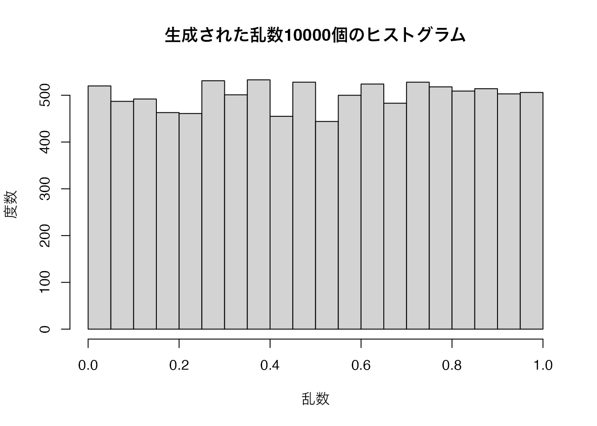

# 関数の自作 {#functions}


## 関数の作成 {#func-intro}

　これまで`class()`や、`sum()`、`print()`など、様々な**関数 (functions)** を使ってきた。「Rで起こるあらゆることは関数の呼び出しである (Everything that happens in R is a function call)」(@Chambers:2016 [p.4]) と言われるように、「Rを使う」ということは、「Rの関数を使う」ということである。

　関数は`関数名()` ように括弧とセットで表記されることが多い。1つの関数でも、括弧の中に異なる引数を指定することで、さまざまな結果を出すことができる。例として、第\@ref(rbasic)章でも説明した`seq()`関数について考えてみよう。この関数を使うと、一連の数字からなるベクトルを作ることができる。`from` で数列の初項を、`to` で数列の最終項を指定し、`by` で要素間の差（第2要素は第1要素に `by` を加えた値になる ）を指定するか、`length.out` で最終的にできるベクトルの要素の数を指定する。

　

　Rを含むプログラミングにおける関数は、何かを入力すると何かを出力する箱のようなものである。関数を使うだけなら、関数という箱の中で何が起こっているかを理解する必要はない。例えば、`mean()` という関数に実数のベクトルを入力すると、平均値を実数として返すということを知っていれば、`mean()` が具体的にどのような計算を行っているかを知らなくても、実用上は問題ない。つまり、関数をブラックボックスとして扱うことができる。


このように1つの関数でも指定する内容は、`by` になったり`length.out` になったりする。`by` や `length.out`、`from`、`to` などのように、関数で指定する対象になっているもののことを **仮引数 (parameter)** と呼ぶ。また、`by = 1` の1や、`length.out = 10` の10のように、仮引数に実際に渡される値のことを**実引数 (argument)** と呼ぶ。特に誤解が生じないと思われる場合には、仮引数と実引数を区別せずに**引数（ひきすう）**と呼ぶ。
Rでは、1つの関数で使う引数の数が複数あることが多いので、**仮引数を明示する**習慣を身につけたほうがよい。
ただし、第1引数（関数で最初に指定する引数）として必ず入力すべきものは決められている場合がほとんどなので、第1引数の仮引数は省略されることが多い。仮引数が省略される代わりに、第1引数の実引数はほぼ必ず入力する（いくつかの例外もある）。


関数とは`()`内の引数のデータを関数内部の手続きに沿って処理し、その結果を返すものです。あるデータを引数として受け付ける関数であれば、その引数を変えるだけで「先ほどとは異なるデータに対し、同じ処理を行う」ことが可能となり、コーディングの労力が省けます。

ここでは、ベクトル`c(1, 2, 3, 4, 5)`の総和を計算する方法について考えてみましょう。まず、1つ目は単純に足し算をする方法があります。


```{.r .numberLines}
1 + 2 + 3 + 4 + 5
```

```
## [1] 15
```

他にも反復処理を使うことも可能です。とりわけ、`1:100`のようなベクトルを1つ目の方法で記述するのは時間の無駄でしょう。`for()`文を使った方法は以下のようになります。


```{.r .numberLines}
Result <- 0

for (i in 1:5) {
  Result <- Result + i  
}
```


```{.r .numberLines}
Result
```

```
## [1] 15
```

数個の数字を足すだけなら方法1の方が楽でしょうし、数百個の数字の場合は方法2の方が効率的です。それでもやはり`sum()`関数の方が数倍は効率的です。また、関数を使うことで、スクリプトの量をへらすこともできます。1から100までの総和なら、方法2の`for (i in 1:5)`を`for (i in 1:100)`に変えることで対応可能ですが、それでも全体としては数行のコードで書かなくてもなりません。一方、`sum(1:100)`なら一行で済みます。

`sum()`はまだマシな方です。たとえば、回帰分析をしたい場合、毎回回帰分析のコードを一から書くのはあまりにも非効率的です。`lm()`関数を使うと、データや回帰式などを指定するだけで、一連の作業を全て自動的に行い、その結果を返してくれます。中には回帰式の係数も計算してくれますが、他にも残差や決定係数なども計算してくれます。その意味で、`lm()`という関数は複数の機能を一つの関数としてまとめたものでもあります。

これらの関数は既にR開発チームが書いた関数ですが、ユーザー側から関数を作成することも可能です。長いコードを書く、同じ作業を繰り返す場合、関数の作成はほぼ必須とも言えます。ここではまず、簡単な関数を作成してみましょう。与えられた数字を二乗し、その結果を返す`myPower()`関数を作ってみましょう。


```{.r .numberLines}
myPower <- function(x) {
  x^2
}
```


```{.r .numberLines}
# 引数が一つしかないので、myPower(24)も可能
myPower(x = 24)
```

```
## [1] 576
```

それではコードを解説します。関数は以下のように定義されます。


```{.r .numberLines}
関数名 <- function (引数名) {
  処理内容
}
```

まず、関数名を`myPower`とし、それが関数であることを宣言します。そして、この関数の引数の名前は`x`とします。それが


```{.r .numberLines}
myPower <- function (x)
```

の部分です。続いて、`{}`内に処理内容を書きます。今回は`x^2`であり、これは`x`の2乗を意味します。そして、関数の処理結果が返されますが、`{}`内の最後の行が結果として返されます。`x^2`の部分は`return(x^2)`と書き換えることも可能です。`return()`は「この結果を返せよ」という意味の関数ですが、返す結果が最後の行である場合、省略可能であり、Hadely先生もこのような書き方を推奨しています。

それでは、もうちょっと複雑な関数を作成してみましょう。ベクトルを引数とし、その和を計算する`mySum()`という関数です。要するに`sum()`関数を再現したものです。


```{.r .numberLines}
# mySum関数を定義し、引数はxのみとする
mySum <- function(x) {
  # 結果を格納するベクトルResultを生成し、0を入れておく
  Result <- 0
  
  # xの要素をiに一つずつ入れながら反復処理
  for (i in x) {
    # Resultに既存のResultの値にiを足した結果を上書きする
    Result <- Result + i
  }
  
  # Resultを返す
  Result
}
```


```{.r .numberLines}
mySum(1:5)
```

```
## [1] 15
```

普通の`sum()`関数と同じ動きをする関数が出来上がりました。よく見ると、上で説明した総和を計算する方法2のコードを丸ごと関数内に入っているだけです。変わったところがあるとすれば、`for()`文であり、`for (i in 1:5)`が`for (i in x)`に変わっただけです。ここの`x`は`mySum <- function (x)`の`x`を意味します。このように関数を一回作成しておくと、これからは総和を出す作業を1行に短縮することができます。

この`mySum()`ですが、一つ問題があります。それは`x`に欠損値が含まれている場合、結果が`NA`になることです。


```{.r .numberLines}
mySum(c(1, 2, 3, NA, 5))
```

```
## [1] NA
```

実際、R内蔵関数である`sum()`も同じですが、`sum()`には`na.rm =`というもう一つの引数があり、これを`TRUE`にすることで欠損値を除いた総和が計算できます。つまり、関数は複数の引数を持つことができます。それでは、`mySum()`を改良してみましょう。ここにも`na.rm`という関数を追加し、`na.rm`引数が`TRUE`の場合、`x`から欠損値を除いた上で総和を計算するようにしましょう。


```{.r .numberLines}
mySum <- function(x, na.rm = FALSE) {
  if (na.rm == TRUE) {
    x <- x[!is.na(x)]
  }
  
  Result <- 0
  
  for (i in x) {
      Result <- Result + i
  }
  
  Result
}
```


```{.r .numberLines}
mySum(c(1, 2, 3, NA, 5))
```

```
## [1] NA
```

```{.r .numberLines}
mySum(c(1, 2, 3, NA, 5), na.rm = FALSE)
```

```
## [1] NA
```

```{.r .numberLines}
mySum(c(1, 2, 3, NA, 5), na.rm = TRUE)
```

```
## [1] 11
```

変わったところは、まず`function (x)`が`function (x, na.rm = FALSE)`になりました。これは`x`と`na.rm`の引数が必要であるが、`na.rm`のデフォルト値は`FALSE`であることを意味します。デフォルト値が指定されている場合、関数を使用する際、その引数は省略できます。実際、`sum()`関数の`na.rm`引数も`FALSE`がデフォルトとなっており、省略可能となっています。

次は最初に条件分岐が追加されました。ここでは`na.rm`が`TRUE`の場合、`x`から欠損値を抜いたベクトルを`x`に上書きするように指定しました。もし、`FALSE`ならこの処理は行いません。

これでR開発チームが作成した`sum()`関数と同じものが出来上がりました。それでは引数の順番について簡単に解説し、もうちょっと複雑な関数を作ってみましょう。引数の順番は基本的に`function()`の`()`内で定義した順番であるなら、引数名を省略することも可能です。


```{.r .numberLines}
mySum(c(1, 2, 3, NA, 5), TRUE)
```

```
## [1] 11
```

ただし、順番を逆にすると、以下のようにわけのわからない結果が返されます。


```{.r .numberLines}
mySum(TRUE, c(1, 2, 3, NA, 5))
```

```
## [1] 1
```

任意の順番で引数を指定する場合、引数名を指定する必要があります。


```{.r .numberLines}
mySum(na.rm = TRUE, x = c(1, 2, 3, NA, 5))
```

```
## [1] 11
```

自分で関数を作成し、他の人にも使ってもらう場合、引数名、順番、デフォルト値を適切に設定しておくことも大事です。

## ちょっと複雑な関数 {#func-adv}

それではちょっとした遊び心を込めた関数を作ってみましょう。その名もドラクエ戦闘シミュレーターです。

以下はドラクエ11のダメージ公式です。

* ダメージの基礎値 = (攻撃力 / 2) - (守備力 / 4)
    * 0未満の場合、基礎値は0とする
* ダメージの幅 = (ダメージの基礎値 / 16) + 1
    * 端数は切り捨てます (`floor()`関数使用)

ダメージの最小値は「ダメージの基礎値 - ダメージの幅」、最大値は「ダメージの基礎値 - ダメージの幅」となります。この最小値が負になることもありますが、その場合は0扱いになります。実際のダメージはこの範囲内でランダムに決まります (`runif()`関数使用)。


```{.r .numberLines}
# DQ_Attack関数を定義
DQ_Attack <- function(attack, defence, hp, enemy) {
  ## 引数一覧
  ## attack: 勇者の力 + 武器の攻撃力 (長さ1の数値型ベクトル)
  ## defence: 敵の守備力 (長さ1の数値型ベクトル)
  ## hp: 敵のHP (長さ1の数値型ベクトル)
  ## enemy: 敵の名前 (長さ1の文字型ベクトル)
  
  # ダメージの基礎値
  DefaultDamage <- (attack / 2) - (defence / 4)
  # ダメージの基礎値が負の場合、0とする
  DefaultDamage <- ifelse(DefaultDamage < 0, 0, DefaultDamage)
  # ダメージの幅
  DamageWidth   <- floor(DefaultDamage / 16) + 1
  
  # ダメージの最小値
  DamageMin     <- DefaultDamage - DamageWidth
  # ダメージの最小値が負の場合、0とする
  DamageMin     <- ifelse(DamageMin < 0, 0, DamageMin)
  # ダメージの最大値
  DamageMax     <- DefaultDamage + DamageWidth
  
  # 敵の残りHPを格納する
  CurrentHP     <- hp
  
  # 残りHPが0より大きい場合、以下の処理を繰り返す
  while (CurrentHP > 0) {
    # ダメージの最小値から最大値の間の数値を1つ無作為に抽出する
    Damage <- runif(n = 1, min = DamageMin, max = DamageMax)
    # 小数点1位で丸める
    Damage <- round(Damage, 0)
    # 残りのHPを更新する
    CurrentHP <- CurrentHP - Damage
    # メッセージを表示
    print(paste0(enemy, "に", Damage, "のダメージ!!"))
  }
  
  # 上記の反復処理が終わったら勝利メッセージを出力
  paste0(enemy, "をやっつけた！")
}
```

初めて見る関数が3つありますね。まず、`floor()`関数は引数の端数は切り捨てる関数です。たとえば、`floor(2.1)`も`floor(2.6)`も結果は2です。続いて、`runif()`関数は指定された範囲の一様分布から乱数を生成する関数です。引数は生成する乱数の個数 (`n`)、最小値 (`min`)、最大値 (`max`)の3つです。`runif(5, 3, 10)`なら最小値3、最大値10の乱数を5個生成するという意味です。正規分布は平均値周辺の値が生成されやすい一方、一様分布の場合、ある値が抽出される確率は同じです。最後に`round()`関数は四捨五入の関数です。引数は2つあり、1つ目の引数は数値型のベクトルです。2つ目は丸める小数点です。たとえば、`round(3.127, 1)`の結果は`3.1`であり、`round(3.127, 2)`の結果は`3.13`となります。

それでは「ひのきのぼう」を装備したレベル1の勇者を考えてみましょう。ドラクエ5の場合、Lv1勇者の力は11、「ひのきのぼう」の攻撃力は2ですので、攻撃力は13です。まずは定番のスライムから狩ってみましょう。スライムのHPと守備力は両方7です。


```{.r .numberLines}
DQ_Attack(13, defence = 7, hp = 7, "スライム")
```

```
## [1] "スライムに6のダメージ!!"
## [1] "スライムに4のダメージ!!"
```

```
## [1] "スライムをやっつけた！"
```

まぁ、こんなもんでしょう。それではスライムナイト (=ピエール)はどうでしょう。スライムナイトのHPのは40、守備力は44です。


```{.r .numberLines}
DQ_Attack(13, defence = 44, hp = 40, "スライムナイト")
```

```
## [1] "スライムナイトに1のダメージ!!"
## [1] "スライムナイトに1のダメージ!!"
## [1] "スライムナイトに0のダメージ!!"
## [1] "スライムナイトに1のダメージ!!"
## [1] "スライムナイトに1のダメージ!!"
## [1] "スライムナイトに0のダメージ!!"
## [1] "スライムナイトに0のダメージ!!"
## [1] "スライムナイトに1のダメージ!!"
## [1] "スライムナイトに1のダメージ!!"
## [1] "スライムナイトに1のダメージ!!"
## [1] "スライムナイトに0のダメージ!!"
## [1] "スライムナイトに1のダメージ!!"
## [1] "スライムナイトに1のダメージ!!"
## [1] "スライムナイトに1のダメージ!!"
## [1] "スライムナイトに0のダメージ!!"
## [1] "スライムナイトに0のダメージ!!"
## [1] "スライムナイトに1のダメージ!!"
## [1] "スライムナイトに1のダメージ!!"
## [1] "スライムナイトに0のダメージ!!"
## [1] "スライムナイトに0のダメージ!!"
## [1] "スライムナイトに1のダメージ!!"
## [1] "スライムナイトに1のダメージ!!"
## [1] "スライムナイトに1のダメージ!!"
## [1] "スライムナイトに1のダメージ!!"
## [1] "スライムナイトに1のダメージ!!"
## [1] "スライムナイトに1のダメージ!!"
## [1] "スライムナイトに0のダメージ!!"
## [1] "スライムナイトに1のダメージ!!"
## [1] "スライムナイトに1のダメージ!!"
## [1] "スライムナイトに0のダメージ!!"
## [1] "スライムナイトに1のダメージ!!"
## [1] "スライムナイトに1のダメージ!!"
## [1] "スライムナイトに0のダメージ!!"
## [1] "スライムナイトに0のダメージ!!"
## [1] "スライムナイトに1のダメージ!!"
## [1] "スライムナイトに1のダメージ!!"
## [1] "スライムナイトに0のダメージ!!"
## [1] "スライムナイトに0のダメージ!!"
## [1] "スライムナイトに0のダメージ!!"
## [1] "スライムナイトに0のダメージ!!"
## [1] "スライムナイトに0のダメージ!!"
## [1] "スライムナイトに0のダメージ!!"
## [1] "スライムナイトに0のダメージ!!"
## [1] "スライムナイトに0のダメージ!!"
## [1] "スライムナイトに1のダメージ!!"
## [1] "スライムナイトに1のダメージ!!"
## [1] "スライムナイトに1のダメージ!!"
## [1] "スライムナイトに0のダメージ!!"
## [1] "スライムナイトに1のダメージ!!"
## [1] "スライムナイトに1のダメージ!!"
## [1] "スライムナイトに1のダメージ!!"
## [1] "スライムナイトに0のダメージ!!"
## [1] "スライムナイトに0のダメージ!!"
## [1] "スライムナイトに1のダメージ!!"
## [1] "スライムナイトに0のダメージ!!"
## [1] "スライムナイトに0のダメージ!!"
## [1] "スライムナイトに1のダメージ!!"
## [1] "スライムナイトに0のダメージ!!"
## [1] "スライムナイトに0のダメージ!!"
## [1] "スライムナイトに1のダメージ!!"
## [1] "スライムナイトに0のダメージ!!"
## [1] "スライムナイトに0のダメージ!!"
## [1] "スライムナイトに1のダメージ!!"
## [1] "スライムナイトに1のダメージ!!"
## [1] "スライムナイトに0のダメージ!!"
## [1] "スライムナイトに0のダメージ!!"
## [1] "スライムナイトに1のダメージ!!"
## [1] "スライムナイトに1のダメージ!!"
## [1] "スライムナイトに0のダメージ!!"
## [1] "スライムナイトに1のダメージ!!"
## [1] "スライムナイトに0のダメージ!!"
## [1] "スライムナイトに1のダメージ!!"
## [1] "スライムナイトに1のダメージ!!"
```

```
## [1] "スライムナイトをやっつけた！"
```

これだと「なんと　スライムナイトが　おきあがりなかまに　なりたそうに　こちらをみている！」のメッセージを見る前に勇者ご一行が全滅しますね。エスターク (HP: 9000 / 守備力: 250)は計算するまでもないでしょう...

以上の関数に条件分岐を追加することで「かいしんの　いちげき！」を入れることもできますし[^Kaisin]、逆に敵からの攻撃を計算して誰が先に倒れるかをシミュレーションすることも可能でしょうね。色々遊んでみましょう。

[^Kaisin]: 一般的に会心の一撃が出る確率は約3.125% (=1/32)または約1.563% (=1/64)と言われています。

## 関数 in 関数 {#func-in-func}

当たり前かも知れまっせんが、自作関数を他の自作関数に含めることもできます。ここでは乱数を生成する関数を作ってみましょう。パソコンだけだと完全な乱数を作成することは不可能ですが[^randomnumber]、乱数に近いものは作れます。このようにソフトウェアで生成された乱数は擬似乱数と呼ばれ、様々なアルゴリズムが提案されています。天才、フォン・ノイマン大先生も乱数生成では天才ではなかったらしく、彼が提案した平方採中法 (middle-square method)は使い物になりませんので、ここではもうちょっとマシな方法である線形合同法 (linear congruential generators; 以下、LCG)を採用します。平方採中法よりは式が複雑ですが、それでも非常に簡単な式で乱数が生成可能であり、Rによる実装に関しては平方採中法より簡単です。ちなみに、線形合同法にも様々な問題があり、Rのデフォルトは広島大学の[松本眞](http://www.math.sci.hiroshima-u.ac.jp/~m-mat/index.html)先生と山形大学の[西村拓士](http://yudb.kj.yamagata-u.ac.jp/html/428_ja.html)先生が開発しましたメルセンヌ・ツイスタ (Mersenne twister)を採用しています。それでは、LCGのアルゴリズムから見ましょう。

[^randomnumber]: 特殊なハードウェアを使えば周囲の雑音や電波などのノイズから乱数を生成することも可能です。

乱数の列があるとし、$n$番目の乱数を$X_n$とします。この場合、$X_{n+1}$は以下のように生成されます。

$$
X_{n+1} = (aX_n + c) \text{ mod } m
$$
$\text{mod}$は余りを意味し、$5 \text{mod} 3$は5を3で割った際の余りですので、2となります。$a$と$c$、$m$は以下の条件を満たす任意の数です。

\begin{align}
0 < &  m, \\
0 < &  a < m, \\
0 \leq &  c < m.
\end{align}

ベストな$a$、$c$、$m$も決め方はありませんが、ここではTurbo Cの設定を真似て$a = 22695477$、$c = 1$、$m = 2^{32}$をデフォルト値として設定します[^lcg_ansi_c]。そして、もう一つ重要なのが最初の数、つまり$X_n$をどう決めるかですが、これは自由に決めて問題ありません。最初の数 ($X_0$)はシード (seed)と呼ばれ、最終的には使わない数字となります。それでは`seed`という引数からある乱数を生成する関数`rng_number()`を作ってみましょう。

[^lcg_ansi_c]: ANSI C標準の場合、$a = 1103515245$、$c = 12345$、$m = 2^{31}$です。


```{.r .numberLines}
rng_number <- function(seed, a = 22695477, c = 1, m = 2^32) {
  (a * seed + c) %% m
}
```

簡単な四則演算のみで構成された関数ですね。ちなみに`%%`は余りを計算する演算子です。とりあえず、`seed`を12345に設定し、一つの乱数を生成してみましょう。


```{.r .numberLines}
rng_number(12345)
```

```
## [1] 1002789326
```

かなり大きい数字が出ました。ちなみに線形合同法で得られる乱数の最大値は$m$、最小値は0です。次は、今回得られた乱数1.0027893\times 10^{9}を新しい`seed`とし、新しい乱数を作ってみましょう。


```{.r .numberLines}
rng_number(1002789326)
```

```
## [1] 3785644968
```

この作業を繰り返すと、(疑似)乱数の数列が得られます。続いて、この作業を`n`回繰り返し、長さ`n`の乱数ベクトルを返す関数`LCG`を作ってみましょう。いかがコードになります。


```{.r .numberLines}
LCG <- function(n, seed, a = 22695477, c = 1, m = 2^32) {
  rng_vec    <- rep(NA, n + 1) # seedも入るので長さn+1の空ベクトルを生成
  rng_vec[1] <- seed           # 1番目の要素にseedを入れる
  
  # iに2からn+1までの値を順次的に投入しながら、反復処理
  for (i in 2:(n+1)) {
    # rng_vecのi番目にi-1番目の要素をseedにした疑似乱数を格納
    rng_vec[i] <- rng_number(rng_vec[i - 1], a, c, m)
  }
  
  rng_vec <- rng_vec[-1] # 1番目の要素 (seed)を捨てる
  rng_vec <- rng_vec / m # 最小値0、最大値1になるように、mで割る
  
  rng_vec # 結果を返す
}
```

それでは、詳細に解説します。

* 1行目: 関数`LCG`を定義し、必要な引数として`n`と`seed`を設定する。
* 2行目: 結果を格納する空ベクトル`rng_vec`を生成。ただし、1番目には`seed`が入るので、長さを`n+1`とする。
* 3行目: `rng_vec`の1番目に`seed`を格納する。
* 6行目: 疑似乱数を`n`回生成し、格納するように反復作業を行う。任意の変数は`i`とし、`i`に代入される値は2から`n+1`までである。
* 8行目: `rng_vec`の`i-1`番目要素を`seed`にした疑似乱数を生成し、`rng_vec`の`i`番目に格納する。1回目の処理だと`i=2`であるため、`rng_vec[1]` (= `seed`)を`seed`にした疑似乱数が生成され、`rng_vec[2]`に格納される。
* 11行目: `rng_vec`の1番目の要素は`seed`であるため、捨てる。
* 12行目: 乱数が最小値0、最大値1になるように、調整する。具体的には得られた乱数を`m` (デフォルトは$2^{32}$)で割るだけである。
* 14行目: 結果ベクトルを返す。

それでは、`seed`を[19861008](https://www.jaysong.net)とした疑似乱数10000個を生成し、`LCG_Numbers`という名のベクトルに格納してみましょう。結果を全て表示させるのは無理があるので、最初の20個のみを確認してみます。


```{.r .numberLines}
LCG_Numbers <- LCG(10000, 19861008)
head(LCG_Numbers, 20)
```

```
##  [1] 0.58848246 0.09900449 0.21707060 0.89462981 0.23421890 0.72341249
##  [7] 0.55965400 0.59552685 0.96594972 0.69050965 0.98383344 0.20136551
## [13] 0.25856502 0.37569497 0.50086451 0.03986446 0.89291806 0.24760102
## [19] 0.27912510 0.24493750
```

正直、これが乱数かどうかは見るだけでは分かりませんね。簡単な確認方法としては、これらの乱数列のヒストグラムを見れば分かります。得られた数列が本当に乱数(に近いもの)なら、その分布は一様分布に従っているからです。ただし、一様分布に従っていることが乱数を意味するものではありません。

可視化については第\@ref(visualization1)章以降で解説しますが、ここでは簡単に`hist()`関数を使ってみましょう。必要な引数はnumeric型のベクトルのみです。以下のコードにある`xlab =`などはラベルを指定する引数ですが、省略しても構いません。


```{.r .numberLines}
hist(LCG_Numbers, xlab = "乱数", ylab = "度数", 
     main = "生成された乱数10000個のヒストグラム")
```



ややギザギザしているように見えますが[^largenumber]、これなら一様分布だと考えて良いでしょう。

[^largenumber]: 1万個ではなく、100万個、1億個など乱数を生成すればするほど、一様分布に近づきます。

---

## 練習問題 {#func-exercise .unnumbered}

**問1**

* 長さ2のnumericベクトル`Data`について考える。条件分岐を用いて`Data`の1番目の要素 (`Data[1]`)が2番目の要素 (`Data[2]`)より大きい場合、1番目の要素と2番目の順番を逆転させる条件分岐を作成せよ。たとえば、`Data <- c(5, 3)`なら、条件分岐後の`Data`の値が`c(3, 5)`になること。

**問2**

* 与えられた正の実数の平方根を求める`my_sqrt()`を作成する。平方根を計算する方法はHero of Alexandriaの近似法[^heron]を使用する。
    1. 平方根を求める`x`、任意の初期値`g`、非常に小さい正の実数`e`を入力する。`e`の既定値は0.001とする。
    2. `g`の2乗を計算し、`x - g^2`の絶対値を`gap`とする（`gap`の初期値は`Inf`とする）。
    3. `gap`が`e`より小さい場合、`g`を`x`の平方根として返す。
    4. `gap`が`e`より大きい場合、`g + (x / g)`を新しい`g`とする。
    5. 2へ戻る。
* `while()`関数を使えば簡単である。

[^heron]: 実はこの方法はアレクサンドリアのヘロンが考案したものではないと言われており、もっと昔の古代バビロニアで使用されたと推測される。


```{.r .numberLines}
# Rのsqrt()関数
sqrt(29)
```

```
## [1] 5.385165
```

```{.r .numberLines}
# 計算例1
my_sqrt(29, 5) # 29の平方根。初期値は5
```

```
## [1] 5.385185
```

```{.r .numberLines}
# 計算例2
my_sqrt(29, 5, e = 0.00001) # 29の平方根。初期値は5。eは0.00001
```

```
## [1] 5.385165
```

```{.r .numberLines}
# 計算例3
my_sqrt(-3, 5, e = 0.00001) # あえてエラーを出してみる
```

```
## Error in my_sqrt(-3, 5, e = 1e-05): xは正の実数でなければなりません。
```

**問3**

* 問3ではベクトルの1番目要素と2番目の要素を比較し、前者が大きい場合において順番を入れ替える条件分岐を行った。これを長さ3以上のベクトルにも適用したい。長さ4のnumeric型ベクトル`Data`がある場合の計算手順について考えてみよう。
    1. `Data[1]`と`Data[2]`の要素を比較し、`Data[1] > Data[2]`の場合、入れ替える。
    2. `Data[2]`と`Data[3]`の要素を比較し、`Data[2] > Data[3]`の場合、入れ替える。
    3. `Data[3]`と`Data[4]`の要素を比較し、`Data[3] > Data[4]`の場合、入れ替える。この段階で`Data[4]`は`Data`の最大値が格納される。
    4. 続いて、`Data[1]`と`Data[2]`の要素を比較し、`Data[1] > Data[2]`の場合、入れ替える。
    5. `Data[2]`と`Data[3]`の要素を比較し、`Data[2] > Data[3]`の場合、入れ替える。この段階で`Data[3]`には`Data`の2番目に大きい数値が格納される。
    6. 最後に`Data[1]`と`Data[2]`の要素を比較し、`Data[1] > Data[2]`の場合、入れ替える。ここで並び替えは終了
* **ヒント:** 2つの`for()`文が必要となる。これは「[バブルソート](https://ja.wikipedia.org/wiki/バブルソート)」と呼ばれる最も簡単なソートアルゴリズムである。イメージとしては、長さNのベクトルの場合、n番目の要素とn+1番目の要素を比較しながら、大きい方を後ろの方に追い込む形である。最初は、`Data[4]`最後の要素に最大値を格納し、続いて、`Data[3]`に次に大きい数値を、`Data[2]`に次に大きい数値を入れる仕組みである。
    * 最初は`Data[1]`と`Data[2]`、`Data[2]`と`Data[3]`、`Data[3]`と`Data[4]`の3ペアの比較を行う。
    * 続いて、`Data[1]`と`Data[2]`、`Data[2]`と`Data[3]`の2ペアの比較を行う
    * 最後に、`Data[1]`と`Data[2]`の1ペアの比較を行う
    * つまり、外側の`for()`文は「`Data`の長さ-1」回繰り返すことになる。
    * 内側の`for()`文は3, 2, 1ペアの比較を行うことになる。

**問4**

* 「問4」の練習問題で作成したコードを関数化せよ。関数名は`mySort()`であり、引数は長さ2以上のnumeric型ベクトルのみである。引数名は自由に決めても良いし、`data`や`x`などを使っても良い。

**問5**

* 既に作成した`DQ_Attack`関数を修正してみよう。今の関数は通常攻撃のみであるが、稀に「会心の一撃」が発生するように修正する。
    * 会心の一撃が発生する確率は1/32とする (Hint: 0から1の間の乱数を生成し、その乱数が1/32以下であるか否かで条件分岐させる)。乱数の生成は`runif()`または、自作関数の`LCG()`でも良い。
    * 会心の一撃のダメージの最小値は攻撃力の95%、最大値は105%とする。
    * 会心の一撃が発生したら、`"かいしんのいちげき! スライムに10のダメージ!!"`のようなメッセージを出力させること。

**問6**

* 与えられたベクトル`x`から`n`個の要素を無作為に抽出する関数、`mySample()`を定義せよ。`mySample()`の引数は`x`と`n`、`seed`とし、`x`は長さ1以上のベクトルとする。`n`は長さ1の整数型ベクトルである。
    * 以下の場合、エラーメッセージを出力し、処理を中止させること。
        * `n`と`seed`が長さ1ベクトルでない場合、
        * `seed`がnumeric型でない場合
        * `n`が整数でない場合 (`floor(n) == n`で判定)
    * **ヒント:** `LCG()`関数を用いて乱数を生成した場合、生成された擬似乱数は0以上1以下である。ベクトル`x`の長さを`length(x)`とした場合、擬似乱数に`length(x)`を掛けると、擬似乱数は0以上`length(x)`以下になる。これらの値を切り上げると (`ceiling()`関数)、その値は1以上`length(x)`以下の整数となる。
