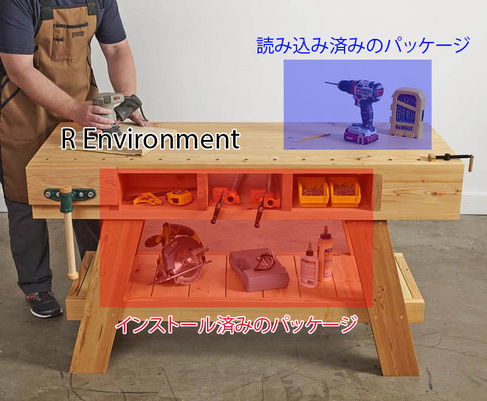
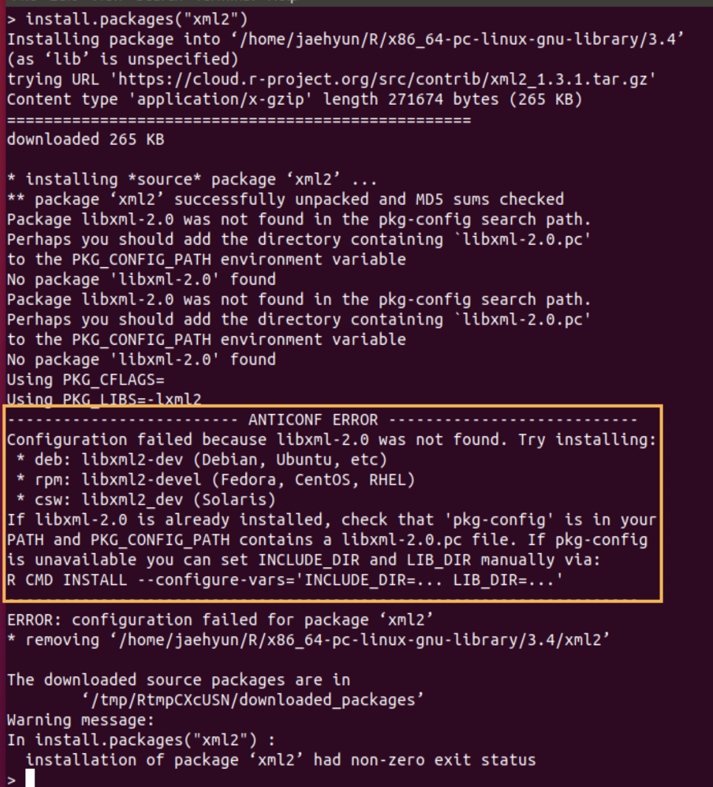

# Rパッケージ {#packages}


## パッケージとは {#packages_intro}

　Rには様々な関数 (functions) が提供されている。平均値を求める`mean()`、合計を求める`sum()`、線形回帰分析を行う`lm()`、平均値の検定を行う`t.test()`などがあり、全てを列挙することはできない。しかし、データ分析の技術は日々発展し、Rがデフォルトで提供する関数では不可能ではないが、かなり長いコードが必要な分析を使わざる得ないケースもあろう。Rは開発元だけでなく、誰でも関数を作ることができる。通常なら数百行のコードが必要な分析を一行のコードで実行可能とする関数を多くのRユーザーが作ってきた。これらの関数を集めたのがパッケージである。Rにはグラフ作成に特化したパッケージ、機械学習に特化したパッケージ、テキスト分析に特化したパッケージなど、数千のパッケージが開発されている。このパッケージの豊富さがRの最大のメリットでもある。誰かが新しい分析手法を提案したら、数日内、あるいはその手法が論文として出版される前からRパッケージとして公開されるケースが多い。

　本章ではパッケージをインストールし、読み込む方法について説明する。また、パッケージの管理をアシストするパッケージ、{pacman}の使い方についても紹介する。

---

## パッケージのインストール {#packages_install}

　Rの環境は何かを作るための作業台に似ている。作業台にはモノを作るために材料だけでなく、工具・道具セットなども置いたりもする。この作業台がRにおける「環境 (environment) 」であり、材料がベクトルや行列、データフレームなどのデータ、工具セットがパッケージになる。データについては後で説明するとし、ここではパッケージについて考えたい。

　モノを作るためには素材・材料だけでは不十分だろう。多くの場合、なんらかの道具セットが必要となる。Rには既にいくつかの必須道具セットを用意されているが、他にも様々な道具セットがある。そして、これら道具セットには、一般的に複数の道具が含まれている。一つ一つの道具のことを、ここでは「関数 (function) 」と呼ぶ。これらの道具セットを購入し、作業台の収納に入れておくことがパッケージをインストールすることである。


```{.r .numberLines}
install.packages("パッケージ名")
```

　これらのパッケージは基本的に[CRAN](https://cran.r-project.org)というRの公式道具屋からダウンロード・インストールされる。もう一つの大きな道具屋としては[GitHub](https://github.com)がある[^repo_etc]。[GitHub](https://github.com)は個人経営の道具屋が集まっているモールのようなものである。[GitHub](https://github.com)道具屋を使用するためには、予め[CRAN](https://cran.r-project.org)から{devtools}、または{remotes}というパッケージをインストールしておく必要がある。

[^repo_etc]: 他にも[GitLab](https://about.gitlab.com)、[Bitbucket](https://bitbucket.org/product/)などがある。

　ここでは{devtools}というパッケージをインストールしてみよう。{devtools}はCRANに登録されているため、`install.pcakges()`関数でインストールできる。パッケージ名を`"`で囲むことを忘れないこと。


```{.r .numberLines}
install.packages("devtools")
```

　もし、[CRAN](https://cran.r-project.org)に登録されていないパッケージを[GitHub](https://github.com)からインストールするなら、{devtools}パッケージ、または{remotes}の`install_github()`関数を使う。


```{.r .numberLines}
# あらかじめ{devtools}、または{remotes}をインストールしておく
# {remotes}をインストールした場合は、remotes::install_github()を使用する
devtools::install_github("作成者のGitHubのID/パッケージ名")
```

　たとえば、筆者 (Song) が作成しました{[BalanceR](https://github.com/JaehyunSong/BalanceR)}パッケージがインストールしたいなら、以下のように打つ。


```{.r .numberLines}
# {remotes}をインストールした場合は、
# remotes::install_github("JaehyunSong/BalanceR")
devtools::install_github("JaehyunSong/BalanceR")
```

　ここで`JaehyunSong`はSongのGitHub IDであり、`BalanceR`はパッケージ名である。

---

## パッケージの読み込み {#packages_library}

　先ほど述べたように、パッケージのインストールは道具セットの購入と収納に似ている。ただし、実際に道具セットを使うためには、それを自分の作業台上に載せた方が効率がいいだろう[^default-pacakge] [^load_direct]。この作業がパッケージの読み込み (load) である。インストールしたパッケージを読み込むには`library()`または`require()`関数を使う。`require()`は関数内に使う目的で設計された関数だが、パッケージを読み込むという点では全く同じである。

<div class="figure" style="text-align: center">

<p class="caption">(\#fig:packages_load_1)Rパッケージと作業環境</p>
</div>

[^default-pacakge]: `mean()`や`sum()`、`lm()`のように、よく使われる関数 (=工具)はR起動と同時に作業台上に載せられる。

[^load_direct]: 作業台上に載せずに、収納から必要な時だけ道具を取り出して使うことも可能である。この場合、`パッケージ名::関数名()`のように関数を使う。よく使うパッケージなら読み込んだ方が効率的だが、1、2回くらいしか使わないパッケージなら、このような使い方も良いだろう。


```{.r .numberLines}
library("パッケージ名")
#または
require("パッケージ名")
```

　読み込まれたパッケージはセッションが開かれている時のみに有効である。一通りの作業が終わり、作業部屋から退出すると、作業台上の道具セットは収納に自動的に戻される。つまり、RまたはRStudioを閉じると読み込まれたパッケージは自動的に取り外されるということである。しかし、作業の途中に読み込んだパッケージをセッションから取り外したい時があるかも知れない。この場合、`detach()`関数を使う。


```{.r .numberLines}
detach("パッケージ名")
```

---

## パッケージのアップデート {#packages_update}

　Rパッケージはバグが修正されたり、新しい機能 (=関数) が追加されるなど、日々更新される。できる限りパッケージは最新版に維持した方が良いだろう。パッケージのアップデートはパッケージのインストールと同じである。{dplyr}というパッケージを最新版にアップデートしたい場合、`install.packages("dplyr")`で十分である。

　しかし、Rを使っていくうちに数十個のパッケージをインストールしていくこととなり、一つ一つアップデートするのは面倒だろう。そもそも既に最新版が入っていて (または開発休止/中止)、アップデートが不要なパッケージがあるかも知れない。実はRStudioを使えば、アップデートが必要なパッケージのリストが表示され、一気にアップデートすることができる。RStudioのPackagesペインにある「Update」をクリックしてみれば、アップデート可能なパッケージの一覧が表示される。ここでアップデートしたいパッケージの左にチェックをするか、下段の「Select All」を選択して「Install Updates」をクリックすれば、チェックされているパッケージがアップデートされる。

　ただし、場合によってはアップデート時、以下のようなメッセージがコンソールに表示されるかも知れない。

```
  There are binary versions available but the source versions
  are later:
      binary source needs_compilation
terra 1.5-17 1.5-21              TRUE
yaml   2.2.2  2.3.4              TRUE

Do you want to install from sources the packages which need compilation? (Yes/no/cancel)
```

　**コンソール**にYes、no、cancelのいずれかを入力してReturnキー (Enterキー)を押す必要がある。どうしても最新のパッケージが欲しい場合はYesを入力すれば良いが、インストールに時間がかかる場合がある。一方、noを入力した場合は、若干古いバージョンがインストールされるが、インストールに必要な時間が短いため、基本的にはnoでも問題ないだろう。cancelを入力した場合はアップデートが全てキャンセルされる。

---

## {pacman}によるパッケージ管理 {#packages_pacman}

　CRANとGitHubなどには数千のRパッケージが公開されており、Rの使用歴が長くなればインストールされているパッケージが増えたり、一つのスクリプト内で使用するパッケージも増えていくだろう。また、パッケージは他のパッケージの機能に依存することがほとんどなので、自分の想像以上の数のパッケージがインストールされているかも知れない。このように膨大な数のパッケージを管理するためのパッケージが{pacman}である。{pacman}はCRANから入手可能である。


```{.r .numberLines}
install.packages("pacman")
```

### インストール

　パッケージをCRANからインストールには`p_install()`関数を使用する。使い方は`install.packages()`と同じであり、複数のパッケージをインストールしたい場合はパッケージ名の箇所に`c(パッケージ名1, パッケージ名2, ...)`を入れる。パッケージ名は`"`で囲んでも、囲まなくても良い。GitHubに公開されているパッケージは`p_install_gh()`関数を使用する。これは{devtools}、または{remotes}の`install_github()`と同じ使い方となり、必ず`"`で囲む必要がある。

　これらの関数を使う際、わざわざ`library(pacman)`を使う必要はない。パッケージのインストールや、読み込みなどはコード内に何回も使われることがほとんどないため、{pacman}を読み込まず`pacman::関数名()`で当該関数を使うことができる。


```{.r .numberLines}
# CRANからインストール
pacman::p_install(パッケージ名)
# githubからインストール
pacman::p_install_gh("作成者のGitHubのID/パッケージ名") 
```

### 読み込み

　パッケージの読み込みには`p_load()`関数を使い、実はこの関数は{pacman}を使う最も大きな要素である。`p_load()`関数の使い方は以下の通りである。


```{.r .numberLines}
pacman::p_load(パッケージ名)
```

　`p_load()`の便利なところは (1) 複数のパッケージが指定可能であることと、 (2) インストールされていないパッケージはCRANから自動的にインストールして読み込んでくれる点だ。たとえば、{tidyverse}と{broom}、{estimatr}という3つのパッケージを読み込む場合、`library()`関数を使うと以下のようになる。


```{.r .numberLines}
# library() を使う場合
library(tidyverse)
library(broom)
library(estimatr)
```

　一方、{pacman}の`p_load()`を使えば、以下のように3つのパッケージを読み込むことができる。


```{.r .numberLines}
# {pacman}のp_load() を使う場合
pacman::p_load(tidyverse, broom, estimatr)
```

　また、`p_load()`内のパッケージがインストールされていない場合、CRANのパッケージリストから検索し、そのパッケージをインストールしてくれる。したがって、上で紹介した`p_install()`は実質的に使うケースはほぼない。ただし、GitHub上のパッケージは自動的にインストールしてくれない。たとえば、GitHub上のみにて公開されている{BlanceR}パッケージがインストールされていない場合、`p_load(BalanceR)`を実行しても{BalanceR}はインストールされない[^p_load_gh]。あらかじめ`p_install_gh()`でインストールしておく必要がある。

[^p_load_gh]: GitHubからパッケージを検索し、インストール&読み込みをする`p_load_gh()`という関数もある。たとえば、`pacman::p_load_gh("JaehyunSong/BalanceR")`を実行した場合、{BalanceR}パッケージがインストールされていると読み込みのみ行い、インストールされていない場合はJaehyunSongレポジトリから{BalanceR}をインストールし、読み込む。コードの最上段に`p_load()`を使うなら、`p_load()`と`p_load_gh()`を分けて記述するのも良いだろう。

### アップデート

　{pacman}にはアップデートが可能なパッケージを全てアップデートしてくれる`p_update()`という関数も用意されている。使い方は簡単で、コンソール上に`p_update()`のみの入力すれば良い。ただし、一部のパッケージのみをアップデートしたいのであれば、RStudioが提供するアップデート機能を使った方が良いかも知れない[^pacman_update]。

[^pacman_update]: `p_update(ask = TRUE)`を実行すれば個々のパッケージに対してアップデートするかどうかを決めることができるが、面倒である。

　また、同じ機能の関数として`p_up()`があるが、コードの可読性のために`p_update()`の方を推奨したい。


```{.r .numberLines}
pacman::p_update()
```

---

## 必須パッケージのインストール {#packages_tidyverse}

　ここでは現在のRにおいて必須パッケージである{tidyverse}をインストールする。{tidyverse}は{dplyr}、{ggplot2}、{tidyr}など、Rにおいて不可欠なパッケージを含むパッケージ**群**である。また、上で紹介した{devtools}も今のうちにインストールしておこう。既に導入済みの読者は走らせなくても良い。


```{.r .numberLines}
install.packages("tidyverse")
install.packages("devtools")
```

<!--
### パッケージのインストールが出来ない場合 (Ubuntu)

パッケージのインストールの祭、エラーが出る場合があります。とりわけ、R導入直後は必要とするライブラリがインストールされていないケースが多く、以下のようなエラーメッセージが表示されるケースがあります。

<div class="figure" style="text-align: center">

<p class="caption">(\#fig:unnamed-chunk-1)必要なライブラリがない場合</p>
</div>

これは`xml2`パッケージをインストールしようとした時に表示されたメッセージです。これはUbuntuに`libxml-2.0`というライブラリが入っていないことを意味します。解決方法は、このライブラリを導入することですが、OSによってインストールに必要なライブラリ名が異なります。UbuntuはDebian系列のOSであるため、`deb`行を確認します。どうやら`libxml2-dev`をインストールすれば良いようです。したがって、新しいTerminalを起動し、`R`と同じやり方で`libxml2-dev`をインストールします。

```
sudo apt-get install libxml2-dev
```

もう一回`xml2`をインストールすれば、問題なくインストールされるでしょう。
-->
