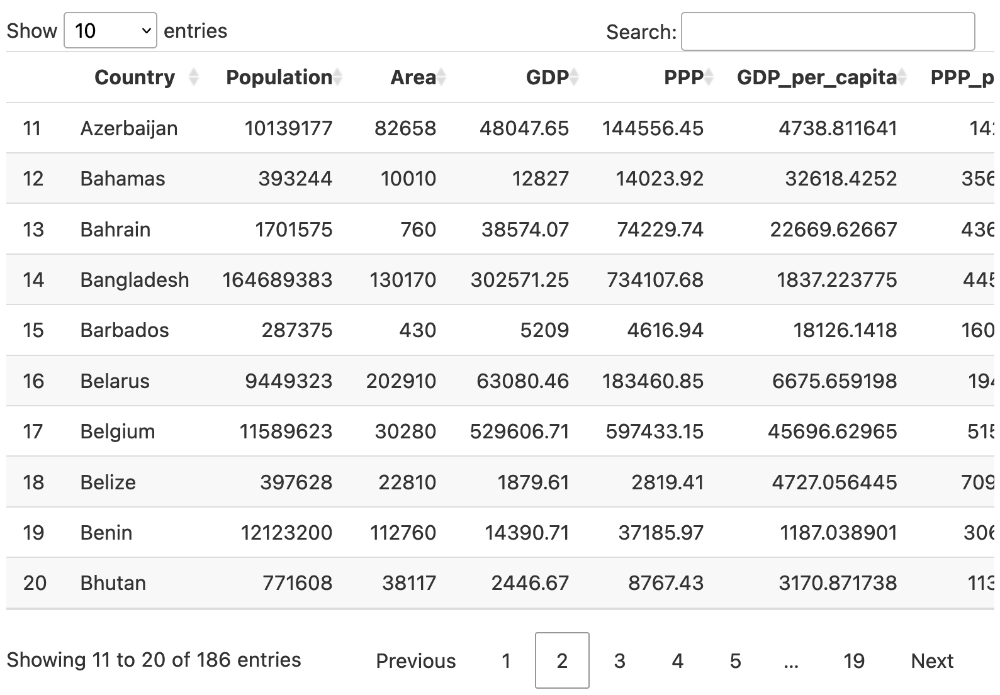

# 表の作成 {#table}

```{r table-common}
#| include: FALSE
source("_common.R")
```

```{r table-setup}
#| message: FALSE
#| warning: FALSE
pacman::p_load(tidyverse, kableExtra, gt, DT)

country_df <- read_csv("Data/Countries.csv")
```

HTML出力のみならどっちでも問題ないが、{gt}が使いやすい。

ただし、{gt}は開発途上であり、PDF出力との相性が現在 (`r Sys.Date()`)、優れているとはいい難いので、PDF出力まで考えているのであれば{knitr}の`kable()` + {kableExtra}を推奨

LaTeX出力とHTML出力の見た目が異なるため、調整が必要

## {kableExtra}の使い方 {#table-kbl}

`country_df`の`Population` (100万で割った値)、`Area` (1万で割った値)、`GPP_per_capita` (1万で割った値)、`PPP_per_capita` (1万で割った値)、`HDI_2018`、`Polity_Score`、`FH_Total`の記述統計

コード入力が面倒であれば、コピペでOK

```{r table-kbl-1}
country_desc <- country_df %>%
    mutate(Population     = Population / 1000000,
           Area           = Area / 10000,
           GDP_per_capita = GDP_per_capita / 10000,
           PPP_per_capita = PPP_per_capita / 10000) %>%
    select(Population, Area, GDP_per_capita, PPP_per_capita, 
           HDI_2018, Polity_Score, FH_Total) %>%
    summarise(across(everything(),
                     .fns = list("Mean" = ~mean(.x, na.rm = TRUE),
                                 "SD"   = ~sd(.x, na.rm = TRUE),
                                 "Min"  = ~min(.x, na.rm = TRUE),
                                 "Max"  = ~max(.x, na.rm = TRUE),
                                 "Obs"  = ~sum(!is.na(.x))),
                     .names = "{.col}-{.fn}")) %>%
    pivot_longer(cols = everything(),
                 names_to = "Label",
                 values_to = "Value") %>%
    separate(col  = "Label",
             into = c("Variable", "Stat"),
             sep  = "-") %>%
    pivot_wider(names_from  = Stat,
                values_from = Value)
```

```{r table-kbl-2}
country_desc
```

{summarytools}の`descr()`を使う場合

```{r table-kbl-3}
#| message: FALSE
pacman::p_load(summarytools)

country_desc <- country_df %>%
    mutate(Population     = Population / 1000000,
           Area           = Area / 10000,
           GDP_per_capita = GDP_per_capita / 10000,
           PPP_per_capita = PPP_per_capita / 10000) %>%
    select(Population, Area, GDP = GDP_per_capita, PPP = PPP_per_capita, 
           HDI = HDI_2018, Polity = Polity_Score, FreedomHouse = FH_Total) %>%
    descr(stats = c("mean", "sd", "min", "max", "n.valid"),
          order = "preserve", transpose = TRUE) %>%
    as.data.frame() %>%
    rownames_to_column("Variable") %>%
    rename(SD = Std.Dev, Obs = N.Valid) %>%
    as_tibble()
```

```{r table-kbl-4}
country_desc
```

### 表の出力

```{r table-kbl-5}
kbl(country_desc)
```

小数点桁数の調整

```{r table-kbl-6}
country_desc %>%
    kbl(digits = 3)
```

表の幅 (HTML限定)

```{r table-kbl-7, eval = if(knitr::is_latex_output()) FALSE else TRUE}
country_desc %>%
    kbl(digits = 3) %>%
    kable_styling(full_width = FALSE)
```

### 列の操作

列名の修正

全ての列を指定する必要がある

```{r table-kbl-8}
country_desc %>%
    kbl(col.names = c("変数", "平均値", "標準偏差", 
                      "最小値", "最大値", "観察数"),
        digits = 3)
```

列の揃え

全ての列を指定する必要がある

```{r table-kbl-9}
# 不要だが、あえてVariable列を中央揃えにする
country_desc %>%
    kbl(align = c("crrrrr"),
        digits = 3)
```

### タイトル、フットノート

```{r table-kbl-10}
country_desc %>%
    kbl(caption = "記述統計表", digits = 3)
```

```{r table-kbl-11}
country_desc %>%
    kbl(caption = "記述統計表", digits = 3) %>%
    footnote(general       = "『私たちのR』のサンプルデータ",
             general_title = "出典:")
```

```{r table-kbl-12}
country_desc2 <- country_desc

names(country_desc2)[4:5] <- paste0(names(country_desc2)[4:5],
                                    footnote_marker_number(1))
names(country_desc2)[6] <- paste0(names(country_desc2)[6],
                                  footnote_marker_number(2))

country_desc2 %>%
    kbl(caption = "記述統計表", escape = FALSE, digits = 3) %>%
    footnote(general = "出典: 『私たちのR』のサンプルデータ",
             number  = c("欠損値を除く", "欠損していないケース数"))
```

### グループ化

列のグループ化

グループ化しない列のラベルは`""`でなく、`" "`にする。

```{r table-kbl-13}
country_desc %>%
    kbl(digits = 3) %>%
    add_header_above(c(" " = 3, "Range" = 2, " " = 1))
```

行のグループ化

```{r table-kbl-14}
country_desc %>%
    kbl(digits = 3) %>%
    pack_rows("Demographic factors", 1, 2) %>%
    pack_rows("Economic factors", 3, 5) %>%
    pack_rows("Political factors", 6, 7)
```

```{r table-kbl-15}
country_desc3 <- country_desc %>%
    mutate(Factor  = c(rep("Demographic", 2),
                       rep("Economic", 3),
                       rep("Political", 2)),
           .before = Variable)

country_desc3 %>%
    kbl(digits = 3)
```

```{r table-kbl-16}
country_desc3 %>%
    kbl(digits = 3) %>%
    collapse_rows(columns = 1, valign = "top")
```


### セルの色分け（HTML限定）

{formattable}パッケージ使用

```{r table-kbl-17, eval = if(knitr::is_latex_output()) FALSE else TRUE}
country_desc4 <- country_df %>%
    mutate(Population     = Population / 1000000,
           Area           = Area / 10000,
           GDP_per_capita = GDP_per_capita / 10000,
           PPP_per_capita = PPP_per_capita / 10000) %>%
    select(HDI_2018, 
           Population, Area, GDP = GDP_per_capita, PPP = PPP_per_capita, 
           Polity = Polity_Score, FreedomHouse = FH_Total) %>%
    drop_na() %>%
    cor() %>%
    as.data.frame() %>%
    rownames_to_column("Variable") %>%
    select(Variable, Cor = HDI_2018) %>%
    filter(Variable != "HDI_2018")
```

```{r table-kbl-18, eval = if(knitr::is_latex_output()) FALSE else TRUE}
country_desc4 %>%
    kbl(digits = 3)
```

```{r table-kbl-19, eval = if(knitr::is_latex_output()) FALSE else TRUE}
pacman::p_load(formattable)

country_desc4$Cor2 <- color_text("blue", "red")(sprintf("%.3f", country_desc4$Cor))
country_desc4$Cor3 <- color_tile("white", "mistyrose")(sprintf("%.3f", country_desc4$Cor))

country_desc4 %>%
    kbl(col.names = c("変数", "数字のみ", "文字色", "色塗り"),
        digits = 3, escape = FALSE) %>%
    add_header_above(c(" " = 1, "人間開発指数との相関係数" = 3))
```

### テーマ

```{r table-kbl-20, eval = if(knitr::is_latex_output()) FALSE else TRUE}
country_desc %>%
    kbl(digits = 3) %>%
    kable_paper()
```

```{r table-kbl-21, eval = if(knitr::is_latex_output()) FALSE else TRUE}
country_desc %>%
    kbl(digits = 3) %>%
    kable_classic()
```

```{r table-kbl-22, eval = if(knitr::is_latex_output()) FALSE else TRUE}
country_desc %>%
    kbl(digits = 3) %>%
    kable_classic_2()
```

```{r table-kbl-23, eval = if(knitr::is_latex_output()) FALSE else TRUE}
country_desc %>%
    kbl(digits = 3) %>%
    kable_minimal()
```

```{r table-kbl-24, eval = if(knitr::is_latex_output()) FALSE else TRUE}
country_desc %>%
    kbl(digits = 3) %>%
    kable_material()
```

```{r table-kbl-25, eval = if(knitr::is_latex_output()) FALSE else TRUE}
country_desc %>%
    kbl(digits = 3) %>%
    kable_paper(bootstrap_options = "striped",
                full_width        = FALSE)
```

```{r table-kbl-26, eval = if(knitr::is_latex_output()) FALSE else TRUE}
country_desc %>%
    kbl(digits = 3) %>%
    kable_paper(bootstrap_options = c("striped", "condensed"),
                full_width        = FALSE)
```

他にも`"hover"`や`"responsive"`、`"bordered"`あり

テーマを変更せずにスタイルを変更したい場合は`kable_styling()`を使用

## {gt}の使い方 {#table-gt}

そのまま`country_desc`を使用

表の出力

```{r table-gt-1}
gt(country_desc)
```

小数点桁数の調整

```{r table-gt-2}
country_desc %>%
    gt() %>%
    fmt_number(columns = 2:5, decimals = 3)
```

## データの出力 {#table-dataout}

通常の出力の場合

```{r table-dataout-1}
country_df
```

{DT}パッケージの`datatable()`関数を使用した場合

```{r table-dataout-2}
#| eval: FALSE
datatable(country_df)
```

`r if (knitr::is_latex_output()) '<!--'` 

```{r table-dataout-3}
#| echo: FALSE
datatable(country_df)
```

`r if (knitr::is_latex_output()) '-->'`

`r if (knitr::is_html_output()) '<!--'` 

```{r table-dataout-4}
#| echo: FALSE
#| out.width: "100%"

```

`r if (knitr::is_html_output()) '-->'`