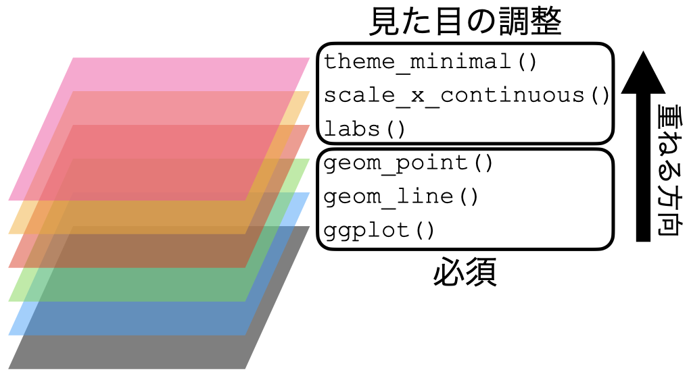
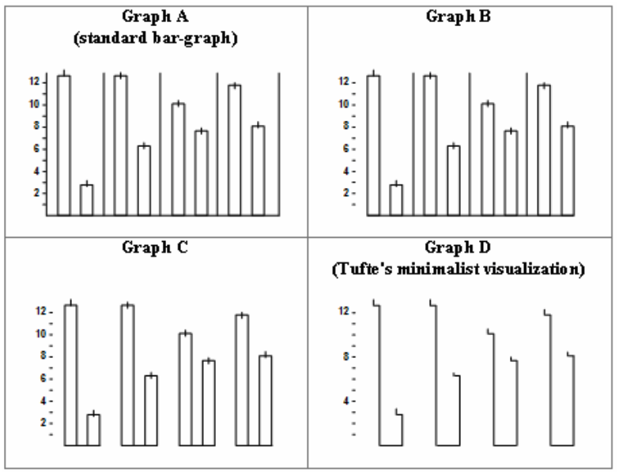

# (PART) 可視化 {-}

# 可視化[理論] {#visualization1}

```{r visual1-common, include = FALSE}
source("_common.R")
```

## 可視化のためのパッケージ {#visual-packages}

Rによる可視化は様々な方法がありますが、可視化のために使うパッケージとして代表的なものは (1) パッケージを使わない方法、(2) {lattice}パッケージ、(3) {ggplot2}パッケージがあります。ここでは、以下のデータ (表\@ref(tab:visual1-sampledata))を可視化しながら、それぞれの特徴について簡単に解説します。

```{r visual1-setup, echo = FALSE, message = FALSE}
pacman::p_load(lattice)

Country_df <- read_csv("Data/Countries.csv")

Country_df <- Country_df %>%
  mutate(PPP_per_capita = round(PPP_per_capita),
         OECD = factor(OECD, levels = 0:1, 
                       labels = c("非加盟国", "加盟国"))) %>%
  select(Country, 
         PPP = PPP_per_capita,
         HDI = HDI_2018,
         OECD) %>%
  filter(complete.cases(Country_df))
```

```{r visual1-sampledata, echo = FALSE}
head(Country_df, 10) %>%
    kable(caption = "サンプルデータの最初の10行") %>%
    kable_styling(full_width = FALSE)
```

このデータは各国 (`Country`) の一人当たり購買力平価基準GDP (`PPP`)、人間開発指数 (`HDI`)、OECD加盟有無 (`OECD`)の変数で構成されています。このデータを使って横軸は`PPP`、縦軸は`HDI`とし、`OECD`の値によって色分けしたグラフを作成します。

### Base R

Rは統計学、データ分析に特化したプログラミング言語であるため、別途のパッケージなしで作図が可能です。後ほど紹介する{lattice}や{ggplot2}を用いた作図とは違って、Base Rによる作図は、紙にペンでグラフを書くイメージに近いです。キャンバスを用意し、そこにペンで点や線を描く感じです。これはレイヤーという概念を導入した{ggplot2}に近いかも知れませんが、{ggplot2}はレイヤーを変更出来る一方、Base Rは図が気に入らない場合、一からやり直しです。つまり、キャンバスに引いた線や点は消すことができません。また、作成した図はオブジェクトとして保存することが出来ないため、もう一度図示するためには一から書く必要があります。Base Rによる作図は短所だけでなく、メリットもあります。まず、パッケージを必要としないため、Rインストール直後から使える点です。そして、{lattice}や{ggplot2}よりも速いです。他にも人によってはBase Rの方がシンプルでかっこいいという方もいますが、これは好みの問題でしょう。

以下の図\@ref(fig:visual1-baser)はBase Rを使った散布図の例です。

```{r visual1-baser, fig.width = 6, fig.height = 4, cache = TRUE, fig.cap = "Base Rによるグラフ"}
# Base Rを用いた作図の例
plot(x = Country_df$PPP, y = Country_df$HDI, pch = 19, 
     col = ifelse(Country_df$OECD == "加盟国", "red", "blue"),
     xlab = "一人当たり購買力平価GDP (USD)", ylab = "人間開発指数")
legend("bottomright", pch = 19,
       legend = c("OECD加盟国", "OECD非加盟国"), 
       col    = c("red", "blue"))
```

### {lattice}パッケージ

{lattice}は[Deepayan Sarkar](https://www.isid.ac.in/~deepayan/)によって開発された可視化パッケージです。このパッケージの最大特徴は「1つの関数で可視化が出来る」点です。作図に必要な様々な情報が1つの関数内に全て入ります。むろん、指定しない情報に関しては多くの場合、自動的に処理してくれます。

図\@ref(fig:visual1-baser)を{lattice}を使って作る場合は以下のようなコードになります。

```{r visual1-lattice, warning = FALSE, fig.width = 6, fig.height = 4, cache = TRUE, fig.cap = "{lattice}によるグラフ"}
# latticeを用いた作図の例
xyplot(HDI ~ PPP, data = Country_df,
       group = OECD, pch = 19, grid = TRUE,
       auto.key = TRUE,
       key = list(title     = "OECD加盟有無",
                  cex.title = 1,
                  space     = "right",
                  points    = list(col = c("magenta", "cyan"),
                                   pch = 19),
                  text      = list(c("加盟国", "非加盟国"))), 
       xlab = "一人当たり購買力平価GDP (USD)", ylab = "人間開発指数")
```

1つの関数で全てを処理するので、関数が非常に長くなり、人間にとって読みやすいコードにはなりにくいのが短所です。しかし、{lattice}はBase Rでは出来ない、プロットのオブジェクトとしての保存ができます。Base Rは出来上がったプロットをオブジェクトとして保存することが出来ず、同じ図をもう一回出力するためには、改めてコードを書く必要があります。しかし、{lattice}はオブジェクトとして保存ができるため、いつでもリサイクルが可能です。他にも、{lattice}は条件付きプロットの作成において非常に強力です。しかし、これらの特徴は今は{ggplot2}も共有しているため、{lattice}独自の長所とは言いにくいです。

### {ggplot2}パッケージ

{ggplot2}はHadely Wickhamが大学院生の時に開発した可視化パッケージであり[^visual1-ggplot-naming]、 @Wilkinson:2005 の「グラフィックの文法 (**g**rammer of **g**raphics)」の思想をR上で具現化したものです。グラフィックの文法という思想は今は{ggplot2}以外にも[Plotly](https://plotly.com)や[Tableau](https://www.tableau.com/)などでも採用されています。

[^visual1-ggplot-naming]: 厳密に言えば、大学院生の時代に開発したパッケージは{ggplot2}ではなく、{ggplot}です。このパッケージもグラフィックの文法の思想に基づいた可視化パッケージではありますが、今の{ggplot2}とは別物に近いパッケージです。このパッケージは2008年10月、バージョン0.4.2を以ってCRANから削除されました。

グラフィックの文法は後ほど詳細に解説しますが、{ggplot2}による作図の特徴は「レイヤーを重ねる」ことです。グラフの様々な要素をそれぞれ1つの層 (layer)と捉え、これを重ねられていくことでグラフが出来上がる仕組みです。これはBase Rの書き方に似ています。たとえば、{ggplot2}を使って図\@ref(fig:visual1-baser)を作る場合、以下のようなコードになります。

```{r visual1-ggplot, warning = FALSE, fig.width = 6, fig.height = 4, cache = TRUE, fig.cap = "{ggplot2}によるグラフ"}
# ggplot2を用いた作図の例
ggplot(data = Country_df) +
  geom_point(aes(x = PPP, y = HDI, color = OECD)) +
  labs(x = "一人あたり購買力平価GDP (USD)", y = "人間開発指数",
       color = "OECD加盟有無") +
  theme_bw()
```

このように{ggplot2}による作図コードはBase Rや{lattice}に比べ、読みやすいのが特徴です。また、書く手間も大きく省かれる場合が多く、結果として出力されるグラフも綺麗です（これは好みによりますが）。しかし、{ggplot2}にも限界はあり、代表的なものとして (1) 3次元グラフが作成でないこと、(2) 処理速度が遅い点があります。後者は多くの場合においてあまり気にならない程度ですが、3次元プロットが必要な場合は{lattice}や別途のパッケージを使う必要があります。しかし、社会科学において3次元プロットが使われる機会は少なく、2次元平面であっても3次元以上のデータを表現することも可能です。本書では{ggplot2}を用いた可視化方法のみについて解説していきます。

---

## グラフィックの文法 {#visual-ggplot}

### グラフィックの文法

本書では特別な事情がない限り、{ggplot2}による可視化のみを扱います。既に{ggplot2}のggが「グラフィックの文法 (**g**rammar of **g**raphics)」だと説明しましたが、この概念は @Wilkinson:2005 によって提唱された比較的新しいものであり、{ggplot2}はHadley先生がグラフィックの文法に則った作図のプロセスをRで具現化したものです。

グラフィックスの文法とは、グラフを構造化された方法で記述し、レイヤーを積み重ねることによってグラフを構築するフレームワークです。グラフは様々な要素で構成されています。横軸と縦軸、点、線、グラフ、凡例、図のタイトルなどがあります。横軸や縦軸は線の太さ、目盛りの間隔、数字の大きさなどに分割することも可能です。このように1つのグラフは数十、数百以上の要素の集合です。これら一つ一つの要素をレイヤーとして捉え、それを積み重ねることでグラフを作成します。これが簡単な{ggplot2}による作図のイメージですが、以下でもうちょっと目に見える形でこれを解説していきます。

### ggplot2のイメージ

それでは{ggplot2}によるグラフが出来上がる過程を見ていきます。例えば、以下のようなデータセット`df`があるとします。変数は年度を表す`Year`、鉄道事業者のタイプを表す`Company_Type1`、一日利用者数の平均値を表す`P`があります。例えば、2行目は2011年度におけるJRが管理する駅の一日平均利用者数が約7399名であることを意味します。

```{r visual1-ggplot-image-1, echo = FALSE, message = FALSE, results = "asis"}
pacman::p_load(DT)

df <- read_csv("Data/Stations.csv") %>%
    select(Company_Type1:Company_Type2,
           starts_with("P2")) %>%
    pivot_longer(cols = P2011:P2017,
                 names_to = "Year",
                 values_to = "P") %>%
    mutate(Year = parse_number(Year),
           Company_Type1 = factor(Company_Type1, levels = 0:3,
                                  labels = c("その他", "JR", 
                                             "大手私鉄", "準大手私鉄"))) %>%
    group_by(Year, Company_Type1) %>%
    summarise(P = mean(P, na.rm = TRUE),
              .groups = "drop") %>%
    mutate(P             = round(P),
           Company_Type1 = fct_reorder2(Company_Type1, Year, P, last2))

datatable(df)
```

このデータ`df`を使って図\@ref(fig:visual1-ggplot-image-2)のようなグラフを作成します。以下では作図のコードも載っていますが、詳しく理解しなくても結構です。理解しなくてもいいですが、必ずコードには目を通し、説明文との対応を自分で考えてください。

```{r visual1-ggplot-image-2, fig.width = 8, fig.height = 4, cache = TRUE, echo = FALSE, fig.cap = "鉄道駅の事業者区分による平均利用者数の推移"}
ggplot(data = df) +
  geom_line(aes(x = Year, y = P, color = Company_Type1), 
            size = 1) +
  geom_point(aes(x = Year, y = P, color = Company_Type1), 
             size = 3, shape = 21, fill = "white") +
  labs(x = "年度", y = "平均利用者数 (人/日)", color = "事業者区分") +
  scale_x_continuous(breaks = 2011:2017, labels = 2011:2017) +
  theme_minimal(base_size = 12)
```

1. まずは、グラフに使用するデータを指定し、空のキャンバスを用意します。

```{r visual1-ggplot-image-3, fig.cap = "第1層: データとキャンバスの用意", fig.width = 8, fig.height = 4, cache = TRUE}
# 第1層: キャンバスを用意し、使用するデータはdf
ggplot(data = df)
```

2. 折れ線グラフを作成します。折れ線グラフは点の位置を指定すると、勝手に点と点の間を線で繋いでぐれます。したがって、必要な情報は点の情報ですが、横軸 (X軸)は`Year`、縦軸 (Y軸)は`P`にした点を出力します。この点を`Company_Type1`ごとに色分けします。これで折れ線グラフが出来上がります。線の太さは1にします。

```{r visual1-ggplot-image-4, fig.width = 8, fig.height = 4, fig.cap = "第2層: 幾何オブジェクト (折れ線グラフ) の指定とマッピング", cache = TRUE}
# 第2層: X軸はYear、Y軸はPにし、Company_type1ごとに色分けした折れ線グラフを作成し、線の太さは1とする。
ggplot(data = df) +
  geom_line(aes(x = Year, y = P, color = Company_Type1), 
            size = 1)
```

3. 続いて、折れ線グラフに散布図を載せます。これは線が引かれていない折れ線グラフと同じです。したがって、横軸、縦軸、色分けの情報は同じです。しかし、点と線が重なると点がよく見えないこともあるので、点の大きさを3にし、形は枠線付きの点にします。点の中身は白塗りをします。つまり、`Company_Type1`によって変わるのは、点の枠線です。

```{r visual1-ggplot-image-5, fig.width = 8, fig.height = 4, fig.cap = "第2層: 幾何オブジェクト (散布図) の指定とマッピング", cache = TRUE}
# 第3層: X軸はYear、Y軸はPにし、Company_type1ごとに色分けした散布図を作成する。
#        点の大きさは3、点のタイプは21 (外線付き)、点の中身の色は白よする
ggplot(data = df) +
  geom_line(aes(x = Year, y = P, color = Company_Type1), 
            size = 1) +
  geom_point(aes(x = Year, y = P, color = Company_Type1), 
             size = 3, shape = 21, fill = "white")
```

4. 横軸と縦軸、そして凡例のタイトルを日本語に直します。日本語のレポート、論文なら図表も日本語にすべきです。横軸のラベルは`"年度"`、縦軸のラベルは`"平均利用者数 (人/日)"`にします。色の凡例タイトルは`"事業者区分"`にします。

```{r visual1-ggplot-image-6, fig.width = 8, fig.height = 4, fig.cap = "ラベルの修正", cache = TRUE}
# 第4層: X軸、Y軸のラベルをそれぞれ「年度」、「平均利用者数 (人/日)」に
#        凡例のcolorのラベルは「事業者区分」にする
ggplot(data = df) +
  geom_line(aes(x = Year, y = P, color = Company_Type1), 
            size = 1) +
  geom_point(aes(x = Year, y = P, color = Company_Type1), 
             size = 3, shape = 21, fill = "white") +
  labs(x = "年度", y = "平均利用者数 (人/日)", color = "事業者区分")
```

5. 横軸のスケールを修正します。横軸は連続 (continuous)変数です。今の目盛りは2012、2014、2016になっていますが、これを1年刻みにし、それぞれの目盛りのラベルも2011、2012、2013、...にします。

```{r visual1-ggplot-image-7, fig.width = 8, fig.height = 4, fig.cap = "スケールの修正", cache = TRUE}
# 第5層: 連続変数で構成されたX軸を調整する
#        目盛りは2011, 2012, ..., 2017とし、ラベルも2011, 2012, ..., 2017に
ggplot(data = df) +
  geom_line(aes(x = Year, y = P, color = Company_Type1), 
            size = 1) +
  geom_point(aes(x = Year, y = P, color = Company_Type1), 
             size = 3, shape = 21, fill = "white") +
  labs(x = "年度", y = "平均利用者数 (人/日)", color = "事業者区分") +
  scale_x_continuous(breaks = 2011:2017, labels = 2011:2017)
```

6. グラフのテーマを{ggplot2}が基本的に提供しているminimalに変更し、フォントサイズを12に変更します。

```{r visual1-ggplot-image-8, fig.width = 8, fig.height = 4, fig.cap = "見た目の調整", cache = TRUE}
# 第6層: テーマをminimalに指定し、フォントサイズを12に
ggplot(data = df) +
  geom_line(aes(x = Year, y = P, color = Company_Type1), 
            size = 1) +
  geom_point(aes(x = Year, y = P, color = Company_Type1), 
             size = 3, shape = 21, fill = "white") +
  labs(x = "年度", y = "平均利用者数 (人/日)", color = "事業者区分") +
  scale_x_continuous(breaks = 2011:2017, labels = 2011:2017) +
  theme_minimal(base_size = 12)
```

これで図が出来上がりました。このように{ggplot2}では図の要素をレイヤーと捉えます。このレイヤーを生成する関数が`ggplot()`、`geom_line()`、`lab()`などであり、これらを`+`演算子を用いて重ねていきます。このイメージを図にすると図\@ref(fig:visual1-ggplot-layer)のように表現できます。

```{r visual1-ggplot-layer, out.width = "85%", fig.cap = "{ggplot2}の図が出来上がるまで (全体像)", echo = FALSE}

```

それでは、グラフは具体的にどのような要素で構成されているかを以下で解説します。

## グラフィックの構成要素

{ggplot2}におけるプロット (plot)は「データ + 幾何オブジェクト + 座標系」で構成されます。

ここでいう**データ**は主にデータフレームまたはtibbleです。これは主に`ggplot()`関数の第一引数と指定するか、パイプで渡すのが一般的です。ただし、{ggplot2}で作図するためには、データを予め整然データに整形する必要があります。

**幾何オブジェクト (geometry object)**とは簡単に言うと図の種類です。散布図、折れ線グラフ、棒グラフ、ヒストグラムなど、{ggplot2}は様々なタイプの幾何オブジェクトを提供しており、ユーザー自作の幾何オブジェクトもRパッケージとして多く公開されています。幾何オブジェクトは関数の形で提供されており、`geom_`で始まるといった共通点があります。散布図は`geom_point()`、折れ線グラフは`geom_line()`のような関数を使います。

この幾何オブジェクトに線や点、棒などを表示する際には、どの変数が横軸で、どの変数が縦軸かを明記する必要があります。また、変数によって点や線の色が変わったりする場合も、どの変数によって変わるかを明記します。これを **マッピング (mapping)**と呼びます。また、必要に応じて位置 (`position`)と統計量 (`stat`)を明記する必要がありますが、これは指定しなくてもとりあえず何らかの図は出力されます。

最後に**座標系 (coordinate system)**は幾何オブジェクトが表示される空間の特徴を定義します。最も重要な特徴は横軸と縦軸の下限と上限です。または、空間を回転することなどもできます。

{ggplot2}の図は以上の3つ要素を重ねることで出来ます。

```{r visual1-ggplot-structure-1, out.width = "100%", fig.cap = "{ggplot2}の構造の例", echo = FALSE}
knitr::include_graphics("Figures/Visualization1/Structure_Example2.png")
```

ただし、この中で座標系は適切だと判断される座標系に設定してくれるため、ユーザーが必ず指定すべきものはデータと幾何オブジェクトのみです。また、幾何オブジェクトはマッピングを含んでおり、これも必ず指定する必要があります。したがって、{ggplot2}で作図するための最小限のコードは以下のようになります。

```{r visual1-ggplot-structure-12, eval = FALSE}
# ggplot2におけるプロットの基本形
# データはggplotの第一引数と使う場合が多いため、「data =」は省略可能
# マッピングは主に幾何オブジェクトの第一引数として使うため、「mapping =」は省略可能
ggplot(data = データ名) +
  幾何オブジェクト関数(mapping = aes(マッピング))

# パイプを使う場合
データ名 %>%
  ggplot() +
  幾何オブジェクト関数(mapping = aes(マッピング))
```

注意すべき点は{ggplot2}においてレイヤーを重ねる際は`%>%`でなく、`+`を使う点です。パイプ演算子は左側の結果を右に渡す意味を持ちますが、{ggplot2}はデータを渡すよりも、**レイヤーを足していく**イメージですから、`+`を使います。

以下は{ggplot2}の必須要素であるデータと幾何オブジェクト、マッピングなどについて解説し、続いて図は見栄を調整するための関数群を紹介します。

### データ

作図のためにはデータはなくてはなりません。データはdata.frmae型、またはtibble型であり、一般的には`ggplot()`関数の第一引数として指定します。例えば、`ggplot(data = データ名)`のように書いてもいいですし、`data =`は省略して、`ggplot(データ名)`でも構いません。

データを指定するもう一つの方法はパイプ演算子を使うことです。この場合、`データ名 %>% ggplot()`のように書きます。書く手間はほぼ同じですが、`dplyr`や`tidyr`などでデータを加工し、それをオブジェクトとして保存せずにすぐ作図に使う場合は便利です。

実際、使う機会は少ないですが、1つのグラフに複数のデータを使う場合もあります。{ggplot2}は複数のデータにも対応していますが、とりあえずメインとなるデータを`ggplot()`に指定し、追加的に必要なデータは今度説明する幾何オブジェクト関数内で指定します。この方法については適宜必要に応じて説明します。

### 幾何オブジェクト

しかし、データを指定しただけで図が出来上がるわけではありません。指定したデータを使ってどのような図を作るかも指定する必要があります。この図のタイプが幾何オブジェクト (geometry object)であり、`geom_*()`関数で表記します。たとえば、散布図を作る場合、

```{r visual1-ggplot-geom, eval = FALSE}
データ名 %>%
  ggplot() +
  geom_point()
```

のように指定します。以上のコードは「あるデータを使って (`データ名 %>%`)、キャンバスを用意し (`ggplot() +`)、散布図を作成する (`geom_point()`)。」と読むことが出来ます。

また、この幾何オブジェクトは重ねることも可能です。よく見る例としては、散布図の上に回帰曲線 (`geom_smooth()`)や折れ線グラフ (`geom_line()`)を重ねたものであり、これらの幾何オブジェクトは`+`で繋ぐことが可能です。

{ggplot2}が提供する幾何オブジェクト関数は散布図だけでなく、棒グラフ (`geom_bar()`)、ヒストグラム (`geom_histogram()`)、折れ線グラフ (`geom_line()`)、ヒートマップ (`geom_tile()`)など、データ分析の場面で使われるほとんどの種類が含まれています。他にもユーザーが作成した幾何オブジェクトもパッケージとして多く公開されています（たとえば、非巡回有向グラフ作成のための[{ggdag}](https://cran.r-project.org/web/packages/ggdag/index.html)、ネットワークの可視化のための[{ggnetwork}](https://cran.r-project.org/web/packages/ggnetwork/index.html)など）。

### マッピング

どのようなデータを使って、どのような図を作るかを指定した後は、変数を指定します。たとえば、散布図の場合、各点の横軸と縦軸における位置情報が必要です。ヒストグラムならヒストグラムに必要な変数を指定する必要があります。このようにプロット上に出力されるデータの具体的な在り方を指定するのをマッピング (mapping)と呼びます。

マッピングは幾何オブジェクト関数内で行います。具体的には`geom_*()`内に`mapping = aes(マッピング)`で指定します。`aes()`も関数の一種です。散布図なら`geom_point(mapping = aes(x = X軸の変数, y = Y軸の変数))`です。ヒストグラムなら横軸のみを指定すればいいので`geom_histogram(mapping = aes(x = 変数名))`で十分です。マッピングは一般的には`geom_*()`の第一引数として渡しますが、この場合、`mapping =`は省略可能です。

マッピングに必要な変数、つまり`aes()`に必要な引数は幾何オブジェクトによって異なります。散布図や折れ線グラフならX軸とY軸の情報が必須であるため、2つ必要です (`x`と`y`)。ヒストグラムは連続変数の度数分布表を自動的に作成してからグラフが作られるから1つが必要です (`x`)。また、等高線図の場合、高さの情報も必要なので3つの変数が必要です (`x`と`y`、`z`)。これらの引数は必ず指定する必要があります。

以上の引数に加え、追加のマッピング情報を入れることも可能です。たとえば、鉄道事業者ごとの平均利用者数を時系列で示した最初の例を考えてみましょう。これは折れ線グラフですので、`mapping = aes(x = 年度, y = 利用者数)`までは必須です。しかし、この図にはもう一つの情報がありますね。それは事業者のタイプです。事業者のタイプごとに線の色を変えたい場合は、`aes()`内に`color = 事業者のタイプ`を、線の種類を変えたい場合は、`linetype = 事業者のタイプ`のように引数を追加します。こうすると2次元のプロットに3次元の情報 (年度、利用者数、事業者タイプ)を乗せることが可能です。むろん、4次元以上にすることも可能です。たとえば、地域ごとに異なる色を、事業者タイプごとに異なる線のタイプを指定する場合は、`mapping = aes(x = 年度, y = 利用者数, color = 地域, linetype = 事業者のタイプ)`のように指定します。`color`や`linetype`以外にも大きさ (`size`)、透明度 (`alpha`)、点のタイプ (`shape`)、面の色 (`fill`)などを指定することができます。

それでは、最初にお見せした図\@ref(fig:visual1-ggplot-image-8)のマッピングはどうなるでしょうか。図\@ref(fig:visual1-ggplot-image-8)の幾何オブジェクトは折れ線グラフ (`geom_line()`)と散布図 (`geom_point()`)の2つです。それぞれの幾何オブジェクトのマッピング情報をまとめたのが表\@ref(tab:visual1-mapping-1)です。

```{r visual1-mapping-1, echo = FALSE}
data.frame(幾何オブジェクト = c(rep("`geom_line`", 3),
                        rep("`geom_point`", 3)),
                   マッピング要素 = c("X軸", "Y軸", "線の色",
                               "X軸", "Y軸", "枠線の色"),
              変数 = rep(c("`Year`", "`P`", "`Company_Type1`"), 2),
              引数 = rep(c("`x`", "`y`", "`color`"), 2)) %>%
    kable(caption = "図\\@ref(fig:visual1-ggplot-image-8)のマッピング情報") %>%
    kable_styling(bootstrap_options = "striped",
                  full_width        = FALSE) %>%
    row_spec(0, align = "c") %>%
    collapse_rows(columns = 1, valign = "top")
```

先ほどマッピング引数は幾何オブジェクト関数内で指定すると言いましたが、実は`ggplot()`内に入れ、`geom_*()`内では省略することも可能です。幾何オブジェクトが1つのみならどっちでも問題ありません。しかし、幾何オブジェクトが2つ以上の場合は注意が必要です。全ての幾何オブジェクトがマッピングを共有する場合は`ggplot()`の方が書く手間が省きます。たとえば、表\@ref(tab:visual1-mapping-1)を見ると、`geom_line()`と`geom_point()`は`x`、`y`、`color`引数の値が同じですから、`ggplot()`内に`aes()`を入れることも可能です。しかし、幾何オブジェクトがマッピングを共有しない場合は幾何オブジェクト関数内に別途指定する必要があります。あるいは、共有するところだけ、`ggplot()`に書いて、共有しない部分だけ幾何オブジェクトで指定することも可能です。したがって、上の図は以下のコードでも作成することができます。

```{r visual1-mapping-2, eval = FALSE}
# geom_line()とgeom_point()はマッピング情報を共有しているため、
# ggplot()内に指定
df %>%
  ggplot(aes(x = Year, y = P, color = Company_Type1)) +
  geom_line(size = 1) +
  geom_point(size = 3, shape = 21, fill = "white") +
  labs(x = "年度", y = "平均利用者数 (人/日)", color = "事業者区分") +
  scale_x_continuous(breaks = 2011:2017, labels = 2011:2017) +
  theme_bw()
```

### マッピング: その他

以上のことさえ覚えれば、とりあえず図は作れます。最後に、必須要素ではありませんが、幾何オブジェクトに使う引数について説明します。先ほど説明しました`color`や`linetype`、`size`などはマッピングの情報として使うことも可能ですが、`aes()`の外側に置くことも可能です。しかし、その挙動はかなり異なります。`color`が`aes()`の外側にある場合は、幾何オブジェクトの全要素に対して反映されます。

たとえば、横軸が「ゲームのプレイ時間」、縦軸が「身長」の散布図を作成しるとします (図\@ref(fig:visual1-mapping-4))。ここで`color`引数を追加しますが、まずは`aes()`の外側に入れます。

```{r visual1-mapping-3, eval = FALSE}
# 例1: 全ての点の色が赤になる
データ %>%
  ggplot() +
  geom_point(aes(x = ゲームのプレイ時間, y = 身長),
             color = "red")
```

```{r visual1-mapping-4, fig.cap = "`color`を`aes()`外側に置いた場合", fig.width = 8, fig.height = 4, echo = FALSE, cache = TRUE}
df2 <- data.frame(X = rep(c("男性","女性"), each = 50),
                  Y = c(runif(50, 160, 180), runif(50, 145, 165)),
                  Z = c(runif(50, 2, 4), runif(50, 1, 3)))

ggplot(data = df2) +
  geom_point(aes(x = Z, y = Y), 
             color = "red", size = 3) +
  labs(x = "ゲームのプレイ時間 (時間/日)", y = "身長 (cm)") +
  theme_bw()
```

ここで注目する点は

1. 散布図におけるすべての点の色が`color`で指定した色 (`"red"` = 赤)に変更された点
2. `color`の引数は変数名でなく、具体的な色を指定する点

以上の2点です。`aes()`の内側に`color`を指定する場合 (図\@ref(fig:visual1-mapping-6)) は、以下のように変数名を指定します。たとえば、性別ごとに異なる色を付けるとしたら、

```{r visual1-mapping-5, eval = FALSE}
# 例2: 性別ごとに点の色が変わる
データ %>%
  ggplot() +
  geom_point(aes(x = ゲームのプレイ時間, y = 身長, color = 性別))
```

```{r visual1-mapping-6, fig.cap = "`color`を`aes()`内側に置いた場合", fig.width = 8, fig.height = 4, echo = FALSE}
ggplot(data = df2) +
  geom_point(aes(x = Z, y = Y, color = X), 
             size = 3) +
  labs(x = "ゲームのプレイ時間 (時間/日)", y = "身長 (cm)",
       color = "性別") +
  theme_bw()
```

以上のように書きます。`aes()`の内部はマッピングの情報が含まれています。言い換えると、**`aes()`の中はある変数がグラフ上においてどのような役割を果たしているかを明記するところ**です。2つ目の例では性別という変数が色分けをする役割を果たすため、`aes()`の内側に入ります。一方、1つ目の例では色分けが行われておりません。

### 座標系

座標系はデータが点や線、面などで出力される空間を意味し、`coord_*()`関数群を用いて操作します。

座標系のズームイン (zoom-in) やズームアウト (zoom-out) を行う`coord_cartesian()`、横軸と縦軸を交換する`coord_flip()`、横軸と縦軸の比率を固定する`coord_fixed()`がよく使われます。座標系の説明は次章以降で詳しく解説しますが、ここでは座標系のズームインを見てみましょう。以下の図\@ref(fig:visual1-coord-1)は各国のCOVID19の感染者数を時系列で示したものです。これを見るとアメリカ、ブラジル、インドは大変だなーくらいしかわかりません。感染者数が比較的に少ない国のデータは線としては存在しますが、なかなか区別ができません。

```{r visual1-coord-1, echo = FALSE, fig.width = 8, fig.height = 5, message = FALSE, fig.cap = "ズームイン前"}
COVID19_df <- read_csv("Data/COVID19_Worldwide.csv", 
                       col_types = c("dccdddddd"))
Country_df <- read_csv("Data/Countries.csv")
COVID19_df <- left_join(COVID19_df, Country_df, by = "Country")

COVID19_df <- COVID19_df %>%
  filter(G20 == 1) %>%
  mutate(Date = as.Date(Date)) %>%
  select(Country, Date, Confirmed_Total)

Coord_Fig1 <- COVID19_df %>%
  mutate(Confirmed = Confirmed_Total / 10000) %>%
  ggplot() +
  geom_line(aes(x = Date, y = Confirmed, color = Country), 
            size = 1) +
  labs(x = "月", y = "累積感染者数 (万人)", color = "国") +
  theme_bw() +
  theme(legend.position = "bottom")

Coord_Fig1
```

ここで座標系をズームインすると、一部の情報は失われますが、ズームインされた箇所はより詳細にグラフを観察できます。ズームインと言っても難しいものではありません。単に、軸の上限、下限を調整するだけです。たとえば、縦軸の上限を10万人に変更したのが図\@ref(fig:visual1-coord-2)です。アメリカなど感染者数が10万人を超える国家の時系列情報の一部は失われましたが、日中韓などのデータはより見やすくなったかと思います[^coord1]。

[^coord1]: 実は図\@ref(fig:visual1-coord-2)1)と図\@ref(fig:visual1-coord-2)2)は似たような色が多く使われているため、褒められそうなグラフではありません。

```{r visual1-coord-2, echo = FALSE, fig.width = 8, fig.height = 5, message = FALSE, fig.cap = "ズームイン後"}
Coord_Fig1 +
    coord_cartesian(ylim = c(0, 10))
```

また、同じ棒グラフや散布図、折れ線グラフでも座標系を変えることによって図の見方が劇的に変わることもあります。我々にとって最も馴染みのある座標系はデカルト座標系 (直交座標系)です。このデカルト座標系に切片0、傾き1の直線を引きます。そして同じ図に対して座標系のみを極座標系 (polar coordinates system)に変更します。この2つを比較したのが図\@ref(fig:visual1-coord-4)です。この2つの図は同じデータ、同じ変数、同じ幾何オブジェクトで構成されています。異なるのは座標系ですが、見方が劇的に変わります。

```{r visual1-coord-3, echo = FALSE}
Coord_Fig2 <- ggplot(data.frame(x = 1:10, y = 1:10)) +
    geom_abline(aes(intercept = 0, slope = 1), size = 1) +
    geom_point(aes(x = x, y = y), shape = 21, fill = "white", size = 5) +
    scale_x_continuous(breaks = 1:10, labels = 1:10) +
    scale_y_continuous(breaks = 1:10, labels = 1:10) +
    theme(text = element_text(size = 12)) +
    ggtitle("直交座標系 (デカルト座標系)") +
    coord_fixed(ratio = 1) +
    theme_bw()

Coord_Fig3 <- ggplot(data.frame(x = 1:10, y = 1:10)) +
    geom_abline(aes(intercept = 0, slope = 1), size = 1) +
    geom_point(aes(x = x, y = y), shape = 21, fill = "white", size = 5) +
    scale_x_continuous(breaks = 1:10, labels = 1:10) +
    scale_y_continuous(breaks = 1:10, labels = 1:10) +
    coord_polar() +
    theme(text = element_text(size = 12)) +
    ggtitle("極座標系") +
    theme_bw()
```

```{r visual1-coord-4, echo = FALSE, fig.width = 8, fig.height = 5, message = FALSE, fig.cap = "直交座標系と極座標系の比較 (1)", warning = FALSE}
pacman::p_load(ggpubr)
ggarrange(Coord_Fig2, Coord_Fig3)
```

こんな座標系を実際に使う機会は多くないかも知れませんが、極座標系は割と身近なところで見ることができます。それは積み上げ棒グラフと円グラフの関係です。図\@ref(fig:visual1-coord-6)はデカルト座標系上の積み上げ棒グラフを極座標系に変換したものです。

```{r visual1-coord-5}
Coord_Fig4 <- data.frame(x = c(rep("男性", 4), 
                               rep("女性", 5), 
                               rep("ニュータイプ", 1))) %>%
    ggplot() +
    geom_bar(aes(x = factor(""), fill = factor(x)), width = 1) +
    labs(fill = "性別", x = "", y = "人数") +
    ggtitle("直交座標系 (デカルト座標系)") +
    theme_bw() +
    theme(legend.position = "bottom")

Coord_Fig5 <- Coord_Fig4 + 
    ggtitle("極座標系") +
    coord_polar(theta = "y")
```

```{r visual1-coord-6, echo = FALSE, fig.width = 8, fig.height = 4.8, message = FALSE, fig.cap = "直交座標系と極座標系の比較 (2)", warning = FALSE}
ggarrange(Coord_Fig4, Coord_Fig5)
```

他にも軸を対数スケールなどに変換する `coord_trans()` 、地図の出力に使われる `coord_map()` や `coord_sf()` などがあり、適宜紹介していきます。

### スケール

既に説明しました通り、{ggplot2}は様々な幾何オブジェクトがあり、これによってグラフ上におけるデータの示し方が変わります。例えば、散布図だとデータは点として表現され、折れ線グラフだと線、棒グラフやヒストグラムだと面で表現されます。これらの点、線、面などが持つ情報がスケール (scale)です。点だと縦軸上の位置、横軸上の位置が必ず含まれ、他にも点の形、点の大きさ、点の色、枠線の色、透明度などの情報を含むことが可能です。線も線が折れるポイントの横軸・縦軸上の位置、線の太さ、線の色などがあります。

この形、色、大きさ、太さなどを調整するためには`scale_*_*()`関数群を使います。例えば、図\@ref(fig:visual1-mapping-4)の場合、点は横軸上の位置、縦軸上の位置、色の3つのスケールを持っています。横軸と縦軸は連続変数 (時間と身長)、色は名目変数 (性別)です。ここで横軸のスケールを調整するためには`scale_x_continuous()`レイヤーを追加します。縦軸も同様に`scale_y_continuous()`を使います。ここの`x`と`y`はスケール、`continuous`は連続変数であることを意味します。それでは、色を調整するためにはどうすれば良いでしょうか。それは`scale_color_manual()`です。`color`は色を、`manual`は手動調整を意味しますが、主に性別や都道府県のような名目変数のスケール調整に使います。

これらの`scale_*_*()`関数群は点、線、面が持つ位置情報や性別を変更することではなく、その見せ方を変更するだけです。図\@ref(fig:visual1-mapping-6)の縦軸の目盛りは「150、160、170、180」となっていますが、`scale_y_continuous()`を使うとこの目盛りが変わります。点の位置が変わることはありません。たとえば、以下のコードは`scale_y_continuous()`を使って縦軸の目盛りを5cm刻みに変更するためのコードであり、図\@ref(fig:visual1-scale-2)はその結果です。

```{r visual1-scale-1, eval = FALSE}
# scale_y_continuous()の例
データ %>%
  ggplot() +
  geom_point(aes(x = ゲームのプレイ時間, y = 身長, color = 性別)) +
  scale_y_continuous(breaks = c(145, 150, 155, 160, 165, 170, 175, 180),
                     labels = c(145, 150, 155, 160, 165, 170, 175, 180))
```

(ref:scale-caption1) `scale_y_continuous()`を使って縦軸を5cm刻みに変更

```{r visual1-scale-2, fig.cap = "(ref:scale-caption1)", fig.width = 8, fig.height = 4, echo = FALSE}
ggplot(data = df2) +
  geom_point(aes(x = Z, y = Y, color = X), 
             size = 3) +
  scale_y_continuous(breaks = seq(145, 180, 5),
                     labels = seq(145, 180, 5)) +
  labs(x = "ゲームのプレイ時間 (時間/日)", y = "身長 (cm)",
       color = "性別") +
  theme_bw()
```

また、性別ごとの色を変更する際は`scale_color_manual()`を使います（図\@ref(fig:visual1-scale-4)）。

```{r visual1-scale-3, eval = FALSE}
# scale_color_manual()の例
データ %>%
  ggplot() +
  geom_point(aes(x = ゲームのプレイ時間, y = 身長, color = 性別)) +
  scale_y_continuous(breaks = c(145, 150, 155, 160, 165, 170, 175, 180),
                     labels = c(145, 150, 155, 160, 165, 170, 175, 180)) +
  scale_color_manual(values = c("男性" = "#ff9900", "女性" = "#339900"))
```

(ref:scale-caption2) さらに`scale_color_manual()`を使って色を指定

```{r visual1-scale-4, fig.cap = "(ref:scale-caption2)", fig.width = 8, fig.height = 4, echo = FALSE}
ggplot(data = df2) +
  geom_point(aes(x = Z, y = Y, color = X), 
             size = 3) +
  scale_y_continuous(breaks = seq(145, 180, 5),
                     labels = seq(145, 180, 5)) +
  scale_color_manual(values = c("男性" = "#ff9900", "女性" = "#339900")) +
  labs(x = "ゲームのプレイ時間 (時間/日)", y = "身長 (cm)",
       color = "性別") +
  theme_bw()
```

`scale_*_*()`関数群は以上のように、`scale_スケールのタイプ_変数のタイプ()`です。つまり、`scale_x_date()`、`scale_y_discrete()`や`scale_color_contiuous()`など様々な組み合わせが可能であり、{ggplot2}は様々なタイプのスケールと変数のための関数群を提供しています。むろん、[ユーザーから独自のスケール関数を作る](https://ggplot2-book.org/extensions.html)ことも可能であり、パッケージとして公開することも可能です。

### ファセット

ファセット (facet)は日本語では「面」、「切子面」などで訳されますが、誤解を招く可能性があるため、本書ではそのままファセットと訳します。ファセットとはデータの部分集合 (subset)を対象にしたグラフを意味します。

たとえば、フリーダムハウスでは毎年、各国を「自由」、「部分的に自由」、「不自由」と格付けをし、結果を公表しています。世界に自由な国、部分的に自由な国、不自由な国が何カ国あるかを大陸ごとに示したいとします。カテゴリごとの個数を示すには棒グラフが効果的であり、図\@ref(fig:visual1-facet-1)のように示すことができます。

```{r visual1-facet-1, echo = FALSE, fig.width = 8, fig.height = 4, message = FALSE, fig.cap = "ファセットを分けないグラフの例"}
Country_df <- read_csv("Data/Countries.csv")
Country_df <- Country_df %>%
  filter(!is.na(FH_Status)) %>%
  mutate(FH_Status = factor(FH_Status, levels = c("F", "PF", "NF"),
                            labels = c("自由", "部分的に\n自由", "不自由")),
         Continent = factor(Continent, 
                            levels = c("Africa", "America", "Asia",
                                       "Europe", "Oceania"),
                            labels = c("アフリカ", "アメリカ", "アジア",
                                       "ヨーロッパ", "オセアニア")))

ggplot(Country_df) +
  geom_bar(aes(x = FH_Status, fill = Continent), position = "dodge2") +
  labs(x = "フリーダムハウス評価", y = "国家数", fill = "大陸") +
  theme_bw()
```

このグラフを見ると各大陸に自由な国がどれほどあるかが分かりますが、人によっては読みにくいかも知れません。できれば大陸ごとに分けたグラフの方が見やすいでしょう。そのためにはデータを特定の大陸に絞って、そのデータを用いた棒グラフを作り、最終的には出来上がったグラフたちを結合する必要があります。

しかし、{ggplot2}のファセットを指定するとそのような手間が省けます。これはデータを大陸ごとの部分集合に分割し、1つのプロット上に小さい複数のプロットを出力します。

```{r visual1-facet-2, echo = FALSE, fig.width = 8, fig.height = 4, message = FALSE, fig.cap = "大陸ごとにファセットを分けたグラフの例"}
Country_df %>%
  filter(!is.na(FH_Status)) %>%
  ggplot() +
  geom_bar(aes(x = FH_Status)) +
  facet_wrap(~Continent, nrow = 1) +
  labs(x = "フリーダムハウス評価", y = "国家数", color = "大陸") +
  theme_bw()
```

ファセットを指定するには `facet_*()` 関数群を使います。具体的には `facet_wrap()` と `facet_grid()` がありますが、今回のように1つの変数 (ここでは「大陸」)でファセットを分割する場合は主に `facet_wrap()` を、2つの変数で分割する場合は `facet_grid()` を使います。

ここまでが{ggplot2}の入門の入門の入門です。韓国旅行に例えると、やっと仁川国際空港の入国審査を通ったところです。[The R Graph Gallery](https://www.r-graph-gallery.com/)を見ると、主に{ggplot2}で作成された綺麗な図がいっぱいあります。しかし、ここまで勉強してきたものだけでは、このような図を作るのは難しいです。そもそもサンプルコードを見ても理解するのが難しいかも知れません。次章では本格的な{ggplot2}の使い方を解説します。到達目標は(1)「よく使う」グラフが作成できること、そして(2)[The R Graph Gallery](https://www.r-graph-gallery.com/)のサンプルコードを見て自分で真似できるようになることです。

---

## 良いグラフとは {#visual-principal}

本格的な作図に入る前に、「優れたグラフとは何か」について考えてみましょう。しかし、優れたグラフの条件を数ページでまとめるのは難しいです。筆者らがいつか暇になったら、これに関しても詳細に1つの章として解説しますが、ここでは参考になる資料をいくつかリストアップします。

* [Yau, Nathan. 2011. *Visualize This: The FlowingData Guide to Design, Visualization, and Statistics.* Wiley](https://www.amazon.co.jp/dp/0470944889)
* [Cairo, Alberto. 2016. *The Truthful Art: Data, Charts, and Maps for Communication.* New Riders.](https://www.amazon.co.jp/dp/0321934075)
* [Healy, Kieran. 2018. *Data Visualization: A Practical Introduction.* New Riders. Princeton University Press.](https://www.amazon.co.jp/dp/0691181624)
* [藤俊久仁・渡部良一. 2019. 『データビジュアライゼーションの教科書』秀和システム.](https://www.amazon.co.jp/dp/0691181624) (第5章以降)
* [永田ゆかり. 2020. 『データ視覚化のデザイン』SBクリエイティブ.](https://www.amazon.co.jp/dp/4815604053)
* [BBC Visual and Data Journalism cookbook for R graphics](https://bbc.github.io/rcookbook/)

### データ・インク比

可視化が本格的に注目を浴びるようになったのはEdward R. Tufteの1983年著作、*The Visual Display of Quantitative Information*からですが、この本のメッセージは単純で、「*データ・インク比 (Data-ink ratio) を最大化せよ*」の一言に要約できます。データ・インク比は以下のように定義されます [@Tufte:2001]。

\begin{align}
\text{Data-ink ratio} = & \frac{\text{data-ink}}{\text{total ink used to print the graphic}} \\
= & \text{proportion of a graphic's ink devoted to the} \\
  & \text{non-redundant display of data-information} \\
= & \text{1.0 - proportion of a graphic that can be earase} \\
  & \text{without loss of data-information.}
\end{align}

データ・インク比は「データ・インク」を「グラフの出力に使用されたインクの総量」で割ったものです。**データ・インク**とはデータの情報を含むインクの量を意味します。これを言い換えると、グラフにおいて情報損失なしに除去できるグラフの要素が占める割合を1から引いたものです。

ここで1つの例を紹介します。たとえば、G20加盟国におけるCOVID19の累積感染者数を時系列で示すとします。そこで最近、インドにおいて感染者数が急増していることを示したいとします。まず、図\@ref(fig:visual1-dataink-1)から見ましょう。

```{r visual1-dataink-1, echo = FALSE, fig.width = 8, fig.height = 5, message = FALSE, fig.cap = "データ・インク比の例 (改善前)"}
Coord_Fig1
```

そもそもどの線がインドを表しているのかが分かりにくいです。カテゴリが増えると使える色に制約が生じてしまうからです。実際、図からフランス、ドイツ、インド、インドネシアを区別するのは非常に難しいでしょう。現実に色分けが出来る天才的な色覚を持つ読者ならこちらの方が情報も豊富であり、いいかも知れません。しかし、インドにおける感染者数の急増を示すには無駄な情報が多すぎます。そこでインドを除く国の色をグレーにまとめたものが図\@ref(fig:visual1-dataink-2)です。

```{r visual1-dataink-2, echo = FALSE, fig.width = 8, fig.height = 4, message = FALSE, fig.cap = "データ・インク比の例 (改善後)"}
COVID19_df %>%
  mutate(Country   = fct_shift(factor(Country), 8),
         Confirmed = Confirmed_Total / 10000,
         Color     = ifelse(Country == "India", "インド", "その他")) %>%
  ggplot() +
  geom_line(aes(x = Date, y = Confirmed, 
                group = Country, color = Color), size = 1) +
  scale_color_manual(values = c("インド" = "Red", "その他" = "Gray")) +
  labs(x = "月", y = "累積感染者数 (人)", color = "国") +
  theme_bw() +
  theme(legend.position = "bottom",
        panel.grid.minor = element_blank())
```

こちらの方は多くの情報が失われています。アメリカや日本、韓国がどの線に該当するかが分かりません。しかし、図で示したいメッセージとは無関係でしょう。ここからもう一歩踏み込んで、「ならばインド以外の線を消せばいいじゃん」と思う方もいるかも知れません。しかし、インドの線のみ残している場合、比較対象がなくなるため、急増していることを示しにくくなります。この場合、示したい情報の損失が生じるため、インド以外の国の線はデータ・インクに含まれます。

しかし、このデータ・インク比に基づく可視化は常に正しいとは言えません。そこでもう一つの例を紹介します。図\@ref(fig:visual1-dataink-3)の左は @Kuznicki_McCutcheon:1979 の論文に掲載された図であり、右はTufteによる改善案です。

```{r visual1-dataink-3, out.width = "85%", fig.cap = "データ・インク比改善の例", echo = FALSE}
knitr::include_graphics("Figures/Visualization1/Dataink_ratio2.png")
```

確かに棒グラフは面を使用しており、高さを示すには線のみで十分かも知れません。また、エラー・バーも線の位置を若干ずらすことによって表現できます。それでは、読者の皆さんから見て、どのグラフが見やすいと思いますか。これについて興味深い研究結果があります。@Inbar_et_al:2007 は87人の学部生を対象に3つのグループに分けました。そして、学生たちは図\@ref(fig:visual1-dataink-4)を「美しさ」、「明瞭さ」、「簡潔さ」の3つの面で評価し、最後にどの図が最も好きかを尋ねました。

* **グループ1:** 図\@ref(fig:visual1-dataink-4)のAとDを評価
* **グループ2:** 図\@ref(fig:visual1-dataink-4)のAとDを評価。
    * ただし、事前にTufteスタイル (図\@ref(fig:visual1-dataink-4)のD)の読み方について学習させる。
* **グループ3:** 図\@ref(fig:visual1-dataink-4)のA、B、C、Dを評価

(ref:dataink-caption1) @Inbar_et_al:2007 から抜粋

```{r visual1-dataink-4, out.width = "65%", fig.cap = "(ref:dataink-caption1)", echo = FALSE}

```

皆さんもある程度は結果が予想できたかと思いますが、いずれのグループにおいても、Tufteが推奨する図\@ref(fig:visual1-dataink-4)のDが「美しさ」、「明瞭さ」、「簡潔さ」のすべての点において最下位でした。また、どの図が最も好きかに対しても表\@ref(tab:visual1-dataink-5)のような結果が得られました。

```{r visual1-dataink-5, echo = FALSE}
tibble("Group"   = c(paste("Group", 1:3)),
       "Graph A" = c("24", "29", "14"),
       "Graph B" = c("", "", "3"),
       "Graph C" = c("", "", "12"),
       "Graph D" = c("3", "2", "0")) %>%
  kable(caption = "Inbar, Tractinsky, and Meyer (2007)の実験結果",
        align   = "lrrrr") %>%
  kable_styling(bootstrap_options = "striped",
                full_width        = FALSE) %>%
  row_spec(0, align = "c")
```

図\@ref(fig:visual1-dataink-4)のDはデータ・インク比の観点から見れば最も優れた図ですが、それが分かりやすさを意味するわけではありません。今は、人々の認知の観点からも図を評価するようになり、近年の可視化の教科書ではこれらに関しても詳しく触れているものが多いです。@Tufte:2001 の本は可視化を勉強する人にとって必読の書かも知れませんが、これだけでは十分ではなく、近年の教科書も合わせて読むことをおすすめします。

### 3次元プロット

これまで見てきた全ての図は縦軸と横軸しか持たない2次元プロットです。しかし、実際の生活において3次元プロットを見にすることは珍しくないでしょう。3次元プロットの場合、縦軸と横軸以外に、高さ (深さ)といったもう一つの軸が含まれます。しかし、多くの場合、このもう一つの軸はグラフにおいて不要な場合が多いです。たとえば、図\@ref(fig:visual1-3dplot-1)をを見てみましょう[^3dplot-1]。これはCOVID19による定額給付金の給付済み金額を時系列で並べたものです。

[^3dplot-1]: [総務省の定額給付金特設ホームページ](https://kyufukin.soumu.go.jp/ja-JP/transition/)から取得（アクセス：2020年7月28日）

```{r visual1-3dplot-1, out.width = "100%", fig.cap = "3次元プロットの例", echo = FALSE}
knitr::include_graphics("Figures/Visualization1/garbage_graph.png")
```

この図の目的は筆者にとってはよく分かりませんが、少なくとも給付金が順調（？）に配られているということですかね。その傾向を見るにはこの図は大きな問題はありません。しかし、細かい数値を見ようとすると誤解が生じる可能性があります。たとえば、7月22日の給付済み額は12.12兆円です。しかし、図\@ref(fig:visual1-3dplot-2)を見ると、7月22日の棒は12兆円に達しておりません。なぜでしょうか。

これは棒と壁（？）との間隔が理由です。図\@ref(fig:visual1-3dplot-2)の右下にある青い円を見ればお分かりかと思いますが、棒が浮いています。この棒を壁（？）側に密着すると12の線を超えると考えられますが、このままだと12兆円に達していないのに12兆円超えてると、何かの入力ミスじゃないかと考えさせるかも知れません。

```{r visual1-3dplot-2, out.width = "100%", fig.cap = "3次元プロットの例 (2)", echo = FALSE}
knitr::include_graphics("Figures/Visualization1/garbage_graph2.png")
```

この図において3D要素の必要性は0と言えます。2次元の棒グラフ (図\@ref(fig:visual1-3dplot-3))、または折れ線グラフ (図\@ref(fig:visual1-3dplot-4))の方がデータ・インク比の観点からも、分かりやすさからも優れていると言えるでしょう。

```{r visual1-3dplot-3, echo = FALSE, fig.cap = "図\\@ref(fig:visual1-3dplot-1)を2次元プロットに再構成した例 (棒グラフ)"}
c("6/5"  =  3.85, "6/10" = 4.91, "6/12" =  5.96, "6/17" = 6.94, 
  "6/19" =  7.73, "6/24" = 8.56, "6/26" =  9.12, "7/1"  = 9.73, 
  "7/3"  = 10.34, "7/8"  = 10.87, "7/10" = 11.19, "7/15" = 11.58, 
  "7/17" = 11.85, "7/22" = 12.12) %>%
  enframe(name = "Date", value = "Value") %>%
  mutate(Date = fct_inorder(Date)) %>%
  ggplot() +
  geom_bar(aes(x = Date, y = Value), stat = "identity") +
  labs(x = "日付", y = "給付済み金額 (兆円)") +
  theme_bw()
```

```{r visual1-3dplot-4, echo = FALSE, fig.cap = "図\\@ref(fig:visual1-3dplot-1)を2次元プロットに再構成した例 (折れ線グラフ)"}
temp <- c("2020/6/5"  =  3.85, "2020/6/10" = 4.91, 
  "2020/6/12" =  5.96, "2020/6/17" = 6.94, 
  "2020/6/19" =  7.73, "2020/6/24" = 8.56, 
  "2020/6/26" =  9.12, "2020/7/1"  = 9.73, 
  "2020/7/3"  = 10.34, "2020/7/8"  = 10.87, 
  "2020/7/10" = 11.19, "2020/7/15" = 11.58, 
  "2020/7/17" = 11.85, "2020/7/22" = 12.12) %>%
  enframe(name = "Date", value = "Value") %>%
  mutate(Date = as.Date(Date))

temp %>%
  ggplot() +
  geom_line(aes(x = Date, y = Value), size = 1) +
  geom_point(aes(x = Date, y = Value), 
             color = "white", fill = "black", shape = 21, size = 4) +
  scale_x_date(date_labels = "%b/%d",
               breaks = as.Date(temp$Date)) +
  labs(x = "日付", y = "給付済み金額 (兆円)") +
  theme_bw() +
  theme(axis.text.x = element_text(angle = 30, vjust = 0.5, hjust=1))
```

ただ、総務省の図はまだマシかも知れません。世の中には誤解を招かすために作成された3次元プロットもあります。以下の図は早稲田アカデミーが作成した早慶高の合格者数を年度ごとに示した図です。2001年は754人で2012年は1494人です。比較対象がないので本当に12年連続全国No.1かどうかは判断できませんが、2倍近く増加したことは分かります。ただし、棒グラフの高さを見ると、2倍どころか3倍程度に見えます。他にも一時期、合格者が減少した時期 (2002、2003年)があるにもかかわらず、あまり目立ちません。これには2つの原因があります。それは(1)多分、ベースラインが0人ではない、(2) 遠近法により遠いものは小さく見えることです。

```{r visual1-3dplot-5, out.width = "100%", fig.cap = "3次元プロットの例 (2)", echo = FALSE}
knitr::include_graphics("Figures/Visualization1/garbage_graph3.jpg")
```

これを2次元棒グラフに直してものが図\@ref(fig:visual1-3dplot-6)です。こちらの方が合格者をより客観的に確認することができるでしょう。

```{r visual1-3dplot-6, echo = FALSE, fig.cap = "図\\@ref(fig:visual1-3dplot-5)を2次元プロットに再構成した例"}
data.frame(Year  = 2001:2012,
           Value = c(754, 697, 674, 846, 914, 980, 1191,
                     1144, 1253, 1349, 1359, 1494)) %>%
  ggplot() +
  geom_bar(aes(x = Year, y = Value), stat = "identity") +
  labs(x = "年度", y = "早慶高 (2次) 合格者数 (人)") +
  scale_x_continuous(breaks = 2001:2012, labels = 2001:2012) +
  theme_bw()
```

むろん、3次元プロットそのものが悪いわけではありません。むしろ、3次元の方が解釈しやすい、見やすいケースもあるでしょう。それには共通点があり、深さというもう一つの軸も何らかの情報があるという点です。一方、ここでお見せしました2つの例の場合、深さは何の情報も持ちません。つまり、データ・インク比の観点から見れば望ましくない図です。